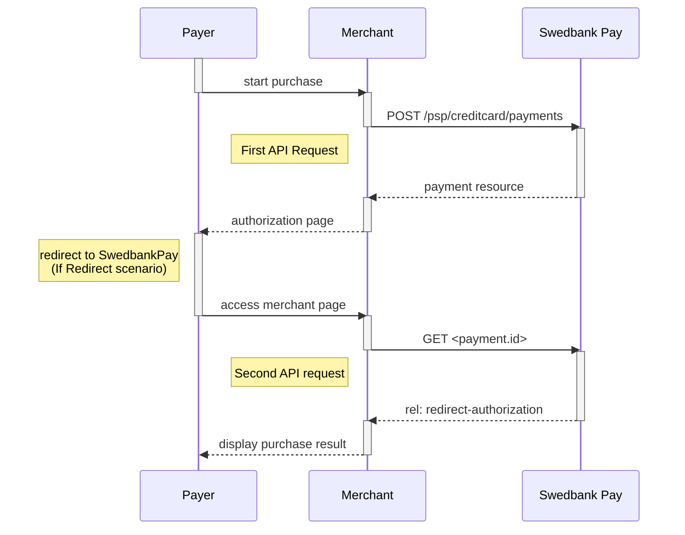







* When properly set up in your merchant/webshop site and the payer starts the
  purchase process, you need to make a `POST` request towards Swedbank Pay with
  your Purchase information. This will generate a payment object with a unique
  `paymentID`. You either receive a Redirect URL to a Swedbank Pay hosted
  page (Redirect integration) or a JavaScript source in response (Seamless View
  integration).
* You need to [redirect][redirect] the payer's browser to that specified URL, or
  embed the script source on your site to create a Hosted View in an `iframe`;
  so that she can enter the credit card details in a secure Swedbank Pay hosted
  environment.
* Swedbank Pay will handle 3-D Secure authentication when this is required.
* Swedbank Pay will redirect the payer's browser to - or display directly in the
  `iframe` - one of two specified URLs, depending on whether the payment session
  is followed through completely or cancelled beforehand. Please note that both
  a successful and rejected payment reach completion, in contrast to a cancelled
  payment.
* When you detect that the payer reach your `completeUrl` , you need to do a
  `GET` request, containing the `id` of the payment generated in the first step,
  to receive the state of the transaction.

You will redirect the payer to Swedbank Pay hosted pages to collect the credit
card information.

![screenshot of the redirect card payment page][card-payment]{:height="500px" width="425px"}

## Operations

The API requests are displayed in the [purchase flow](#purchase-flow).
You can [create a card payment][create-payment] with following `operation`
options:

* [Purchase][purchase]
* [Recur][recur]
* [Payout][payout]
* [Verify][verify]
* [Unscheduled Purchase][unscheduled-purchase]

Our `payment` example below uses the [`purchase`][purchase] operation.

## Intent



## Purchase Flow

The sequence diagram below shows a high level description of a complete
purchase, and the requests you have to send to Swedbank Pay. The links will
take you directly to the corresponding API description.

When dealing with card payments, 3-D Secure authentication of the
cardholder is an essential topic. There are three alternative outcome of a
card payment:

* 3-D Secure enabled - by default, 3-D Secure should be enabled, and Swedbank Pay
  will check if the card is enrolled with 3-D Secure. This depends on the issuer
  of the card. If the card is not enrolled with 3-D Secure, no authentication of
  the cardholder is done.
* Card supports 3-D Secure - if the card is enrolled with 3-D Secure, Swedbank Pay
  will redirect the cardholder to the autentication mechanism that is decided
  by the issuing bank. Normally this will be done using BankID or Mobile
  BankID.



```mermaid
sequenceDiagram
    participant Payer
    participant Merchant
    participant SwedbankPay as Swedbank Pay

    activate Payer
    Payer->>-Merchant: start purchase
    activate Merchant
    Merchant->>-SwedbankPay: POST /psp/creditcard/payments
    activate SwedbankPay
    note left of Payer: First API request
    SwedbankPay-->>-Merchant: payment resource
    activate Merchant
    Merchant-->>-Payer: authorization page
    activate Payer
    Payer->>-SwedbankPay: access authorization page
    activate SwedbankPay
    note left of Payer: redirect to SwedbankPay<br>(If Redirect scenario)
    SwedbankPay-->>-Payer: display purchase information
    activate Payer
    Payer->>Payer: input creditcard information
    Payer->>-SwedbankPay: submit creditcard information
    activate SwedbankPay
        opt Card supports 3-D Secure
        SwedbankPay-->>-Payer: redirect to IssuingBank
        activate Payer
        Payer->>IssuingBank: 3-D Secure authentication process
        activate IssuingBank
        Payer->>-SwedbankPay: access authentication page
        end

    SwedbankPay-->>-Payer: redirect to merchant
    activate Payer
    note left of Payer: redirect back to merchant<br>(If Redirect scenario)

    Payer->>-Merchant: access merchant page
    activate Merchant
    Merchant->>-SwedbankPay: GET <payment.id>
    activate SwedbankPay
    note left of Merchant: Second API request
    SwedbankPay-->>-Merchant: rel: redirect-authorization
    activate Merchant
    Merchant-->>-Payer: display purchase result

        opt Callback is set
        activate SwedbankPay
        SwedbankPay->>SwedbankPay: Payment is updated
        SwedbankPay->>-Merchant: POST Payment Callback
        end
```



[card-payment]: /assets/img/payments/card-payment.png
[cancel]: /payments/card/after-payment#cancellations
[capture]: /payments/card/after-payment#capture
[redirect]: /payments/card/redirect
[create-payment]: /payments/card/other-features#create-payment
[purchase]: /payments/card/other-features#purchase
[recur]: /payments/card/other-features#recur
[payout]: /payments/card/other-features#payout
[verify]: /payments/card/other-features#verify
[unscheduled-purchase]: /payments/card/other-features#unscheduled-purchase
