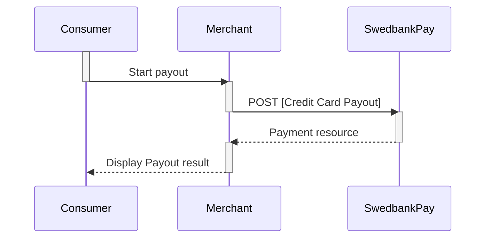





## Payment Resource





## Create Payment

Within the card payments part of the eCommerce API, you can create four kinds
of payments  ([purchase][purchase], [recurrence][recurrence], [payout][payout]
and [verification][verify]) and you can inspect and alter the details of the
individual transactions within the payment.

To create a card payment, you perform an HTTP `POST` against the `payments`
resource.

There are four different kinds of payment that can be created. These are
identified with the value of the `operation` property. Each kind are documented
in their own section below.

{:.code-header}
**Request**"

```http
POST /psp/creditcard/payments HTTP/1.1
Host: {{ page.apiHost }}
Authorization: Bearer <AccessToken>
Content-Type: application/json

{
    "payment": {
        "operation": "<operation>",
        "intent": "<intent>",
    }
}
```

{:.table .table-striped}
| Required | Property            | Type     | Description                                                                                                                                                                                                                                                                                                                                                                                                                                                                                                                                                                               |
| :------: | ------------------- | -------- | ----------------------------------------------------------------------------------------------------------------------------------------------------------------------------------------------------------------------------------------------------------------------------------------------------------------------------------------------------------------------------------------------------------------------------------------------------------------------------------------------------------------------------------------------------------------------------------------- |
|  ✔︎︎︎︎︎  | `payment`           | `object` | The `payment` object.                                                                                                                                                                                                                                                                                                                                                                                                                                                                                                                                                                     |
|  ✔︎︎︎︎︎  | └➔&nbsp;`operation` | `string` | Determines the initial operation, that defines the type card payment created.<br> <br> `Purchase`. Used to charge a card. It is followed up by a capture or cancel operation.<br> <br> `Recur`.Used to charge a card on a recurring basis. Is followed up by a capture or cancel operation (if not Autocapture is used, that is).<br> <br>`Payout`. Used to deposit funds directly to credit card. No more requests are necessary from the merchant side.<br> <br>`Verify`. Used when authorizing a card withouth reserveing any funds.  It is followed up by a verification transaction. |
|  ✔︎︎︎︎︎  | └➔&nbsp;`intent`    | `string` | The intent of the payment identifies how and when the charge will be effectuated. This determine the type transactions used during the payment process.<br> <br>`Authorization`. Reserves the amount, and is followed by a [cancellation][cancel] or [capture][capture] of funds.<br> <br>`AutoCapture`. A one phase-option that enable capture of funds automatically after authorization.                                                                                                                                                                                               |

## Purchase

A `Purchase` payment is a straightforward way to charge the card of the payer.
It is followed up by posting a `capture`, `cancellation` or `reversal` transaction.

An example of a request is provided below. Each individual Property of the JSON
document is described in the following section.





## Recur

A `recur` payment is a payment that references a `recurrenceToken` created
through a previous payment in order to charge the same card.

{:.code-header}
**Request**

```http
POST /psp/creditcard/payments HTTP/1.1
Host: {{ page.apiHost }}
Authorization: Bearer <AccessToken>
Content-Type: application/json

{
    "payment": {
        "operation": "Recur",
        "intent": "Authorization|AutoCapture",
        "recurrenceToken": "{{ page.paymentId }}",
        "currency": "NOK",
        "amount": 1500,
        "vatAmount": 0,
        "description": "Test Recurrence",
        "userAgent": "Mozilla/5.0...",
        "language": "nb-NO",
        "urls": {
            "callbackUrl": "https://example.com/payment-callback"
        },
        "payeeInfo": {
            "payeeId": "{{ page.merchantId }}"
            "payeeReference": "CD1234",
            "payeeName": "Merchant1",
            "productCategory": "A123",
            "orderReference": "or-12456",
            "subsite": "MySubsite"
        }
    }
}
```

## Payout

> "Payout to Card" is an add-on service that enable you to deposit winnings
  directly to your end-users' credit cards. This without  the need to collect
  card details from the end-user a second time.

### Introduction

* Acquirer for this service is Swedbank. You require a separate Swedbank
  acquiring number to ensure that payout transactions and regular card
  transactions are kept separate.
* You need to have the 3-D Secure protocol enabled.
* The service is available through a Swedbank Pay hosted payment page.
* The current implementation is only available for gaming transactions (
  [MCC][mcc]: 7995).
* The payout service is not a part of Swedbank Pay Settlement Service.

### API requests

The API requests are displayed in the [payout flow](#payout-flow).  You create
a payout by performing a `POST` creditcard payments with key `operation` set to
`payout`.

{:.code-header}
**Request**

```http
POST /psp/creditcard/payments HTTP/1.1
Host: {{ page.apiHost }}
Authorization: Bearer <AccessToken>
Content-Type: application/json

{
    "payment": {
        "operation": "Payout",
        "intent": "AutoCapture",
        "paymentToken": "{{ page.paymentId }}",
        "currency": "NOK",
        "amount": 1500,
        "vatAmount": 0,
        "description": "Test Payout",
        "userAgent": "Mozilla/5.0",
        "language": "nb-NO",
        "urls": {
            "callbackUrl": "https://example.com/payment-callback"
        },
        "payeeInfo": {
            "payeeId": "{{ page.merchantId }}"
            "payeeReference": "CD1234",
            "payeeName": "Merchant1",
            "productCategory": "A123",
            "orderReference": "or-12456",
            "subsite": "MySubsite"
        }
    }
}
```

{:.code-header}
**Response**

```http
HTTP/1.1 200 OK
Content-Type: application/json

{
  "payment": {
    "id": "/psp/creditcard/payments/{{ page.paymentId }}",
    "number": 1234567890,
    "created": "2016-09-14T13:21:29.3182115Z",
    "updated": "2016-09-14T13:21:57.6627579Z",
    "state": "Ready",
    "operation": "Payout",
    "currency": "NOK",
    "amount": 1500,
    "remainingCaptureAmount": 1500,
    "remainingCancellationAmount": 1500,
    "remainingReversalAmount": 0,
    "description": "Test Recurrence",
    "initiatingSystemUserAgent": "PostmanRuntime/3.0.1",
    "userAgent": "Mozilla/5.0...",
    "language": "nb-NO",
    "paymentToken": "{{ page.paymentId }}",
    "prices": { "id": "/psp/creditcard/payments/{{ page.paymentId }}/prices" },
    "transactions": { "id": "/psp/creditcard/payments/{{ page.paymentId }}/transactions" },
    "authorizations": { "id": "/psp/creditcard/payments/{{ page.paymentId }}/authorizations" },
    "captures": { "id": "/psp/creditcard/payments/{{ page.paymentId }}/captures" },
    "reversals": { "id": "/psp/creditcard/payments/{{ page.paymentId }}/reversals" },
    "cancellations": { "id": "/psp/creditcard/payments/{{ page.paymentId }}/cancellations" },
    "urls" : { "id": "/psp/creditcard/payments/{{ page.paymentId }}/urls" },
    "payeeInfo" : { "id": "/psp/creditcard/payments/{{ page.paymentId }}/payeeInfo" },
    "settings": { "id": "/psp/creditcard/payments/{{ page.paymentId }}/settings" }
  }
}
```

### Payout flow

You must set `Operation` to `Payout` in the initial `POST` request.



## Verify

> The `Verify` operation lets you post verification payments, which are used to
  confirm validity of card information without reserving or charging any amount.

### Introduction to Verify

This option is commonly used when initiating a subsequent
[One-click card payment][one-click-payments] or a
[recurring card payment][recurrence] flow - where you do not want
to charge the consumer right away.



### Verification through Swedbank Pay Payments

* When properly set up in your merchant/webshop site and the payer initiates a
  verification operation, you make a `POST` request towards Swedbank Pay with
  your Verify information. This will generate a payment object with a unique
  `paymentID`. You either receive a Redirect URL to a hosted page or a
  JavaScript source in response.
* You need to [redirect][redirect] the payer's browser to that specified URL, or
  embed the script source on your site to create a [Hosted View][hosted-view] in
  an `iframe`; so that she can enter the credit card details in a secure
  Swedbank Pay hosted environment.
* Swedbank Pay will handle 3-D Secure authentication when this is required.
* Swedbank Pay will redirect the payer's browser to - or display directly in the
  `iframe` - one of two specified URLs, depending on whether the payment session
  is followed through completely or cancelled beforehand. Please note that both
  a successful and rejected payment reach completion, in contrast to a cancelled
  payment.
* When you detect that the payer reach your completeUrl , you need to do a `GET`
  request to receive the state of the transaction.
* Finally you will make a `GET` request towards Swedbank Pay with the
  `paymentID` received in the first step, which will return the payment result
  and a `paymentToken` that can be used for subsequent [One-Click
  Payments][one-click-payments] and [recurring server-to-server based
  payments][recurrence].

### Screenshots

You will redirect the consumer/end-user to Swedbank Pay hosted pages to collect
the credit card information.

![screenshot of the redirect card payment page][card-payment]{:height="500px" width="425px"}

### API Requests

The API requests are displayed in the [Verification flow]. The options you can
choose from when creating a payment with key operation set to Value Verify are
listed below.

{:.code-header}
**Request**

```http
POST /psp/creditcard/payments HTTP/1.1
Host: {{ page.apiHost }}
Authorization: Bearer <AccessToken>
Content-Type: application/json

{
  "payment": {
    "operation": "Verify",
    "currency": "NOK",
    "description": "Test Verification",
    "payerReference": "AB1234",
    "userAgent": "Mozilla/5.0...",
    "language": "nb-NO",
    "generatePaymentToken": true,
    "generateRecurrenceToken": false,
    "urls": {
      "hostUrls": ["https://example.com"],
      "completeUrl": "https://example.com/payment-completed",
      "cancelUrl": "https://example.com/payment-canceled",
      "paymentUrl": "http://example.com/perform-payment",
      "logoUrl": "https://example.com/payment-logo.png",
      "termsOfServiceUrl": "https://example.com/payment-terms.html"
    },
    "payeeInfo": {
      "payeeId": "{{ page.merchantId }}"
      "payeeReference": "CD1234",
      "payeeName": "Merchant1",
      "productCategory": "A123",
      "orderReference": "or-12456",
      "subsite": "MySubsite"
    }
  },
  "creditCard": {
    "rejectCreditCards": false,
    "rejectDebitCards": false,
    "rejectConsumerCards": false,
    "rejectCorporateCards": false
  }
}
```

{:.code-header}
**Response**

```http
HTTP/1.1 200 OK
Content-Type: application/json

{
    "payment": {
        "id": "/psp/creditcard/payments/{{ page.paymentId }}",
        "number": 1234567890,
        "created": "2016-09-14T13:21:29.3182115Z",
        "updated": "2016-09-14T13:21:57.6627579Z",
        "operation": "Verify",
        "state": "Ready",
        "currency": "NOK",
        "amount": 0,
        "description": "Test Verification",
        "payerReference": "AB1234",
        "initiatingSystemUserAgent": "PostmanRuntime/3.0.1",
        "userAgent": "Mozilla/5.0",
        "language": "nb-NO",
        "transactions": { "id": "/psp/creditcard/payments/{{ page.paymentId }}/transactions" },
        "verifications": { "id": "/psp/creditcard/payments/{{ page.paymentId }}/verifications" },
        "urls" : { "id": "/psp/creditcard/payments/{{ page.paymentId }}/urls" },
        "payeeInfo" : { "id": "/psp/creditcard/payments/{{ page.paymentId }}/payeeInfo" },
        "settings": { "id": "/psp/creditcard/payments/{{ page.paymentId }}/settings" }
    },
    "operations": [
        {
            "href": "{{ page.apiUrl }}/psp/creditcard/payments/{{ page.paymentId }}",
            "rel": "update-payment-abort",
            "method": "PATCH",
            "contentType": "application/json"
        },
        {
            "href": "{{ page.frontEndUrl }}/creditcard/payments/verification/123456123412341234123456789012",
            "rel": "redirect-verification",
            "method": "GET",
            "contentType": "application/json"
        },
        {
            "method": "GET",
            "href": "https://ecom.dev.payex.com/creditcard/core/scripts/client/px.creditcard.client.js?token=123456123412341234123456789012",
            "rel": "view-verification",
            "contentType": "application/javascript"
        },

        {
            "method": "POST",
            "href": "https://ecom.dev.payex.com/psp/creditcard/confined/payments/{paymentId:guid}/verifications",
            "rel": "direct-verification",
            "contentType": "application/json"
        }

    ]
}
```

### Verification flow

The sequence diagram below shows the two requests you have to send to Swedbank
Pay to make a purchase. The links will take you directly to the API description
for the specific request. The diagram also shows in high level, the sequence of
the process of a complete purchase.
When dealing with credit card payments, 3-D Secure authentication of the
cardholder is an essential topic. There are three alternative outcome of a
credit card payment:

* 3-D Secure enabled - by default, 3-D Secure should be enabled, and Swedbank
  Pay will check if the card is enrolled with 3-D Secure. This depends on the
  issuer of the card. If the card is not enrolled with 3-D Secure, no
  authentication of the cardholder is done.
* Card supports 3-D Secure - if the card is enrolled with 3-D Secure, Swedbank
  Pay will redirect the cardholder to the autentication mechanism that is
  decided by the issuing bank. Normally this will be done using BankID or Mobile
  BankID.

```mermaid
sequenceDiagram
    participant Payer
    participant Merchant
    participant SwedbankPay as Swedbank Pay
    participant IssuingBank

  activate Payer
  Payer->>+Merchant: start verification
  deactivate Payer
  Merchant->>+SwedbankPay: POST /psp/creditcard/payments(operation=VERIFY)
  deactivate Merchant
  note left of Payer: First API request
  SwedbankPay-->+Merchant: payment resource
  deactivate SwedbankPay
  Merchant-->>+Payer: redirect to verification page
  deactivate Merchant
  Payer->>+SwedbankPay: access verification page
  deactivate Payer
  note left of Payer: redirect to SwedbankPay<br>(If Redirect scenario)
  SwedbankPay-->>+Payer: display purchase information
  deactivate SwedbankPay

  Payer->>Payer: input creditcard information
  Payer->>+SwedbankPay: submit creditcard information
  deactivate Payer
  opt Card supports 3-D Secure
    SwedbankPay-->>Payer: redirect to IssuingBank
    deactivate SwedbankPay
    Payer->>IssuingBank: 3-D Secure authentication process
    Payer->>+SwedbankPay: access authentication page
    deactivate Payer
  end

  SwedbankPay-->>+Payer: redirect to merchant
  deactivate SwedbankPay
  note left of Payer: redirect back to merchant<br>(If Redirect scenario)

  Payer->>+Merchant: access merchant page
  Merchant->>+SwedbankPay: GET <payment.id>
  deactivate Merchant
  note left of Merchant: Second API request
  SwedbankPay-->>+Merchant: rel: redirect-authorization
  deactivate SwedbankPay
  Merchant-->>Payer: display purchase result
  deactivate Merchant

  opt Callback is set
    activate SwedbankPay
    SwedbankPay->>SwedbankPay: Payment is updated
    SwedbankPay->>Merchant: POST Payment Callback
    deactivate SwedbankPay
  end
```

### Create authorization transaction

The `redirect-authorization` operation redirects the consumer to
Swedbank Pay Payments where the payment is authorized.

{:.code-header}
**Request**

```http
POST /psp/creditcard/payments/{{ page.paymentId }}/authorizations HTTP/1.1
Host: {{ page.apiHost }}
Authorization: Bearer <AccessToken>
Content-Type: application/json

{
    "payment": {
        "operation": "Purchase",
        "intent": "Authorization",
        "currency": "NOK",
        "prices": [
            {
                "type": "CreditCard",
                "amount": 1500,
                "vatAmount": 0
            }
        ],
        "description": "Test Purchase",
        "payerReference": "AB1234",
        "userAgent": "Mozilla/5.0",
        "language": "nb-NO",
        "urls": {
            "hostUrls": [ "http://example.com", "http://example.net" ],
            "completeUrl": "http://example.com/payment-completed",
            "cancelUrl": "http://example.com/payment-canceled",
            "callbackUrl": "http://example.com/payment-callback",
            "logoUrl": "http://example.com/payment-logo.png",
            "termsOfServiceUrl": "http://example.com/payment-terms.pdf",
        },
        "payeeInfo": {
            "payeeId": "12345678-1234-1234-1234-123456789012",
            "payeeReference": "CD1234",
            "payeeName": "Merchant",
            "productCategory": "A123"
        }
}
```

{:.table .table-striped}
| Required | Property                       | Type      | Description                                                                     |
| :------: | :----------------------------- | :-------- | :------------------------------------------------------------------------------ |
|  ✔︎︎︎︎︎  | `transaction`                  | `object`  | The transaction object.                                                         |
|  ✔︎︎︎︎︎  | └➔&nbsp;`cardNumber`           | `string`  | Primary Account Number (PAN) of the card, printed on the face of the card.      |
|  ✔︎︎︎︎︎  | └➔&nbsp;`cardExpiryMonth`      | `integer` | Expiry month of the card, printed on the face of the card.                      |
|  ✔︎︎︎︎︎  | └➔&nbsp;`cardExpiryYear`       | `integer` | Expiry year of the card, printed on the face of the card.                       |
|          | └➔&nbsp;`cardVerificationCode` | `string`  | Card verification code (CVC/CVV/CVC2), usually printed on the back of the card. |
|          | └➔&nbsp;`cardholderName`       | `string`  | Name of the card holder, usually printed on the face of the card.               |

> Response

The `authorization` resource contains information about an authorization
transaction made towards a payment, as previously described.







## PayeeInfo



## Prices





## Problems

When performing unsuccessful operations, the eCommerce API will respond with a
problem message. We generally use the problem message `type` and `status` code
to identify the nature of the problem. The problem `name` and `description` will
often help narrow down the specifics of the problem.

### Contractual Problem Types

All contract types will have the following URI in front of type:
`{{ page.apiUrl }}/psp/<errordetail>/creditcard`

{:.table .table-striped}
| Type                           | Status | Description                                 |
| :----------------------------- | :----: | :------------------------------------------ |
| `cardbranddisabled`            | `403`  | The card brand is disabled.                 |
| `accountholdertyperejected`    | `403`  | The account holder type is rejected.        |
| `cardtyperejected`             | `403`  | The card type is rejected.                  |
| `3dsecurerequired`             | `403`  | The transaction was rejected by 3-D Secure. |
| `authenticationstatusrejected` | `403`  | The authentication status was rejected.     |
| `frauddetected`                | `403`  | The transaction was fraudulent.             |
| `3dsecuredeclined`             | `403`  | 3-D Secure declined the transaction.        |

### Acquirer and 3-D Secure Problem Types

All acquirer error types will have the following URI in front of type:
`https://api.payex.com/psp/errordetail/creditcard/<error-type>`

{:.table .table-striped}
| Type                           | Status | Description                                                                                   |
| :----------------------------- | :----: | :-------------------------------------------------------------------------------------------- |
| `3dsecureerror`                | `400`  | 3D Secure not working, try again some time later                                              |
| `cardblacklisted`              | `400`  | Card blacklisted, Consumer need to contact their Card-issuing bank                            |
| `paymenttokenerror`            | `403`  | There was an error with the payment token.                                                    |
| `carddeclined`                 | `403`  | The card was declined.                                                                        |
| `acquirererror`                | `403`  | The acquirer responded with a generic error.                                                  |
| `acquirercardblacklisted`      | `403`  | Card blacklisted, Consumer need to contact their Card-issuing bank                            |
| `acquirercardexpired`          | `403`  | Wrong expire date or Card has expired and consumer need to contact their Card-issuing bank    |
| `acquirercardstolen`           | `403`  | Card blacklisted, Consumer need to contact their Card-issuing bank                            |
| `acquirerinsufficientfunds`    | `403`  | Card does not have sufficient funds, consumer need to contact their Card-issuing bank.        |
| `acquirerinvalidamount`        | `403`  | Amount not valid by aquirer, contact support.ecom@payex.com                                   |
| `acquirerpossiblefraud`        | `403`  | Transaction declined due to possible fraud, consumer need to contact their Card-issuing bank. |
| `3dsecureusercanceled`         | `403`  | Transaction was Cancelled during 3DSecure verification                                        |
| `3dsecuredeclined`             | `403`  | Transaction was declined during 3DSecure verification                                         |
| `frauddetected`                | `403`  | Fraud detected. Consumer need to contact their Card-issuing bank.                             |
| `badrequest`                   | `500`  | Bad request, try again after some time                                                        |
| `internalservererror`          | `500`  | Server error, try again after some time                                                       |
| `3dsecureacquirergatewayerror` | `502`  | Problems reaching 3DSecure verification, try again after some time.                           |
| `badgateway`                   | `502`  | Problems reaching the gateway, try again after some time                                      |
| `acquirergatewayerror`         | `502`  | Problems reaching acquirers gateway, try again after some time                                |
| `acquirergatewaytimeout`       | `504`  | Problems reaching acquirers gateway, try again after some time                                |



[purchase]: #purchase
[user-agent-definition]: https://en.wikipedia.org/wiki/User_agent
[cancel]: /payments/card/after-payment#cancellations
[capture]: /payments/card/after-payment#Capture
[callback]: /payments/card/other-features#callback
[mcc]: https://en.wikipedia.org/wiki/Merchant_category_code
[price-resource]: /payments/card/other-features#prices
[redirect]: /payments/card/redirect
[hosted-view]: /payments/card/seamless-view
[one-click-payments]: #one-click-payments
[split-settlement]: #split-settlement
[settlement-and-reconciliation]: #settlement-and-reconciliation
[recurrence]: #recur
[verify]: #verify
[payout]: #payout
[card-payment]: /assets/img/payments/card-payment.png
