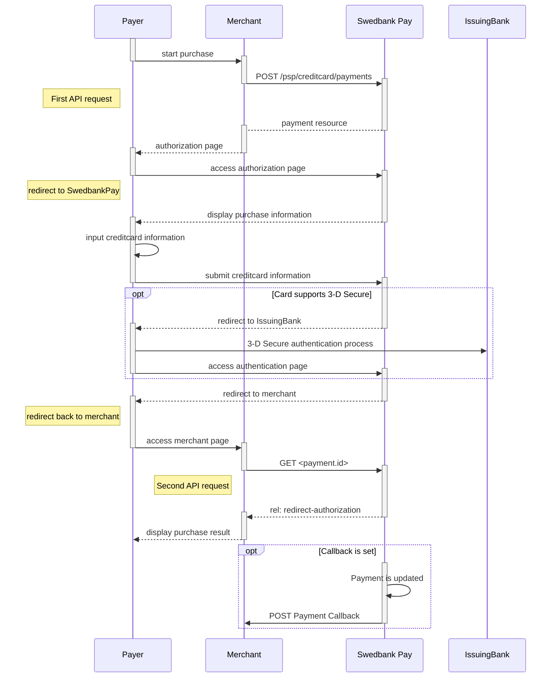



## Introduction

* When properly set up in your merchant/webshop site and the payer starts the
  purchase process, you need to make a POST request towards Swedbank Pay with
  your Purchase information. This will generate a payment object with a unique
  `paymentID`. You will receive a **redirect URL** to a Swedbank Pay payment
  page.
* You need to redirect the payer's browser to that specified URL so that she can
  enter the credit card details in a secure Swedbank Pay environment.
* Swedbank Pay will handle 3-D Secure authentication when this is required.
* Swedbank Pay will redirect the payer's browser to - one of two specified URLs,
  depending on whether the payment session is followed through completely or
  cancelled beforehand. Please note that both a successful and rejected payment
  reach completion, in contrast to a cancelled payment.
* When you detect that the payer reach your `completeUrl`, you need to do a
  `GET` request to receive the state of the transaction, containing the
  `paymentID` generated in the first step, to receive the state of the
  transaction.

## Screenshots

You will redirect the payer to Swedbank Pay hosted pages to collect the credit
card information.

![screenshot of the redirect card payment page][card-payment]{:height="500px" width="425px"}

## API Requests

The API requests are displayed in the [purchase flow](#purchase-flow).
You can [create a card `payment`][create-payment] with following `operation`
options:

* [Purchase][purchase]
* [Recur][recur]
* [Payout][payout]
* [Verify][verify]

Our `payment` example below uses the [`purchase`][purchase] value.

### Purchase

A `Purchase` payment is a straightforward way to charge the card of the payer.
It is followed up by posting a capture, cancellation or reversal transaction.

An example of an abbreviated `POST` request is provided below. Each individual
Property of the JSON document is described in the following section.
An example of an expanded `POST` request is available in the
[other features section][purchase].





## Type of authorization - Intent

The intent of the payment identifies how and when the charge will be
effectuated. This determine the type of transaction used during the payment
process.

* **Authorization (two-phase)**: If you want the credit card to reserve the
  amount, you will have to specify that the intent of the purchase is
  Authorization. The amount will be reserved but not charged. You will later
  (i.e. when you are ready to ship the purchased products) have to make a
  [Capture][capture] or [Cancel][cancel] request.

### General

* *No 3-D Secure and card acceptance:* There are optional paramers that can be
  used in relation to 3-D Secure and card acceptance. By default, most credit
  card agreements with an acquirer will require that you use 3-D Secure for card
  holder authentication. However, if your agreement allows you to make a card
  payment without this authentication, or that specific cards can be declined,
  you may adjust these optional parameters when posting in the payment.
* *Defining `callbackURL`:* When implementing a scenario, it is optional to set
  a `callbackURL` in the `POST` request. If `callbackURL` is set Swedbank Pay
  will send a postback request to this URL when the consumer has fulfilled the
  payment. [See the Callback API description here][callback].

## Payment Resource



## Purchase flow

The sequence diagram below shows a high level description of a complete
purchase, and the requests you have to send to Swedbank Pay. The links will
take you directly to the corresponding API description.

When dealing with credit card payments, 3-D Secure authentication of the
cardholder is an essential topic. There are two alternative outcome of a credit
card payment:

* 3-D Secure enabled - by default, 3-D Secure should be enabled, and Swedbank
  Pay will check if the card is enrolled with 3-D Secure. This depends on the
  issuer of the card. If the card is not enrolled with 3-D Secure, no
  authentication of then cardholder is done.
* Card supports 3-D Secure - if the card is enrolled with 3-D Secure, Swedbank
  Pay will redirect the cardholder to the autentication mechanism that is
  decided by the issuing bank. Normally this will be done using BankID or Mobile
  BankID.

### Options after posting a payment

* `Abort`: It is possible to abort the process, if the payment has no successful
  transactions. [See the Abort payment description][abort].
* If the payment shown above is done as a two phase (`Authorization`), you will
  need to implement the [`Capture`][capture] and [`Cancel`][cancel] requests.
* For `reversals`, you will need to implement the [Reversal request][reversal].
* *If `callbackURL` is set:* Whenever changes to the payment occur a [Callback
  request][callback] will be posted to the `callbackUrl`, which was generated
  when the payment was created.

## Card Payments in Mobile Apps

> The implementation sequence for this scenario is identical to the standard
  Redirect scenario, but also includes explanations of how to include this
  redirect in mobile apps or in mobile web pages.

### Screenshots for Payments

You will redirect the consumer/end-user to Swedbank Pay hosted pages to collect
the credit card information.

![Merchant implemented redirect][redirect-image]{:width="407" height="627"}

## API Requests for Payments

The API requests are displayed in the [purchase flow](#purchase-flow-mobile).
You can [create a card `payment`][create-payment] with following `operation`
options:

* [Purchase][purchase]
* [Recur][recur]
* [Payout][payout]
* [Verify][verify]

Our `payment` example below uses the [`purchase`][purchase] value.

### Type of authorization - Intent

The intent of the payment identifies how and when the charge will be
effectuated. This determine the type of transaction used during the payment
process.

* **Authorization (two-phase)**: If you want the credit card to reserve the
  amount, you will have to specify that the intent of the purchase is
  Authorization. The amount will be reserved but not charged. You will later
  (i.e. when you are ready to ship the purchased products) have to make a
  [Capture][capture] or [Cancel][cancel] request.
* **AutoCapture (one-phase)**:  If you want the credit card to be charged right
  away, you will have to specify that the intent of the purchase is
  `AutoCapture`. The credit card will be charged automatically after
  authorization and you don't need to do any more financial operations to this
  purchase.

### General

* **No 3-D Secure and card acceptance**: There are optional paramers that can be
  used in relation to 3-D Secure and card acceptance. By default, most credit
  card agreements with an acquirer will require that you use 3-D Secure for card
  holder authentication. However, if your agreement allows you to make a card
  payment without this authentication, or that specific cards can be declined,
  you may adjust these optional parameters when posting in the payment.
* **Defining `callbackURL`**: When implementing a scenario, it is optional to
  set a `callbackURL` in the `POST` request. If `callbackURL` is set Swedbank
  Pay will send a postback request to this URL when the consumer has fulfilled
  the payment. [See the Callback API description here][callback].

## Purchase flow mobile

The sequence diagram below shows a high level description of a complete
purchase, and the two requests you have to send to Swedbank Pay. The links will
take you directly to the corresponding API description.

When dealing with credit card payments, 3-D Secure authentication of the
cardholder is an essential topic. There are two alternative outcomes of a credit
card payment:

* 3-D Secure enabled - by default, 3-D Secure should be enabled, and Swedbank
  Pay will check if the card is enrolled with 3-D Secure. This depends on the
  issuer of the card. If the card is not enrolled with 3-D Secure, no
  authentication of the cardholder is done.
* Card supports 3-D Secure - if the card is enrolled with 3-D Secure, Swedbank
  Pay will redirect the cardholder to the autentication mechanism that is
  decided by the issuing bank. Normally this will be done using BankID or Mobile
  BankID.



[abort]: /payments/card/other-features/#abort
[callback]: /payments/card/other-features/#callback
[cancel]: /payments/card/after-payment/#cancellations
[capture]: /payments/card/after-payment/#Capture
[create-payment]: /payments/card/other-features/#create-payment
[expansion]: /payments/card/other-features/#expansion
[payee-reference]: /payments/card/other-features/#payeereference
[payout]: /payments/card/other-features/#payout
[purchase]: /payments/card/other-features/#purchase
[price-resource]: /payments/card/other-features/#prices
[recur]: /payments/card/other-features/#recur
[redirect-image]: /assets/img/checkout/test-purchase.png
[reversal]: /payments/card/after-payment/#reversals
[card-payment]: /assets/img/checkout/test-purchase.png
[verify]: /payments/card/other-features/#verify
[user-agent-definition]: https://en.wikipedia.org/wiki/User_agent
