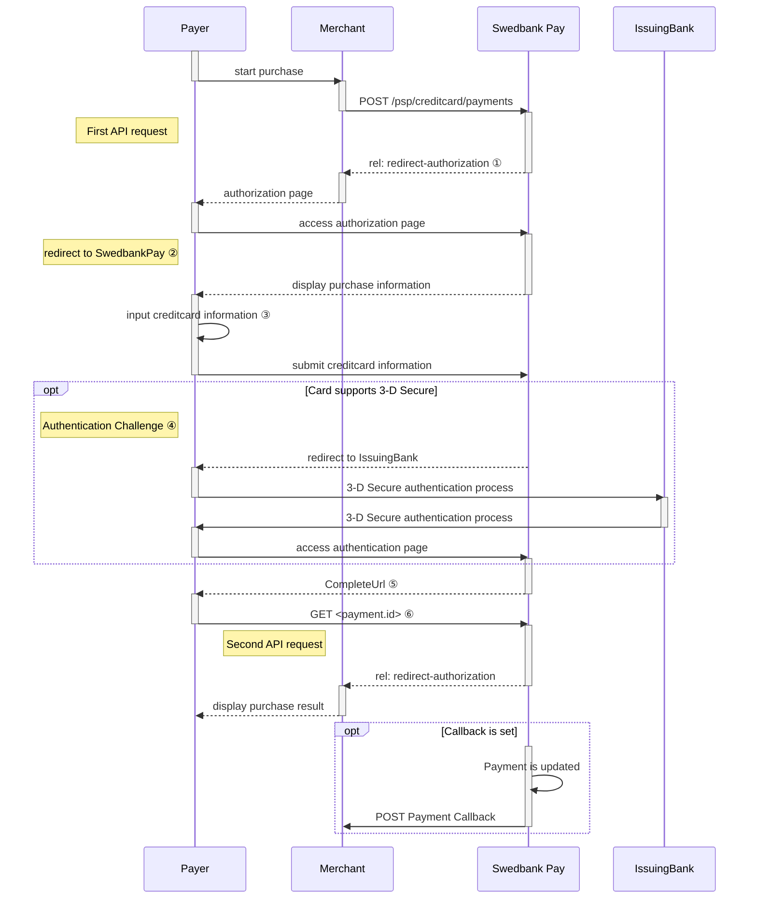
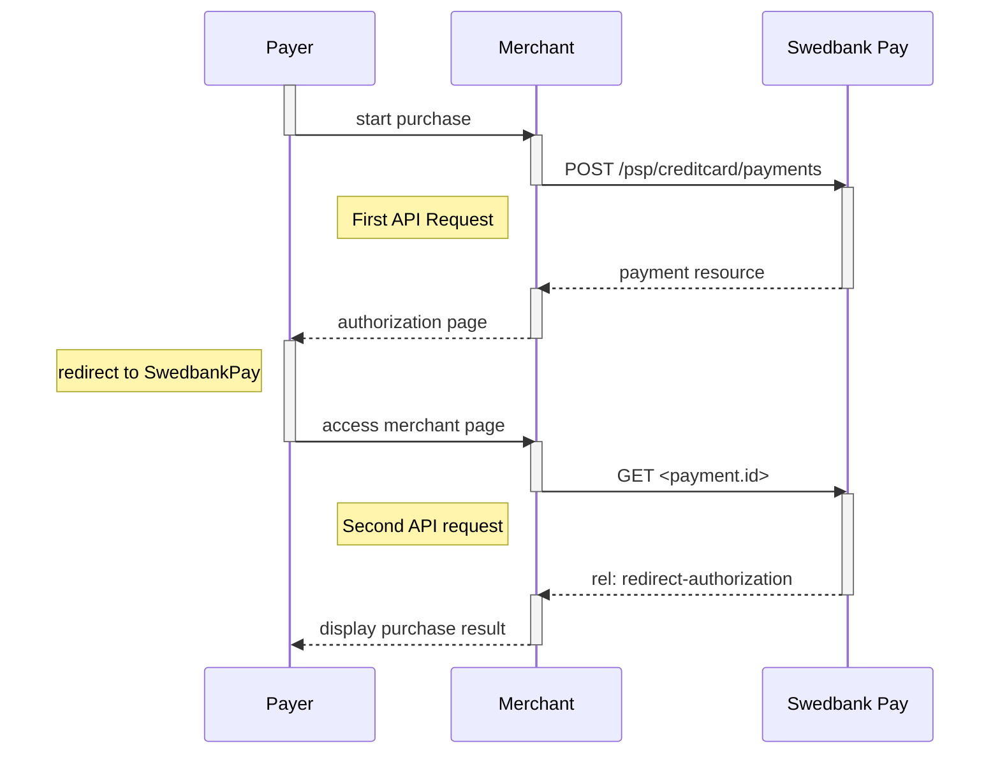





## Introduction

Redirect is the integration that lets Swedbank Pay handle the payments, while
you handle your core activities. When ready to pay, the consumer will be
redirected to a secure Swedbank Pay hosted site. Finally, the consumer will be
redirected back to your website after the payment process.

This is how the payment window might look like:

![screenshot of the redirect card payment page][card-payment]{:height="500px" width="425px"}

## Purchase flow



### Explanations

* ① `rel: redirect-authorization` is the name of one of the operations, sent as
  a response from Swedbank Pay to the Merchant. The href in this operation is
  the **redirect URL** to a Swedbank Pay payment page.
* ② The consumer is being redirected to a secure Swedbank Pay hosted page
* ③ The payment window is presented and the consumer can insert card information
  for authorization.
* ④ If needed the consumer must go through an authorization challenge to verify
  the identity.
* ⑤ The Payer reaches the CompleteUrl which you defined in the initial POST
  request. Please note that both a successful and rejected payment reach
  completion, in contrast to a cancelled payment.
* ⑥ Send a GET request with the `paymentId` to check the state of the
  transaction. Click the link for [a complete list of payment and transaction
  states][payment-transaction-states]. 

### 3-D Secure

Swedbank Pay will handle 3-D Secure authentication when this is required.
When dealing with card payments, 3-D Secure authentication of the
cardholder is an essential topic. There are two alternative outcomes of a credit
card payment:

1. 3-D Secure enabled - by default, 3-D Secure should be enabled, and Swedbank
   Pay will check if the card is enrolled with 3-D Secure. This depends on the
   issuer of the card. If the card is not enrolled with 3-D Secure, no
   authentication of the cardholder is done.
2. Card supports 3-D Secure - if the card is enrolled with 3-D Secure, Swedbank
   Pay will redirect the cardholder to the autentication mechanism that is
   decided by the issuing bank. Normally this will be done using BankID or
   Mobile BankID.

## Redirect Back End

When properly set up in your merchant/webshop site and the payer starts the
purchase process, you need to make a POST request towards Swedbank Pay with
your Purchase information. This will generate a payment object with a unique
`paymentID`. You will receive a **redirect URL** to a Swedbank Pay payment
page.

### Intent



### Operations

The API requests are displayed in the [purchase flow](#purchase-flow).
You can [create a card `payment`][create-payment] with following `operation`
options:

* [Purchase][purchase]
* [Recur][recur]
* [Payout][payout]
* [Verify][verify]

Our `payment` example uses the [`purchase`][purchase] value.

### Purchase

A `Purchase` payment is a straightforward way to charge the card of the payer.
It is followed up by posting a capture, cancellation or reversal transaction.

An example of an abbreviated `POST` request is provided below. Each individual
Property of the JSON document is described in the following section.
An example of an expanded `POST` request is available in the
[other features section][purchase].





* You need to redirect the payer's browser to that specified URL in the
  `redirect-authorization` operation so that she can enter the card
  details in a secure Swedbank Pay environment.
* Swedbank Pay will handle 3-D Secure authentication when this is required.
* Swedbank Pay will redirect the payer's browser to - one of two specified URLs,
  depending on whether the payment session is followed through completely or
  cancelled beforehand. Please note that both a successful and rejected payment
  reach completion, in contrast to a cancelled payment.
* When you detect that the payer reach your `completeUrl`, you need to do a
  `GET` request to receive the state of the transaction, containing the
  `paymentID` generated in the first step, to receive the state of the
  transaction.

### General



## Card Payments in Mobile Apps

> The implementation sequence for this scenario is identical to the standard
  Redirect scenario, but also includes explanations of how to include this
  redirect in mobile apps or in mobile web pages.

### Screenshots for Payments

You will redirect the consumer/end-user to Swedbank Pay hosted pages to collect
the card information.

![Merchant implemented redirect][redirect-image]{:width="407" height="627"}

## API Requests for Payments

The API requests are displayed in the [purchase flow](#purchase-flow-mobile).
You can [create a card `payment`][create-payment] with following `operation`
options:

* [Purchase][purchase]
* [Recur][recur]
* [Payout][payout]
* [Verify][verify]

Our `payment` example below uses the [`purchase`][purchase] value.

## Purchase flow mobile

The sequence diagram below shows a high level description of a complete
purchase, and the two requests you have to send to Swedbank Pay. The links will
take you directly to the corresponding API description.

When dealing with card payments, 3-D Secure authentication of the
cardholder is an essential topic. There are two alternative outcomes of a credit
card payment:

* 3-D Secure enabled - by default, 3-D Secure should be enabled, and Swedbank
  Pay will check if the card is enrolled with 3-D Secure. This depends on the
  issuer of the card. If the card is not enrolled with 3-D Secure, no
  authentication of the cardholder is done.
* Card supports 3-D Secure - if the card is enrolled with 3-D Secure, Swedbank
  Pay will redirect the cardholder to the autentication mechanism that is
  decided by the issuing bank. Normally this will be done using BankID or Mobile
  BankID.



```mermaid
sequenceDiagram
    participant Payer
    participant Merchant
    participant SwedbankPay as Swedbank Pay

    activate Payer
    Payer->>-Merchant: start purchase
    activate Payer
    Merchant->>-SwedbankPay: POST /psp/creditcard/payments
    activate Merchant
    note left of Payer: First API request
    SwedbankPay-->-Merchant: payment resource
    activate SwedbankPay
    Merchant-->>-Payer: authorization page
    activate Merchant
    Payer->>-SwedbankPay: access authorization page
    activate Payer
    note left of Payer: redirect to SwedbankPay
    SwedbankPay-->>-Payer: display purchase information
    activate SwedbankPay
    Payer->>Payer: input creditcard information
    Payer->>-SwedbankPay: submit creditcard information
    activate Payer

        opt Card supports 3-D Secure
        SwedbankPay-->>-Payer: redirect to IssuingBank
        activate SwedbankPay
        Payer->>IssuingBank: 3-D Secure authentication process
        Payer->>-SwedbankPay: access authentication page
        activate Payer
        end

    SwedbankPay-->>-Payer: redirect to merchant
    activate SwedbankPay
    note left of Payer: redirect back to merchant
    Payer->>-Merchant: access merchant page
    activate Payer
    Merchant->>-SwedbankPay: GET <payment.id>
    activate Merchant
    note left of Merchant: Second API request
    SwedbankPay-->>-Merchant: rel: redirect-authorization
    activate SwedbankPay
    Merchant-->>Payer: display purchase result
    activate Merchant

        opt Callback is set
        activate SwedbankPay
        SwedbankPay->>SwedbankPay: Payment is updated
        SwedbankPay->>Merchant: POST Payment Callback
        activate SwedbankPay
        end
```



[abort]: /payments/card/other-features#abort
[callback]: /payments/card/other-features#callback
[cancel]: /payments/card/after-payment#cancellations
[capture]: /payments/card/after-payment#Capture
[create-payment]: /payments/card/other-features#create-payment
[expansion]: /payments/card/other-features#expansion
[payee-reference]: /payments/card/other-features#payeereference
[payout]: /payments/card/other-features#payout
[purchase]: /payments/card/other-features#purchase
[price-resource]: /payments/card/other-features#prices
[recur]: /payments/card/other-features#recur
[redirect-image]: /assets/img/checkout/test-purchase.png
[reversal]: /payments/card/after-payment#reversals
[card-payment]: /assets/img/payments/card-payment.png
[verify]: /payments/card/other-features#verify
[user-agent-definition]: https://en.wikipedia.org/wiki/User_agent
[payment-transaction-states]: /payments/card/other-features#payment-states-and-transaction-states
