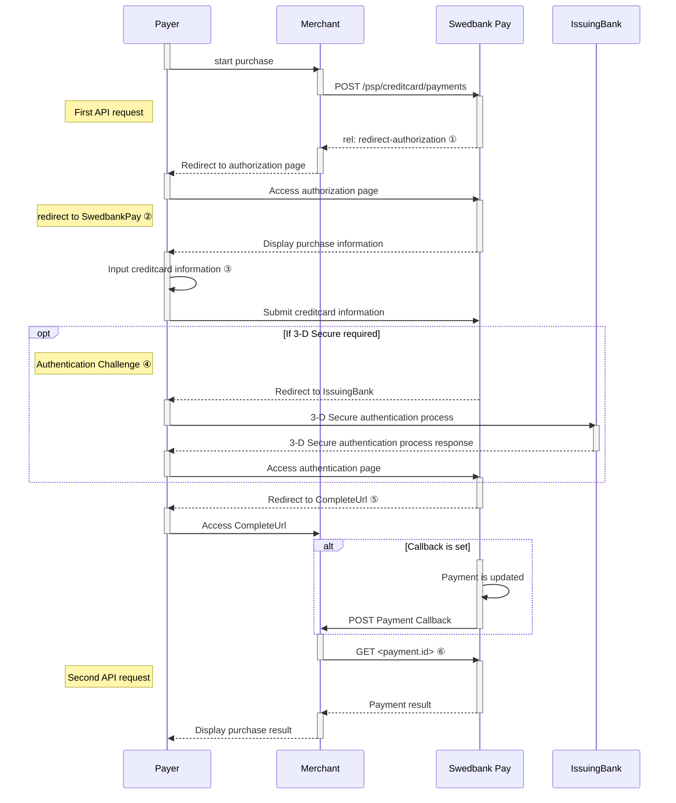



When properly set up in your merchant/webshop site and the payer starts the
purchase process, you need to make a POST request towards Swedbank Pay with
your Purchase information. This will generate a payment object with a unique
`paymentID`. You will receive a **redirect URL** to a Swedbank Pay payment
page.

## Step 1: Create a Purchase

A `Purchase` payment is a straightforward way to charge the card of the payer.
It is followed up by posting a capture, cancellation or reversal transaction.

An example of an abbreviated `POST` request is provided below.
Each individual field of the JSON document is described in the following section.
An example of an expanded `POST` request is available in the
[other features section][purchase].







When you receive the redirect url from Swedbank Pay, you redirect the
payer there to complete the payment. This ensures that card details and other
personal information is entered in a secure environment. Swedbank Pay handles
all authentication during this phase.

After an attempted payment, Swedbank Pay will redirect the Payer to one of two
specified URLs: `completeUrl` or `cancelUrl`.

If the payer cancel at any point, the payer will be redirected to the
`cancelUrl`. If the payment is followed through completely the payer will
reach the `completeUrl`.



This means that when you reach this point, you need to make sure that the
payment has gone through before you let the payer know that the payment was
successful. You do this by doing a `GET` request. This request has to include the
payment Id generated from the initial `POST` request, so that you can receive the
state of the transaction.

If you have chosen Seamless View, the `completeUrl` and `cancelUrl` will display
directly inside the iframe.

This is how the payment window might look:

![screenshot of the redirect card payment page][card-payment]{:height="500px" width="425px"}

Transactions in the currency SEK might look like this, with a debit/credit
selection available:

![screenshot of the swedish redirect card payment page][swedish-card-payment]{:height="600px" width="500px"}

### Purchase flow

### Explanations

*   ① `rel: redirect-authorization` is the name of one of the operations, sent as
  a response from Swedbank Pay to the Merchant. The href in this operation is
  the **redirect URL** to a Swedbank Pay payment page.
*   ② The consumer is being redirected to a secure Swedbank Pay hosted page
*   ③ The payment window is presented and the consumer can insert card information
  for authorization.
*   ④ If needed the consumer must go through an authorization challenge to verify
  the identity.
*   ⑤ The Payer reaches the CompleteUrl which you defined in the initial POST
  request. Please note that both a successful and rejected payment reach
  completion, in contrast to a cancelled payment.
*   ⑥ Send a GET request with the `paymentId` to check the state of the
  transaction. Click the link for [a complete list of payment and transaction
  states][payment-transaction-states].

### 3-D Secure



Swedbank Pay will handle 3-D Secure authentication when this is required.
When dealing with card payments, 3-D Secure authentication of the
cardholder is an essential topic. There are two alternative outcomes of a credit
card payment:

1.  3-D Secure enabled - by default, 3-D Secure should be enabled, and Swedbank
   Pay will check if the card is enrolled with 3-D Secure. This depends on the
   issuer of the card. If the card is not enrolled with 3-D Secure, no
   authentication of the cardholder is done.
2.  Card supports 3-D Secure - if the card is enrolled with 3-D Secure, Swedbank
   Pay will redirect the cardholder to the autentication mechanism that is
   decided by the issuing bank. Normally this will be done using BankID or
   Mobile BankID.



[abort]: /payments/card/other-features#abort
[callback]: /payments/card/other-features#callback
[cancel]: /payments/card/after-payment#cancellations
[capture]: /payments/card/capture
[create-payment]: /payments/card/other-features#create-payment
[expansion]: /home/technical-information#expansion
[payee-reference]: /payments/card/other-features#payee-reference
[payout]: /payments/card/other-features#payout
[purchase]: /payments/card/other-features#purchase
[price-resource]: /payments/card/other-features#prices
[recur]: /payments/card/other-features#recur
[reversal]: /payments/card/after-payment#reversals
[card-payment]: /assets/img/payments/card-payment.png
[swedish-card-payment]: /assets/img/payments/swedish-card-payment.png
[verify]: /payments/card/other-features#verify
[user-agent]: https://en.wikipedia.org/wiki/User_agent
[payment-transaction-states]: /payments/card/other-features#payment-and-transaction-states
