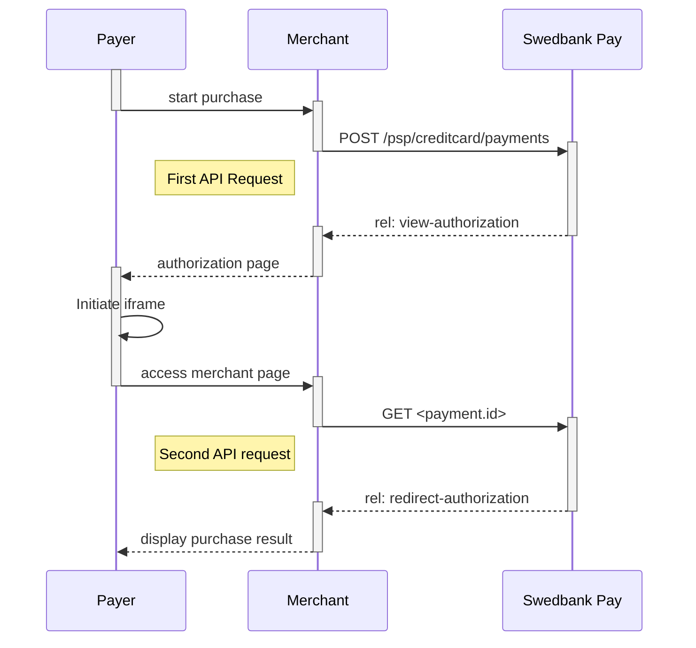
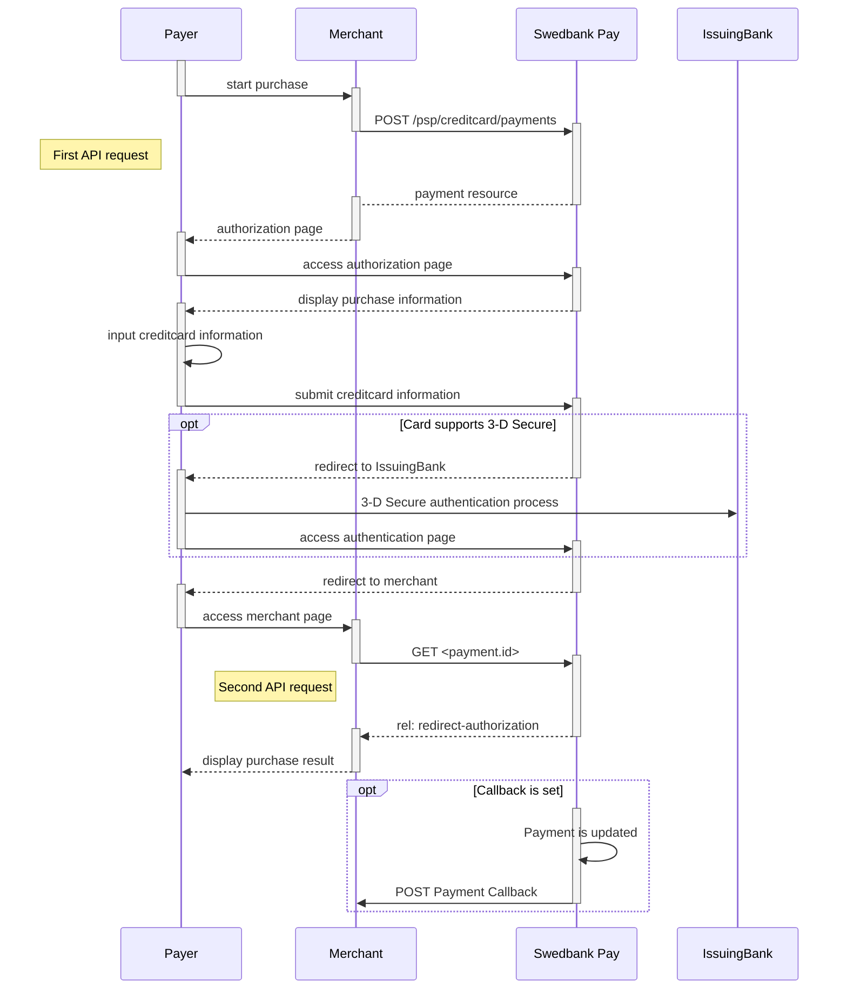



## Introduction

Seamless View provides an integration of the payment process directly on your
website. This solution offers a smooth shopping experience with Swedbank Pay
payment pages seamlessly integrated in an iFrame on your website. The costumer
does not need to leave your webpage, since we are handling the payment in the
iFrame on your page.

* When properly set up in your merchant/webshop site and the payer starts the
  purchase process, you need to make a POST request towards Swedbank Pay with
  your Purchase information. This will generate a payment object with a unique
  `paymentID`. You will receive a **JavaScript source** in response.
* You need to embed the script source on your site to create a hosted-view in an
  `iframe`(see screenshot below); so that she can enter the credit card details
  in a secure Swedbank Pay hosted environment.
* Swedbank Pay will handle 3-D Secure authentication when this is required.
* Swedbank Pay will display directly in the `iframe` - one of two specified
  URLs, depending on whether the payment session is followed through completely
  or cancelled beforehand. Please note that both a successful and rejected
  payment reach completion, in contrast to a cancelled payment.
* When you detect that the payer reach your `completeUrl` , you need to do a
  `GET` request to receive the state of the transaction, containing the
  `paymentID` generated in the first step, to receive the state of the
  transaction.

### Payment Url



## Screenshots

You will have an `iframe` window on your page where the consumer can enter the
credit card information.

![screenshot of the hosted view card payment page][hosted-view-card]{:height="250px" width="660px"}

## API Requests

The API requests are displayed in the [purchase flow](#purchase-flow-mobile).
You can [create a card `payment`][create-payment] with following `operation`
options:

* [Purchase][purchase]
* [Recur][recur]
* [Payout][payout]
* [Verify][verify]

Our `payment` example below uses the [`purchase`][purchase] value.

### Purchase

A `Purchase` payment is a straightforward way to charge the card of the payer.
It is followed up by posting a capture, cancellation or reversal transaction.

An example of an abbreviated `POST` request is provided below. Each individual
Property of the JSON document is described in the following section.
An example of an expanded `POST` request is available in the
[other features section][purchase].



{:.code-header}
**Request**

```http
POST /psp/creditcard/payments HTTP/1.1
Authorization: Bearer <AccessToken>
Content-Type: application/json

{
    "payment": {
        "operation": "Purchase",
        "intent": "Authorization",
        "currency": "SEK",
        "prices": [{
                "type": "CreditCard",
                "amount": 1500,
                "vatAmount": 0
            }
        ],
        "description": "Test Purchase",
        "generatePaymentToken": false,
        "generateRecurrenceToken": false,
        "userAgent": "Mozilla/5.0...",
        "language": "sv-SE",
        "urls": {
            "hostUrls": ["http://example.com"],
            "completeUrl": "http://example.com/payment-completed",
            "cancelUrl": "http://example.com/payment-canceled",
            "paymentUrl": "http://example.com/perform-payment",
            "callbackUrl": "http://example.com/payment-callback",
            "logoUrl": "http://example.com/payment-logo.png",
            "termsOfServiceUrl": "http://example.com/payment-terms.pdf",
        },
        "payeeInfo": {
            "payeeId": "12345678-1234-1234-1234-123456789012",
            "payeeReference": "CD1234",
            "payeeName": "Merchant1",
            "productCategory": "A123",
            "orderReference": "or123",
        },
        "riskIndicator": {
            "deliveryEmailAddress": "string",
            "deliveryTimeFrameindicator": "01",
            "preOrderDate": "YYYYMMDD",
            "preOrderPurchaseIndicator": "01",
            "shipIndicator": "01",
            "giftCardPurchase": false,
            "reOrderPurchaseIndicator": "01",
            "pickUpAddress": {
                "name": "companyname",
                "streetAddress": "string",
                "coAddress": "string",
                "city": "string",
                "zipCode": "string",
                "countryCode": "string"
            }
        }
    },
    "creditCard": {
        "rejectCreditCards": false,
        "rejectDebitCards": false,
        "rejectConsumerCards": false,
        "rejectCorporateCards": false,
        "no3DSecure": false,
        "noCvc": false
    }
}
```

{:.table .table-striped}
| Required | Property                              | Type          | Description                                                                                                                                                                                                                                                                                                                                                                                                                                                                                                                                                               |
| :------: | :------------------------------------ | :------------ | :------------------------------------------------------------------------------------------------------------------------------------------------------------------------------------------------------------------------------------------------------------------------------------------------------------------------------------------------------------------------------------------------------------------------------------------------------------------------------------------------------------------------------------------------------------------------ |
|  ✔︎︎︎︎︎  | `payment`                             | `object`      | The `payment` object contains information about the specific payment.                                                                                                                                                                                                                                                                                                                                                                                                                                                                                                     |
|  ✔︎︎︎︎︎  | └➔&nbsp;`operation`                   | `string`      | The operation that the `payment` is supposed to perform. The [`purchase`][purchase] operation is used in our example. Take a look at the [create card `payment` section][create-payment] for a full examples of the following `operation` options: [Purchase][purchase], [Recur][recur], [Payout][payout], [Verify][verify]                                                                                                                                                                                                                                               |
|  ✔︎︎︎︎︎  | └➔&nbsp;`intent`                      | `string`      | `Authorization`. Reserves the amount, and is followed by a [cancellation][cancel] or [capture][capture] of funds.<br> <br> `AutoCapture`. A one phase option that enable capture of funds automatically after authorization.                                                                                                                                                            |
|  ✔︎︎︎︎︎  | └➔&nbsp;`currency`                    | `string`      | NOK, SEK, DKK, USD or EUR.                                                                                                                                                                                                                                                                                                                                                                                                                                                                                                                                                |
|  ✔︎︎︎︎︎  | └➔&nbsp;`prices`                      | `object`      | The `prices` resource lists the prices related to a specific payment.                                                                                                                                                                                                                                                                                                                                                                                                                                                                                                     |
|  ✔︎︎︎︎︎  | └─➔&nbsp;`type`                       | `string`      | Use the generic type CreditCard if you want to enable all card brands supported by merchant contract. Use card brands like Visa (for card type Visa), MasterCard (for card type Mastercard) and others if you want to specify different amount for each card brand. If you want to use more than one amount you must have one instance in the prices node for each card brand. You will not be allowed to both specify card brands and CreditCard at the same time in this field. [See the Prices resource and prices object types for more information][price-resource]. |
|  ✔︎︎︎︎︎  | └─➔&nbsp;`amount`                     | `integer`     | Amount is entered in the lowest momentary units of the selected currency. E.g. 10000 = 100.00 SEK 5000 = 50.00 SEK.                                                                                                                                                                                                                                                                                                                                                                                                                                                       |
|  ✔︎︎︎︎︎  | └─➔&nbsp;`vatAmount`                  | `integer`     | If the amount given includes VAT, this may be displayed for the user in the payment page (redirect only). Set to 0 (zero) if this is not relevant.                                                                                                                                                                                                                                                                                                                                                                                                                        |
|  ✔︎︎︎︎︎  | └➔&nbsp;`description`                 | `string(40)`  | A textual description max 40 characters of the purchase.                                                                                                                                                                                                                                                                                                                                                                                                                                                                                                                  |
|          | └➔&nbsp;`payerReference`              | `string`      | The reference to the payer (consumer/end user) from the merchant system. E.g mobile number, customer number etc.                                                                                                                                                                                                                                                                                                                                                                                                                                                          |
|          | └➔&nbsp;`generatePaymentToken`        | `boolean`     | `true` or `false`. Set this to `true` if you want to create a paymentToken for future use as One Click.                                                                                                                                                                                                                                                                                                                                                                                                                                                                   |
|          | └➔&nbsp;`generateRecurrenceToken`     | `boolean`     | `true` or `false`. Set this to `true` if you want to create a recurrenceToken for future use Recurring purchases (subscription payments).                                                                                                                                                                                                                                                                                                                                                                                                                                 |
|  ✔︎︎︎︎︎  | └➔&nbsp;`userAgent`                   | `string`      | The user agent reference of the consumer's browser - [see user agent definition][user-agent-definition]                                                                                                                                                                                                                                                                                                                                                                                                                                                                   |
|  ✔︎︎︎︎︎  | └➔&nbsp;`language`                    | `string`      | nb-NO, sv-SE or en-US.                                                                                                                                                                                                                                                                                                                                                                                                                                                                                                                                                    |
|  ✔︎︎︎︎︎  | └➔&nbsp;`urls`                        | `object`      | The `urls` resource lists urls that redirects users to relevant sites.                                                                                                                                                                                                                                                                                                                                                                                                                                                                                                    |
|          | └─➔&nbsp;`hostUrl`                    | `array`       | The array of URLs valid for embedding of Swedbank Pay Hosted Views. If not supplied, view-operation will not be available.                                                                                                                                                                                                                                                                                                                                                                                                                                                |
|  ✔︎︎︎︎︎  | └─➔&nbsp;`completeUrl`                | `string`      | The URL that Swedbank Pay will redirect back to when the payment page is completed.                                                                                                                                                                                                                                                                                                                                                                                                                                                                                       |
|          | └─➔&nbsp;`cancelUrl`                  | `string`      | The URI to redirect the payer to if the payment is canceled. Only used in redirect scenarios. Can not be used simultaneously with `paymentUrl`; only cancelUrl or `paymentUrl` can be used, not both.                                                                                                                                                                                                                                                                                                                                                                     |
|          | └─➔&nbsp;`paymentUrl`                 | `string`      | The URI that Swedbank Pay will redirect back to when the view-operation needs to be loaded, to inspect and act on the current status of the payment. Only used in Seamless Views. If both `cancelUrl` and `paymentUrl` is sent, the `paymentUrl` will used.                                                                                                                                                                                                                                                                                                               |
|          | └─➔&nbsp;`callbackUrl`                | `string`      | The URL that Swedbank Pay will perform an HTTP POST against every time a transaction is created on the payment. See [callback][callback] for details.                                                                                                                                                                                                                                                                                                                                                                                                                     |
|          | └─➔&nbsp;`logoUrl`                    | `string`      | The URL that will be used for showing the customer logo. Must be a picture with maximum 50px height and 400px width. Require https.                                                                                                                                                                                                                                                                                                                                                                                                                                       |
|          | └─➔&nbsp;`termsOfServiceUrl`          | `string`      | A URL that contains your terms and conditions for the payment, to be linked on the payment page. Require https.                                                                                                                                                                                                                                                                                                                                                                                                                                                           |
|  ✔︎︎︎︎︎  | └➔&nbsp;`payeenfo`                    | `object`      | The `payeeInfo` contains information about the payee.                                                                                                                                                                                                                                                                                                                                                                                                                                                                                                                     |
|  ✔︎︎︎︎︎  | └─➔&nbsp;`payeeId`                    | `string`      | This is the unique id that identifies this payee (like merchant) set by Swedbank Pay.                                                                                                                                                                                                                                                                                                                                                                                                                                                                                     |
|  ✔︎︎︎︎︎  | └─➔&nbsp;`payeeReference`             | `string(30*)` | A unique reference from the merchant system. It is set per operation to ensure an exactly-once delivery of a transactional operation. See [payeeReference][payee-reference] for details.                                                                                                                                                                                                                                                                                                                                                                                  |
|          | └─➔&nbsp;`payeeName`                  | `string`      | The payee name (like merchant name) that will be displayed to consumer when redirected to Swedbank Pay.                                                                                                                                                                                                                                                                                                                                                                                                                                                                   |
|          | └─➔&nbsp;`productCategory`            | `string`      | A product category or number sent in from the payee/merchant. This is not validated by Swedbank Pay, but will be passed through the payment process and may be used in the settlement process.                                                                                                                                                                                                                                                                                                                                                                            |
|          | └─➔&nbsp;`orderReference`             | `String(50)`  | The order reference should reflect the order reference found in the merchant's systems.                                                                                                                                                                                                                                                                                                                                                                                                                                                                                   |
|          | └─➔&nbsp;`subsite`                    | `String(40)`  | The subsite field can be used to perform split settlement on the payment. The subsites must be resolved with Swedbank Pay reconciliation before being used.                                                                                                                                                                                                                                                                                                                                                                                                               |
|          | └➔&nbsp;`riskIndicator`               | `array`       | This **optional** array consist of information that helps verifying the payer. Providing these fields decreases the likelyhood of having to promt for 3-D Secure authenticaiton of the payer when they are authenticating the purchacse.                                                                                                                                                                                                                                                                                                                                  |
|          | └─➔&nbsp;`deliveryEmailAdress`        | `string`      | For electronic delivery, the email address to which the merchandise was delivered. Providing this field when appropriate decreases the likelyhood of a 3-D Secure authentication for the payer.                                                                                                                                                                                                                                                                                                                                                                           |
|          | └─➔&nbsp;`deliveryTimeFrameIndicator` | `string`      | Indicates the merchandise delivery timeframe. <br>`01` (Electronic Delivery) <br>`02` (Same day shipping) <br>`03` (Overnight shipping) <br>`04` (Two-day or more shipping)                                                                                                                                                                                                                                                                                                                                                                                               |
|          | └─➔&nbsp;`preOrderDate`               | `string`      | For a pre-ordered purchase. The expected date that the merchandise will be available. Format: `YYYYMMDD`                                                                                                                                                                                                                                                                                                                                                                                                                                                                  |
|          | └─➔&nbsp;`preOrderPurchaseIndicator`  | `string`      | Indicates whether the payer is placing an order for merchandise with a future availability or release date. <br>`01` (Merchandise available) <br>`02` (Future availability)                                                                                                                                                                                                                                                                                                                                                                                               |
|          | └─➔&nbsp;`shipIndicator`              | `string`      | Indicates shipping method chosen for the transaction. <br>`01` (Ship to cardholder's billing address) <br>`02` (Ship to another verified address on file with merchant)<br>`03` (Ship to address that is different than cardholder's billing address)<br>`04` (Ship to Store / Pick-up at local store. Store address shall be populated in shipping address fields)<br>`05` (Digital goods, includes online services, electronic giftcards and redemption codes) <br>`06` (Travel and Event tickets, not shipped) <br>`07` (Other, e.g. gaming, digital service)          |
|          | └─➔&nbsp;`giftCardPurchase`           | `bool`        | `true` if this is a purchase of a gift card.                                                                                                                                                                                                                                                                                                                                                                                                                                                                                                                              |
|          | └─➔&nbsp;`reOrderPurchaseIndicator`   | `string`      | Indicates whether the payer is placing an order for merchandise with a future availability or release date. <br>`01` (Merchandise available) <br>`02` (Future availability)                                                                                                                                                                                                                                                                                                                                                                                               |
|          | └➔&nbsp;`pickUpAddress`               | `object`      | If `shipIndicator` set to `04`, then prefill this with the payers `pickUpAddress` of the purchase to decrease the risk factor of the purchase.                                                                                                                                                                                                                                                                                                                                                                                                                            |
|          | └─➔&nbsp;`name`                       | `string`      | If `shipIndicator` set to `04`, then prefill this with the payers `name` of the purchase to decrease the risk factor of the purchase.                                                                                                                                                                                                                                                                                                                                                                                                                                     |
|          | └─➔&nbsp;`streetAddress`              | `string`      | If `shipIndicator` set to `04`, then prefill this with the payers `streetAddress` of the purchase to decrease the risk factor of the purchase.                                                                                                                                                                                                                                                                                                                                                                                                                            |
|          | └─➔&nbsp;`coAddress`                  | `string`      | If `shipIndicator` set to `04`, then prefill this with the payers `coAddress` of the purchase to decrease the risk factor of the purchase.                                                                                                                                                                                                                                                                                                                                                                                                                                |
|          | └─➔&nbsp;`city`                       | `string`      | If `shipIndicator` set to `04`, then prefill this with the payers `city` of the purchase to decrease the risk factor of the purchase.                                                                                                                                                                                                                                                                                                                                                                                                                                     |
|          | └─➔&nbsp;`zipCode`                    | `string`      | If `shipIndicator` set to `04`, then prefill this with the payers `zipCode` of the purchase to decrease the risk factor of the purchase.                                                                                                                                                                                                                                                                                                                                                                                                                                  |
|          | └─➔&nbsp;`countryCode`                | `string`      | If `shipIndicator` set to `04`, then prefill this with the payers `countryCode` of the purchase to decrease the risk factor of the purchase.                                                                                                                                                                                                                                                                                                                                                                                                                              |
|          | └➔&nbsp;`creditCard`                  | `object`      | An object that holds different scenarios for card payments.                                                                                                                                                                                                                                                                                                                                                                                                                                                                                                               |
|          | └─➔&nbsp;`rejectDebitCards`           | `boolean`     | `true` if debit cards should be declined; otherwise `false` per default. Default value is set by Swedbank Pay and can be changed at your request.                                                                                                                                                                                                                                                                                                                                                                                                                         |
|          | └─➔&nbsp;`rejectCreditCards`          | `boolean`     | `true` if credit cards should be declined; otherwise `false` per default. Default value is set by Swedbank Pay and can be changed at your request.                                                                                                                                                                                                                                                                                                                                                                                                                        |
|          | └─➔&nbsp;`rejectConsumerCards`        | `boolean`     | `true` if consumer cards should be declined; otherwise `false` per default. Default value is set by Swedbank Pay and can be changed at your request.                                                                                                                                                                                                                                                                                                                                                                                                                      |
|          | └─➔&nbsp;`rejectCorporateCards`       | `boolean`     | `true` if corporate cards should be declined; otherwise `false` per default. Default value is set by Swedbank Pay and can be changed at your request.                                                                                                                                                                                                                                                                                                                                                                                                                     |
|          | └─➔&nbsp;`no3DSecure`                 | `boolean`     | `true` if 3-D Secure should be disabled for this payment in the case a stored card is used; otherwise `false` per default. To use this feature it has to be enabled on the contract with Swedbank Pay.                                                                                                                                                                                                                                                                                                                                                                    |
|          | └─➔&nbsp;`noCvc`                      | `boolean`     | `true` if the CVC field should be disabled for this payment in the case a stored card is used; otherwise `false` per default. To use this feature it has to be enabled on the contract with Swedbank Pay.                                                                                                                                                                                                                                                                                                                                                                 |

{:.code-header}
**Response**

```http
HTTP/1.1 200 OK
Content-Type: application/json

{
    "payment": {
      "id": "/psp/creditcard/payments/5adc265f-f87f-4313-577e-08d3dca1a26c",
      "number": 1234567890,
      "instrument": "CreditCard",
      "created": "2016-09-14T13:21:29.3182115Z",
      "updated": "2016-09-14T13:21:57.6627579Z",
      "state": "Ready",
      "operation": "Purchase",
      "intent": "Authorization",
      "currency": "SEK",
      "amount": 1500,
      "remainingCaptureAmount": 1500,
      "remainingCancellationAmount": 1500,
      "remainingReversalAmount": 0,
      "description": "Test Purchase",
      "payerReference": "AB1234",
      "initiatingSystemUserAgent": "PostmanRuntime/3.0.1",
      "userAgent": "Mozilla/5.0...",
      "language": "sv-SE",
      "prices": { "id": "/psp/creditcard/payments/5adc265f-f87f-4313-577e-08d3dca1a26c/prices" },
      "transactions": { "id": "/psp/creditcard/payments/5adc265f-f87f-4313-577e-08d3dca1a26c/transactions" },
      "authorizations": { "id": "/psp/creditcard/payments/5adc265f-f87f-4313-577e-08d3dca1a26c/authorizations" },
      "captures": { "id": "/psp/creditcard/payments/5adc265f-f87f-4313-577e-08d3dca1a26c/captures" },
      "reversals": { "id": "/psp/creditcard/payments/5adc265f-f87f-4313-577e-08d3dca1a26c/reversals" },
      "cancellations": { "id": "/psp/creditcard/payments/5adc265f-f87f-4313-577e-08d3dca1a26c/cancellations" },
      "urls" : { "id": "/psp/creditcard/payments/5adc265f-f87f-4313-577e-08d3dca1a26c/urls" },
      "payeeInfo" : { "id": "/psp/creditcard/payments/5adc265f-f87f-4313-577e-08d3dca1a26c/payeeInfo" },
      "settings": { "id": "/psp/creditcard/payments/5adc265f-f87f-4313-577e-08d3dca1a26c/settings" }
    },
    "operations": [
      {
        "href": "https://api.payex.com/psp/creditcard/payments/5adc265f-f87f-4313-577e-08d3dca1a26c",
        "rel": "update-payment-abort",
        "method": "PATCH",
        "contentType": "application/json"
      },
      {
        "href": "https://ecom.payex.com/creditcard/payments/authorize/123456123412341234123456789012",
        "rel": "redirect-authorization",
        "method": "GET",
        "contentType": "text/html"
      },
      {
        "method": "GET",
        "href": "https://ecom.dev.payex.com/creditcard/core/scripts/client/px.creditcard.client.js?token=123456123412341234123456789012",
        "rel": "view-authorization",
        "contentType": "application/javascript"
      }
    ]
}
```

## Type of authorization - Intent

The intent of the payment identifies how and when the charge will be
effectuated. This determine the type of transaction used during the payment
process.

* **Authorization (two-phase)**: If you want the credit card to reserve the
  amount, you will have to specify that the intent of the purchase is
  Authorization. The amount will be reserved but not charged. You will later
  (i.e. when you are ready to ship the purchased products) have to make a
  [Capture][capture] or [Cancel][cancel] request.
* **AutoCapture (one-phase)**:  If you want the credit card to be charged right
  away, you will have to specify that the intent of the purchase is
  `AutoCapture`. The credit card will be charged automatically after
  authorization and you don't need to do any more financial operations to this
  purchase.

### General

* **No 3-D Secure and card acceptance**: There are optional paramers that can be
  used in relation to 3-D Secure and card acceptance. By default, most credit
  card agreements with an acquirer will require that you use 3-D Secure for card
  holder authentication. However, if your agreement allows you to make a card
  payment without this authentication, or that specific cards can be declined,
  you may adjust these optional parameters when posting in the payment. This is
  specified in the technical reference section for creating credit card payments
   - you will find the link in the sequence diagram below.
* **Defining `callbackURL`**: When implementing a scenario, it is optional to
  set a `callbackURL` in the `POST` request. If `callbackURL` is set Swedbank
  Pay will send a postback request to this URL when the consumer has fulfilled
  the payment. [See the Callback API description here][callback].

## Payment Resource



## Purchase flow

The sequence diagram below shows a high level description of a complete
purchase, and the requests you have to send to Swedbank Pay. The links will take
you directly to the corresponding API description.

When dealing with credit card payments, 3-D Secure authentication of the
cardholder is an essential topic. There are two alternative outcome of a credit
card payment:

* 3-D Secure enabled - by default, 3-D Secure should be enabled, and Swedbank
  Pay will check if the card is enrolled with 3-D Secure. This depends on the
  issuer of the card. If the card is not enrolled with 3-D Secure, no
  authentication of the cardholder is done.
* Card supports 3-D Secure - if the card is enrolled with 3-D Secure, Swedbank
  Pay will redirect the cardholder to the autentication mechanism that is
  decided by the issuing bank. Normally this will be done using BankID or Mobile
  BankID.





### Options after posting a payment

* `Abort`: It is possible to abort the process, if the payment has no successful
  transactions. [See the Abort payment description][abort].
* If the payment shown above is done as a two phase (`Authorization`), you will
  need to implement the [`Capture`][capture] and [`Cancel`][cancel] requests.
* For `reversals`, you will need to implement the [Reversal request][reversal].
* *If `callbackURL` is set:* Whenever changes to the payment occur a [Callback
  request][callback] will be posted to the `callbackUrl`, which was generated
  when the payment was created.



[payment-page_hosted-view.png]: /assets/screenshots/credit-card/hosted-view/view/macos.png
[abort]: /payments/card/other-features/#abort
[callback]: /payments/card/other-features/#callback
[cancel]: /payments/card/after-payment/#cancellations
[capture]: /payments/card/after-payment/#Capture
[create-payment]: /payments/card/other-features/#create-payment
[expansion]: /payments/card/other-features/#expansion
[payee-reference]: /payments/card/other-features/#payeereference
[payout]: /payments/card/other-features/#payout
[purchase]: /payments/card/other-features/#purchase
[price-resource]: /payments/card/other-features/#prices
[recur]: /payments/card/other-features/#recur
[reversal]: /payments/card/after-payment/#reversals
[verify]: /payments/card/other-features/#verify
[create-payment]: /payments/card/other-features/#create-payment
[user-agent-definition]: https://en.wikipedia.org/wiki/User_agent
[hosted-view-card]: /assets/img/payments/hosted-view-card.png
