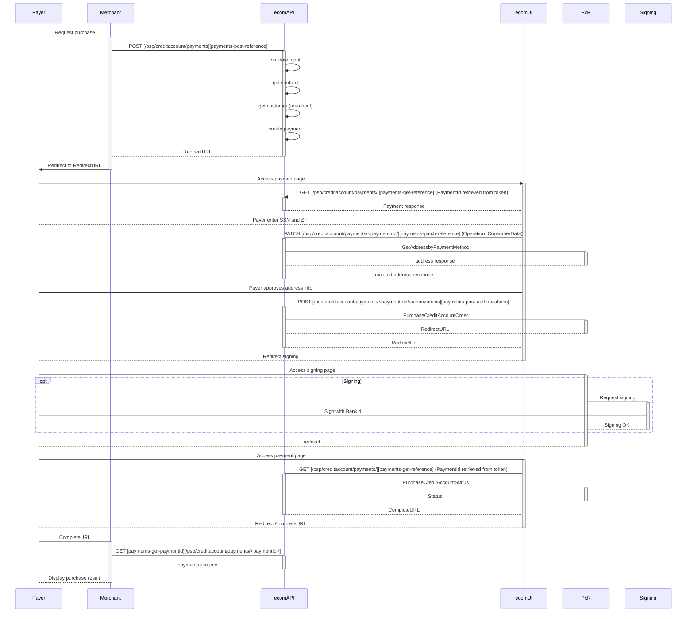
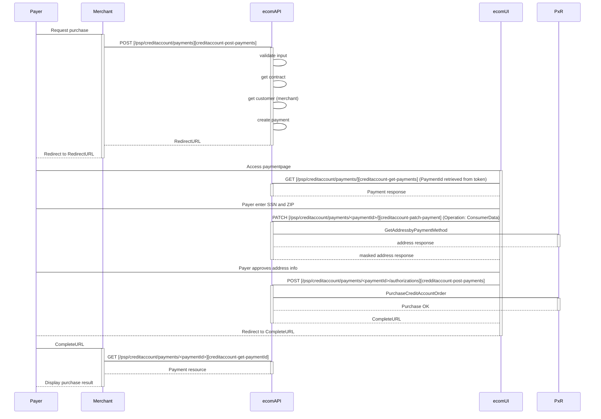



> PayEx Credit Account is an online payment instrument allowing payers to split a purchase into several payments.



## Sequence with unsigned CreditAccount  
Payment sequence when signing is required.

## Sequence with signed CreditAccount  
Payment sequence when signing is not required.

[payments-post-reference]: #
[payments-get-reference]: #
[payments-patch-reference]: #
[payments-post-authorizations]: #
[payments-get-paymentid]: #
[creditaccount-post-payments]: #
[creditaccount-get-payments]: #
[creditaccount-patch-payment]: #
[creditaccount-get-paymentId]: #
