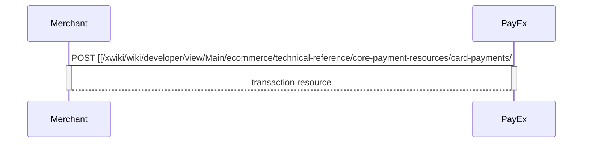
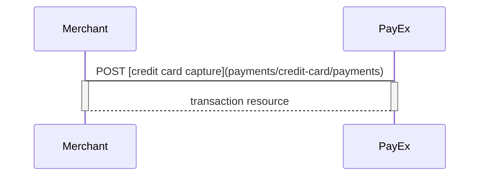
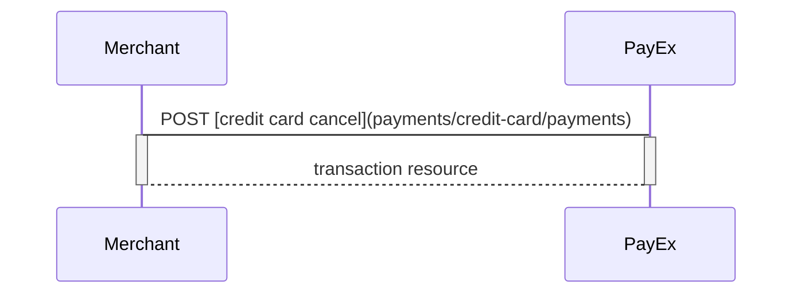
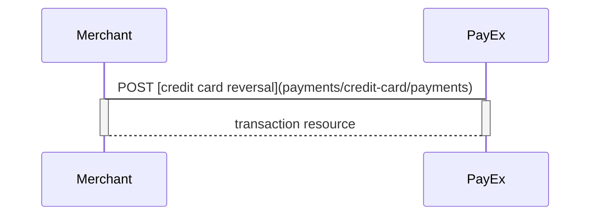
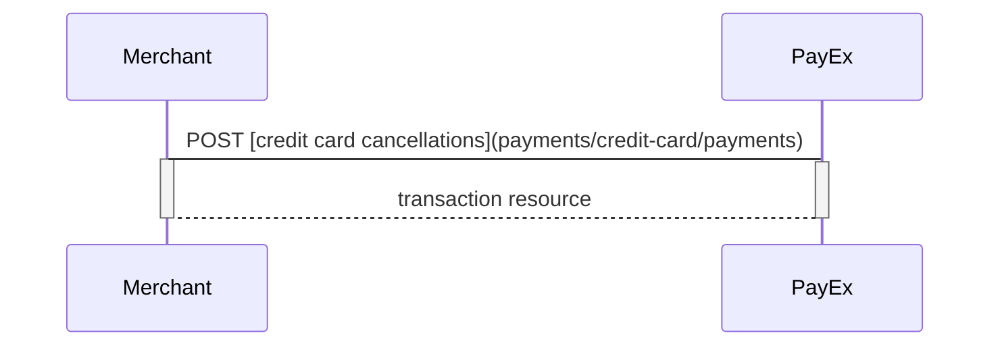
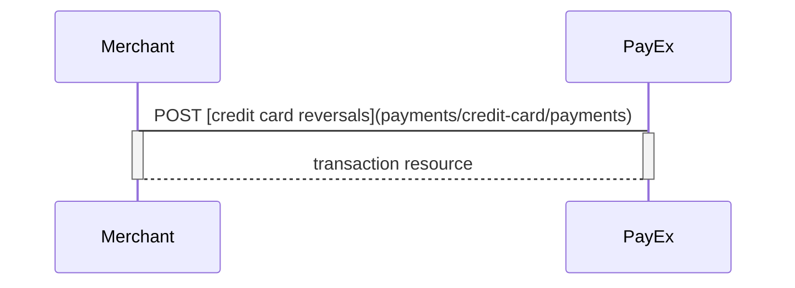

## After payment options for Credit card
#### Capture Sequence

Capture can only be done on a authorized transaction. It is possible to do a part-capture where you only capture a part of the authorization amount. You can later do more captures on the same payment up to the total authorization amount.

#### Cancel Sequence

Cancel can only be done on a authorized transaction. If you do cancel after doing a part-capture you will cancel the different between the capture amount and the authorization amount.

#### Reversal Sequence

Reversal can only be done on a payment where there are some captured amount not yet reversed.

## After payment options for Card Payment Pages in Mobile Apps

### Capture Sequence

Capture can only be done on a authorized transaction. It is possible to do a part-capture where you only capture a smaller amount than the authorization amount. You can later do more captures on the sam payment upto the total authorization amount.

### Cancel Sequence

Cancel can only be done on a authorized transaction. If you do cancel after doing a part-capture you will cancel the different between the capture amount and the authorization amount.

### Reversal Sequence

Reversal can only be done on a payment where there are some captured amount not yet reversed.

## After payment options for Direct Card Payments

### Capture Sequence

Capture can only be done on a authorized transaction. It is possible to do a part-capture where you only capture a smaller amount than the authorization amount. You can later do more captures on the sam payment upto the total authorization amount.

### Cancel Sequence

Cancel can only be done on a authorized transaction. If you do cancel after doing a part-capture you will cancel the different between the capture amount and the authorization amount.

### Reversal Sequence

Reversal can only be done on a payment where there are some captured amount not yet reversed.

## After payment options for Payout to Card
### Options after a payment

You have the following options after a server-to-server Recur payment `POST`.

#### Autorization (intent)

* **Authorization (two-phase):** If you want the credit card to reserve the amount, you will have to specify that the intent of the purchase is Authorization. The amount will be reserved but not charged. You will later (i.e. when you are ready to ship the purchased products) have to make a [Capture](/xwiki/wiki/developer/view/Main/ecommerce/technical-reference/core-payment-resources/card-payments/#HCaptures) or [Cancel](/xwiki/wiki/developer/view/Main/ecommerce/technical-reference/core-payment-resources/card-payments/#HCancellations) request.

#### Capture (intent)

* **AutoCapture (one-phase): **If you want the credit card to be charged right away, you will have to specify that the intent of the purchase is AutoCapture. The credit card will be charged and you don't need to do any more financial operations to this purchase.​​​​​