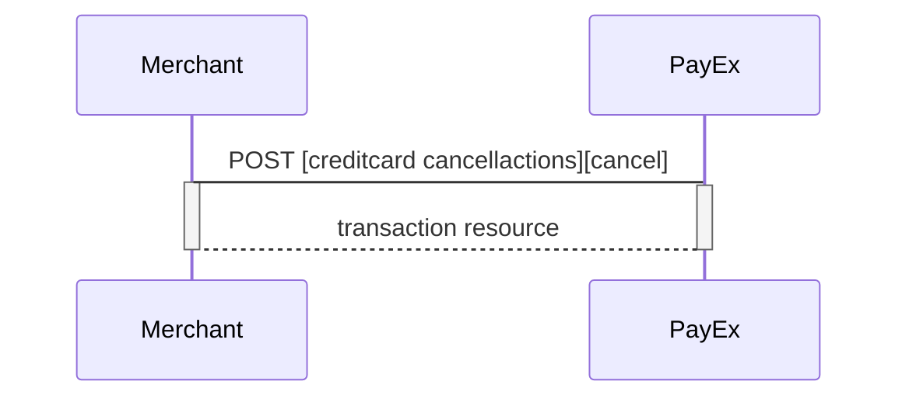
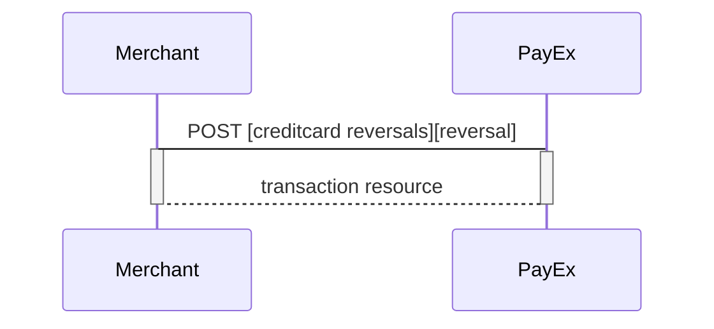
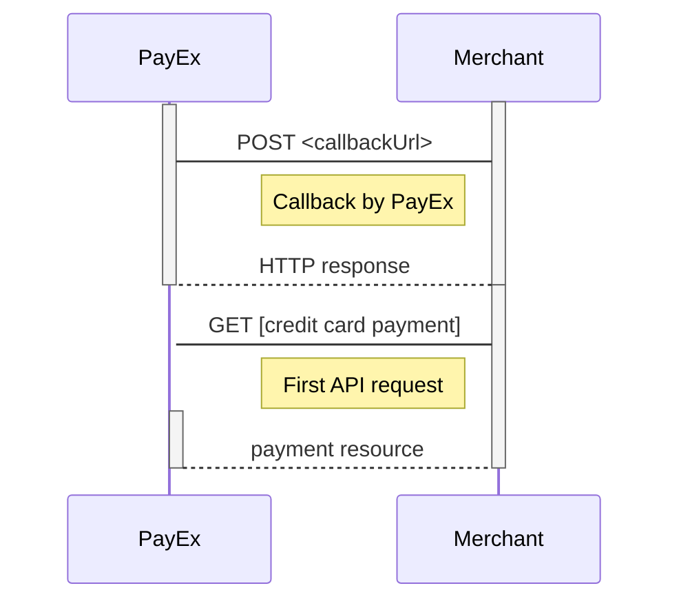
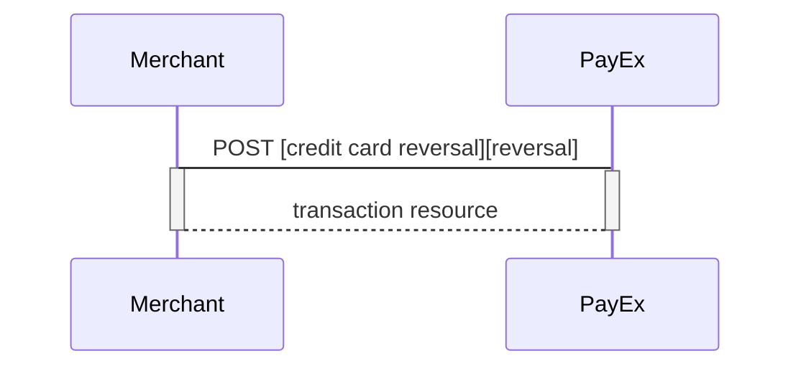
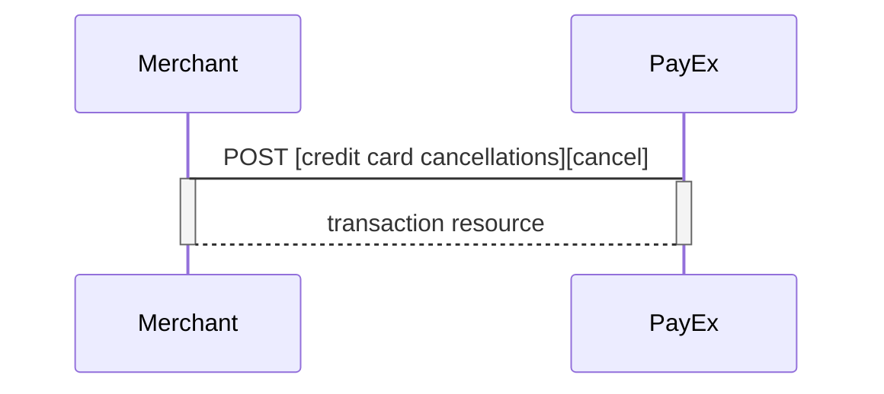
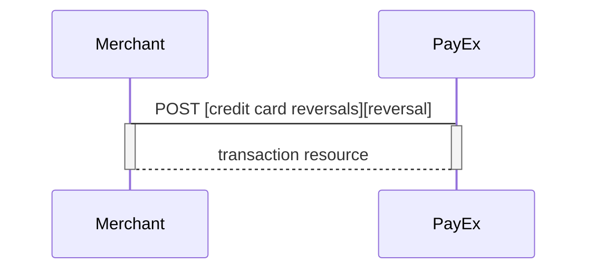



## After payment options for Credit card

### Options after posting a payment

* *Abort:* It is possible to abort the process, if the payment has no successful 
transactions. [See the PATCH payment description][abort].  
* If the payment shown above is done as a two phase (`Authorization`), you will 
need to implement the `Capture` and `Cancel` requests.  
* For `reversals`, you will need to implement the [Reversal request][reversal].  
* If you did a `PreAuthorization`, you will have to send a 
[Finalize request][finalize] to finalize the transaction.  
* *If CallbackURL is set:* Whenever changes to the payment occur a 
[Callback request][callback] will be posted to the callbackUrl, which was 
generated when the payment was created.  


### Capture  
The `captures` resource list the capture transactions (one or more) on a 
specific payment.

{:.code-header}
**Request**

```HTTP
GET /psp/creditcard/payments/5adc265f-f87f-4313-577e-08d3dca1a26c/captures HTTP/1.1
Host: api.payex.com
Authorization: Bearer <MerchantToken>
Content-Type: application/json
```

{:.code-header}
**Response**

```HTTP
HTTP/1.1 200 OK
Content-Type: application/json
{
    "payment": "/psp/creditcard/payments/5adc265f-f87f-4313-577e-08d3dca1a26c",
    "captures": {
            "id": "/psp/creditcard/payments/5adc265f-f87f-4313-577e-08d3dca1a26c/captures",
            "captureList": [{
                    "id": "/psp/creditcard/payments/5adc265f-f87f-4313-577e-08d3dca1a26c/captures/12345678-1234-1234-1234-123456789012",
                    "transaction": {
                            "id": "/psp/creditcard/payments/5adc265f-f87f-4313-577e-08d3dca1a26c/transactions/12345678-1234-1234-1234-123456789012",
                            "created": "2016-09-14T01:01:01.01Z",
                            "updated": "2016-09-14T01:01:01.03Z",
                            "type": "Capture",
                            "state": "Completed",
                            "number": 1234567890,
                            "amount": 1000,
                            "vatAmount": 250,
                            "description": "Test transaction",
                            "payeeReference": "AH123456",
                            "failedReason": "",
                            "isOperational": false,
                            "operations": []
                    }
            }]
    }
}
```

{:.table .table-striped}
| **Property** | **Data type** | **Description**
|:-------------|:--------------|:--------------
| payment | string |The relative URI of the payment this list of capture transactions belong to.
| captures.id | string |The relative URI of the current  captures  resource.
| captures.captureList | array |The array of capture transaction objects.
| captures.captureList[] | object |The capture transaction object described in the  capture  resource below.

#### Create capture transaction
To create a capture transaction to withdraw money from the payer's card, you 
need to perform the create-capture operation.

{:.code-header}
**Request**

```HTTP
POST /psp/creditcard/payments/5adc265f-f87f-4313-577e-08d3dca1a26c/captures HTTP/1.1
Host: api.payex.com
Authorization: Bearer <MerchantToken>
Content-Type: application/json

{
    "transaction": {
        "amount": 1500,
        "vatAmount": 250,
        "description": "Test Capture",
        "payeeReference": "ABC123"
    }
}
```

{:.table .table-striped}
| ✔︎︎︎︎︎ | **Property** | **Data type** | **Required** | **Description**
|:---|:-------------|:--------------|:-------------|:--------------
| ✔︎︎︎︎︎ | transaction.amount | integer |Amount Entered in the lowest momentary units of the selected currency. E.g. 10000 100.00 NOK, 5000 50.00 SEK.
| ✔︎︎︎︎︎ | transaction.vatAmount | integer |Amount Entered in the lowest momentary units of the selected currency. E.g. 10000 100.00 NOK, 5000 50.00 SEK.
| ✔︎︎︎︎︎ | transaction.description | string |A textual description of the capture transaction.
| ✔︎︎︎︎︎ | transaction.payeeReference | string(30*) |A unique reference for the capture transaction. See [payeeReference][payeeReference] for details.

{:.code-header}
**Response**

```HTTP
HTTP/1.1 200 OK
Content-Type: application/json

{
    "payment": "/psp/creditcard/payments/5adc265f-f87f-4313-577e-08d3dca1a26c",
    "capture": {
            "id": "/psp/creditcard/payments/5adc265f-f87f-4313-577e-08d3dca1a26c/captures/12345678-1234-1234-1234-123456789012",
            "transaction": {
                   "id": "/psp/creditcard/payments/5adc265f-f87f-4313-577e-08d3dca1a26c/transactions/12345678-1234-1234-1234-123456789012",
                   "created": "2016-09-14T01:01:01.01Z",
                   "updated": "2016-09-14T01:01:01.03Z",
                   "type": "Capture",
                   "state": "Completed",
                   "number": 1234567890,
                   "amount": 1500,
                   "vatAmount": 250,
                   "description": "Test Capture",
                   "payeeReference": "ABC123",
                   "isOperational": false,
                   "operations": []
            }
    }
}
```

{:.table .table-striped}
| **Property** | **Data type** | **Description**
|:-------------|:--------------|:-----------------
| payment | string |The relative URI of the payment this capture transaction belongs to.
| capture.id | string | The relative URI of the created capture transaction.
| capture.transaction | object |The object representation of the generic [transaction resource][transaction-resource].

#### Capture Sequence

Capture can only be done on a authorized transaction. It is possible to do a 
part-capture where you only capture a part of the authorization amount. You can 
later do more captures on the same payment up to the total authorization amount.


### Finalize

Finalizing a preauthorized payment is done as a `PATCH`  after a successful 
`Authorization` transaction has been created. The common use-case for the 
finalize operation is to authorize the payment 
(that has the preauthorization intent) and complete all payment related 
activities as soon as possible - in order to complete (finalize) everything 
server-to-server afterwards. The only allowed activity is `Finalize`. To use 
the operation, you should perform a `GET` on the payment after the user returns 
from the `redirect-authorization` operation and find the operation 
`update-authorization-finalize`.

{:.code-header}
**Request**

```http
PATCH /psp/creditcard/payments/5adc265f-f87f-4313-577e-08d3dca1a26c/authorizations/<transactionId> HTTP/1.1
Host: api.payex.com
Authorization: Bearer <MerchantToken>
Content-Type: application/json

{
    "transaction": {
        "activity": "Finalize"
    }
}
```

{:.table .table-striped}
| ✔︎︎︎︎︎ | Property | Data type |Description
| |:--------|:-------|:---------
| ✔︎︎︎︎︎ |transaction.activity|string|Finalize

{:.code-header}
**Response**

```http
HTTP/1.1 200 OK
Content-Type: application/json

{
    "payment": "/psp/creditcard/payments/5adc265f-f87f-4313-577e-08d3dca1a26c",
    "authorization": {
        "id": "/psp/creditcard/payments/5adc265f-f87f-4313-577e-08d3dca1a26c/authorizations/12345678-1234-1234-1234-123456789012",
        "paymentToken": "12345678-1234-1234-1234-123456789012",
        "maskedPan": "123456xxxxxx1234",
        "expireDate": "mm/yyyy",
        "panToken": "12345678-1234-1234-1234-123456789012",
        "cardBrand": "Visa|MC",
        "cardType": "Credit Card|Debit Card",
        "issuingBank": "UTL MAESTRO",
        "countryCode": "999",
        "acquirerTransactionType": "3DSECURE|SSL",
        "acquirerStan": "39736",
        "acquirerTerminalId": "39",
        "acquirerTransactionTime": "2017-08-29T13:42:18Z",
        "authenticationStatus": "Y|A|U|N",
        "transaction": {
            "id": "/psp/creditcard/payments/5adc265f-f87f-4313-577e-08d3dca1a26c/transactions/12345678-1234-1234-1234-123456789012",
            "created": "2016-09-14T01:01:01.01Z",
            "updated": "2016-09-14T01:01:01.03Z",
            "type": "Authorization",
            "state": "Initialized",
            "number": 1234567890,
            "amount": 1000,
            "vatAmount": 250,
            "description": "Test transaction",
            "payeeReference": "AH123456",
            "failedReason": "",
            "isOperational": true,
            "operations": [
                {
                    "href": "https://api.payex.com/psp/creditcard/payments/5adc265f-f87f-4313-577e-08d3dca1a26c",
                    "rel": "edit-authorization",
                    "method": "PATCH"
                }
            ]
        }
    }
}
```

{:.table .table-striped}
|Property|Data type|Description
|:-------|:--------|:-----------
|payment|string|The relative URI of the payment this finalize transaction resource belongs to.
|authorization|object|The object representation of the [authorization transaction resource].


### Cancellations 

The `cancellations` resource lists the cancellation transactions on a specific 
payment.

{:.code-header}
**Request**

```HTTP
GET /psp/creditcard/payments/5adc265f-f87f-4313-577e-08d3dca1a26c/cancellations HTTP/1.1
Host: api.payex.com
Authorization: Bearer <MerchantToken>
Content-Type: application/json
```

{:.code-header}
**Response**

```HTTP
HTTP/1.1 200 OK
Content-Type: application/json

{
    "payment": "/psp/creditcard/payments/5adc265f-f87f-4313-577e-08d3dca1a26c",
    "cancellations": {
        "id": "/psp/creditcard/payments/5adc265f-f87f-4313-577e-08d3dca1a26c/cancellations",
        "cancellationList": [{
            "id": "/psp/creditcard/payments/5adc265f-f87f-4313-577e-08d3dca1a26c/cancellations/12345678-1234-1234-1234-123456789012",
            "transaction": {
                "id": "/psp/creditcard/payments/5adc265f-f87f-4313-577e-08d3dca1a26c/transactions/12345678-1234-1234-1234-123456789012",
                "created": "2016-09-14T01:01:01.01Z",
                "updated": "2016-09-14T01:01:01.03Z",
                "type": "Cancellation",
                "state": "Completed",
                "number": 1234567890,
                "amount": 1000,
                "vatAmount": 250,
                "description": "Test transaction",
                "payeeReference": "AH123456",
                "failedReason": "",
                "isOperational": false,
                "operations": []
            }
        }]
    }
}
```

{:.table .table-striped}
| **Property** | **Data type** | **Description**
|:-------------|:--------------|:------------------
| payment | string |The relative URI of the payment this list of cancellation transactions belong to.
| cancellations.id | string | The relative URI of the current `cancellations` resource.
| cancellations.cancellationList | array | The array of the cancellation transaction objects.
| cancellations.cancellationList[] | object | The object representation of the cancellation transaction resource described below.

### Create cancellation transaction

Perform the `create-cancel` operation to cancel a previously created - and not 
yet captured - payment.

{:.code-header}
**Request**

```HTTP
POST /psp/creditcard/payments/5adc265f-f87f-4313-577e-08d3dca1a26c/cancellations HTTP/1.1
Host: api.payex.com
Authorization: Bearer <MerchantToken>
Content-Type: application/json

{
    "transaction": {
        "description": "Test Cancellation",
        "payeeReference": "ABC123"
    }
}
```

{:.table .table-striped}
| ✔︎︎︎︎︎ | **Property** | **Data type** | **Required** | **Description**
|:-------------|:--------------|:-------------|:---------------
| ✔︎︎︎︎︎ | transaction.description | string | A textual description of the reason 
for the cancellation.
| ✔︎︎︎︎︎ | transaction.payeeReference | string(30*) | A unique reference for the 
cancellation transaction. See [payeeReference][payeeReference] for details.

The `cancel` resource contains information about a cancellation transaction 
made against a payment.

{:.code-header}
**Response**

```HTTP
HTTP/1.1 200 OK
Content-Type: application/json

{
    "payment": "/psp/creditcard/payments/5adc265f-f87f-4313-577e-08d3dca1a26c",
    "cancellation": {
        "id": "/psp/creditcard/payments/5adc265f-f87f-4313-577e-08d3dca1a26c/cancellations/12345678-1234-1234-1234-123456789012",
        "transaction": {
            "id": "/psp/creditcard/payments/5adc265f-f87f-4313-577e-08d3dca1a26c/transactions/12345678-1234-1234-1234-123456789012",
            "created": "2016-09-14T01:01:01.01Z",
            "updated": "2016-09-14T01:01:01.03Z",
            "type": "Cancellation",
            "state": "Initialized",
            "number": 1234567890,
            "amount": 1000,
            "vatAmount": 250,
            "description": "Test Cancellation",
            "payeeReference": "ABC123",
            "failedReason": "",
            "isOperational": false,
            "operations": []
        }
    }
}
```

{:.table .table-striped}
| **Property** | **Data type** | **Description**
|:-------------|:--------------|:---------------
| payment | string | The relative URI of the payment this cancellation 
transaction belongs to.
| cancellation.id | string | The relative URI of the current cancellation 
transaction resource.
| cancellation.transaction | object | The object representation of the generic 
[transaction resource][transaction-resource].

#### Cancel Sequence

Cancel can only be done on a authorized transaction. If you do cancel after 
doing a part-capture you will cancel the different between the capture amount 
and the authorization amount.



### Reversals

The `reversals` resource lists the reversal transactions (one or more) on a 
specific payment.

{:.code-header}
**Request**

```HTTP
GET /psp/creditcard/payments/5adc265f-f87f-4313-577e-08d3dca1a26c/reversals HTTP/1.1
Host: api.payex.com
Authorization: Bearer <MerchantToken>
Content-Type: application/json
```

{:.code-header}
**Response**

```HTTP
HTTP/1.1 200 OK
Content-Type: application/json

{
    "payment": "/psp/creditcard/payments/5adc265f-f87f-4313-577e-08d3dca1a26c",
    "reversals": {
        "id": "/psp/creditcard/payments/5adc265f-f87f-4313-577e-08d3dca1a26c/reversal",
        "reversalList": [{
            "id": "/psp/creditcard/payments/5adc265f-f87f-4313-577e-08d3dca1a26c/reversal/12345678-1234-1234-1234-123456789012",
            "transaction": {
                "id": "/psp/creditcard/payments/5adc265f-f87f-4313-577e-08d3dca1a26c/transactions/12345678-1234-1234-1234-123456789012",
                "created": "2016-09-14T01:01:01.01Z",
                "updated": "2016-09-14T01:01:01.03Z",
                "type": "Reversal",
                "state": "Completed",
                "number": 1234567890,
                "amount": 1000,
                "vatAmount": 250,
                "description": "Test transaction",
                "payeeReference": "AH123456",
                "failedReason": "",
                "isOperational": false,
                "operations": []
            }
        }]
    }
}
```

{:.table .table-striped}
| **Property** | **Type** | **Description**
|:-------------|:---------|:-----------------
| payment | string | The relative URI of the payment that the reversal transactions belong to.
| id | string | The relative URI of the created reversal transaction.
| reversalList | array | The array of reversal transaction objects.
| reversalList[] | object |The reversal transaction object representation of the reversal transaction resource described below.

#### Create reversal transaction

The `create-reversal` operation will reverse a previously captured payment.

{:.code-header}
**Request**

```HTTP
POST /psp/creditcard/payments/5adc265f-f87f-4313-577e-08d3dca1a26c/reversals HTTP/1.1
Host: api.payex.com
Authorization: Bearer <MerchantToken>
Content-Type: application/json

{
    "transaction": {
        "amount": 1500,
        "vatAmount": 0,
        "description": "Test Reversal",
        "payeeReference": "ABC123"
    }
}
```

{:.table .table-striped}
| ✔︎︎︎︎︎ | **Property** | **Data type** | **Description**
| ✔︎︎︎︎︎ | transaction.amount | integer | Amount Entered in the lowest momentary units of the selected currency. E.g. 10000 = 100.00 NOK, 5000 = 50.00 SEK.
| ✔︎︎︎︎︎ | transaction.vatAmount | integer | Amount Entered in the lowest momentary units of the selected currency. E.g. 10000 = 100.00 NOK, 5000 = 50.00 SEK.
| ✔︎︎︎︎︎ | transaction.description | string | A textual description of the capture
| ✔︎︎︎︎︎ | transaction.payeeReference | string(30*) | A unique reference for the reversal transaction. See [payeeReference][payeeReference] for details.

The `reversal` resource contains information about the newly created reversal 
transaction.

{:.code-header}
**Response**

```HTTP
HTTP/1.1 200 OK
Content-Type: application/json

{
    "payment": "/psp/creditcard/payments/5adc265f-f87f-4313-577e-08d3dca1a26c",
    "reversal": {
        "id": "/psp/creditcard/payments/5adc265f-f87f-4313-577e-08d3dca1a26c/reversal/12345678-1234-1234-1234-123456789012",
        "transaction": {
            "id": "/psp/creditcard/payments/5adc265f-f87f-4313-577e-08d3dca1a26c/transactions/12345678-1234-1234-1234-123456789012",
            "created": "2016-09-14T01:01:01.01Z",
            "updated": "2016-09-14T01:01:01.03Z",
            "type": "Reversal",
            "state": "Completed",
            "number": 1234567890,
            "amount": 1000,
            "vatAmount": 250,
            "description": "Test transaction",
            "payeeReference": "AH123456",
            "failedReason": "",
            "isOperational": false,
            "operations": []
        }
    }
}
```

{:.table .table-striped}
| **Property** | **Data type** | **Description**
|:------------|:---------------|:---------------
| payment | string | The relative URI of the payment this reversal transaction belongs to.
| reversal.id | string | The relative URI of the created reversal transaction.
| reversal.transaction | object | The object representation of the generic [transaction resource][transaction-resource].

#### Reversal Sequence

Reversal can only be done on a payment where there are some captured amount not
 yet reversed.



#### Remove payment token

If you, for any reason, need to delete a paymentToken you use the 
`Delete payment token` request.

>Please note that this call does not erase the card number stored at PayEx. A 
card number is automatically deleted six months after a successful
 `Delete payment token` request. If you want to remove card information 
 beforehand, you need to contact support.ecom@payex.com; and supply them with 
 the relevant transaction reference or payment token.

{:.code-header}
**Request**

```HTTP
PATCH /psp/creditcard/payments/instrumentData/<paymentToken> HTTP/1.1
Host: api.payex.com
Authorization: Bearer <MerchantToken>
Content-Type: application/json

{
  "state": "Deleted", 
  "tokenType" : "PaymentToken|RecurrenceToken",
  "comment": "Comment on why the deletion is happening"
}
```

{:.code-header}
**Response**

```HTTP
HTTP/1.1 200 OK
Content-Type: application/json

{
  "instrumentData": {
    "id": "/psp/creditcard/payments/instrumentdata/12345678-1234-1234-1234-123456789000",
    "paymentToken": "12345678-1234-1234-1234-123456789000",
    "payeeId": "61c65499-de5c-454e-bf4c-043f22538d49",
    "isDeleted": true|false,
    "isPayeeToken": false,
    "cardBrand": "Visa|MasterCard|...",
    "maskedPan": "123456xxxxxx1111",
    "expiryDate": "MM/YYYY"
  }
}
```

#### Callback 

When a change or update from the back-end system are made on a payment or 
transaction, Swedbank Pay will perform a callback to inform the payee (merchant)
 about this update. Callback functionality is explaned in more detail 
 [here][callback].



## After payment options for Card Payment Pages in Mobile Apps

### Capture Sequence

Capture can only be done on a authorized transaction. It is possible to do a 
part-capture where you only capture a smaller amount than the authorization 
amount. You can later do more captures on the sam payment upto the total 
authorization amount.


### Cancel Sequence

Cancel can only be done on a authorized transaction. If you do cancel after 
doing a part-capture you will cancel the different between the capture amount 
and the authorization amount.


### Reversal Sequence

Reversal can only be done on a payment where there are some captured amount not 
yet reversed.



## After payment options for Direct Card Payments

### Capture Sequence

Capture can only be done on a authorized transaction. It is possible to do a 
part-capture where you only capture a smaller amount than the authorization 
amount. You can later do more captures on the sam payment upto the total 
authorization amount.


### Cancel Sequence

Cancel can only be done on a authorized transaction. If you do cancel after 
doing a part-capture you will cancel the different between the capture amount 
and the authorization amount.



### Reversal Sequence

Reversal can only be done on a payment where there are some captured amount not 
yet reversed.



## After payment options for Payout to Card
### Options after a payment

You have the following options after a server-to-server Recur payment `POST`.

#### Autorization (intent)

* **Authorization (two-phase):** If you want the credit card to reserve the 
* amount, you will have to specify that the intent of the purchase is 
* Authorization. The amount will be reserved but not charged. You will later 
* (i.e. when you are ready to ship the purchased products) have to make a 
* [Capture][capture] or [Cancel][cancel] request.

#### Capture (intent)

* **AutoCapture (one-phase): **If you want the credit card to be charged right 
away, you will have to specify that the intent of the purchase is AutoCapture. 
The credit card will be charged and you don't need to do any more financial 
operations to this purchase.​​​​​


[transaction-resource]: /payments/credit-card/other-features/#transactions
[payeeReference]: /payments/credit-card/other-features/#payeereference
[callback]: /payment/credit-card/other-features/#callback


[abort]: /payments/credit-card/other-features/#abort
[callback]: /payments/credit-card/other-features/#callback
[cancel]: /payments/credit-card/after-payment/#cancellations
[capture]: /payments/credit-card/after-payment/#Capture
[finalize]: /payments/credit-card/after-payment/#finalize
[reversal]: /payments/credit-card/after-payment/#reversals
[verify]: /payments/credit-card/other-features/#verify
