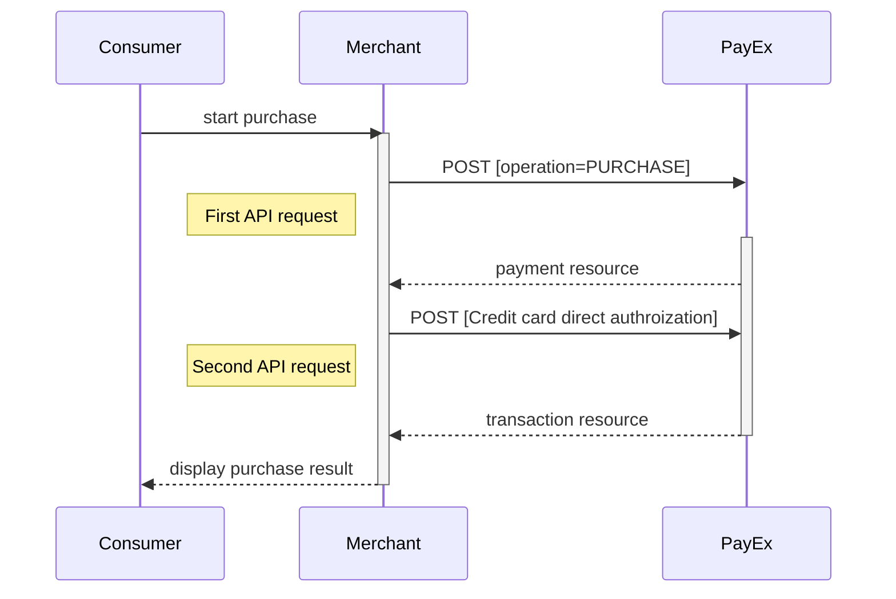
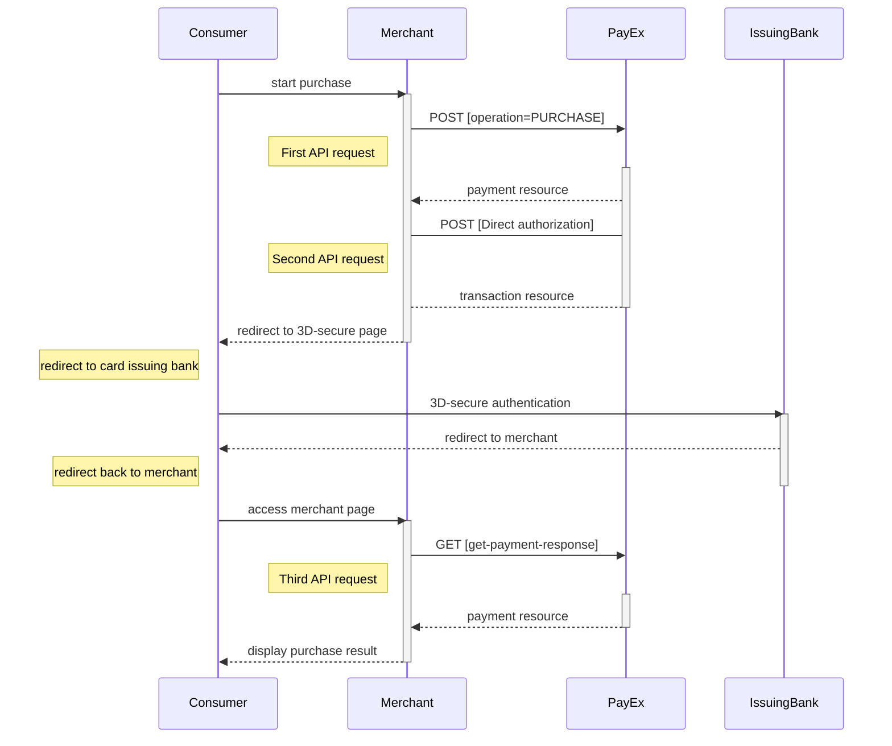







* The payer places an order and you make a `POST` request towards Swedbank Pay 
with gathered `Purchase` information. The action taken next is the 
`direct-authorization` operation that is returned in the first request. 
* You `POST` the payer's card data to the URL in the 
[`direct-authorization` operation][authorization].
* If 3D-secure authentication is required, you will then receive a URL where 
you will have to redirect the payer.
* When the payment is completed, the payer needs to be redirected back to your
merchant/webshop site.
* Finally you make a `GET` request towards Swedbank Pay with the `paymentID`
received in the first step, which will return the purchase result.

### API Requests

The API requests are displayed in the [purchase flow](#purchase-flow-2). The 
options you can choose from when creating a payment with key `operation` set to
Value `Purchase` are listed below. The general REST based API model is described
in the [technical reference](#).

#### Options before posting a payment

All valid options when posting in a payment with `operation` equal to `Purchase`
, are described in [the technical reference].

##### Type of authorization (Intent).

* **PreAuthorization**: If you specify that the `intent` of the `purchase` is 
`PreAuthorization`, it's almost the same as an authorization,
_except that no money will be reserved_ from the consumers credit card, 
[before you finalize the transaction][finalize]
* **Authorization (two-phase):** If you want the credit card to reserve the 
amount, you will have to specify that the `intent` of the `purchase` is 
`Authorization`. The amount will be reserved but not charged. You will later 
(i.e. when you are ready to ship the purchased products) have to make a 
[Capture][Capture] or [Cancel][Cancel] request.

##### Type of capture (Intent)

* **AutoCapture (one-phase):** If you want the credit card to be charged right 
* away, you will have to specify that the `intent` of the purchase is 
* `AutoCapture`. The credit card will be charged and you don't need to do any 
more financial operations to this purchase.

##### General

* **No 3D Secure and card acceptance**: There are optional paramers that can be 
used in relation to 3d-secure and card acceptance. By default, most credit card 
agreements with an acquirer will require that you use 3D-Secure for card holder 
authentication. However, if your agreement allows you to make a card payment 
without this authentication, or that specific cards can be declined, you may 
adjust these optional parameters when posting in the payment. This is specified 
in the technical reference section for creating credit card payments  - you will
 find the link in the sequence diagram below.
* **Defining CallbackURL**: When implementing a scenario, it is optional to set 
a [CallbackURL][callback] in the `POST` request. If callbackURL is set Swedbank 
Pay will send a postback request to this URL when the consumer has fulfilled the
 payment. [See the Callback API description here][callback].

### Purchase flow

The sequence diagram below shows a high level description of a complete 
purchase, and the requests you have to send to Swedbank Pay. The links will take
 you directly to the corresponding API description.

When dealing with credit card payments, 3D-Secure authentication of the 
cardholder is an essential topic. There are three alternative outcomes of 
acredit card payment:

* 3D-Secure enabled - by default, 3D-secure should be enabled, and Swedbank Pay 
will check if the card is enrolled with 3D-secure. This depends on the issuer of
 the card. If the card is not enrolled with 3D-Secure, no authentication of the 
 cardholder is done.
* Card supports 3D-Secure - if the card is enrolled with 3D-Secure, Swedbank Pay
will redirect the cardholder to the autentication mechanism that is decided by 
the issuing bank. Normally this will be done using BankID or Mobile BankID.

### Options after posting a purchase payment

* If the payment shown above is done as a two-phase (Authorization), you will 
need to implement the Capture and Cancel requests.
* **Abort:** It is possible to [abort a payment][abort] if the payment has no 
successful transactions.
* For reversals, you will need to implement the [Reversal][reversal] request.
* If you did a PreAuthorization, you will have to send a Finalize to the 
transaction using [PATCH on the Authorization][finalize].
* **Callback from Swedbank Pay:** Whenever changes to the payment occur a 
[Callback request][callback] will be posted to the `callbackUrl`, 
generated when the payment was created.



[abort]: /payments/credit-card/other-features/#abort
[callback]: /payments/credit-card/other-features/#callback
[Cancel]: /payments/credit-card/after-payment/#Cancellations
[Capture]: /payments/credit-card/after-payment/#Capture
[finalize]: /payments/credit-card/after-payment/#finalize
[PCI-link]: https://www.pcisecuritystandards.org/
[reversal]: /payments/credit-card/after-payment/#Reversals
[authorization]: /payments/credit-card/other-features/#create-authorization-transaction