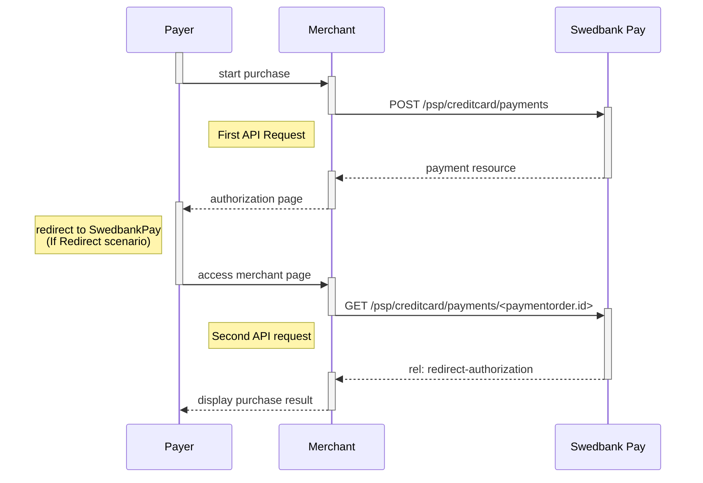
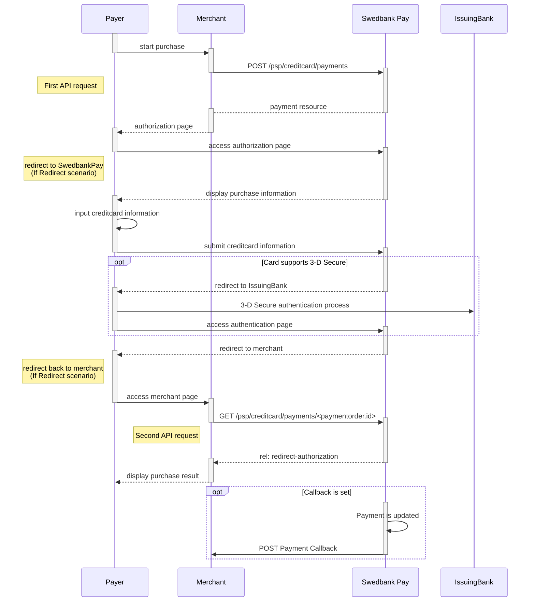


TODO: This page needs serious clean-up.






* When properly set up in your merchant/webshop site and the payer starts the
purchase process, you need to make a `POST` request towards Swedbank Pay with
your Purchase information. This will generate a payment object with a unique
`paymentID`. You either receive a Redirect URL to a Swedbank Pay hosted
page(Redirect integration) or a JavaScript source in
response(Seamless View integration).
* You need to [redirect][redirect] the payer's browser to that specified URL,
or embed the script source on your site to create a Hosted View in an iFrame;
so that she can enter the credit card details in a secure Swedbank Pay hosted
environment.
* Swedbank Pay will handle 3-D Secure authentication when this is required.
* Swedbank Pay will redirect the payer's browser to - or display directly in
the iFrame - one of two specified URLs, depending on whether the payment session
 is followed through completely or cancelled beforehand. Please note that both a
  successful and rejected payment reach completion, in contrast to a cancelled
  payment.
* When you detect that the payer reach your `completeUrl` , you need to do a
`GET` request, containing the `paymentID` generated in the first step, to
receive the state of the transaction.

## Screenshots

You will redirect the payer to Swedbank Pay hosted pages to collect the credit
card information.

![screenshot of the redirect card payment page][card-payment]{:height="500px" width="425px"}

## API Requests

The API requests are displayed in the [purchase flow](#purchase-flow).
You can [create a card `payment`][create-payment] with following `operation`
options:

* [Purchase][purchase]
* [Recur][recur]
* [Payout][payout]
* [Verify][verify]

Our `payment` example below uses the [`purchase`][purchase] value.

### Type of authorization - Intent

The intent of the payment identifies how and when the charge will be
effectuated. This determine the type of transaction used during the payment
process.

* **Authorization (two-phase)**: If you want the credit card to reserve the
amount, you will have to specify that the intent of the purchase is
Authorization. The amount will be reserved but not charged. You will later
(i.e. when you are ready to ship the purchased products) have to make a
[Capture][capture] or [Cancel][cancel] request.
* **AutoCapture (one-phase)**:  If you want the credit card to be charged right
away, you will have to specify that the intent of the purchase is `AutoCapture`.
 The credit card will be charged automatically after authorization and you don't
  need to do any more financial operations to this purchase.

### Purchase flow

The sequence diagram below shows a high level description of a complete
purchase, and the requests you have to send to Swedbank Pay. The links will
take you directly to the corresponding API description.

When dealing with credit card payments, 3-D Secure authentication of the
cardholder is an essential topic. There are three alternative outcome of a
credit card payment:

* 3-D Secure enabled - by default, 3-D Secure should be enabled, and Swedbank Pay
* will check if the card is enrolled with 3-D Secure. This depends on the issuer
* of the card. If the card is not enrolled with 3-D Secure, no authentication of
* the cardholder is done.
* Card supports 3-D Secure - if the card is enrolled with 3-D Secure, Swedbank Pay
* will redirect the cardholder to the autentication mechanism that is decided
* by the issuing bank. Normally this will be done using BankID or Mobile
* BankID.



[card-payment]: /assets/img/payments/card-payment.png
[finalizing-the-transaction]: /payments/credit-card/after-payment
[cancel]: /payments/credit-card/after-payment/#cancellations
[capture]: /payments/credit-card/after-payment/#Capture
[redirect]: /payments/credit-card/redirect
[create-payment]: /payments/credit-card/other-features/#create-payment
[purchase]: /payments/credit-card/other-features/#purchase
[recur]: /payments/credit-card/other-features/#recur
[payout]: /payments/credit-card/other-features/#payout
[verify]: /payments/credit-card/other-features/#verify
