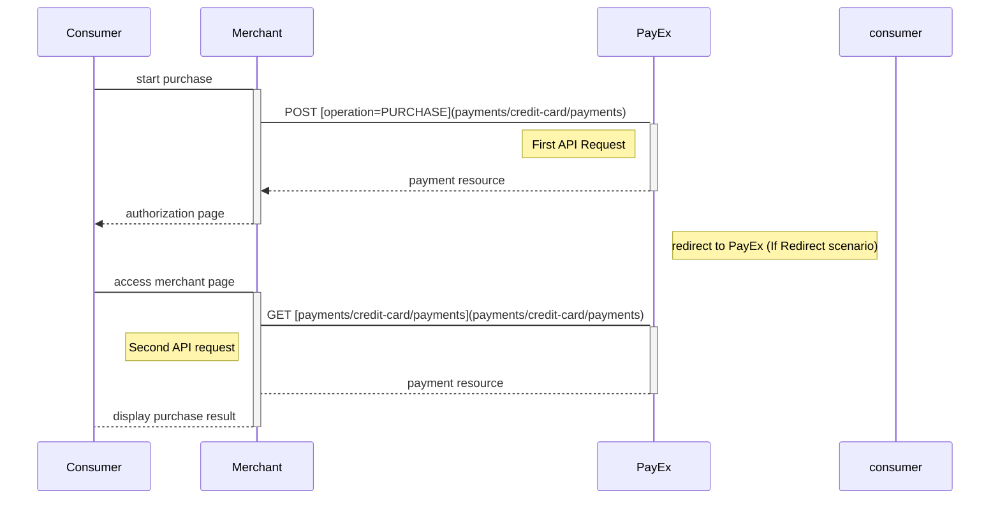
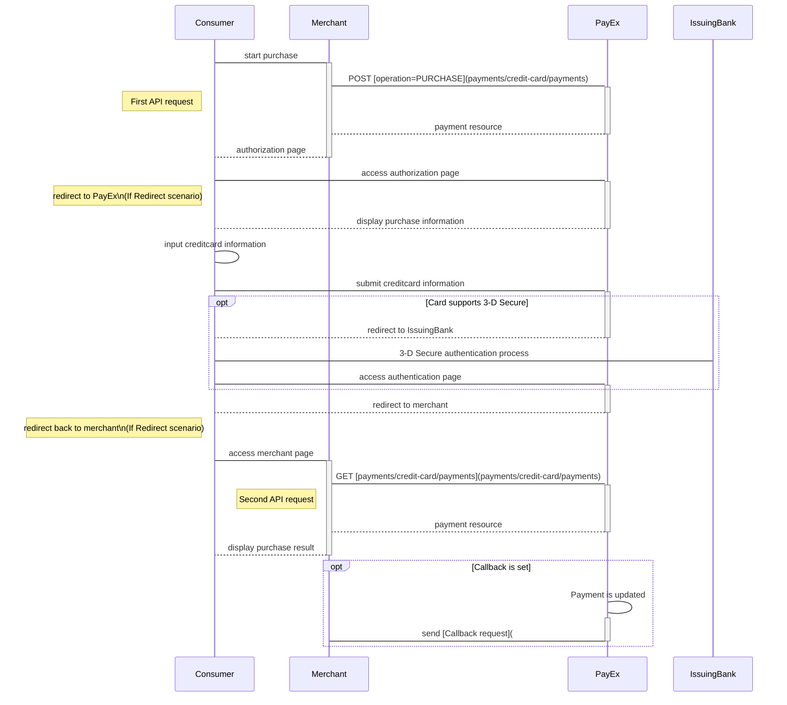
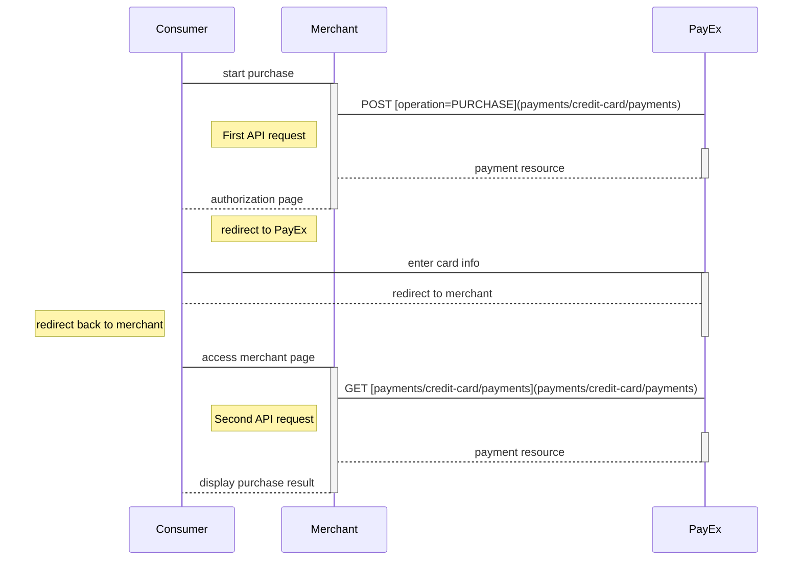
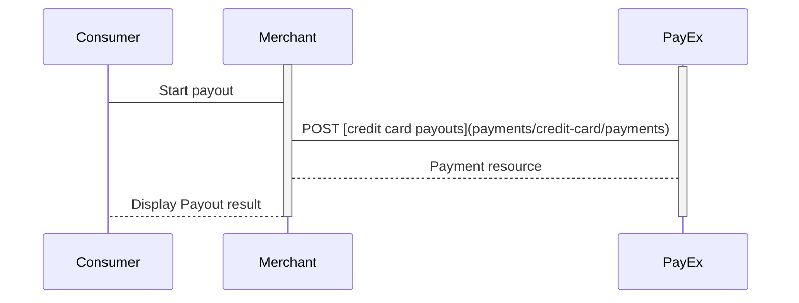


TODO: This page needs serious clean-up.






* When properly set up in your merchant/webshop site and the payer starts the purchase process, you need to make a POST request towards PayEx with your Purchase information. This will generate a payment object with a unique paymentID. You either receive a Redirect URL to a hosted page or a JavaScript source in response.
* You need to [redirect] the payer's browser to that specified URL, or embed the script source on your site to create a Hosted View in an iFrame; so that she can enter the credit card details in a secure PayEx hosted environment.
* PayEx will handle 3D-secure authentication when this is required.
* PayEx will redirect the payer's browser to - or display directly in the iFrame - one of two specified URLs, depending on whether the payment session is followed through completely or cancelled beforehand. Please note that both a successful and rejected payment reach completion, in contrast to a cancelled payment.
* When you detect that the payer reach your completeUrl , you need to do a `GET` request to receive the state of the transaction, containing the paymentID generated in the first step, to receive the state of the transaction.

## Screenshots

You will redirect the payer to PayEx hosted pages to collect the credit card information.

![Screnshot-1]

## API Requests

The API requests are displayed in the [purchase flow](#purchase-flow). The options you can choose from when creating a payment with key operation set to Value Purchase are listed below. The general REST based API model is described in the [technical reference][technical-reference].

### Options before posting a payment

All valid options when posting in a payment with se, are described in the [technical reference][technical-reference].

#### Type of authorization - Intent
* *PreAuthorization*: A purchase with PreAuthorization intent is handled in a similar manner as the ordinary authorization procedure. The notable difference is that the funds are put on hold for 30 days (for an ordinary authorization the funds are reserved for 7 days). Also, with a PreAuthorization, the captured amount can be higher than the preauthorized amount. The amount captured should not be higher than 20% of the original amount, due to card brand rules. You complete the purchase by [finalizing the transaction][finalizing-the-transaction].
* *Authorization (two-phase)*: If you want the credit card to reserve the amount, you will have to specify that the intent of the purchase is Authorization. The amount will be reserved but not charged. You will later (i.e. when you are ready to ship the purchased products) have to make a [Capture] or [Cancel] request.

### Purchase flow

The sequence diagram below shows a high level description of a complete purchase, and the requests you have to send to PayEx. The links will take you directly to the corresponding API description.

When dealing with credit card payments, 3D-Secure authentication of the cardholder is an essential topic. There are three alternative outcome of a credit card payment:

* 3D-Secure enabled - by default, 3D-secure should be enabled, and PayEx will check if the card is enrolled with 3D-secure. This depends on the issuer of the card. If the card is not enrolled with 3D-Secure, no authentication of the cardholder is done.
* Card supports 3D-Secure - if the card is enrolled with 3D-Secure, PayEx will redirect the cardholder to the autentication mechanism that is decided by the issuing bank. Normally this will be done using BankID or Mobile BankID.





## Card Payment Pages in Mobile Apps

>The implementation sequence for this scenario is identical to the standard Redirect scenario, but also includes explanations of how to include this redirect in mobile apps or in mobile web pages.

### Payment Url

For our hosted view, the URL property called paymentUrl will be used if the consumer is redirected out of the hosted view frame through our [Credit Card API]. The consumer is redirected out of frame when at the 3d secure verification for credit card payments. The URL should represent the page of where the payment hosted view was hosted originally, such as the checkout page, shopping cart page, or similar. Basically, paymentUrl should be set to the same URL as that of the page where the JavaScript for the hosted payment view was added to in order to initiate the payment. Please note that the paymentUrl must be able to invoke the same JavaScript URL from the same Payment as the one that initiated the payment originally, so it should include some sort of state identifier in the URL. The state identifier is the ID of the order, shopping cart or similar that has the URL of the Payment stored.

With paymentUrl in place, the retry process becomes much more convenient for both the integration and the payer.

## Screenshots

You will redirect the consumer/end-user to PayEx hosted pages to collect the credit card information.

![Merchant implemented redirect][redirect-image]

## API-requests

The API requests are displayed in the [purchase flow](#purchase-flow-1). The options you can choose from when creating a payment with key operation set to Value Purchase are listed below. The general REST based API model is described in the [technical reference].

### Options before posting a payment

All valid options when posting in a payment with `operation` equal to `Purchase`, are described in [the technical reference].

#### Type of authorization (Intent)

* **PreAuthorization**: If you specify that the `intent` of the `purchase` is `PreAuthorization`, it's almost the same as an authorization, _except that no money will be reserved_ from the consumers credit card, [Finalize request][before-you-finalize-the-transaction]
* **Authorization (two-phase):** If you want the credit card to reserve the amount, you will have to specify that the `intent` of the `purchase` is `Authorization`. The amount will be reserved but not charged. You will later (i.e. when you are ready to ship the purchased products) have to make a [Capture] or [Cancel] request.

#### Type of capture (Intent)

* **AutoCapture (one-phase):** If you want the credit card to be charged right away, you will have to specify that the `intent` of the purchase is `AutoCapture`. The credit card will be charged and you don't need to do any more financial operations to this purchase.

#### General

* **No 3D Secure and card acceptance**: There are optional paramers that can be used in relation to 3d-secure and card acceptance. By default, most credit card agreements with an acquirer will require that you use 3D-Secure for card holder authentication. However, if your agreement allows you to make a card payment without this authentication, or that specific cards can be declined, you may adjust these optional parameters when posting in the payment. This is specified in the technical reference section for creating credit card payments  - you will find the link in the sequence diagram below.
* **Defining CallbackURL**: When implementing a scenario, it is optional to set a [CallbackURL] in the `POST` request. If callbackURL is set PayEx will send a postback request to this URL when the consumer has fulfilled the payment. [See the Callback API description here][technical-reference].

## Purchase flow

The sequence diagram below shows a high level description of a complete purchase, and the two requests you have to send to PayEx. The links will take you directly to the corresponding API description.

When dealing with credit card payments, 3D-Secure authentication of the cardholder is an essential topic. There are three alternative outcome of a credit card payment:

* 3D-Secure enabled - by default, 3D-secure should be enabled, and PayEx will check if the card is enrolled with 3D-secure. This depends on the issuer of the card. If the card is not enrolled with 3D-Secure, no authentication of the cardholder is done.
* Card supports 3D-Secure - if the card is enrolled with 3D-Secure, PayEx will redirect the cardholder to the autentication mechanism that is decided by the issuing bank. Normally this will be done using BankID or Mobile BankID. 



### Detailed Sequence Diagram enabing 3D-secure authentication

```mermaid
sequenceDiagram
  Consumer->Merchant: start purchase
  Activate Merchant
  Merchant->PayEx: POST [operation=PURCHASE](payments/credit-card/payments)
  note left of Merchant: First API request
  Activate PayEx
  PayEx-->Merchant: payment resource
  Deactivate PayEx
  Merchant-->Consumer: authorization page
  Deactivate Merchant
  
  Consumer->PayEx: access authorization page
  note left of Consumer: redirect to PayEx\n(if Redirect scenario)
  Activate PayEx
  PayEx-->Consumer: display purchase information
  Deactivate PayEx
  
  Consumer->Consumer: input creditcard information
  Consumer->PayEx: submit creditcard information
  Activate PayEx

  opt Card supports 3-D Secure
  PayEx-->Consumer: redirect to IssuingBank
  Deactivate PayEx
  Consumer<->IssuingBank: 3-D Secure authentication process
  Consumer->PayEx: access authentication page
  Activate PayEx
  end
  
  PayEx-->Consumer: redirect to merchant
  note left of Consumer: redirect back to merchant\n(if Redirect scenario)
  Deactivate PayEx
  
  Consumer->Merchant: access merchant page
  Activate Merchant
  Merchant->PayEx: GET [payments/credit-card/payments](payments/credit-card/payments)
  note left of Merchant: Second API request
  Activate PayEx
  PayEx-->Merchant: payment resource
  Deactivate PayEx
  Merchant-->Consumer: display purchase result
  Deactivate Merchant
  
  opt Callback is set
  PayEx->PayEx: Payment is updated
  Activate PayEx
  PayEx->Merchant: send [Callback request](#)
  deactivate PayEx
  end
```

## Options after posting a payment

* If the payment shown above is done as a two-phase (Authorize), you will need to implement the Capture and Cancel requests.
* **Abort:** It is possible to [abort a payment][abort] if the payment has no successful transactions.
* For reversals, you will need to implement the Reversal request.
* If you did a `PreAuthorization`, you will have to send a `Finalize` to the transaction using [PATCH on the Authorization][finalize-request].
* **Callback from PayEx:** Whenever changes to the payment occur  a [Callback request] will be posted to the `callbackUrl`, generated when the payment was created.

## Direct Card Payments

>The direct payment scenario **is used by customers that are compliant with PCI-DSS regulations**, and is a way to implement card payments without using PayEx Hosted payment pages.  

## Introduction


                      

* The payer places an order and you make a `POST` request towards PayEx with gathered `Purchase` information. The action taken next is the `direct-authorization` operation that is returned in the first request. 
* You `POST` the payer's card data to the URL in the [`direct-authorization` operation](#options-before-posting-a-payment-1).
* If 3D-secure authentication is required, you will then receive a URL where you will have to redirect the payer.
* When the payment is completed, the payer needs to be redirected back to your merchant/webshop site.
* Finally you make a `GET` request towards PayEx with the `paymentID` received in the first step, which will return the purchase result.

## API Requests

The API requests are displayed in the [purchase flow](#purchase-flow-2). The options you can choose from when creating a payment with key `operation` set to Value `Purchase` are listed below. The general REST based API model is described in the [technical reference](#).

### Options before posting a payment

All valid options when posting in a payment with `operation` equal to `Purchase`, are described in [the technical reference].

#### Type of authorization (Intent).

* **PreAuthorization**: If you specify that the `intent` of the `purchase` is `PreAuthorization`, it's almost the same as an authorization, _except that no money will be reserved_ from the consumers credit card, [before you finalize the transaction][finalize-request]
* **Authorization (two-phase):** If you want the credit card to reserve the amount, you will have to specify that the `intent` of the `purchase` is `Authorization`. The amount will be reserved but not charged. You will later (i.e. when you are ready to ship the purchased products) have to make a [Capture][Capture] or [Cancel][Cancel] request.

#### Type of capture (Intent)

* **AutoCapture (one-phase):** If you want the credit card to be charged right away, you will have to specify that the `intent` of the purchase is `AutoCapture`. The credit card will be charged and you don't need to do any more financial operations to this purchase.

## Introduction

The main purchase flow and implementation is exactly the same as described in the [Redirect][redirect] and [Hosted View][hosted-view] scenarios for [card][credit-card] and [financing invoice][financing-invoice] payments, the difference being the use of a paymentToken. The details in this section describe explicitly the parameters that must be set to enable one-click purchases.

### Payment Url

For our hosted view, the URL property called `paymentUrl` will be used if the consumer is redirected out of the hosted view frame through our [Credit Card API]. The consumer is redirected out of frame when at the 3d secure verification for credit card payments. The URL should represent the page of where the payment hosted view was hosted originally, such as the checkout page, shopping cart page, or similar. Basically, `paymentUrl` should be set to the same URL as that of the page where the JavaScript for the hosted payment view was added to in order to initiate the payment. Please note that the `paymentUrl` must be able to invoke the same JavaScript URL from the same Payment as the one that initiated the payment originally, so it should include some sort of state identifier in the URL. The state identifier is the ID of the order, shopping cart or similar that has the URL of the Payment stored.

With paymentUrl in place, the retry process becomes much more convenient for both the integration and the payer.

## API requests to generate paymentToken

When making the initial purchase request, a `paymentToken` is generated.


When the purchase is followed through a `paymentToken` will linked to the payment.  You can return the value by making a `GET` request payment resource ([read up on expanding here][expanding]) either the authorizations or verifications sub-resource), after the consumer successfully has completed the purchase.

```HTTP
GET https://api.payex.com/psp/creditcard/payments/d23a0e69-3c35-4e6b-cb3c-08d73b3d9f95?$expand=[authorizations|verifications] HTTP/1.1
Host: api.payex.com
```

**paymentToken**
```
"paymentToken": "5adc265f-f87f-4313-577e-08d3dca1a26c",
```

You need to store the paymentToken in your system and keep track of the corresponding consumer-ID in your system.

## Returning purchases

When a known consumer (where you have attained a consumer-ID or similar) returns to your system, you can use the payment token, using already stored payment data, to initiate enable one-click payments. You will need to make a standard redirect purchase, following the sequence as specified in the Redirect scenarios for  [credit card api][credit-card] and [financing invoice api][financing-invoice] financing-invoice-redirect/). When making the first `POST` request you insert the `paymentToken` attribute. This must be the `paymentToken` you received in the initial purchase.

See the technical reference, for how to create a [card] and [invoice] payment.

**Request**

```JS
POST /psp/creditcard/payments HTTP/1.1
Host: api.payex.com
Authorization: Bearer <MerchantToken>
Content-Type: application/json      

{
  "payment": {
    "operation": "Verify",
    "currency": "NOK",
    "description": "Test Verification",
    "payerReference": "AB1234",
    "userAgent": "Mozilla/5.0...",
    "language": "nb-NO",
    "generateRecurrenceToken": false,
    "urls": {
      "hostUrls": ["http://test-dummy.net"],
      "completeUrl": "http://test-dummy.net/payment-completed",
      "cancelUrl": "http://test-dummy.net/payment-canceled",
      "paymentUrl": "http://example.com/perform-payment",
      "logoUrl": "https://test-dummy.net/payment-logo.png",
      "termsOfServiceUrl": "https://test-dummy.net/payment-terms.html"
    },
    "payeeInfo": {
      "payeeId": "12345678-1234-1234-1234-123456789012",
      "payeeReference": "CD1234",
      "payeeName": "Merchant1",
      "productCategory": "A123",
      "orderReference": "or-12456",
      "subsite": "MySubsite"
    }
  },
  "creditCard": {
    "rejectCreditCards": false,
    "rejectDebitCards": false,
    "rejectConsumerCards": false,
    "rejectCorporateCards": false
  }
}
```

When redirecting to PayEx (as specified in [the Redirect scenario][redirect]) the payment page will be prefilled with the payer's card details.

## Screenshots

![Merchant implemnted redirect scenario][creditcard-image-2]

## Delete payment token

Please see [Delete payment token][delete-payment-token]

## Payout to Card

>"Payout to Card" is an add-on service that enable you to deposit winnings directly to your end-users' credit cards. This without  the need to collect card details from the end-user a second time.

## Introduction

* Acquirer for this service is Swedbank. You require a separate Swedbank acquiring number to ensure that payout transactions and regular card transactions are kept separate.
* You need to have the 3D-secure protocol enabled.
* The service is available both through hosted payment pages and through direct API integration.
* The current implementation is only available for gaming transactions (Merchant MCC: 7995).
* The payout service is not a part of PayEx Settlement Service.

## API requests

The API requests are displayed in the [payout flow](#payout-flow).  You create a payout by performing a `POST` creditcard payments with key `operation` set to `payout`. See more details in the [Card Payment pages] of the technical reference. The general REST based API model is described in the [technical reference].

The general REST based API model is described [here][technical-reference].

### Payout flow

You must set `Operation` to `Payout` in the initial `POST` request. 



#### General

* **Defining CallbackURL**: When implementing a scenario, it is optional to set a [CallbackURL][CallbackURL]in the `POST` request. If callbackURL is set PayEx will send a postback request to this URL when the consumer has fulfilled the payment. [See the Callback API description here][callback-API-description].

The Verify operation lets you post verification payments, which are used to confirm validity of card information without reserving or charging any amount.

# Verifications

>The Verify operation lets you post verification payments, which are used to confirm validity of card information without reserving or charging any amount.

## Introduction

This option is commonly used when initiating a subsequent [One-click card payment][one-click-payments] or a [recurring card payment][recurring-card-payment] flow - where you do not want to charge the consumer right away.

#### Verification through PayEx Payment Pages

* When properly set up in your merchant/webshop site and the payer initiates a verification operation, you make a `POST` request towards PayEx with your Verify information. This will generate a payment object with a unique paymentID. You either receive a Redirect URL to a hosted page or a JavaScript source in response.
* You need to [redirect] the payer's browser to that specified URL, or embed the script source on your site to create a [Hosted View][hosted-view] in an iFrame; so that she can enter the credit card details in a secure PayEx hosted environment.
* PayEx will handle 3D-secure authentication when this is required.
* PayEx will redirect the payer's browser to - or display directly in the iFrame - one of two specified URLs, depending on whether the payment session is followed through completely or cancelled beforehand. Please note that both a successful and rejected payment reach completion, in contrast to a cancelled payment.
* When you detect that the payer reach your completeUrl , you need to do a `GET` request to receive the state of the transaction.
* Finally you will make a `GET` request towards PayEx with the paymentID received in the first step, which will return the payment result and a paymentToken that can be used for subsequent [One-Click Payments][one-click-payments] and [recurring server-to-server based payments][recurring-server-to-server-based-payments].

### Screenshots

You will redirect the consumer/end-user to PayEx hosted pages to collect the credit card information.

![Merchant implementing redirect][redirect-image]

### API Requests

The API requests are displayed in the [Verification flow]. The options you can choose from when creating a payment with key operation set to Value Verify are listed below. The general REST based API model is described in the [technical reference].

### Verification flow

The sequence diagram below shows the two requests you have to send to PayEx to make a purchase. The links will take you directly to the API description for the specific request. The diagram also shows in high level, the sequence of the process of a complete purchase.  
When dealing with credit card payments, 3D-Secure authentication of the cardholder is an essential topic. There are three alternative outcome of a credit card payment:

* 3D-Secure enabled - by default, 3D-secure should be enabled, and PayEx will check if the card is enrolled with 3D-secure. This depends on the issuer of the card. If the card is not enrolled with 3D-Secure, no authentication of the cardholder is done.
* Card supports 3D-Secure - if the card is enrolled with 3D-Secure, PayEx will redirect the cardholder to the autentication mechanism that is decided by the issuing bank. Normally this will be done using BankID or Mobile BankID.

[Screnshot-1]: /assets/img/creditcard-image-1.png
{:height="711px" width="400px"}
[creditcard-image-2]: /assets/img/creditcard-image-2.png
{:height="711px" width="400px"}
[redirect-image]: /assets/img/creditcard-image-3.png
{:height="711px" width="400px"}
[finalizing-the-transaction]: /payments/credit-card/after-after-payment
[abort-a-payment]: #
[abort]: /payments/credit-card/after-payment
[before-you-finalize-the-transaction]: /payments/credit-card/after-payment
[callback-API-description]: #
[callback-request]: /payments/credit-card/after-payment
[callback]: #
[CallbackURL]: #
[Cancel]: /payments/credit-card/after-after-payment
[Capture]: /payments/credit-card/after-after-payment
[card-verification]: #
[card]: #
[credit-card-auth-direct]: #
[credit-card]: #
[creditcard]: #
[delete-payment-token]: #
[direct-authorization-reference]: #
[expanding]: #
[finalize-request]: /payments/credit-card/after-payment
[financing-invoice]: #
[get-payment-response]: payments/credit-card/payments
[hosted-view]: /..
[invoice]: #
[one-click-payments]: #
[PCI-link]: https://www.pcisecuritystandards.org/
[purchace-operation-link]: #
[purchase-operation-link]: #
[purchase-payment]: #
[recurring-card-payment]: #
[recurring-server-to-server-based-payments]: #
[redirect]: #
[remove-payment-token]: #
[see-the-PATCH-payment-description]: /payments/credit-card/after-payment
[technical-reference]: #
[verify-payment]: #
