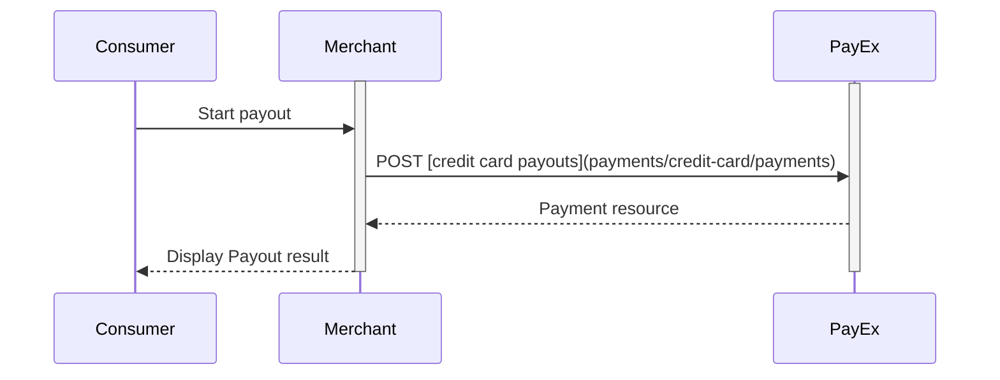



# Create Payment 

Within the card payments part of the eCommerce API, you can create four kinds 
of payments  ([purchase][purchase], [recurrence][recurrence], [payout][payout] 
and [verification][verify]) and you can inspect and alter the details of the 
individual transactions within the payment.

To create a card payment, you perform an HTTP `POST` against the
 `/psp/creditcard/payments resource`.

There are four different kinds of payment that can be created. These are 
identified with the value of the `operation` property. Each kind are documented 
in their own section below.

{:.code-header}
**Request**"

```http
POST /psp/creditcard/payments HTTP/1.1
Host: api.payex.com
Authorization: Bearer <MerchantToken>
Content-Type: application/json

{
    "payment": {
        "operation": "<operation>",
        "intent": "<intent>",
    }
}
```


{:.table .table-striped}
| ✔︎︎︎︎︎ | Property          | Data type | Description                                                                                                                                                                                                                                                                                                                                                                                                                                                                                                                                                                               |
| ----------------- | --------- | -------- | ----------------------------------------------------------------------------------------------------------------------------------------------------------------------------------------------------------------------------------------------------------------------------------------------------------------------------------------------------------------------------------------------------------------------------------------------------------------------------------------------------------------------------------------------------------------------------------------- |
| ✔︎︎︎︎︎ | payment.operation | string   | Determines the initial operation, that defines the type card payment created.<br> <br> `Purchase`. Used to charge a card. It is followed up by a capture or cancel operation.<br> <br> `Recur`.Used to charge a card on a recurring basis. Is followed up by a capture or cancel operation (if not Autocapture is used, that is).<br> <br>`Payout`. Used to deposit funds directly to credit card. No more requests are necessary from the merchant side.<br> <br>`Verify`. Used when authorizing a card withouth reserveing any funds.  It is followed up by a verification transaction. |
| ✔︎︎︎︎︎ | payment.intent    | string    | The intent of the payment identifies how and when the charge will be effectuated. This determine the type transactions used during the payment process.<br> <br>`PreAuthorization`. Holds the funds for a certain time in contrast to reserving the amount. A preauthoriations is always followed by the [finalize][finalize] operation.<br> <br>`Authorization`. Reserves the amount, and is followed by a [cancellation][cancel] or [capture][capture] of funds.<br> <br>`AutoCapture`. A one phase-option that enable capture of funds automatically after authorization.        |

## Purchase 

A `Purchase` payment is a straightforward way to charge the card of the payer. 
It is followed up by posting a capture, cancellation or reversal transaction.

An example of a request is provided below. Each individual Property of the JSON
 document is described in the following section.

{:.code-header}
**Request**

```http
POST /psp/creditcard/payments HTTP/1.1
Authorization: Bearer <MerchantToken>
Content-Type: application/json

{
    "payment": {
        "operation": "Purchase",
        "intent": "Authorization",
        "paymentToken": "",
        "currency": "SEK",
        "prices": [{
                "type": "CreditCard",
                "amount": 1500,
                "vatAmount": 0
            },
            {
                "type": "Visa",
                "amount": 1500,
                "vatAmount": 0
            },
            {
                "type": "MasterCard",
                "amount": 1500,
                "vatAmount": 0
            }
        ],
        "description": "Test Purchase",
        "payerReference": "AB1234",
        "generatePaymentToken": "false",
        "generateRecurrenceToken": "false",
        "userAgent": "Mozilla/5.0...",
        "language": "sv-SE",
        "urls": {
            "hostUrls": ["http://test-dummy.net"],
            "completeUrl": "http://test-dummy.net/payment-completed",
            "cancelUrl": "http://test-dummy.net/payment-canceled",
            "paymentUrl": "http://example.com/perform-payment",
            "callbackUrl": "http://test-dummy.net/payment-callback",
            "logoUrl": "http://test-dummy.net/payment-logo.png",
            "termsOfServiceUrl": "http://test-dummy.net/payment-terms.pdf",
        },
        "payeeInfo": {
            "payeeId": "12345678-1234-1234-1234-123456789012",
            "payeeReference": "CD1234",
            "payeeName": "Merchant1",
            "productCategory": "A123",
            "orderReference": "or123",
            "subsite": "MySubsite"
        },
        "metadata": {
            "key1": "value1",
            "key2": 2,
            "key3": 3.1,
            "key4": false
        },
        "cardholder": {
            "firstName": "firstname/companyname",
            "lastName": "lastname",
            "email": "string",
            "msisdn": "string",
            "homePhoneNumber": "string",
            "workPhoneNumber": "string",
            "shippingAddress": {
                "firstName": "firstname",
                "lastName": "lastname",
                "email": "string",
                "msisdn": "string",
                "streetAddress": "string",
                "coAddress": "string",
                "city": "string",
                "zipCode": "string",
                "countryCode": "string"
            },
            "billingAddress": {
                "firstName": "firstname/companyname",
                "lastName": "lastname",
                "email": "string",
                "msisdn": "string",
                "streetAddress": "string",
                "coAddress": "string",
                "city": "string",
                "zipCode": "string",
                "countryCode": "string"
            },
            "accountInfo": {
                "accountAgeIndicator": "01",
                "accountChangeIndicator": "01",
                "accountPwdChangeIndicator": "01",
                "shippingAddressUsageIndicator": "01",
                "shippingNameIndicator": "01",
                "suspiciousAccountActivity": "01",
                "addressMatchIndicator": "false"
            }
        },
        "riskIndicator": {
            "deliveryEmailAddress": "string",
            "deliveryTimeFrameindicator": "01",
            "preOrderDate": "YYYYMMDD",
            "preOrderPurchaseIndicator": "01",
            "shipIndicator": "01",
            "giftCardPurchase": "false",
            "reOrderPurchaseIndicator": "01",
            "pickUpAddress": {
                "name": "companyname",
                "streetAddress": "string",
                "coAddress": "string",
                "city": "string",
                "zipCode": "string",
                "countryCode": "string"
            }
        }
    },
    "creditCard": {
        "rejectCreditCards": false,
        "rejectDebitCards": false,
        "rejectConsumerCards": false,
        "rejectCorporateCards": false,
    }
}
```

{:.table .table-striped}
| ✔︎︎︎︎︎ | Property     | Data type | Description                                                                                                                                                                                                                                                                                                                                                                                                          |
| :----- | :----------- | :-------- | :------------------------------------------------------------------------------------------------------------------------------------------------------------------------------------------------------------------------------------------------------------------------------------------------------------------------------------------------------------------------------------------------------------------- |
| ✔︎︎︎︎︎ | operation    | string    | Purchase                                                                                                                                                                                                                                                                                                                                                                                                             |
| ✔︎︎︎︎︎ | intent       | string    | `PreAuthorization`. Holds the funds for a certain time in contrast to reserving the amount. A preauthoriation is always followed by the [finalize][finalize] operation. <br> <br> `Authorization`. Reserves the amount, and is followed by a [cancellation][cancel] or [capture][capture] of funds.<br> <br> `AutoCapture`. A one phase option that enable capture of funds automatically after authorization. |
|        | paymentToken | string    | If you put in a paymentToken here, the payment page will preload the stored payment data related to the `paymentToken` and let the consumer make a purchase without having to enter all card data. This is called a "One Click" purchase.                                                                                                                                                                            |
| ✔︎︎︎︎︎ | currency     | string    | NOK, SEK, DKK, USD or EUR.                                                                                                                                                                                                                                                                                                                                                                                           |
| ✔︎︎︎︎︎ | prices.type  | string    | Use the generic type CreditCard if you want to enable all card brands supported by merchant contract. Use card brands like Visa (for card type Visa), MasterCard (for card type Mastercard) and others if you want to specify different amount for each card brand. If you want to use more than one amount you must have one instance in the prices node for each card brand. You will not be allowed to both specify card brands and CreditCard at the same time in this field. [See the Prices resource and prices object types for more information][price-resource].
| ✔︎︎︎︎︎ |prices.amount|integer|Amount is entered in the lowest monetary units of the selected currency. E.g. 10000 = 100.00 NOK, 5000 = 50.00 SEK.
| ✔︎︎︎︎︎ |prices.vatAmount|integer|If the amount given includes VAT, this may be displayed for the user in the payment page (redirect only). Set to 0 (zero) if this is not relevant.
| ✔︎︎︎︎︎ |description|string(40)|A textual description max 40 characters of the purchase.
| |payerReference|string|The reference to the payer (consumer/end user) from the merchant system. E.g mobile number, customer number etc.
| |generatePaymentToken|boolean|`true` or `false`. Set this to `true` if you want to create a paymentToken for future use as One Click.
| |generateRecurrenceToken|boolean|`true` or `false`. Set this to `true` if you want to create a recurrenceToken for future use Recurring purchases (subscription payments).
| ✔︎︎︎︎︎ |userAgent|string|The user agent reference of the consumer's browser - [see user agent definition][user-agent-definition]
| ✔︎︎︎︎︎ |language|string|nb-NO, sv-SE or en-US.
| |urls.hostUrl|array|The array of URLs valid for embedding of Swedbank Pay Hosted Views. If not supplied, view-operation will not be available.
| ✔︎︎︎︎︎ |urls.completeUrl|string|The URL that Swedbank Pay will redirect back to when the payment page is completed.
| |urls.cancelUrl|string|The URI to redirect the payer to if the payment is canceled. Only used in redirect scenarios. Can not be used simultaneously with paymentUrl; only cancelUrl or paymentUrl can be used, not both. 
| |urls.paymentUrl|string|The URI that Swedbank Pay will redirect back to when the view-operation needs to be loaded, to inspect and act on the current status of the payment. Only used in hosted views. If both cancelUrl and paymentUrl is sent, the paymentUrl will used.
| |urls.callbackUrl|string|The URL that Swedbank Pay will perform an HTTP POST against every time a transaction is created on the payment. See [callback][callback] for details.
| |urls.logoUrl|string|The URL that will be used for showing the customer logo. Must be a picture with maximum 50px height and 400px width. Require https.
| |urls.termsOfServiceUrl|string|A URL that contains your terms and conditions for the payment, to be linked on the payment page. Require https.
| ✔︎︎︎︎︎ |payeeInfo.payeeId|string|This is the unique id that identifies this payee (like merchant) set by Swedbank Pay.
| ✔︎︎︎︎︎ |payeeInfo.payeeReference|string(30*)|A unique reference from the merchant system. It is set per operation to ensure an exactly-once delivery of a transactional operation. See [payeeReference][payee-reference] for details.
| |payeeInfo.payeeName|string|The payee name (like merchant name) that will be displayed to consumer when redirected to Swedbank Pay.
| |payeeInfo.productCategory|string|A product category or number sent in from the payee/merchant. This is not validated by Swedbank Pay, but will be passed through the payment process and may be used in the settlement process.
| |payeeInfo.orderReference|String(50)|The order reference should reflect the order reference found in the merchant's systems.
| |payeeInfo.subsite|String(40)|The subsite field can be used to perform split settlement on the payment. The subsites must be resolved with Swedbank Pay reconciliation before being used.
| |metadata|object|The keys and values that should be associated with the payment. Can be additional identifiers and data you want to associate with the payment.
| |cardholder.firstName|string|Optional (increased chance for frictionless flow if set) If buyer is a company, use only firstName for companyName.
| |cardholder.lastName|string|Optional (increased chance for frictionless flow if set) If buyer is a company, use only firstName for companyName.
| |cardholder.email|string|Optional (increased chance for frictionless flow if set)
| |cardholder.msisdn|string|Optional (increased chance for frictionless flow if set)
| |cardholder.homePhoneNumber|string|Optional (increased chance for frictionless flow if set)
| |cardholder.workPhoneNumber|string|Optional (increased chance for frictionless flow if set)
| |cardholder.shippingAddress.firstName|string|Optional (increased chance for frictionless flow if set)
| |cardholder.shippingAddress.lastName|string|Optional (increased chance for frictionless flow if set)
| |cardholder.shippingAddress.email|string|Optional (increased chance for frictionless flow if set)
| |cardholder.shippingAddress.msisdn|string|Optional (increased chance for frictionless flow if set)
| |cardholder.shippingAddress.streetAddress|string|Optional (increased chance for frictionless flow if set)
| |cardholder.shippingAddress.coAddress|string|Optional (increased chance for frictionless flow if set)
| |cardholder.shippingAddress.city|string|Optional (increased chance for frictionless flow if set)
| |cardholder.shippingAddress.zipCode|string|Optional (increased chance for frictionless flow if set)
| |cardholder.shippingAddress.countryCode|string|Optional (increased chance for frictionless flow if set)
| |cardholder.billingAddress.firstName|string|Optional (increased chance for frictionless flow if set) If buyer is a company, use only firstName for companyName.
| |cardholder.billingAddress.lastName|string|Optional (increased chance for frictionless flow if set) If buyer is a company, use only firstName for companyName.
| |cardholder.billingAddress.email|string|Optional (increased chance for frictionless flow if set)
| |cardholder.billingAddress.msisdn|string|Optional (increased chance for frictionless flow if set)
| |cardholder.billingAddress.streetAddress|string|Optional (increased chance for frictionless flow if set)
| |cardholder.billingAddress.coAddress|string|Optional (increased chance for frictionless flow if set)
| |cardholder.billingAddress.city|string|Optional (increased chance for frictionless flow if set)
| |cardholder.billingAddress.zipCode|string|Optional (increased chance for frictionless flow if set)
| |cardholder.billingAddress.countryCode|string|Optional (increased chance for frictionless flow if set)
| |cardholder.accountInfo|object| Optional (increased chance for frictionless flow if set).<br> <br>If cardholder is known by merchant and have some kind of registered user then these fields can be set.
| |cardholder.accountInfo.accountAgeIndicator|string| Optional (increased chance for frictionless flow if set).<br> <br>Indicates the length of time that the payments account was enrolled in the cardholder's account with merchant.<br>01 (No account, guest)<br>02 (Created during transaction)<br>03 (Less than 30 days)<br>04 (30-60 days)<br>05 (More than 60 days)
| |cardholder.accountInfo.accountChangeIndicator|string| Optional (increased chance for frictionless flow if set).<br> <br>Length of time since the cardholder's account information with the merchant was changed. Including billing etc.<br>01 (Changed during transaction)<br>02 (Less than 30 days)<br>03 (30-60 days)<br>04 (More than 60 days)
| |cardholder.accountInfo.accountPwdChangeIndicator|string| Optional (increased chance for frictionless flow if set).<br> <br>Indicates the length of time since the cardholder's account with the merchant had a password change or account reset.<br>01 (No change)<br>02 (Changed during transaction)<br>03 (Less than 30 days)<br>04 (30-60 days)<br>05 (More than 60 days)
| |cardholder.accountInfo.shippingAddressUsageIndicator|string| Optional (increased chance for frictionless flow if set).<br> <br>Indicates when the shipping address used for this transaction was first used with the merchant.<br>01 (This transaction)<br>02 (Less than 30 days)<br>03 (30-60 days)<br>04 (More than 60 days)
| |cardholder.accountInfo.shippingNameIndicator|string| Optional (increased chance for frictionless flow if set).<br> <br>Indicates if the Cardholder Name on the account is identical to the shipping Name used for this transaction.<br>01 (Account name identical to shipping name)<br>02 (Account name different than shipping name)<br>
| |cardholder.accountInfo.suspiciousAccountActivity|string| Optional (increased chance for frictionless flow if set).<br> <br>Indicates whether merchant has experienced suspicious activity (including previous fraud) on the cardholder account.<br>01 (No suspicious activity has been observed)<br>02 (Suspicious activity has been observed)<br>
| |cardholder.accountInfo.addressMatchIndicator|boolean| Optional (increased chance for frictionless flow if set)<br> <br> Allows the 3DS Requestor to indicate to the ACS whether the cardholder’s billing and shipping address are the same.
| |riskIndicator.deliveryEmailAddress|string| Optional (increased chance for frictionless flow if set).<br> <br> For electronic delivery, the email address to which the merchandise was delivered.
| |riskIndicator.deliveryTimeFrameIndicator|string| Optional (increased chance for frictionless flow if set).<br> <br> Indicates the merchandise delivery timeframe.<br>01 (Electronic Delivery)<br>02 (Same day shipping)<br>03 (Overnight shipping)<br>04 (Two-day or more shipping)<br>
| |riskIndicator.preOrderDate|string|Optional (increased chance for frictionless flow if set).<br> <br>For a pre-ordered purchase. The expected date that the merchandise will be available.<br>FORMAT: "YYYYMMDD"
| |riskIndicator.preOrderPurchaseIndicator|string|Optional (increased chance for frictionless flow if set).<br> <br> Indicates whether Cardholder is placing an order for merchandise with a future availability or release date.<br>01 (Merchandise available)<br>02 (Future availability)
| |riskIndicator.shipIndicator|string| Optional (increased chance for frictionless flow if set).<br> <br>Indicates shipping method chosen for the transaction.<br> 01 (Ship to cardholder's billing address)<br>02 (Ship to another verified address on file with merchant)<br>03 (Ship to address that is different than cardholder's billing address)<br>04 (Ship to Store / Pick-up at local store. Store address shall be populated in shipping address fields)<br>05 (Digital goods, includes online services, electronic giftcards and redemption codes)<br>06 (Travel and Event tickets, not shipped)<br>07 (Other, e.g. gaming, digital service)
| |riskIndicator.giftCardPurchase|boolean|Optional (increased chance for frictionless flow if set).<br> <br>`true` if this is a purchase of a gift card.
| |riskIndicator.reOrderPurchaseIndicator|string| Optional (increased chance for frictionless flow if set).<br> <br>Indicates whether Cardholder is placing an order for merchandise with a future availability or release date.<br>01 (Merchandise available)<br>02 (Future availability)
| |riskIndicator.pickUpAddress|object|If shipIndicator set to 4, then prefil this.
| |riskIndicator.pickUpAddress.name|string|If shipIndicator set to 4, then prefil this.
| |riskIndicator.pickUpAddress.streetAddress|string|If shipIndicator set to 4, then prefil this.
| |riskIndicator.pickUpAddress.coAddress|string|If shipIndicator set to 4, then prefil this.
| |riskIndicator.pickUpAddress.city|string|If shipIndicator set to 4, then prefil this.
| |riskIndicator.pickUpAddress.zipCode|string|If shipIndicator set to 4, then prefil this.
| |riskIndicator.pickUpAddress.countryCode|string|If shipIndicator set to 4, then prefil this.
| |creditCard.rejectDebitCards|boolean|`true` if debit cards should be declined; otherwise `false` per default. Default value is set by Swedbank Pay and can be changed at your request.
| |creditCard.rejectCreditCards|boolean|`true` if credit cards should be declined; otherwise `false` per default. Default value is set by Swedbank Pay and can be changed at your request.
| |creditCard.rejectConsumerCards|boolean|`true` if consumer cards should be declined; otherwise `false` per default. Default value is set by Swedbank Pay and can be changed at your request.
| |creditCard.rejectCorporateCards|boolean|`true` if corporate cards should be declined; otherwise `false` per default. Default value is set by Swedbank Pay and can be changed at your request.

{:.code-header}
**Response**

```http
HTTP/1.1 200 OK
Content-Type: application/json

{
  "payment": {
    "id": "/psp/creditcard/payments/5adc265f-f87f-4313-577e-08d3dca1a26c",
    "number": 1234567890,
    "instrument": "CreditCard",
    "created": "2016-09-14T13:21:29.3182115Z",
    "updated": "2016-09-14T13:21:57.6627579Z",
    "state": "Ready",
    "operation": "Purchase",
    "intent": "Authorization",
    "currency": "SEK",
    "amount": 1500,
    "remainingCaptureAmount": 1500,
    "remainingCancellationAmount": 1500,
    "remainingReversalAmount": 0,
    "description": "Test Purchase",
    "payerReference": "AB1234",
    "initiatingSystemUserAgent": "PostmanRuntime/3.0.1",
    "userAgent": "Mozilla/5.0...",
    "language": "sv-SE",
    "prices": { "id": "/psp/creditcard/payments/5adc265f-f87f-4313-577e-08d3dca1a26c/prices" },
    "transactions": { "id": "/psp/creditcard/payments/5adc265f-f87f-4313-577e-08d3dca1a26c/transactions" },
    "authorizations": { "id": "/psp/creditcard/payments/5adc265f-f87f-4313-577e-08d3dca1a26c/authorizations" },
    "captures": { "id": "/psp/creditcard/payments/5adc265f-f87f-4313-577e-08d3dca1a26c/captures" },
    "reversals": { "id": "/psp/creditcard/payments/5adc265f-f87f-4313-577e-08d3dca1a26c/reversals" },
    "cancellations": { "id": "/psp/creditcard/payments/5adc265f-f87f-4313-577e-08d3dca1a26c/cancellations" },
    "urls" : { "id": "/psp/creditcard/payments/5adc265f-f87f-4313-577e-08d3dca1a26c/urls" },
    "payeeInfo" : { "id": "/psp/creditcard/payments/5adc265f-f87f-4313-577e-08d3dca1a26c/payeeInfo" },
    "settings": { "id": "/psp/creditcard/payments/5adc265f-f87f-4313-577e-08d3dca1a26c/settings" }
  },
  "operations": [
    {
      "href": "https://api.payex.com/psp/creditcard/payments/5adc265f-f87f-4313-577e-08d3dca1a26c",
      "rel": "update-payment-abort",
      "method": "PATCH",
      "contentType": "application/json"
    },
    {
      "href": "https://ecom.payex.com/creditcard/payments/authorize/123456123412341234123456789012",
      "rel": "redirect-authorization",
      "method": "GET",
      "contentType": "text/html"
    },
    {
      "method": "GET",
      "href": "https://ecom.dev.payex.com/creditcard/core/scripts/client/px.creditcard.client.js?token=123456123412341234123456789012",
      "rel": "view-authorization",
      "contentType": "application/javascript"
    }
  ]
}
```


## Recur

A `recur` payment is a payment that references a `recurrenceToken` created 
through a previous payment in order to charge the same card. Use the 
[expand][expansion] request parameter to get a response that includes one or 
more expanded sub-resources inlined.

{:.code-header}
**Request**

```HTTP
POST /psp/creditcard/payments HTTP/1.1
Host: api.payex.com
Authorization: Bearer <MerchantToken>
Content-Type: application/json

{
   "payment": {
       "operation": "Recur",
       "intent": "Authorization|AutoCapture",
       "recurrenceToken": "5adc265f-f87f-4313-577e-08d3dca1a26c",
       "currency": "NOK",
       "amount": 1500,
       "vatAmount": 0,
       "description": "Test Recurrence",
       "userAgent": "Mozilla/5.0...",
       "language": "nb-NO",
       "urls": {
           "callbackUrl": "http://test-dummy.net/payment-callback"
        },
       "payeeInfo": {
           "payeeId": "12345678-1234-1234-1234-123456789012",
           "payeeReference": "CD1234",
           "payeeName": "Merchant1",
           "productCategory": "A123",
           "orderReference": "or-12456",
           "subsite": "MySubsite"
        }
    }
}
```

## Payout 

>"Payout to Card" is an add-on service that enable you to deposit winnings 
directly to your end-users' credit cards. This without  the need to collect 
card details from the end-user a second time.

### Introduction

* Acquirer for this service is Swedbank. You require a separate Swedbank 
acquiring number to ensure that payout transactions and regular card 
transactions are kept separate.
* You need to have the 3D-secure protocol enabled.
* The service is available both through hosted payment pages and through direct 
API integration.
* The current implementation is only available for gaming transactions 
(Merchant MCC: 7995).
* The payout service is not a part of Swedbank Pay Settlement Service.

### API requests

The API requests are displayed in the [payout flow](#payout-flow).  You create 
a payout by performing a `POST` creditcard payments with key `operation` set to 
`payout`.

{:.code-header}
**Request**

```http
POST /psp/creditcard/payments HTTP/1.1
Host: api.payex.com
Authorization: Bearer <MerchantToken>
Content-Type: application/json

{
    "payment": {
        "operation": "Payout",
        "intent": "AutoCapture",
        "paymentToken": "5adc265f-f87f-4313-577e-08d3dca1a26c",
        "currency": "NOK",
        "amount": 1500,
        "vatAmount": 0,
        "description": "Test Payout",
        "userAgent": "Mozilla/5.0",
        "language": "nb-NO",
        "urls": {
            "callbackUrl": "http://test-dummy.net/payment-callback"
        },
        "payeeInfo": {
            "payeeId": "12345678-1234-1234-1234-123456789012",
            "payeeReference": "CD1234",
            "payeeName": "Merchant1",
            "productCategory": "A123",
            "orderReference": "or-12456",
            "subsite": "MySubsite"
        }
    }
}
```

{:.code-header}
**Response**

```http
HTTP/1.1 200 OK
Content-Type: application/json

{
  "payment": {
    "id": "/psp/creditcard/payments/5adc265f-f87f-4313-577e-08d3dca1a26c",
    "number": 1234567890,
    "created": "2016-09-14T13:21:29.3182115Z",
    "updated": "2016-09-14T13:21:57.6627579Z",
    "state": "Ready",
    "operation": "Payout",
    "currency": "NOK",
    "amount": 1500,
    "remainingCaptureAmount": 1500,
    "remainingCancellationAmount": 1500,
    "remainingReversalAmount": 0,
    "description": "Test Recurrence",
    "initiatingSystemUserAgent": "PostmanRuntime/3.0.1",
    "userAgent": "Mozilla/5.0...",
    "language": "nb-NO",
    "paymentToken": "5adc265f-f87f-4313-577e-08d3dca1a26c",
    "prices": { "id": "/psp/creditcard/payments/5adc265f-f87f-4313-577e-08d3dca1a26c/prices" },
    "transactions": { "id": "/psp/creditcard/payments/5adc265f-f87f-4313-577e-08d3dca1a26c/transactions" },
    "authorizations": { "id": "/psp/creditcard/payments/5adc265f-f87f-4313-577e-08d3dca1a26c/authorizations" },
    "captures": { "id": "/psp/creditcard/payments/5adc265f-f87f-4313-577e-08d3dca1a26c/captures" },
    "reversals": { "id": "/psp/creditcard/payments/5adc265f-f87f-4313-577e-08d3dca1a26c/reversals" },
    "cancellations": { "id": "/psp/creditcard/payments/5adc265f-f87f-4313-577e-08d3dca1a26c/cancellations" },
    "urls" : { "id": "/psp/creditcard/payments/5adc265f-f87f-4313-577e-08d3dca1a26c/urls" },
    "payeeInfo" : { "id": "/psp/creditcard/payments/5adc265f-f87f-4313-577e-08d3dca1a26c/payeeInfo" },
    "settings": { "id": "/psp/creditcard/payments/5adc265f-f87f-4313-577e-08d3dca1a26c/settings" }
  }
}
```

### Payout flow

You must set `Operation` to `Payout` in the initial `POST` request. 



## Verify

>The `Verify` operation lets you post verification payments, which are used to 
confirm validity of card information without reserving or charging any amount.

### Introduction

This option is commonly used when initiating a subsequent 
[One-click card payment][one-click-payments] or a 
[recurring card payment][recurrence] flow - where you do not want 
to charge the consumer right away. Please note that all boolean credit card 
attributes involving rejection of certain card types are optional and set on 
contract level.

### Verification through Swedbank Pay Payment Pages

* When properly set up in your merchant/webshop site and the payer initiates a 
verification operation, you make a `POST` request towards Swedbank Pay with your
 Verify information. This will generate a payment object with a unique 
 `paymentID`. You either receive a Redirect URL to a hosted page or a JavaScript
 source in response.
* You need to [redirect][redirect] the payer's browser to that specified URL, or embed the
 script source on your site to create a [Hosted View][hosted-view] in an iFrame;
 so that she can enter the credit card details in a secure Swedbank Pay hosted 
 environment.
* Swedbank Pay will handle 3D-secure authentication when this is required.
* Swedbank Pay will redirect the payer's browser to - or display directly in the
 iFrame - one of two specified URLs, depending on whether the payment session is
 followed through completely or cancelled beforehand. Please note that both a 
 successful and rejected payment reach completion, in contrast to a cancelled 
 payment.
* When you detect that the payer reach your completeUrl , you need to do a `GET`
 request to receive the state of the transaction.
* Finally you will make a `GET` request towards Swedbank Pay with the 
`paymentID` received in the first step, which will return the payment result 
and a `paymentToken` that can be used for subsequent 
[One-Click Payments][one-click-payments] and 
[recurring server-to-server based payments][recurrence].

### Screenshots

You will redirect the consumer/end-user to Swedbank Pay hosted pages to collect 
the credit card information.

![Merchant implementing redirect][redirect-image]

### API Requests

The API requests are displayed in the [Verification flow]. The options you can 
choose from when creating a payment with key operation set to Value Verify are 
listed below.

{:.code-header}
**Request**

```http
POST /psp/creditcard/payments HTTP/1.1
Host: api.payex.com
Authorization: Bearer <MerchantToken>
Content-Type: application/json

{
  "payment": {
    "operation": "Verify",
    "currency": "NOK",
    "description": "Test Verification",
    "payerReference": "AB1234",
    "userAgent": "Mozilla/5.0...",
    "language": "nb-NO",
    "generatePaymentToken": true,
    "generateRecurrenceToken": false,
    "urls": {
      "hostUrls": ["http://test-dummy.net"],
      "completeUrl": "http://test-dummy.net/payment-completed",
      "cancelUrl": "http://test-dummy.net/payment-canceled",
      "paymentUrl": "http://example.com/perform-payment",
      "logoUrl": "https://test-dummy.net/payment-logo.png",
      "termsOfServiceUrl": "https://test-dummy.net/payment-terms.html"
    },
    "payeeInfo": {
      "payeeId": "12345678-1234-1234-1234-123456789012",
      "payeeReference": "CD1234",
      "payeeName": "Merchant1",
      "productCategory": "A123",
      "orderReference": "or-12456",
      "subsite": "MySubsite"
    }
  },
  "creditCard": {
    "rejectCreditCards": false,
    "rejectDebitCards": false,
    "rejectConsumerCards": false,
    "rejectCorporateCards": false
  }
}
```

{:.code-header}
**Response**

```http
HTTP/1.1 200 OK
Content-Type: application/json

{
    "payment": {
        "id": "/psp/creditcard/payments/5adc265f-f87f-4313-577e-08d3dca1a26c",
        "number": 1234567890,
        "created": "2016-09-14T13:21:29.3182115Z",
        "updated": "2016-09-14T13:21:57.6627579Z",
        "operation": "Verify",
        "state": "Ready",
        "currency": "NOK",
        "amount": 0,
        "description": "Test Verification",
        "payerReference": "AB1234",
        "initiatingSystemUserAgent": "PostmanRuntime/3.0.1",
        "userAgent": "Mozilla/5.0",
        "language": "nb-NO",
        "transactions": { "id": "/psp/creditcard/payments/5adc265f-f87f-4313-577e-08d3dca1a26c/transactions" },
        "verifications": { "id": "/psp/creditcard/payments/5adc265f-f87f-4313-577e-08d3dca1a26c/verifications" },
        "urls" : { "id": "/psp/creditcard/payments/5adc265f-f87f-4313-577e-08d3dca1a26c/urls" },
        "payeeInfo" : { "id": "/psp/creditcard/payments/5adc265f-f87f-4313-577e-08d3dca1a26c/payeeInfo" },
        "settings": { "id": "/psp/creditcard/payments/5adc265f-f87f-4313-577e-08d3dca1a26c/settings" }
    },
    "operations": [
        {
            "href": "https://api.payex.com/psp/creditcard/payments/5adc265f-f87f-4313-577e-08d3dca1a26c",
            "rel": "update-payment-abort",
            "method": "PATCH",
            "contentType": "application/json"
        },
        {
            "href": "https://ecom.payex.com/creditcard/payments/verification/123456123412341234123456789012",
            "rel": "redirect-verification",
            "method": "GET",
            "contentType": "application/json"
        },
        {
            "method": "GET",
            "href": "https://ecom.dev.payex.com/creditcard/core/scripts/client/px.creditcard.client.js?token=123456123412341234123456789012",
            "rel": "view-verification",
            "contentType": "application/javascript"
        },
          
        {
            "method": "POST",
            "href": "https://ecom.dev.payex.com/psp/creditcard/confined/payments/{paymentId:guid}/verifications",
            "rel": "direct-verification",
            "contentType": "application/json"
        }

    ]   
}   
```

### Verification flow

The sequence diagram below shows the two requests you have to send to Swedbank 
Pay to make a purchase. The links will take you directly to the API description 
for the specific request. The diagram also shows in high level, the sequence of 
the process of a complete purchase.  
When dealing with credit card payments, 3D-Secure authentication of the 
cardholder is an essential topic. There are three alternative outcome of a 
credit card payment:

* 3D-Secure enabled - by default, 3D-secure should be enabled, and Swedbank Pay 
will check if the card is enrolled with 3D-secure. This depends on the issuer of
 the card. If the card is not enrolled with 3D-Secure, no authentication of the 
 cardholder is done.
* Card supports 3D-Secure - if the card is enrolled with 3D-Secure, Swedbank 
Pay will redirect the cardholder to the autentication mechanism that is decided 
by the issuing bank. Normally this will be done using BankID or Mobile BankID.

## Payment Orders







### Create authorization transaction

The `direct-authorization` operation creates an authorization transaction 
directly whilst the `redirect-authorization`operation redirects the consumer to 
Swedbank Pay Payment pages where the payment is authorized.




{code-header}
**Request**

```http
POST /psp/creditcard/payments/5adc265f-f87f-4313-577e-08d3dca1a26c/authorizations HTTP/1.1
Host: api.payex.com
Authorization: Bearer <MerchantToken>
Content-Type: application/json

{
    "transaction": {
        "cardNumber": "4925000000000004",
        "cardExpiryMonth": 11,
        "cardExpiryYear": 22,
        "cardVerificationCode": "185",
        "cardholderName": "John Hancock"
    }
}
```


{:.table .table-striped}
| ✔︎︎︎︎︎ | Property | Data type | Description
|:--|:---------|:----------|:--------------
| ✔︎︎︎︎︎ | transaction.cardNumber | string|Primary Account Number (PAN) of the card, printed on the face of the card.
| ✔︎︎︎︎︎ | transaction.cardExpiryMonth | integer|Expiry month of the card, printed on the face of the card.
| ✔︎︎︎︎︎ | transaction.cardExpiryYear | integer|Expiry year of the card, printed on the face of the card.
| | transaction.cardVerificationCode | string|Card verification code (CVC/CVV/CVC2), usually printed on the back of the card.
| | transaction.cardholderName | string|Name of the card holder, usually printed on the face of the card.

**Response**

The `authorization` resource contains information about an authorization 
transaction made towards a payment, as previously described.









## PayeeReference



## Prices





## Problem messages

When performing unsuccessful operations, the eCommerce API will respond with a 
problem message. We generally use the problem message `type` and `status` code 
to identify the nature of the problem. The problem `name` and `description` will
 often help narrow down the specifics of the problem.

For general information about problem messages and error handling,
[visit error handling and problem details][technical-reference-problems]. 

### Contractual error types

All contract types will have the following URI in front of type: 
`https://api.payex.com/psp/<errordetail>/creditcard`

{:.table .table-striped}
| **Type** | **Status** | **Notes**
|:---------|:-----------|:----------
|*cardbranddisabled*| 403 | 
| *accountholdertyperejected* | 403 | 
| *cardtyperejected* | 403 | 
| *3dsecurerequired* | 403 | 
| *authenticationstatusrejected* | 403 | 
| *frauddetected* | 403 | 
| *3dsecuredeclined* | 403 | 

### Error types from 3Dsecure/ Acquirer

All acquirer error types will have the following URI in front of type: 
`https://api.payex.com/psp/errordetail/creditcard/<errorType>`

{:.table .table-striped}
| **Type** | **Status** | **Notes**
|:---------|:-----------|:-----------
| *3dsecureerror* | 400 | 3D Secure not working, try again some time later
| *cardblacklisted* | 400 | Card blacklisted, Consumer need to contact their Card-issuing bank
| *paymenttokenerror* | 403 |  
| *carddeclined* | 403 | 
| *acquirererror* | 403 | 
| *acquirercardblacklisted* | 403 | Card blacklisted, Consumer need to contact their Card-issuing bank
| *acquirercardexpired* | 403 | Wrong expire date or Card has expired and consumer need to contact their Card-issuing bank
| *acquirercardstolen* | 403 | Card blacklisted, Consumer need to contact their Card-issuing bank
| *acquirerinsufficientfunds* | 403 | Card does not have sufficient funds, consumer need to contact their Card-issuing bank.
| *acquirerinvalidamount* | 403 | Amount not valid by aquirer, contact support.ecom@payex.com
| *acquirerpossiblefraud* | 403 | Transaction declined due to possible fraud, consumer need to contact their Card-issuing bank.
| *3dsecureusercanceled* | 403 | Transaction was Cancelled during 3DSecure verification
| *3dsecuredeclined* | 403 | Transaction was declined during 3DSecure verification
| *frauddetected* | 403 | Fraud detected. Consumer need to contact their Card-issuing bank.
| *badrequest* | 500| Bad request, try again after some time
| *internalservererror* | 500| Server error, try again after some time
| *3dsecureacquirergatewayerror* | 502| Problems reaching 3DSecure verification, try again after some time.
| *badgateway* | 502| Problems reaching the gateway, try again after some time
| *acquirergatewayerror* | 502| Problems reaching acquirers gateway, try again after some time
| *acquirergatewaytimeout* | 504| Problems reaching acquirers gateway, try again after some time

[purchase]: #purchase
[user-agent-definition]: https://en.wikipedia.org/wiki/User_agent
[finalize]: /payments/credit-card/after-payment/#finalize
[cancel]: /payments/credit-card/after-payment/#cancellations
[capture]: /payments/credit-card/after-payment/#Capture
[callback]: /payments/credit-card/other-features/#callback
[price-resource]: /payments/credit-card/other-features/#prices
[redirect]: /payments/credit-card/redirect
[hosted-view]: /payments/credit-card/seamless-view
[one-click-payments]: #one-click-payments
[recurrence]: #recur
[verify]: #verify
[payout]: #payout
[expansion]: #
[technical-reference-problems]: #
[redirect-image]: /assets/img/creditcard-image-3.png


