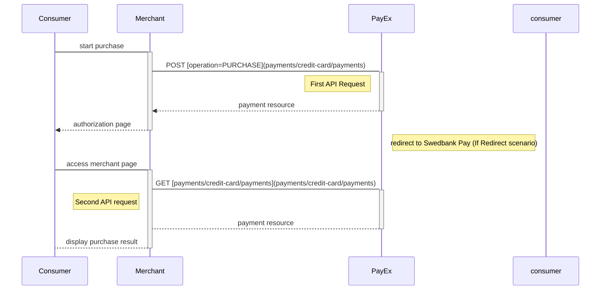
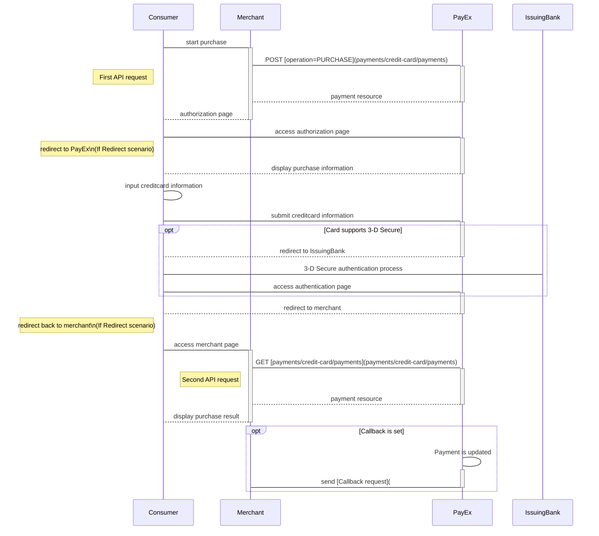
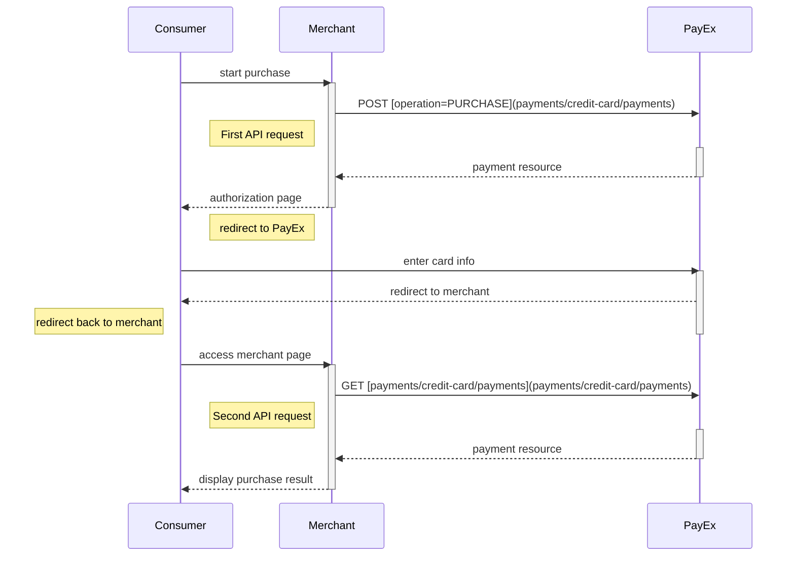
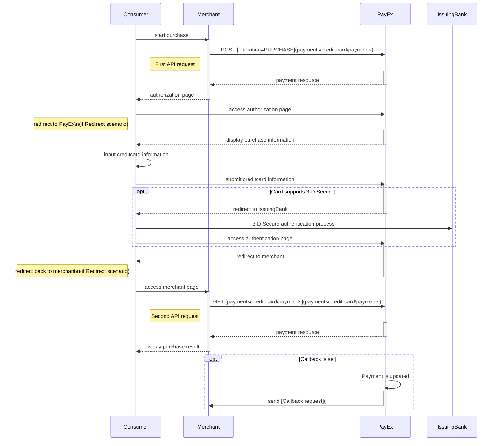



## Introduction

* When properly set up in your merchant/webshop site and the payer starts the purchase process, you need to make a POST request towards Swedbank Pay with your Purchase information. This will generate a payment object with a unique paymentID. You either receive a Redirect URL to a hosted page or a JavaScript source in response.
* You need to [redirect] the payer's browser to that specified URL, or embed the script source on your site to create a Hosted View in an iFrame; so that she can enter the credit card details in a secure Swedbank Pay hosted environment.
* Swedbank Pay will handle 3D-secure authentication when this is required.
* Swedbank Pay will redirect the payer's browser to - or display directly in the iFrame - one of two specified URLs, depending on whether the payment session is followed through completely or cancelled beforehand. Please note that both a successful and rejected payment reach completion, in contrast to a cancelled payment.
* When you detect that the payer reach your completeUrl , you need to do a `GET` request to receive the state of the transaction, containing the paymentID generated in the first step, to receive the state of the transaction.

## Screenshots

You will redirect the payer to Swedbank Pay hosted pages to collect the credit card information.

![Screnshot-1]

## API Requests

The API requests are displayed in the [purchase flow](#purchase-flow). The options you can choose from when creating a payment with key operation set to Value Purchase are listed below. The general REST based API model is described in the [technical reference][technical-reference].

### Options before posting a payment

All valid options when posting in a payment with se, are described in the [technical reference][technical-reference].

#### Type of authorization - Intent
* *PreAuthorization*: A purchase with PreAuthorization intent is handled in a similar manner as the ordinary authorization procedure. The notable difference is that the funds are put on hold for 30 days (for an ordinary authorization the funds are reserved for 7 days). Also, with a PreAuthorization, the captured amount can be higher than the preauthorized amount. The amount captured should not be higher than 20% of the original amount, due to card brand rules. You complete the purchase by [finalizing the transaction][finalizing-the-transaction].
* *Authorization (two-phase)*: If you want the credit card to reserve the amount, you will have to specify that the intent of the purchase is Authorization. The amount will be reserved but not charged. You will later (i.e. when you are ready to ship the purchased products) have to make a [Capture] or [Cancel] request.

#### General
* *No 3D Secure and card acceptance:* There are optional paramers that can be used in relation to 3d-secure and card acceptance. By default, most credit card agreements with an acquirer will require that you use 3D-Secure for card holder authentication. However, if your agreement allows you to make a card payment without this authentication, or that specific cards can be declined, you may adjust these optional parameters when posting in the payment. This is specified in the technical reference section for creating credit card payments  - you will find the link in the sequence diagram below.
* *Defining CallbackURL:* When implementing a scenario, it is optional to set a [CallbackURL] in the `POST` request. If callbackURL is set Swedbank Pay will send a postback request to this URL when the consumer has fulfilled the payment. [See the Callback API description here][callback-API-description].

### Co-brand Visa/Dankort

Not yet supported

### Purchase flow
The sequence diagram below shows a high level description of a complete purchase, and the requests you have to send to PayEx. The links will take you directly to the corresponding API description.

When dealing with credit card payments, 3D-Secure authentication of the cardholder is an essential topic. There are three alternative outcome of a credit card payment:

* 3D-Secure enabled - by default, 3D-secure should be enabled, and Swedbank Pay will check if the card is enrolled with 3D-secure. This depends on the issuer of the card. If the card is not enrolled with 3D-Secure, no authentication of the cardholder is done.
* Card supports 3D-Secure - if the card is enrolled with 3D-Secure, Swedbank Pay will redirect the cardholder to the autentication mechanism that is decided by the issuing bank. Normally this will be done using BankID or Mobile BankID.

### Options after posting a payment

* *Abort:* It is possible to abort the process, if the payment has no successful transactions. [See the PATCH payment description][see-the-PATCH-payment-description].  
* If the payment shown above is done as a two phase (`Authorization`), you will need to implement the `Capture` and `Cancel` requests.  
* For `reversals`, you will need to implement the Reversal request.  
* If you did a `PreAuthorization`, you will have to send a [Finalize request] to finalize the transaction.  
* *If CallbackURL is set:* Whenever changes to the payment occur a [Callback request] will be posted to the callbackUrl, which was generated when the payment was created. 

## Card Payment Pages in Mobile Apps

>The implementation sequence for this scenario is identical to the standard Redirect scenario, but also includes explanations of how to include this redirect in mobile apps or in mobile web pages.

### Payment Url

For our hosted view, the URL property called `paymentUrl` will be used if the consumer is redirected out of the hosted view frame through our [Credit Card API]. The consumer is redirected out of frame when at the 3d secure verification for credit card payments. The URL should represent the page of where the payment hosted view was hosted originally, such as the checkout page, shopping cart page, or similar. Basically, `paymentUrl` should be set to the same URL as that of the page where the JavaScript for the hosted payment view was added to in order to initiate the payment. Please note that the `paymentUrl` must be able to invoke the same JavaScript URL from the same Payment as the one that initiated the payment originally, so it should include some sort of state identifier in the URL. The state identifier is the ID of the order, shopping cart or similar that has the URL of the Payment stored.

With `paymentUrl` in place, the retry process becomes much more convenient for both the integration and the payer.

## Screenshots

You will redirect the consumer/end-user to PayEx hosted pages to collect the credit card information.

![Merchant implemented redirect][redirect-image]

## API-requests

The API requests are displayed in the [purchase flow](#purchase-flow-1). The options you can choose from when creating a payment with key operation set to Value Purchase are listed below. The general REST based API model is described in the [technical reference].

### Options before posting a payment

All valid options when posting in a payment with `operation` equal to `Purchase`, are described in [the technical reference].

#### Type of authorization (Intent)

* **PreAuthorization**: If you specify that the `intent` of the `purchase` is `PreAuthorization`, it's almost the same as an authorization, _except that no money will be reserved_ from the consumers credit card, [Finalize request][before-you-finalize-the-transaction]
* **Authorization (two-phase):** If you want the credit card to reserve the amount, you will have to specify that the `intent` of the `purchase` is `Authorization`. The amount will be reserved but not charged. You will later (i.e. when you are ready to ship the purchased products) have to make a [Capture] or [Cancel] request.
* **AutoCapture (one-phase)**:  If you want the credit card to be charged right away, you will have to specify that the intent of the purchase is `AutoCapture`. The credit card will be charged automatically after authorization and you don't need to do any more financial operations to this purchase.

#### General

* **No 3D Secure and card acceptance**: There are optional paramers that can be used in relation to 3d-secure and card acceptance. By default, most credit card agreements with an acquirer will require that you use 3D-Secure for card holder authentication. However, if your agreement allows you to make a card payment without this authentication, or that specific cards can be declined, you may adjust these optional parameters when posting in the payment. This is specified in the technical reference section for creating credit card payments  - you will find the link in the sequence diagram below.
* **Defining CallbackURL**: When implementing a scenario, it is optional to set a [CallbackURL] in the `POST` request. If callbackURL is set PayEx will send a postback request to this URL when the consumer has fulfilled the payment. [See the Callback API description here][technical-reference].

## Purchase flow

The sequence diagram below shows a high level description of a complete purchase, and the two requests you have to send to PayEx. The links will take you directly to the corresponding API description.

When dealing with credit card payments, 3D-Secure authentication of the cardholder is an essential topic. There are two alternative outcomes of a credit card payment:

* 3D-Secure enabled - by default, 3D-secure should be enabled, and PayEx will check if the card is enrolled with 3D-secure. This depends on the issuer of the card. If the card is not enrolled with 3D-Secure, no authentication of the cardholder is done.
* Card supports 3D-Secure - if the card is enrolled with 3D-Secure, PayEx will redirect the cardholder to the autentication mechanism that is decided by the issuing bank. Normally this will be done using BankID or Mobile BankID. 

### Detailed Sequence Diagram enabing 3D-secure authentication

[Screnshot-1]: /assets/img/creditcard-image-1.png
{:height="711px" width="400px"}
[creditcard-image-2]: /assets/img/creditcard-image-2.png
{:height="711px" width="400px"}
[redirect-image]: /assets/img/creditcard-image-3.png
{:height="711px" width="400px"}
[callback-API-description]: #
[callback-api]: #
[CallbackURL]: #
[Cancel]: /payments/credit-card/after-after-payment
[Capture]: /payments/credit-card/after-after-payment
[finalizing-the-transaction]: /payments/credit-card/after-after-payment
[redirect]: #
[see-the-PATCH-payment-description]: /payments/credit-card/after-payment
[technical-reference]: #
