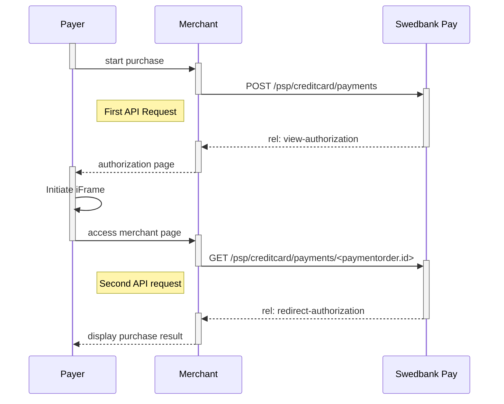
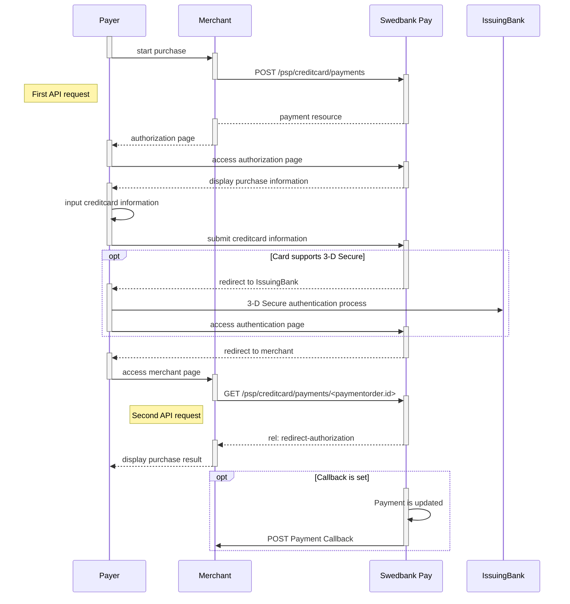



## Introduction

* When properly set up in your merchant/webshop site and the payer starts the
purchase process, you need to make a POST request towards Swedbank Pay with your
 Purchase information. This will generate a payment object with a unique
 `paymentID`. You will receive a **JavaScript source** in response.
* You need to embed the script source on your site to create a
hosted-view in an iFrame(see screenshot below); so that she can enter the credit card
details in a secure Swedbank Pay hosted environment.
* Swedbank Pay will handle 3-D Secure authentication when this is required.
* Swedbank Pay will display directly in the iFrame - one of two specified URLs,
depending on whether the payment session is followed through completely or
cancelled beforehand. Please note that both a successful and rejected payment
reach completion, in contrast to a cancelled payment.
* When you detect that the payer reach your `completeUrl` , you need to do a
`GET` request to receive the state of the transaction, containing the
`paymentID` generated in the first step, to receive the state of the
transaction.

### Payment Url



## Screenshots

You will have an iFramed window on your page where the consumer can enter the
credit card information.

![payment-page_hosted-view.png]{:height="700px" :width="490px"}

## API Requests

The API requests are displayed in the [purchase flow](#purchase-flow-mobile).
You can [create a card `payment`][create-payment] with following `operation`
options:

* [Purchase][purchase]
* [Recur][recur]
* [Payout][payout]
* [Verify][verify]

Our `payment` example below uses the [`purchase`][purchase] value.

### Type of authorization - Intent

The intent of the payment identifies how and when the charge will be
effectuated. This determine the type of transaction used during the payment
process.

* **PreAuthorization**: A purchase with `PreAuthorization` intent is handled
in a similar manner as the ordinary authorization procedure. The notable
difference is that the funds are put on hold for 30 days (for an ordinary
authorization the funds are reserved for 7 days). Also, with a
`PreAuthorization`, the captured amount can be higher than the preauthorized
amount. The amount captured should not be higher than 20% of the original
amount, due to card brand rules. You complete the purchase by
[finalizing the transaction][finalize].
* **Authorization (two-phase)**: If you want the credit card to reserve the
amount, you will have to specify that the intent of the purchase is
Authorization. The amount will be reserved but not charged. You will later
(i.e. when you are ready to ship the purchased products) have to make a
[Capture][capture] or [Cancel][cancel] request.
* **AutoCapture (one-phase)**:  If you want the credit card to be charged right
away, you will have to specify that the intent of the purchase is `AutoCapture`.
 The credit card will be charged automatically after authorization and you don't
  need to do any more financial operations to this purchase.

### General

* **No 3-D Secure and card acceptance**: There are optional paramers that can be
used in relation to 3-D Secure and card acceptance. By default, most credit card
 agreements with an acquirer will require that you use 3-D Secure for card holder
 authentication. However, if your agreement allows you to make a card payment
 without this authentication, or that specific cards can be declined, you may
 adjust these optional parameters when posting in the payment. This is specified
  in the technical reference section for creating credit card payments  - you
will find the link in the sequence diagram below.
* **Defining `callbackURL`**: When implementing a scenario, it is optional to
set a `callbackURL` in the `POST` request. If `callbackURL` is set Swedbank Pay
will send a postback request to this URL when the consumer has fulfilled the
payment. [See the Callback API description here][callback].

## Purchase flow

The sequence diagram below shows a high level description of a complete
purchase, and the requests you have to send to Swedbank Pay. The links will take
 you directly to the corresponding API description.

When dealing with credit card payments, 3-D Secure authentication of the
cardholder is an essential topic. There are two alternative outcome of a credit
card payment:

* 3-D Secure enabled - by default, 3-D Secure should be enabled, and Swedbank Pay
will check if the card is enrolled with 3-D Secure. This depends on the issuer of
 the card. If the card is not enrolled with 3-D Secure, no authentication of the
 cardholder is done.
* Card supports 3-D Secure - if the card is enrolled with 3-D Secure, Swedbank Pay
 will redirect the cardholder to the autentication mechanism that is decided by
 the issuing bank. Normally this will be done using BankID or Mobile BankID.

### Options after posting a payment

* `Abort`: It is possible to abort the process, if the payment has no successful
 transactions. [See the PATCH payment description][abort].
* If the payment shown above is done as a two phase (`Authorization`), you will
need to implement the [`Capture`][capture] and [`Cancel`][cancel] requests.
* For `reversals`, you will need to implement the [Reversal request][reversal].
* If you did a `PreAuthorization`, you will have to send a
[Finalize request][finalize] to finalize the transaction.
* *If `callbackURL` is set:* Whenever changes to the payment occur a
[Callback request][callback] will be posted to the `callbackUrl`, which was
generated when the payment was created.



[payment-page_hosted-view.png]: /assets/screenshots/credit-card/hosted-view/view/macos.png
[abort]: /payments/credit-card/other-features/#abort
[callback]: /payments/credit-card/other-features/#callback
[cancel]: /payments/credit-card/after-payment/#cancellations
[capture]: /payments/credit-card/after-payment/#Capture
[create-payment]: /payments/credit-card/other-features/#create-payment
[finalize]: /payments/credit-card/after-payment/#finalize
[payout]: /payments/credit-card/other-features/#payout
[purchase]: /payments/credit-card/other-features/#purchase
[recur]: /payments/credit-card/other-features/#recur
[reversal]: /payments/credit-card/after-payment/#reversals
[verify]: /payments/credit-card/other-features/#verify
[create-payment]: /payments/credit-card/other-features/#create-payment
