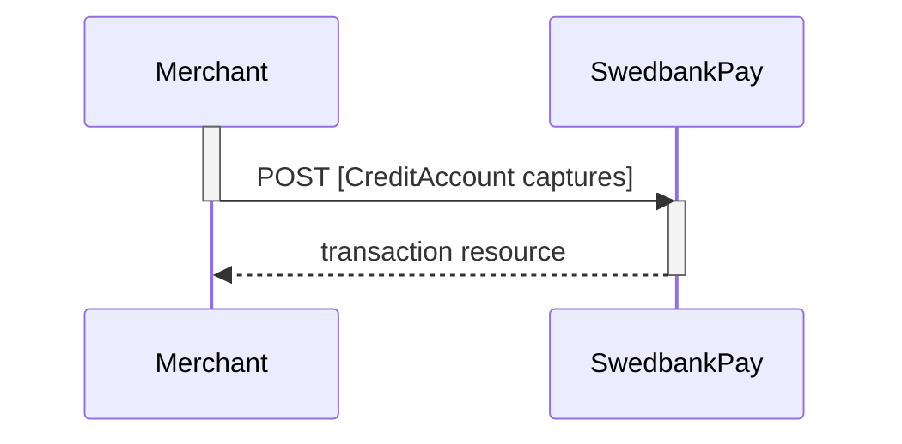
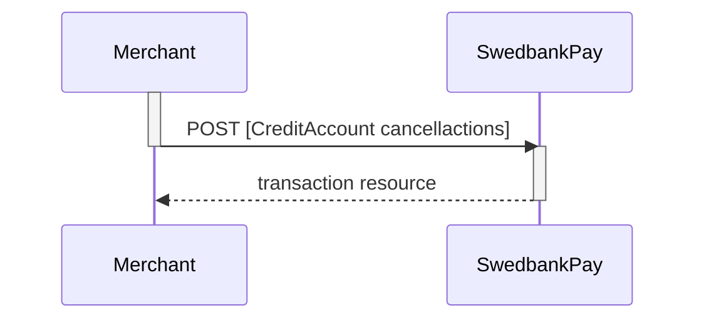
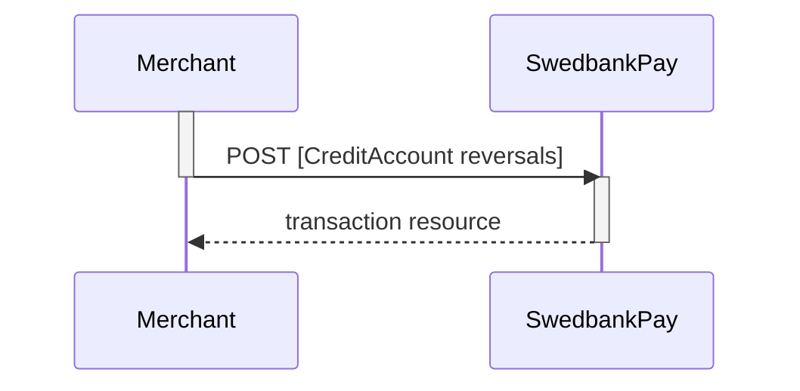
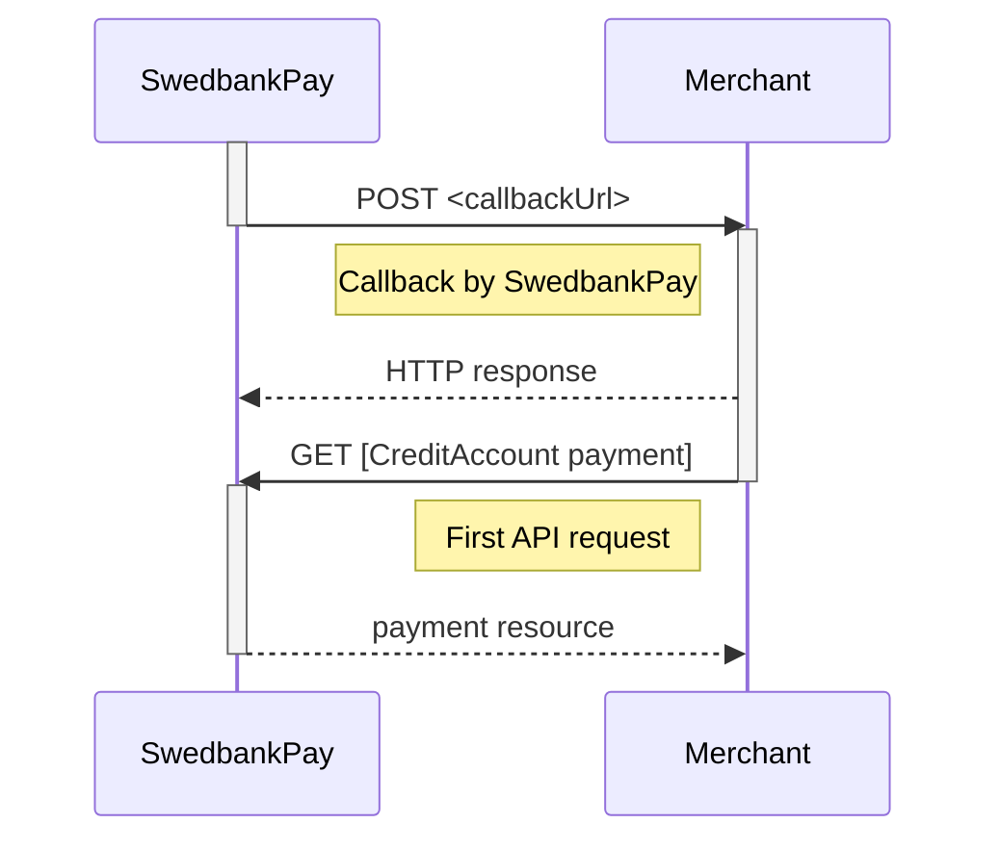



## Options after posting a payment

When you detect that the payer reach your `completeUrl` , you need to do a `GET`
request on the payment resource, containing the `paymentID` generated in the
first step, to receive the state of the transaction. You will also be able to
see the available operations after posting a payment.

The `payment` resource is central to all payment instruments. All operations
that target the payment resource directly produce a response similar to the
example seen below. The response given contains all operations that are
possible to perform in the current state of the payment.

{:.code-header}
**Request**

```http
GET /psp/{{ payment-instrument }}/payments/{{ page.paymentId }}/ HTTP/1.1
Host: {{ page.apiHost }}
Authorization: Bearer <AccessToken>
Content-Type: application/json
```

{:.code-header}
**Response**

```http
HTTP/1.1 200 OK
Content-Type: application/json

{
    "payment": {
        "id": "/psp/{{ payment-instrument }}/payments/{{ page.paymentId }}",
        "number": 1234567890,
        "created": "2016-09-14T13:21:29.3182115Z",
        "updated": "2016-09-14T13:21:57.6627579Z",
        "state": "Ready",
        "operation": "Purchase",
        "intent": "Authorization",
        "currency": "NOK",
        "amount": 1500,
        "remainingCaptureAmount": 1500,
        "remainingCancellationAmount": 1500,
        "remainingReversalAmount": 0,
        "description": "Test Purchase",
        "payerReference": "AB1234",
        "initiatingSystemUserAgent": "PostmanRuntime/3.0.1",
        "userAgent": "Mozilla/5.0...",
        "language": "nb-NO",
        "prices": {
            "id": "/psp/{{ payment-instrument }}/payments/{{ page.paymentId }}/prices"
        },
        "payeeInfo": {
            "id": "/psp/{{ payment-instrument }}/payments/{{ page.paymentId }}/payeeInfo"
        },
        "urls": {
            "id": "/psp/{{ payment-instrument }}/payments/{{ page.paymentId }}/urls"
        },
        "transactions": {
            "id": "/psp/{{ payment-instrument }}/payments/{{ page.paymentId }}/transactions"
        },
        "authorizations": {
            "id": "/psp/{{ payment-instrument }}/payments/{{ page.paymentId }}/authorizations"
        },
        "captures": {
            "id": "/psp/{{ payment-instrument }}/payments/{{ page.paymentId }}/captures"
        },
        "reversals": {
            "id": "/psp/{{ payment-instrument }}/payments/{{ page.paymentId }}/reversals"
        },
        "cancellations": {
            "id": "/psp/{{ payment-instrument }}/payments/{{ page.paymentId }}/cancellations"
        }
    },
    "operations": [
        {
            "method": "PATCH",
            "href": "{{ page.apiUrl }}/psp/{{ payment-instrument }}/payments/{{ page.paymentId }}",
            "rel": "update-payment-abort",
            "contentType": "application/json"
        },
        {
            "method": "GET",
            "href": "{{ page.frontEndUrl }}/{{ payment-instrument }}/payments/authorize/{{ page.transactionId }}",
            "rel": "redirect-authorization",
            "contentType": "text/html"
        },
        {
            "method": "POST",
            "href": "{{ page.apiUrl }}/psp/{{ payment-instrument }}/payments/{{ page.paymentId }}/captures",
            "rel": "create-capture",
            "contentType": "application/json"
        }
    ]
}
```

{:.table .table-striped}
| Property                 | Type         | Description                                                                                                                                                                                      |
| :----------------------- | :----------- | :----------------------------------------------------------------------------------------------------------------------------------------------------------------------------------------------- |
| `payment`                | `object`     | The `payment` object contains information about the specific payment.                                                                                                                            |
| └➔&nbsp;`id`             | `string`     | The relative URI of the payment.                                                                                                                                                                 |
| └➔&nbsp;`number`         | `integer`    | The payment  number , useful when there's need to reference the payment in human communication. Not usable for programmatic identification of the payment, for that  id  should be used instead. |
| └➔&nbsp;`created`        | `string`     | The ISO-8601 date of when the payment was created.                                                                                                                                               |
| └➔&nbsp;`updated`        | `string`     | The ISO-8601 date of when the payment was updated.                                                                                                                                               |
| └➔&nbsp;`state`          | `string`     | Ready ,  Pending ,  Failed  or  Aborted . Indicates the state of the payment. This field is only for status display purposes. To                                                                 |
| └➔&nbsp;`prices`         | `object`     | The `prices` resource lists the prices related to a specific payment.                                                                                                                            |
| └➔&nbsp;`prices.id`      | `string`     | The relative URI of the current prices resource.                                                                                                                                                 |
| └➔&nbsp;`description`    | `string(40)` | A textual description of maximum 40 characters of the purchase.                                                                                                                                  |
| └➔&nbsp;`payerReference` | `string`     | The reference to the payer (consumer/end-user) from the merchant system, like e-mail address, mobile number, customer number etc.                                                                |
| └➔&nbsp;`userAgent`      | `string`     | The [user agent](https://en.wikipedia.org/wiki/User_agent) string of the consumer's browser.                                                                                                     |
| └➔&nbsp;`language`       | `string`     | `nb-NO` , `sv-SE`  or  `en-US`                                                                                                                                                                   |
| └➔&nbsp;`urls`           | `string`     | The URI to the  urls  resource where all URIs related to the payment can be retrieved.                                                                                                           |
| └➔&nbsp;`payeeInfo`      | `string`     | The URI to the  payeeinfo  resource where the information about the payee of the payment can be retrieved.                                                                                       |
| `operations`             | `array`      | The array of possible operations to perform                                                                                                                                                      |
| └─➔&nbsp;`method`        | `string`     | The HTTP method to use when performing the operation.                                                                                                                                            |
| └─➔&nbsp;`href`          | `string`     | The target URI to perform the operation against.                                                                                                                                                 |
| └─➔&nbsp;`rel`           | `string`     | The name of the relation the operation has to the current resource.                                                                                                                              |

### Operations

The operations should be performed as described in each response and not as
described here in the documentation.
Always use the `href` and `method` as specified in the response by finding
the appropriate operation based on its `rel` value.
The only thing that should be hard coded in the client is the value of
the `rel` and the request that will be sent in the HTTP body of the request
for the given operation.

{:.table .table-striped}
| Operation                | Description                                                                                                               |
| :----------------------- | :------------------------------------------------------------------------------------------------------------------------ |
| `update-payment-abort`   | `abort`s the payment order before any financial transactions are performed.                                               |
| `redirect-authorization` | Contains the URI that is used to redirect the consumer to the Swedbank Pay Payments containing the card authorization UI. |
| `create-capture`         | Creates a `capture` transaction in order to charge the reserved funds from the consumer.                                  |
| `create-cancellation`    | Creates a `cancellation` transaction that cancels a created, but not yet captured payment.                                |

* *Abort:* It is possible to abort the process if the payment has no successful
  transactions. [See the Abort description here][abort].
* If the payment shown above is done as a two phase (`Authorization`), you will
  need to implement the `Capture` and `Cancel` requests.
* For `reversals`, you will need to implement the [Reversal request][reversal].
* If `CallbackURL` is set: Whenever changes to the payment occur a [Callback
  request][callback] will be posted to the `callbackUrl`, which was generated
  when the payment was created.

## Capture

To `capture` a `CreditAccountSe` transaction, you need to perform the
`create-capture` operation.

{:.code-header}
**Request**

```http
POST /psp/creditaccount/payments/<paymentId>/captures HTTP/1.1
Host: {{ page.apiHost }}
Authorization: Bearer <AccessToken>
Content-Type: application/json

{
 "transaction": {
    "amount": 1000,
   "vatAmount": 250,
   "description" : "description for transaction",
   "payeeReference": "customer reference-unique"
  }
}
```

{:.table .table-striped}
| Required | Property               | Type        | Description                                                                                                               |
| :------: | :--------------------- | :---------- | :------------------------------------------------------------------------------------------------------------------------ |
|    ✔︎    | `capture.amount`         | `integer`     | Amount Entered in the lowest momentary units of the selected currency. E.g. `10000` = `100.00 NOK`, `5000` = `50.00 SEK`. |
|    ✔︎    | `capture.vatAmount`      | `integer`     | Amount Entered in the lowest momentary units of the selected currency. E.g. `10000` = `100.00 NOK`, `5000` = `50.00 SEK`. |
|    ✔︎    | `capture.description`    | `string`      | A textual description of the capture transaction.                                                                         |
|    ✔︎    | `capture.payeeReference` | `string(30)` | A unique reference for the capture transaction. See [payeeReference][payee-reference] for details.                        |

The `capture` resource contains information about the capture transaction.

{:.code-header}
**Response**

```http
HTTP/1.1 200 OK
Content-Type: application/json

{
 "payment": "/psp/creditaccount/payments/<paymentId>",
 "captures": [
    {
      "transaction": {
       "id": "/psp/creditaccount/payments/<paymentId>/transactions/<transactionId>",
       "created": "2016-09-14T01:01:01.01Z",
       "updated": "2016-09-14T01:01:01.03Z",
       "type": "Capture",
       "state": "Initialized",
       "number": 1234567890,
       "amount": 1000,
       "vatAmount": 250,
       "description": "Test transaction",
       "payeeReference": "AH123456",
       "failedReason": "ExternalResponseError",
       "failedActivityName": "Authorize",
       "failedErrorCode": "ThirdPartyErrorCode",
       "failedErrorDescription": "ThirdPartyErrorMessage",
       "isOperational": true,
       "activities": { "id": "/psp/creditaccount/payments/<paymentId>/transactions/<transactionId>/activities" },
       "operations": [
        ]
      }
    },
}
```

{:.table .table-striped}
| Property              | Type     | Description                                                                           |
| :-------------------- | :------- | :------------------------------------------------------------------------------------ |
| `payment`             | `string` | The relative URI of the payment this capture transaction belongs to.                  |
| `capture.id`          | `string` | The relative URI of the created capture transaction.                                  |
| `capture.transaction` | `object` | The object representation of the generic [transaction resource][transaction-resource] |

{:.table .table-striped}
| Property                  | Type      | Description                                                                                                                                                                                                  |
| :------------------------ | :-------- | :----------------------------------------------------------------------------------------------------------------------------------------------------------------------------------------------------------- |
| `payment`                 | `string`  | The relative URI of the payment this list of  `capture` transactions belong to.                                                                                                                              |
| `captures`                | `object`  | The  `capture` resource contains information about the  `capture` transaction made against a card payment.                                                                                                   |
| └➔&nbsp;`id`              | `string`  | The relative URI of the current   `capture`s  resource.                                                                                                                                                      |
| └➔&nbsp;`captureList`     | `array`   | The array of  `capture` transaction objects.                                                                                                                                                                 |
| └─➔&nbsp;`id`             | `string`  | The relative URI of the current  transaction  resource.                                                                                                                                                      |
| └➔&nbsp;`transaction`     | `object`  | The object representation of the generic [transaction resource][transaction-resource].                                                                                                                       |
| └─➔&nbsp;`id`             | `string`  | The relative URI of the current  transaction  resource.                                                                                                                                                      |
| └─➔&nbsp;`created`        | `string`  | The ISO-8601 date and time of when the transaction was created.                                                                                                                                              |
| └─➔&nbsp;`updated`        | `string`  | The ISO-8601 date and time of when the transaction was created.                                                                                                                                              |
| └─➔&nbsp;`type`           | `string`  | Indicates the transaction type.                                                                                                                                                                              |
| └─➔&nbsp;`state`          | `string`  | Initialized ,  Completed  or  Failed . Indicates the state of the transaction                                                                                                                                |
| └─➔&nbsp;`number`         | `string`  | The transaction  number , useful when there's need to reference the transaction in human communication. Not usable for programmatic identification of the transaction, for that  id  should be used instead. |
| └─➔&nbsp;`amount`         | `integer` | Amount is entered in the lowest momentary units of the selected currency. E.g.  10000  = 100.00 NOK,  5000  = 50.00 SEK.                                                                                     |
| └─➔&nbsp;`vatAmount`      | `integer` | If the amount given includes VAT, this may be displayed for the user in the payment page (redirect only). Set to 0 (zero) if this is not relevant.                                                           |
| └─➔&nbsp;`description`    | `string`  | A human readable description of maximum 40 characters of the transaction                                                                                                                                     |
| └─➔&nbsp;`payeeReference` | `string`  | A unique reference for the transaction. See [payeeReference][payee-reference] for details.                                                                                                                    |
| └─➔&nbsp;`failedReason`   | `string`  | The human readable explanation of why the payment failed.                                                                                                                                                    |
| └─➔&nbsp;`isOperational`  | `boolean` | `true`  if the transaction is operational; otherwise  `false` .                                                                                                                                              |
| └─➔&nbsp;`operations`     | `array`   | The array of [operations][operations] that are possible to perform on the transaction in its current state.                                                                                                  |

### Capture Sequence

`Capture` can only be done on a authorized transaction. It is possible to do a
part-capture where you only capture a part of the authorization amount. You can
later do more captures on the same payment up to the total authorization amount.



## Cancellations

`Cancel` can only be done on a authorized transaction. If you do cancel after
doing a part-capture you will cancel the difference between the capture amount
and the authorization amount.

### Create cancellation transaction

Perform the `create-cancel` operation to cancel a previously created - and not
yet captured - payment.

{:.code-header}
**Request**

```http
POST /psp/creditaccount/payments/{{ page.paymentId }}/cancellations HTTP/1.1
Host: {{ page.apiHost }}
Authorization: Bearer <AccessToken>
Content-Type: application/json

{
    "transaction": {
        "description": "Test Cancellation",
        "payeeReference": "ABC123"
    }
}
```

{:.table .table-striped}
| Required | Property                 | Type          | Description                                                                                              |
| :------: | :----------------------- | :------------ | :------------------------------------------------------------------------------------------------------- |
|  ✔︎︎︎︎︎  | `transaction`            | `object`      | The `object` representation of the generic [transaction resource][transaction-resource].                 |
|  ✔︎︎︎︎︎  | └➔&nbsp;`description`    | `string`      | A textual description of the reason for the `cancellation`.                                              |
|  ✔︎︎︎︎︎  | └➔&nbsp;`payeeReference` | `string(30*)` | A unique reference for the `cancellation` transaction. See [payeeReference][payee-reference] for details. |

The `cancel` resource contains information about a cancellation transaction
made against a payment.

{:.code-header}
**Response**

```http
HTTP/1.1 200 OK
Content-Type: application/json

{
    "payment": "/psp/creditaccount/payments/{{ page.paymentId }}",
    "cancellation": {
        "id": "/psp/creditaccount/payments/{{ page.paymentId }}/cancellations/{{ page.transactionId }}",
        "transaction": {
            "id": "/psp/creditaccount/payments/{{ page.paymentId }}/transactions/{{ page.transactionId }}",
            "created": "2016-09-14T01:01:01.01Z",
            "updated": "2016-09-14T01:01:01.03Z",
            "type": "Cancellation",
            "state": "Initialized",
            "number": 1234567890,
            "amount": 1000,
            "vatAmount": 250,
            "description": "Test Cancellation",
            "payeeReference": "ABC123",
            "failedReason": "",
            "isOperational": false,
            "operations": []
        }
    }
}
```

{:.table .table-striped}
| Property                  | Type      | Description                                                                                                                                                                                                  |
| :------------------------ | :-------- | :----------------------------------------------------------------------------------------------------------------------------------------------------------------------------------------------------------- |
| `payment`                 | `string`  | The relative URI of the payment this `cancellation` transaction belongs to.                                                                                                                                  |
| `cancellation`            | `object`  | The `cancellation` resource contains information about the `cancellation` transaction made against a card payment.                                                                                           |
| └➔&nbsp;`id`              | `string`  | The relative URI of the created `cancellation` transaction.                                                                                                                                                  |
| └➔&nbsp;`transaction`     | `object`  | The object representation of the generic [transaction resource][transaction-resource].                                                                                                                       |
| └─➔&nbsp;`id`             | `string`  | The relative URI of the current  transaction  resource.                                                                                                                                                      |
| └─➔&nbsp;`created`        | `string`  | The ISO-8601 date and time of when the transaction was created.                                                                                                                                              |
| └─➔&nbsp;`updated`        | `string`  | The ISO-8601 date and time of when the transaction was created.                                                                                                                                              |
| └─➔&nbsp;`type`           | `string`  | Indicates the transaction type.                                                                                                                                                                              |
| └─➔&nbsp;`state`          | `string`  | Initialized ,  Completed  or  Failed . Indicates the state of the transaction                                                                                                                                |
| └─➔&nbsp;`number`         | `string`  | The transaction  number , useful when there's need to reference the transaction in human communication. Not usable for programmatic identification of the transaction, for that  id  should be used instead. |
| └─➔&nbsp;`amount`         | `integer` | Amount is entered in the lowest momentary units of the selected currency. E.g.  10000  = 100.00 NOK,  5000  = 50.00 SEK.                                                                                     |
| └─➔&nbsp;`vatAmount`      | `integer` | If the amount given includes VAT, this may be displayed for the user in the payment page (redirect only). Set to 0 (zero) if this is not relevant.                                                           |
| └─➔&nbsp;`description`    | `string`  | A human readable description of maximum 40 characters of the transaction                                                                                                                                     |
| └─➔&nbsp;`payeeReference` | `string`  | A unique reference for the transaction. See [payeeReference][payee-reference] for details.                                                                                                                    |
| └─➔&nbsp;`failedReason`   | `string`  | The human readable explanation of why the payment failed.                                                                                                                                                    |
| └─➔&nbsp;`isOperational`  | `boolean` | `true`  if the transaction is operational; otherwise  `false` .                                                                                                                                              |
| └─➔&nbsp;`operations`     | `array`   | The array of [operations][operations] that are possible to perform on the transaction in its current state.                                                                                                  |

The `cancellations` resource lists the cancellation transactions on a specific
payment.

{:.code-header}
**Request**

```http
GET /psp/creditaccount/payments/{{ page.paymentId }}/cancellations HTTP/1.1
Host: {{ page.apiHost }}
Authorization: Bearer <AccessToken>
Content-Type: application/json
```

{:.code-header}
**Response**

```http
HTTP/1.1 200 OK
Content-Type: application/json

{
    "payment": "/psp/creditaccount/payments/{{ page.paymentId }}",
    "cancellations": {
        "id": "/psp/creditaccount/payments/{{ page.paymentId }}/cancellations",
        "cancellationList": [{
            "id": "/psp/creditaccount/payments/{{ page.paymentId }}/cancellations/{{ page.transactionId }}",
            "transaction": {
                "id": "/psp/creditaccount/payments/{{ page.paymentId }}/transactions/{{ page.transactionId }}",
                "created": "2016-09-14T01:01:01.01Z",
                "updated": "2016-09-14T01:01:01.03Z",
                "type": "Cancellation",
                "state": "Completed",
                "number": 1234567890,
                "amount": 1000,
                "vatAmount": 250,
                "description": "Test transaction",
                "payeeReference": "AH123456",
                "failedReason": "",
                "isOperational": false,
                "operations": []
            }
        }]
    }
}
```

{:.table .table-striped}
| Property                   | Type      | Description                                                                                                                                                                                                  |
| :------------------------- | :-------- | :----------------------------------------------------------------------------------------------------------------------------------------------------------------------------------------------------------- |
| `payment`                  | `string`  | The relative URI of the payment this list of `cancellation` transactions belong to.                                                                                                                          |
| `cancellations`            | `object`  | The `cancellation` resource contains information about the `cancellation` transaction made against a card payment.                                                                                           |
| └➔&nbsp;`id`               | `string`  | The relative URI of the current `cancellation` resource.                                                                                                                                                     |
| └➔&nbsp;`cancellationList` | `array`   | The array of `cancellation` transaction objects.                                                                                                                                                             |
| └─➔&nbsp;`id`              | `string`  | The relative URI of the current transaction  resource.                                                                                                                                                       |
| └➔&nbsp;`transaction`      | `object`  | The object representation of the generic [transaction resource][transaction-resource].                                                                                                                       |
| └─➔&nbsp;`id`              | `string`  | The relative URI of the current  transaction  resource.                                                                                                                                                      |
| └─➔&nbsp;`created`         | `string`  | The ISO-8601 date and time of when the transaction was created.                                                                                                                                              |
| └─➔&nbsp;`updated`         | `string`  | The ISO-8601 date and time of when the transaction was created.                                                                                                                                              |
| └─➔&nbsp;`type`            | `string`  | Indicates the transaction type.                                                                                                                                                                              |
| └─➔&nbsp;`state`           | `string`  | Initialized , Completed or Failed . Indicates the state of the transaction                                                                                                                                   |
| └─➔&nbsp;`number`          | `string`  | The transaction  number , useful when there's need to reference the transaction in human communication. Not usable for programmatic identification of the transaction, for that  id  should be used instead. |
| └─➔&nbsp;`amount`          | `integer` | Amount is entered in the lowest momentary units of the selected currency. E.g.  10000  = 100.00 NOK,  5000  = 50.00 SEK.                                                                                     |
| └─➔&nbsp;`vatAmount`       | `integer` | If the amount given includes VAT, this may be displayed for the user in the payment page (redirect only). Set to 0 (zero) if this is not relevant.                                                           |
| └─➔&nbsp;`description`     | `string`  | A human readable description of maximum 40 characters of the transaction                                                                                                                                     |
| └─➔&nbsp;`payeeReference`  | `string`  | A unique reference for the transaction. See [payeeReference][payee-reference] for details.                                                                                                                    |
| └─➔&nbsp;`failedReason`    | `string`  | The human readable explanation of why the payment failed.                                                                                                                                                    |
| └─➔&nbsp;`isOperational`   | `boolean` | `true` if the transaction is operational; otherwise `false` .                                                                                                                                                |
| └─➔&nbsp;`operations`      | `array`   | The array of [operations][operations] that are possible to perform on the transaction in its current state.                                                                                                  |

#### Cancel Sequence



## Reversals

This transaction is used when a captured payment needs to be reversed.

### Create reversal transaction

The `create-reversal` operation will reverse a previously captured payment.

{:.code-header}
**Request**

```http
POST /psp/creditaccount/payments/{{ page.paymentId }}/reversals HTTP/1.1
Host: {{ page.apiHost }}
Authorization: Bearer <AccessToken>
Content-Type: application/json

{
    "transaction": {
        "amount": 1500,
        "vatAmount": 0,
        "description": "Test Reversal",
        "payeeReference": "ABC123"
    }
}
```

{:.table .table-striped}
|:---:|:----------|:------|:-----------
| Required | Property | Type | Description |
|   ✔︎︎︎︎︎   | `transaction`            | `object`      | The `object` representation of the generic [transaction resource][transaction-resource].                 |
|   ✔︎︎︎︎︎   | └➔&nbsp;`amount` | `integer` | Amount Entered in the lowest momentary units of the selected currency. E.g. 10000 = 100.00 NOK, 5000 = 50.00 SEK. |
|   ✔︎︎︎︎︎   | └➔&nbsp;`vatAmount` | `integer` | Amount Entered in the lowest momentary units of the selected currency. E.g. 10000 = 100.00 NOK, 5000 = 50.00 SEK.|
|   ✔︎︎︎︎︎   | └➔&nbsp;`description` | `string` | A textual description of the `reversal`.|
|   ✔︎︎︎︎︎   | └➔&nbsp;`payeeReference` | `string(30*)` | A unique reference for the `reversal` transaction. See [payeeReference][payee-reference] for details.|

The `reversal` resource contains information about the newly created reversal
transaction.

{:.code-header}
**Response**

```http
HTTP/1.1 200 OK
Content-Type: application/json

{
    "payment": "/psp/creditaccount/payments/{{ page.paymentId }}",
    "reversal": {
        "id": "/psp/creditaccount/payments/{{ page.paymentId }}/reversal/{{ page.transactionId }}",
        "transaction": {
            "id": "/psp/creditaccount/payments/{{ page.paymentId }}/transactions/{{ page.transactionId }}",
            "created": "2016-09-14T01:01:01.01Z",
            "updated": "2016-09-14T01:01:01.03Z",
            "type": "Reversal",
            "state": "Completed",
            "number": 1234567890,
            "amount": 1000,
            "vatAmount": 250,
            "description": "Test transaction",
            "payeeReference": "AH123456",
            "failedReason": "",
            "isOperational": false,
            "operations": []
        }
    }
}
```

{:.table .table-striped}
| Property                  | Type      | Description                                                                                                                                                                                                  |
| :------------------------ | :-------- | :----------------------------------------------------------------------------------------------------------------------------------------------------------------------------------------------------------- |
| `payment`                 | `string`  | The relative URI of the payment this `reversal` transaction belongs to.                                                                                                                                      |
| `reversal`                | `object`  | The `reversal`resource contains information about the `reversal`transaction made against a card payment.                                                                                                     |
| └➔&nbsp;`id`              | `string`  | The relative URI of the created `reversal`transaction.                                                                                                                                                       |
| └➔&nbsp;`transaction`     | `object`  | The object representation of the generic [transaction resource][transaction-resource].                                                                                                                       |
| └─➔&nbsp;`id`             | `string`  | The relative URI of the current  transaction  resource.                                                                                                                                                      |
| └─➔&nbsp;`created`        | `string`  | The ISO-8601 date and time of when the transaction was created.                                                                                                                                              |
| └─➔&nbsp;`updated`        | `string`  | The ISO-8601 date and time of when the transaction was created.                                                                                                                                              |
| └─➔&nbsp;`type`           | `string`  | Indicates the transaction type.                                                                                                                                                                              |
| └─➔&nbsp;`state`          | `string`  | Initialized ,  Completed  or  Failed . Indicates the state of the transaction                                                                                                                                |
| └─➔&nbsp;`number`         | `string`  | The transaction  number , useful when there's need to reference the transaction in human communication. Not usable for programmatic identification of the transaction, for that  id  should be used instead. |
| └─➔&nbsp;`amount`         | `integer` | Amount is entered in the lowest momentary units of the selected currency. E.g.  10000  = 100.00 NOK,  5000  = 50.00 SEK.                                                                                     |
| └─➔&nbsp;`vatAmount`      | `integer` | If the amount given includes VAT, this may be displayed for the user in the payment page (redirect only). Set to 0 (zero) if this is not relevant.                                                           |
| └─➔&nbsp;`description`    | `string`  | A human readable description of maximum 40 characters of the transaction                                                                                                                                     |
| └─➔&nbsp;`payeeReference` | `string`  | A unique reference for the transaction. See [payeeReference][payee-reference] for details.                                                                                                                    |
| └─➔&nbsp;`failedReason`   | `string`  | The human readable explanation of why the payment failed.                                                                                                                                                    |
| └─➔&nbsp;`isOperational`  | `boolean` | `true`  if the transaction is operational; otherwise  `false` .                                                                                                                                              |
| └─➔&nbsp;`operations`     | `array`   | The array of [operations][operations] that are possible to perform on the transaction in its current state.                                                                                                  |

The `reversals` resource lists the reversal transactions (one or more) on a
specific payment.

{:.code-header}
**Request**

```http
GET /psp/creditaccount/payments/{{ page.paymentId }}/reversals HTTP/1.1
Host: {{ page.apiHost }}
Authorization: Bearer <AccessToken>
Content-Type: application/json
```

{:.code-header}
**Response**

```http
HTTP/1.1 200 OK
Content-Type: application/json

{
    "payment": "/psp/creditaccount/payments/{{ page.paymentId }}",
    "reversals": {
        "id": "/psp/creditaccount/payments/{{ page.paymentId }}/reversal",
        "reversalList": [{
            "id": "/psp/creditaccount/payments/{{ page.paymentId }}/reversal/{{ page.transactionId }}",
            "transaction": {
                "id": "/psp/creditaccount/payments/{{ page.paymentId }}/transactions/{{ page.transactionId }}",
                "created": "2016-09-14T01:01:01.01Z",
                "updated": "2016-09-14T01:01:01.03Z",
                "type": "Reversal",
                "state": "Completed",
                "number": 1234567890,
                "amount": 1000,
                "vatAmount": 250,
                "description": "Test transaction",
                "payeeReference": "AH123456",
                "failedReason": "",
                "isOperational": false,
                "operations": []
            }
        }]
    }
}
```

{:.table .table-striped}
| Property                  | Type      | Description                                                                                                                                                                                                  |
| :------------------------ | :-------- | :----------------------------------------------------------------------------------------------------------------------------------------------------------------------------------------------------------- |
| `payment`                 | `string`  | The relative URI of the payment this list of `reversals` transactions belong to.                                                                                                                             |
| `recersals`               | `object`  | The `reversals` resource contains information about the `reversals` transaction made against a card payment.                                                                                                 |
| └➔&nbsp;`id`              | `string`  | The relative URI of the current `reversals` resource.                                                                                                                                                        |
| └➔&nbsp;`reversalList`    | `array`   | The array of `reversals` transaction objects.                                                                                                                                                                |
| └─➔&nbsp;`id`             | `string`  | The relative URI of the current transaction  resource.                                                                                                                                                       |
| └➔&nbsp;`transaction`     | `object`  | The object representation of the generic [transaction resource][transaction-resource].                                                                                                                       |
| └─➔&nbsp;`id`             | `string`  | The relative URI of the current  transaction  resource.                                                                                                                                                      |
| └─➔&nbsp;`created`        | `string`  | The ISO-8601 date and time of when the transaction was created.                                                                                                                                              |
| └─➔&nbsp;`updated`        | `string`  | The ISO-8601 date and time of when the transaction was created.                                                                                                                                              |
| └─➔&nbsp;`type`           | `string`  | Indicates the transaction type.                                                                                                                                                                              |
| └─➔&nbsp;`state`          | `string`  | Initialized , Completed or Failed . Indicates the state of the transaction                                                                                                                                   |
| └─➔&nbsp;`number`         | `string`  | The transaction  number , useful when there's need to reference the transaction in human communication. Not usable for programmatic identification of the transaction, for that  id  should be used instead. |
| └─➔&nbsp;`amount`         | `integer` | Amount is entered in the lowest momentary units of the selected currency. E.g.  10000  = 100.00 NOK,  5000  = 50.00 SEK.                                                                                     |
| └─➔&nbsp;`vatAmount`      | `integer` | If the amount given includes VAT, this may be displayed for the user in the payment page (redirect only). Set to 0 (zero) if this is not relevant.                                                           |
| └─➔&nbsp;`description`    | `string`  | A human readable description of maximum 40 characters of the transaction                                                                                                                                     |
| └─➔&nbsp;`payeeReference` | `string`  | A unique reference for the transaction. See [payeeReference][payee-reference] for details.                                                                                                                    |
| └─➔&nbsp;`failedReason`   | `string`  | The human readable explanation of why the payment failed.                                                                                                                                                    |
| └─➔&nbsp;`isOperational`  | `boolean` | `true` if the transaction is operational; otherwise `false` .                                                                                                                                                |
| └─➔&nbsp;`operations`     | `array`   | The array of [operations][operations] that are possible to perform on the transaction in its current state.                                                                                                  |

### Reversal Sequence



## Callback

When a change or update from the back-end system are made on a payment or
transaction, Swedbank Pay will perform a callback to inform the payee (merchant)
about this update. `Callback` functionality is explaned in more detail
[here][callback].





[payment-resource]: /payments/credit/other-features#payment
[abort]: /payments/credit/other-features#abort
[callback]: /payments/credit/other-features#callback
[cancel]: /payments/credit/after-payment#cancellations
[capture]: /payments/credit/after-payment#capture
[operations]:/payments/credit/after-payment#operations
[reversal]: /payments/credit/after-payment#reversals
[payee-reference]: /payments/credit/other-features#payeereference
[transaction-resource]: /payments/credit/other-features#transactions
