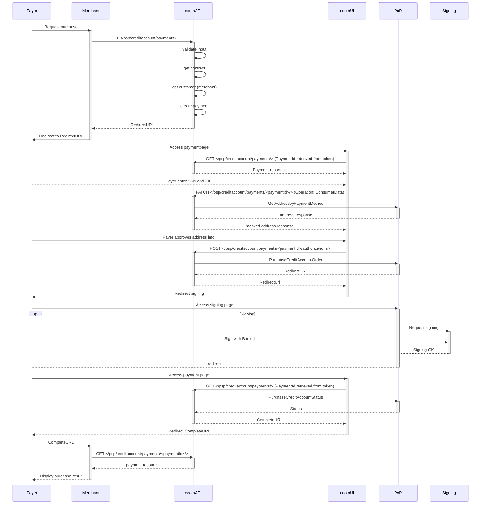
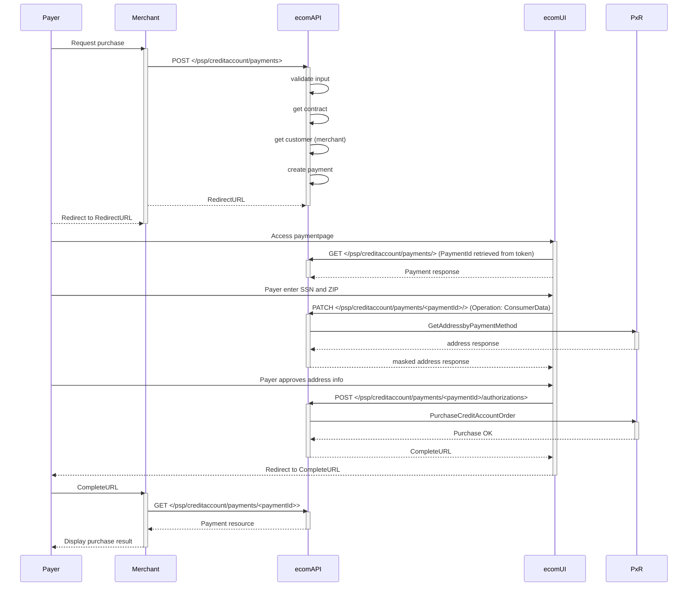



> Swedbank Pay Credit Account is an online payment instrument allowing payers
> to split a purchase into several payments.



## Sequence with unsigned CreditAccount

Payment sequence when signing is required.

## Sequence with signed CreditAccount

Payment sequence when signing is not required.


