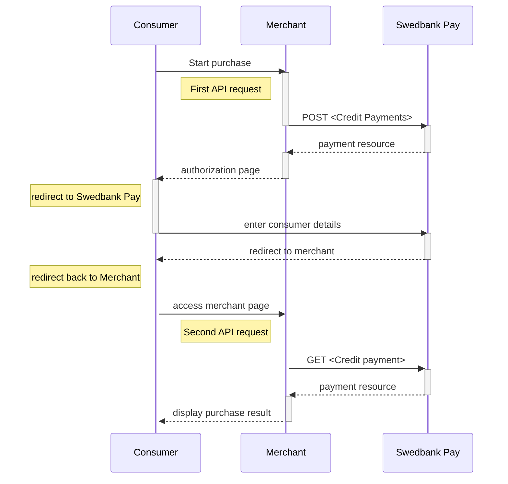









## Introduction

* When properly set up in your merchant/webshop site and the payer starts the
  purchase process, you need to make a `POST` request towards Swedbank Pay with
  your Purchase information. This will generate a payment object with a unique
  `paymentID`. You will receive a **redirect URL** to a Swedbank Pay payment
  page.
* You need to redirect the payer's browser to that specified URL so that the
  payer can enter the payment details in a secure Swedbank Pay environment.
* Swedbank Pay will redirect the payer's browser to - one of two specified URLs,
  depending on whether the payment session is followed through completely or
  cancelled beforehand. Please note that both a successful and rejected payment
  reach completion, in contrast to a cancelled payment.
* When you detect that the payer reach your `completeUrl` , you need to do a
  `GET` request to receive the state of the transaction, containing the
  `paymentID` generated in the first step, to receive the state of the
  transaction.

## Credit Payments flow

This is an example of the Credit Payments flow in the Redirect scenario.
For other integrations, take a look at the respective sections.
The sequence diagram below shows the two requests you have to send to
Swedbank Pay to make a purchase. The diagram also
shows the steps in a [purchase][purchase] process.


