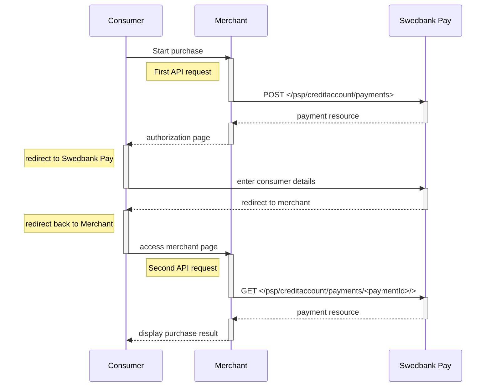







## Introduction

Redirect is the integration that lets Swedbank Pay handle the payments, while
you handle your core activities. When ready to pay, the consumer will be
redirected to a secure Swedbank Pay hosted site. Finally, the consumer will be
redirected back to your website after the payment process.

* When properly set up in your merchant/webshop site and the payer starts the
  purchase process, you need to make a `POST` request towards Swedbank Pay with
  your Purchase information. This will generate a payment object with a unique
  `paymentID`. You will receive a **redirect URL** to a Swedbank Pay payment
  page.
* You need to redirect the payer's browser to that specified URL so that the
  payer can enter the payment details in a secure Swedbank Pay environment.
* Swedbank Pay will redirect the payer's browser to - one of two specified URLs,
  depending on whether the payment session is followed through completely or
  cancelled beforehand. Please note that both a successful and rejected payment
  reach completion, in contrast to a cancelled payment.
* When you detect that the payer reach your `completeUrl` , you need to do a
  `GET` request to receive the state of the transaction, containing the
  `paymentID` generated in the first step, to receive the state of the
  transaction.

This is how the payment window might look like:

**Ha med eksempel av screenshot her**

### General



## Credit Account Payment flow



## Purchase

{:.code-header}
**Request**

```http
POST /psp/creditaccount/payments HTTP/1.1
Authorization: Bearer <AccessToken>
Content-Type: application/json

{
  "payment": {
    "operation": "Purchase",
    "intent": "Authorization",
    "currency": "SEK",
    "prices": [
      {
        "type": "CreditAccount",
        "amount": 1500,
        "vatAmount": 0
      }
    ],
    "description": "Test Purchase",
    "payerReference": "SomeReference",
    "userAgent": "Mozilla/5.0...",
    "language": "sv-SE",
    "urls": {
      "completeUrl": "http://example.com/payment-completed",
      "cancelUrl": "http://example.com/payment-canceled",
      "callbackUrl": "http://example.com/payment-callback",
      "logoUrl": "https://example.com/payment-logo.png",
      "termsOfServiceUrl": "https://example.com/payment-terms.pdf"
    },
    "payeeInfo": {
      "payeeId": "{{ page.merchantId }}",
      "payeeReference": "PR123",
      "payeeName": "Merchant1",
      "productCategory": "PC1234",
    },
    "prefillInfo": {
      "msisdn": "+46739000001",
      "email": "leia.ahlstrom@swedbankpay.com"
    }
  },
  "creditAccount": {
    "creditAccountType": "CreditAccountSe"
  }
}
```

{:.table .table-striped}
| Required | Property                              | Type          | Description                                                                                                                                                                                                                                                                                                                                                                                                                                                                                                                                    |
| :------: | :------------------------------------ | :------------ | :--------------------------------------------------------------------------------------------------------------------------------------------------------------------------------------------------------------------------------------------------------------------------------------------------------------------------------------------------------------------------------------------------------------------------------------------------------------------------------------------------------------------------------------------- |
|  ✔︎︎︎︎︎  | `payment`                             | `object`      | The `payment` object contains information about the specific payment.                                                                                                                                                                                                                                                                                                                                                                                                                                                                          |
|  ✔︎︎︎︎︎  | └➔&nbsp;`operation`                   | `string`      | The operation that the `payment` is supposed to perform.                                                                                                                                                                                                                           |
|  ✔︎︎︎︎︎  | └➔&nbsp;`intent`                      | `string`      | `Authorization` is the only intent option for credit account. Reserves the amount, and is followed by a [cancellation][cancel] or [capture][capture] of funds.                                                                                                                                                                                                                                                                                                                                                                                        |
|  ✔︎︎︎︎︎  | └➔&nbsp;`currency`                    | `string`      | NOK, SEK, DKK, USD or EUR.                                                                                                                                                                                                                                                                                                                                                                                                                                                                                                                     |
|  ✔︎︎︎︎︎  | └➔&nbsp;`prices`                      | `object`      | The `prices` resource lists the prices related to a specific payment.                                                                                                                                                                                                                                                                                                                                                                                                                                                                          |
|  ✔︎︎︎︎︎  | └─➔&nbsp;`type`                       | `string`      | Use the `CreditAccount` type here                                                                                                                                                                                                                                                                                                                                                                                                                                                                                                                    |
|  ✔︎︎︎︎︎  | └─➔&nbsp;`amount`                     | `integer`     | Amount is entered in the lowest momentary units of the selected currency. E.g. 10000 = 100.00 SEK 5000 = 50.00 SEK.                                                                                                                                                                                                                                                                                                                                                                                                                            |
|  ✔︎︎︎︎︎  | └─➔&nbsp;`vatAmount`                  | `integer`     | If the amount given includes VAT, this may be displayed for the user in the payment page (redirect only). Set to 0 (zero) if this is not relevant.                                                                                                                                                                                                                                                                                                                                                                                             |
|  ✔︎︎︎︎︎  | └➔&nbsp;`description`                 | `string(40)`  | A textual description max 40 characters of the purchase.                                                                                                                                                                                                                                                                                                                                                                                                                                                                                       |
|          | └➔&nbsp;`payerReference`              | `string`      | The reference to the payer (consumer/end user) from the merchant system. E.g mobile number, customer number etc.                                                                                                                                                                                                                                                                                                                                                                                                                               |                                                                                                                                                                                                                                                                                                                                                                                                    |
|  ✔︎︎︎︎︎  | └➔&nbsp;`userAgent`                   | `string`      | The user agent reference of the consumer's browser - [see user agent definition][user-agent-definition]                                                                                                                                                                                                                                                                                                                                                                                                                                        |
|  ✔︎︎︎︎︎  | └➔&nbsp;`language`                    | `string`      | nb-NO, sv-SE or en-US.                                                                                                                                                                                                                                                                                                                                                                                                                                                                                                                         |
|  ✔︎︎︎︎︎  | └➔&nbsp;`urls`                        | `object`      | The `urls` resource lists urls that redirects users to relevant sites.                                                                                                                                                                                                                                                                                                                                                                                                                                                                         |
|          | └─➔&nbsp;`hostUrl`                    | `array`       | The array of URLs valid for embedding of Swedbank Pay Hosted Views. If not supplied, view-operation will not be available.                                                                                                                                                                                                                                                                                                                                                                                                                     |
|  ✔︎︎︎︎︎  | └─➔&nbsp;`completeUrl`                | `string`      | The URL that Swedbank Pay will redirect back to when the payer has completed his or her interactions with the payment. This does not indicate a successful payment, only that it has reached a final (complete) state. A `GET` request needs to be performed on the payment to inspect it further.                                                                                                                                                                                                                                             |
|          | └─➔&nbsp;`cancelUrl`                  | `string`      | The URI to redirect the payer to if the payment is canceled. Only used in redirect scenarios. Can not be used simultaneously with `paymentUrl`; only `cancelUrl` or `paymentUrl` can be used, not both.                                                                                                                                                                                                                                                                                                                                        |
|          | └─➔&nbsp;`paymentUrl`                 | `string`      | The URI that Swedbank Pay will redirect back to when the view-operation needs to be loaded, to inspect and act on the current status of the payment. Only used in Seamless Views. If both `cancelUrl` and `paymentUrl` is sent, the `paymentUrl` will used.                                                                                                                                                                                                                                                                                    |
|          | └─➔&nbsp;`callbackUrl`                | `string`      | The URL that Swedbank Pay will perform an HTTP `POST` against every time a transaction is created on the payment. See [callback][callback-url] for details.                                                                                                                                                                                                                                                                                                                                                                                        |
|          | └─➔&nbsp;`logoUrl`                    | `string`      | The URL that will be used for showing the customer logo. Must be a picture with maximum 50px height and 400px width. Require https.                                                                                                                                                                                                                                                                                                                                                                                                            |
|          | └─➔&nbsp;`termsOfServiceUrl`          | `string`      | A URL that contains your terms and conditions for the payment, to be linked on the payment page. Require https.                                                                                                                                                                                                                                                                                                                                                                                                                                |
|  ✔︎︎︎︎︎  | └➔&nbsp;`payeenfo`                    | `object`      | The `payeeInfo` contains information about the payee.                                                                                                                                                                                                                                                                                                                                                                                                                                                                                          |
|  ✔︎︎︎︎︎  | └─➔&nbsp;`payeeId`                    | `string`      | This is the unique id that identifies this payee (like merchant) set by Swedbank Pay.                                                                                                                                                                                                                                                                                                                                                                                                                                                          |
|  ✔︎︎︎︎︎  | └─➔&nbsp;`payeeReference`             | `string(30*)` | A unique reference from the merchant system. It is set per operation to ensure an exactly-once delivery of a transactional operation. See [payeeReference][payee-reference] for details.                                                                                                                                                                                                                                                                                                                                                       |
|          | └─➔&nbsp;`payeeName`                  | `string`      | The payee name (like merchant name) that will be displayed to consumer when redirected to Swedbank Pay.                                                                                                                                                                                                                                                                                                                                                                                                                                        |
|          | └─➔&nbsp;`productCategory`            | `string`      | A product category or number sent in from the payee/merchant. This is not validated by Swedbank Pay, but will be passed through the payment process and may be used in the settlement process.                                                                                                                                                                                                                                                                                                                                                 |
|          | └─➔&nbsp;`creditAccountType`             | `String`  | Use the `CreditAccountSe` here.                                                                                                                                                                                                                                                                                                                                                                                                                                                         |

{:.code-header}
**Response**

```http
HTTP/1.1 200 OK
Content-Type: application/json

{
  "payment": {
    "id": "/psp/creditaccount/payments/{{ page.paymentId }}",
    "number": 1234567890,
    "instrument": "CreditAccount",
    "created": "2016-09-14T13:21:29.3182115Z",
    "updated": "2016-09-14T13:21:57.6627579Z",
    "state": "Ready",
    "operation": "Purchase"
    "intent": "Authorization",
    "currency": "SEK",
    "amount": 1500,
    "remainingCaptureAmount": 1000,
    "remainingCancellationAmount": 1000,
    "remainingReversalAmount": 500,
    "description": "Test Purchase",
    "userAgent": "Mozilla/5.0...",
    "language": "sv-SE",
    "prices": { "id": "/psp/creditaccount/payments/{{ page.paymentId }}/prices" },
    "transactions": { "id": "/psp/creditaccount/{{ page.paymentId }}/transactions" },
    "authorizations": { "id": "/psp/creditaccount/{{ page.paymentId }}/authorizations" },
    "captures": { "id": "/psp/creditaccount/payments/{{ page.paymentId }}/captures" },
    "reversals": { "id": "/psp/creditaccount/payments/{{ page.paymentId }}/reversals" },
    "cancellations": { "id": "/psp/creditaccount/payments/{{ page.paymentId }}/cancellations" },
    "payeeInfo" : { "id": "/psp/creditaccount/payments/{{ page.paymentId }}/payeeInfo" },
    "urls" : { "id": "/psp/creditaccount/payments/{{ page.paymentId }}c/urls" },
    "settings": { "id": "/psp/creditaccount/payments/{{ page.paymentId }}/settings" },
    "approvedLegalAddress": { "id": "/psp/creditaccount/payments/<paymentId>/approvedlegaladdress" },
    "maskedApprovedLegalAddress": { "id": "/psp/creditaccount/payments/<paymentId>/maskedapprovedlegaladdress" }
  },
  "operations": [
    {
      "href": "{{ page.apiUrl }}/psp/creditaccount/payments/{{ page.paymentId }}",
      "rel": "update-payment-abort",
      "method": "PATCH"
    },
    {
      "href": "{{ page.apiUrl }}/psp/creditaccount/payments/{{ page.paymentId }}/authorizations",
      "rel": "create-authorize",
      "method": "POST"
    },
    {
      "href": "{{ page.apiUrl }}/psp/creditaccount/payments/{{ page.paymentId }}/approvedlegaladdress",
      "rel": "create-approved-legal-address",
      "method": "POST"
    }
  ]
}
```

## Payment Resource

The `payment` resource is central to all payment instruments. All operations
that target the payment resource directly produce a response similar to the
example seen below. The response given contains all operations that are
possible to perform in the current state of the payment.

{:.code-header}
**Request**

```http
GET /psp/creditaccount/payments/{{ page.paymentId }}/ HTTP/1.1
Host: {{ page.apiHost }}
Authorization: Bearer <AccessToken>
Content-Type: application/json
```

{:.code-header}
**Response**

```http
HTTP/1.1 200 OK
Content-Type: application/json

{
    "payment": {
        "id": "/psp/creditaccount/payments/{{ page.paymentId }}",
        "number": 1234567890,
        "created": "2016-09-14T13:21:29.3182115Z",
        "updated": "2016-09-14T13:21:57.6627579Z",
        "state": "Ready",
        "operation": "Purchase",
        "intent": "Authorization",
        "currency": "SEK",
        "amount": 1500,
        "remainingCaptureAmount": 1500,
        "remainingCancellationAmount": 1500,
        "remainingReversalAmount": 0,
        "description": "Test Purchase",
        "payerReference": "AB1234",
        "initiatingSystemUserAgent": "PostmanRuntime/3.0.1",
        "userAgent": "Mozilla/5.0...",
        "language": "sv-SE",
        "prices": {
            "id": "/psp/creditaccount/payments/{{ page.paymentId }}/prices"
        },
        "transactions": {
            "id": "/psp/ccreditaccount/payments/{{ page.paymentId }}/transactions"
        },
        "authorizations": {
            "id": "/psp/creditaccount/payments/{{ page.paymentId }}/authorizations"
        },
        "captures": {
            "id": "/psp/creditaccount/payments/{{ page.paymentId }}/captures"
        },
        "reversals": {
            "id": "/psp/creditaccount/payments/{{ page.paymentId }}/reversals"
        },
        "cancellations": {
            "id": "/psp/creditaccount/payments/{{ page.paymentId }}/cancellations"
        },
        "payeeInfo": {
            "id": "/psp/creditaccount/payments/{{ page.paymentId }}/payeeInfo"
        },
        "urls": {
            "id": "/psp/creditaccount/payments/{{ page.paymentId }}/urls"
        },
        "settings": {
            "id": "/psp/creditaccount/payments/{{ page.paymentId }}/settings"
        },
        "approvedLegalAddress": {
            "id": "/psp/creditaccount/payments/{{ page.paymentId }}/approvedlegaladdress"
        },
        "maskedApprovedLegalAddress": {
            "id": "/psp/creditaccount/payments/{{ page.paymentId }}/maskedapprovedlegaladdress"
        }
    },
    "approvedLegalAddress": {
        "id": "/psp/creditaccount/payments/{{ page.paymentId }}/approvedlegaladdress"
    },
    "operations": [
        {
            "href": "{{ page.apiUrl }}/psp/creditaccount/payments/{{ page.paymentId }}/captures",
            "rel": "create-capture",
            "method": "POST"
        },
        {
            "href": "{{ page.apiUrl }}/psp/creditaccount/payments/{{ page.paymentId }}/cancellations",
            "rel": "create-cancel",
            "method": "POST"
        },
        {
            "href": "{{ page.apiUrl }}/psp/creditaccount/payments/{{ page.paymentId }}/approvedlegaladdress",
            "rel": "create-approved-legal-address",
            "method": "POST"
        }
    ]
}
```

{:.table .table-striped}
| Property                 | Type         | Description                                                                                                                                                                                      |
| :----------------------- | :----------- | :----------------------------------------------------------------------------------------------------------------------------------------------------------------------------------------------- |
| `payment`                | `object`     | The `payment` object contains information about the specific payment.                                                                                                                            |
| └➔&nbsp;`id`             | `string`     | The relative URI of the payment.                                                                                                                                                                 |
| └➔&nbsp;`number`         | `integer`    | The payment  number , useful when there's need to reference the payment in human communication. Not usable for programmatic identification of the payment, for that  id  should be used instead. |
| └➔&nbsp;`created`        | `string`     | The ISO-8601 date of when the payment was created.                                                                                                                                               |
| └➔&nbsp;`updated`        | `string`     | The ISO-8601 date of when the payment was updated.                                                                                                                                               |
| └➔&nbsp;`state`          | `string`     | `Ready` ,  `Pending` , `Failed`  or  `Aborted` . Indicates the state of the payment. This field is only for status display purposes. To                                                                 |
| └➔&nbsp;`prices`         | `object`     | The `prices` resource lists the prices related to a specific payment.                                                                                                                            |
| └➔&nbsp;`prices.id`      | `string`     | The relative URI of the current prices resource.                                                                                                                                                 |
| └➔&nbsp;`description`    | `string(40)` | A textual description of maximum 40 characters of the purchase.                                                                                                                                  |
| └➔&nbsp;`payerReference` | `string`     | The reference to the payer (consumer/end-user) from the merchant system, like e-mail address, mobile number, customer number etc.                                                                |
| └➔&nbsp;`userAgent`      | `string`     | The [user agent][user-agent-definition] string of the consumer's browser.                                                                                                                        |
| └➔&nbsp;`language`       | `string`     | `nb-NO` , `sv-SE`  or  `en-US`                                                                                                                                                                   |
| └➔&nbsp;`urls`           | `string`     | The URI to the  urls  resource where all URIs related to the payment can be retrieved.                                                                                                           |
| └➔&nbsp;`payeeInfo`      | `string`     | The URI to the  payeeinfo  resource where the information about the payee of the payment can be retrieved.                                                                                       |
| `operations`             | `array`      | The array of possible operations to perform                                                                                                                                                      |
| └─➔&nbsp;`method`        | `string`     | The `HTTP` method to use when performing the operation.                                                                                                                                            |
| └─➔&nbsp;`href`          | `string`     | The target URI to perform the operation against.                                                                                                                                                 |
| └─➔&nbsp;`rel`           | `string`     | The name of the relation the operation has to the current resource.                                                                                                                              |



[abort]: /payments/credit/after-payment#abort
[after-payment]: /payments/credit/after-payment
[callback-url]: /payments/credit/after-payment#callback
[cancel]: /payments/credit/after-payment#cancellations
[capture]: /payments/credit/after-payment#captures
[payee-reference]: /payments/credit/after-payment#payeereference
[user-agent-definition]: https://en.wikipedia.org/wiki/User_agent
