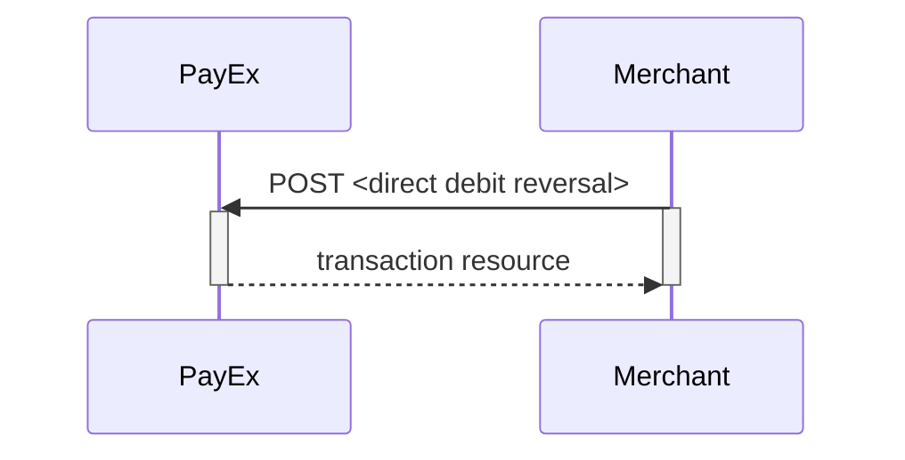



## Options after posting a payment

* **Abort:** It is possible to
  [abort a payment][technical-reference-abort-payment] if the payment has no
  successful transactions.
* For reversals, you will need to implement the Reversal request.
* **If CallbackURL is set:** Whenever changes to the payment occur a
  [Callback request][callbackurl-reference] will be posted to the
  [CallbackURL][callbackurl-reference], which was generated when the payment
  was created.

### Reversal Sequence

Reversal can only be done on a payment where there are some captured amount
not yet reversed.



[callbackurl-reference]: /payments/direct-debit/other-features#callback
[technical-reference-abort-payment]: /payments/direct-debit/other-features#abort-payment
