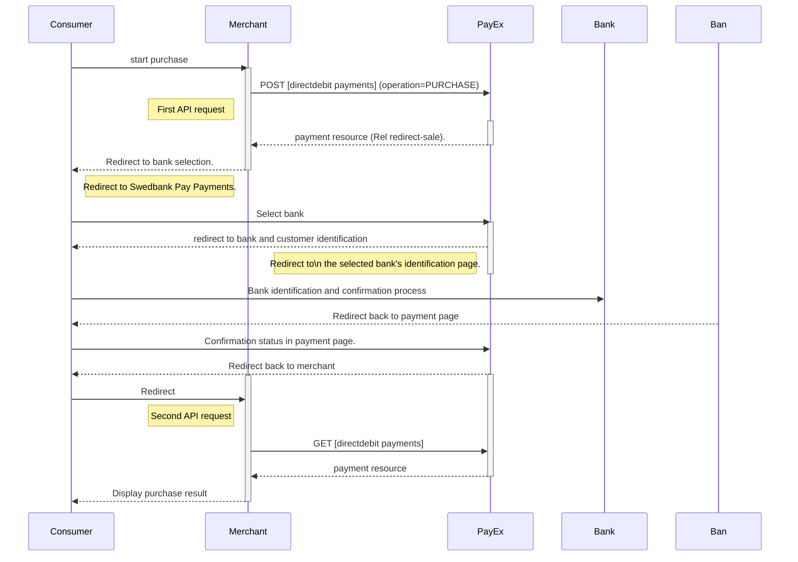



## Direct Debit Payments

>Swedbank Pay offer Direct Debit bank payments in the Baltics
(Estonia, Latvia and Lithuania).

{:.table .table-striped}
| Country                                                | Supported banks |
| :----------------------------------------------------- | :-------------- |
|  Estonia       | Swedbank        |
|  Latvia          | Swedbank        |
|  Lithuania | Swedbank        |

## Introduction

* When the consumer/end-user starts the purchase process in your
  merchant/webshop site, you need to make a `POST` request towards Swedbank Pay
  with your Purchase information. You receive a Redirect URL in return.
* You need to redirect the consumer/end-user's browser to the Redirect URL.
* A bank selection page will be presented to the consumer/end-user.
* The consumer/end-user will be redirect to the choosen bank's login page
  where she have to verify her identity to continue the payment process.
* Swedbank Pay will redirect the consumer/end-user's browser to one of two
  specified URLs, depending on whether the payment session is followed through
  completely or cancelled beforehand.
  Please note that both a successful and rejected payment reach completion,
  in contrast to a cancelled payment.
* When you detect that the consumer/end-user reach your completeUrl,
  you need to do a GET request to receive the state of the transaction.

## API Requests

The API requests are displayed in the [purchase flow](#purchase-flow).
The options you can choose from when creating a payment with key operation set
to Value Purchase are listed below.

### Type of authorization (Intent)

**Sale**: A direct debit payment will always have intent: Sale, creating a
one-phase sales transaction.

#### General

**Defining CallbackURL**: When implementing a scenario, it is optional to
set a [CallbackURL][callbackurl-reference] in the `POST` request.
If callbackURL is set Swedbank Pay will send a postback request to this URL
when the consumer has fulfilled the payment.

## Purchase flow

The sequence diagram below shows the two requests you have to send to
Swedbank Pay to make a purchase.
The links will take you directly to the API
description for the specific request.
The diagram also shows in high level, the sequence of the process of a
complete purchase.

### Next up

Read how to implement _Direct Debit_ using Redirect next.



[callbackurl-reference]: /payments/direct-debit/other-features#callback
