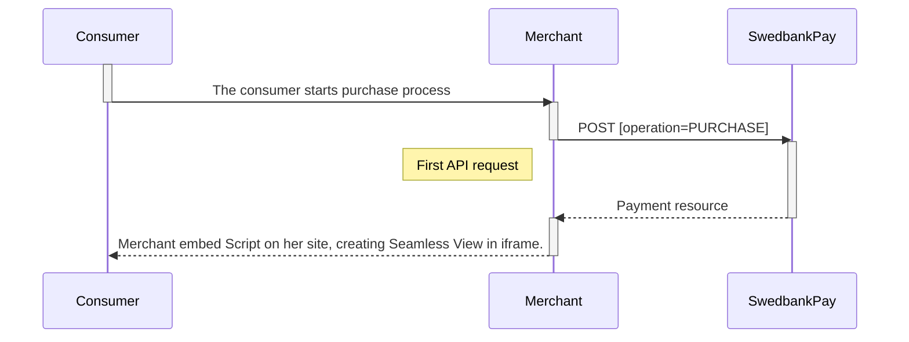
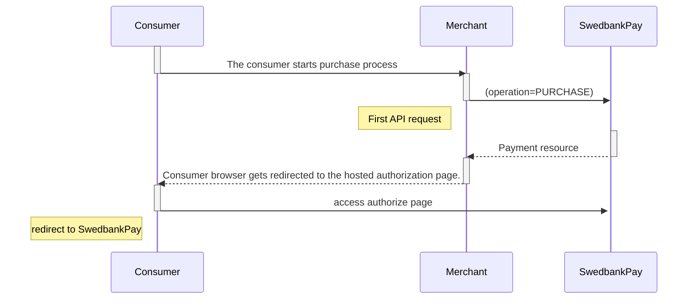





## Prerequisites

To start integrating Swebank Pay Payments, you need the following:

* [HTTPS][https] enabled web server.
* Agreement that includes Swedbank Pay Payments.
* Obtained credentials (merchant Access Token) from Swedbank Pay through
  Swedbank Pay Admin.

{:.table .table-striped}
|                                | Payment instrument                  | Seamless View | Redirect | Region                                                                               |
| :----------------------------: | :---------------------------------- | :-----------: | :------: | :----------------------------------------------------------------------------------- |
|     ![CardIcon][card-icon]     | [Credit card][card]                 |    ✔︎︎︎︎︎     |  ✔︎︎︎︎︎  | ![EarthIcon][earth-icon]                                                             |
|  ![InvoiceIcon][invoice-icon]  | [Swedbank Pay Invoice][invoice]     |    ✔︎︎︎︎︎     |  ✔︎︎︎︎︎  | ![nor][nor-flag] ![swe][swe-flag] ![fin][fin-flag]                                   |
| ![EnvelopeIcon][envelope-icon] | [Swedbank Pay Web Invoice][invoice] |    ✔︎︎︎︎︎     |  ✔︎︎︎︎︎  | ![nor][nor-flag] ![swe][swe-flag]                                                    |
|   ![KeypadIcon][keypad-icon]   | [Direct Debit][direct-debit]        |               |  ✔︎︎︎︎︎  | ![swe][swe-flag] ![fin][fin-flag] ![lat][lat-flag] ![lit][lit-flag] ![est][est-flag] |
|      ![Vipps][vipps-logo]      | [Vipps][vipps]                      |    ✔︎︎︎︎︎     |  ✔︎︎︎︎︎  | ![nor][nor-flag]                                                                     |
|      ![Swish][swish-logo]      | [Swish][swish]                      |    ✔︎︎︎︎︎     |  ✔︎︎︎︎︎  | ![swe][swe-flag]                                                                     |
|  ![MobilePay][mobilepay-logo]  | [Mobile Pay][mobile-pay]            |               |  ✔︎︎︎︎︎  | ![dan][dan-flag]                                                                     |

## Seamless View

With [Seamless Views][seamless-view] you can initiate the payment process
directly in an `iframe` on your site. `hostUrls` needs to be defined in the
first `POST` request in order to enable the Seamless View operation. See details
of the request under **Other Features** for the given payment instrument.

## Redirect

The [Redirect][redirect] platform redirects the consumers to a Swedbank Pay
hosted payment page. The consumer will then be redirected back to your page when
the payment is completed.

## The Fundamentals



*Two-phase payments* ([Card][card], [Invoice][invoice],
[MobilePay][invoice], [Vipps][vipps])

A two-phase payment is managed in two steps - first reserving funds that will be
captured in the next step. The most common payment instrument using two-phase
payments is card payments.

* **Creating a payment object**.
  The payment is the container object that holds all transactions that will be
  created during the payment process.  When Swedbank Pay receives the payment
  request body (in JSON format), a payment  is created and you will be given a
  unique paymentID in return. The response also include  (in a true RESTful way)
  the URIs to possible further actions, given the state of the payment.
* Authorize funds.
  An authorization transaction reserves the funds necessary funds . It is
  possible to abort a payment before the end user has fulfilled the payment
  process.
And either:
* Capture funds.
  Before delivering the merchandise you need to create a capture transaction to
  ensure that the money is charged from the consumer credit card or properly
  billed by invoice.
Or:
* Cancel the authorized amount.
  Funds that are authorized but not yet captured can be released back to the
  consumer. This is done by creating a cancel transaction.
* Reverse captured funds.
  In some cases you may need to make a reversal of captured funds. This is
  achieved by creating a reversal transaction.

*One-phase payments* ([Direct Debit][direct-debit], [Swish][swish],
[Card][card])

If you use a one-phase method (like Direct Bank Debit or [Swish][swish] a Sales
transaction will be created and the consumer charged right away).

* _One-phase card payments is enabled with autocapture._

>Add image

### Creating a payment object

The `payment` is the container object that holds all transactions that will be
created during the payment process. When Swedbank Pay receives the payment
request body (in JSON format), a payment  is created and you will be given a
unique paymentID in return. The response also include  (in a true RESTful way)
the URIs to possible further actions, given the state of the payment. It is
possible to abort a payment before the end user has fulfilled the payment
process. Settle funds directly with a Sales transaction.

>Add image

## Swedbank Pay Payments Platform

Swedbank Pay Seamless View and Redirect offer easy-to-use PCI-DSS compliant
platforms, available from both web and mobile browsers. Either let your
customers access the platform directly, embedded on your site, or by redirection
to a separate Swedbank Pay hosted payment page.

### Seamless Views

With the Seamless View you can initiate the payment process directly in an
`iframe` on your site. `hostUrls` needs to be defined in the first `POST`
request in order to enable the Seamless View operation. See details of the
Seamless View implementation underneath each respective payment instrument.



Please visit our [demoshop][demoshop] to view our Payment Menu and Redirect
implementation in action. Use the configuration below:

```markdown
TODO: Insert picture from demoshop showing the following configuration:
Swedbank Pay Payments
Seamless View
Norway
English
```

#### Getting started with Seamless View

When implementing Seamless View, you need to locate the operation that is
returned from your API request, which contains the URL of the JavaScript that
you need to embed on your Front End side. This will load the payment page on a
subset of your own webpage.

The properties of the operation containing the script URL should be similar to
the example below. The `href` attribute refers to a script of the `contentType`
application/javascript and the `rel` value `view-payment` indicate that the
Seamless View scenario will generate a one-phased sales transaction. A two-phase
credit card payment would during the same scenario generate an authorization
transaction, and the `rel` value would in that case be `view-authorization`.

```js
Operations
{
   "operations": [
        {
           "method": "GET",
           "href": "https://ecom.externalintegration.payex.com/swish/core/scripts/client/px.swish.client.js
                    ?token=cfb9e24832d56fec7ab79709f56accc53d79a699756687d39095b517bc5f011b",
           "rel": "view-payment",
           "contentType": "application/javascript"
        }
    ]
}
```

To integrate the payment page script, you need to prepare you front end:

1. You need to create a container that will contain the Seamless View `iframe`:
   `<div id="payex-hosted-payment-page">`.
2. You also need to create a `<script>` source within the container, using the
   `href` value you obtained when submitting your initial `POST`. As mentioned
   above, all Seamless View operations have a rel description beginning with
    `"view-"`. The example below is taken from the `view-payment` operation, above
   – enabling Swish payments through Seamless View.

```html
<script id="paymentPageScript" src="https://ecom.stage.payex.com/swish/core/scripts/client/px.swish.client.js?
                                    token=bcff0db777d5bcf21a210235342921f46da993efa5e91340f713c8cedf4aac38"></script>
```

1. Lastly, you must initiate the Seamless View with a JavaScript call to open the
  Seamless View iframe embedded on you site.

{:.code-header}
**JavaScript Call**

```html
<script language="javascript">
    payex.hostedView.page(configuration).open();
</script>
```

See the overview of each payment instrument and their technical reference for
more specific information.

### Redirect Implementation

The Redirect implementation lets you redirect your customer to an easy-to-use
PCI-DSS compliant payment platform, hosted by Swedbank Pay and available from
both web and mobile browsers. The consumer selects a payment instrument and proceeds
to hosted payment page.



Please visit our [demoshop][demoshop] to view our Payment Menu and Redirect
implementation in action. Use the configuration below:

```
TODO: Insert picture from demoshop showing the following configuration:
Swedbank Pay Payments
Redirect
Norway
English
```

#### Getting started with Redirect

To start using the Redirect platform, you need to implement the appropriate
operation returned from the initial API Request, containing the URL that the
customer's browser needs to be redirected to.

The combination of properties should be similar to all payment instruments. In
the example below, the `href` attribute refers to the redirect URL and the `rel`
value `redirect-sale` indicate that the redirect scenario will generate a
one-phased `Sales` transaction. A two-phase credit card payment would during the
same scenario generate an authorization transaction, and the `rel` value would
in that case be `redirect-authorization`.

```js
{
   "operations": [
        {
           "method": "GET",
           "href": "https://ecom.externalintegration.payex.com/swish/payments/sales
                     /993b479653da83671c074316c7455da05fced9d634431edbb64f3c5f80a863f0",
           "rel": "redirect-sale"
        }
    ]
}
```

See the technical overview of each payment instrument and the technical reference
for more specific information.

## The Payment Process

The core payment process of the eCommerce APIs are the same across all payment
instruments.

### Creating a payment

* The payment is the container object that holds all transactions that will be
  created during the payment process. You specify which payment instrument to
  use, i.e. if you want to initiate a credit card payment, an invoice payment or
  a Swish payment, etc. This is managed by specific instrument calls to Swedbank
  Pay's API Platform, where you need to include all necessary payment details -
  like amount, description, references to your system, etc. This example shows a
  card payment post.
* When Swedbank Pay receives this information, a payment  will be created and
  you will be given a unique paymentID in return. The response also include
  (in a true RESTful way) the URI's to possible further actions, given the state
  of the payment.
* A successfully created payment is in a Ready state.If something has gone
  wrong along the way, the state is set to Failed.

### Creating an Authorization or Sales transaction

* A successful payment is `Ready` for authorization. An authoriation
  transaction is often created through a Redirect scenario, where you transfer
  the consumer to a hosted payment page, or by enable the process to take place
  directly on your own site, through Seamless View.
* If you use a *one-phase method* (like Direct bank debit or Swish) a `Sales`
  transaction will be created and the consumer be charged right away. A
  two-phase payment instrument like credit card, the authorized amount needs to
  captured in a later step.
* The `authorize` transaction will have one of the below states when created.

{:.table .table-striped}
| State         | Description                                                                                                                                                                                                                                                                                                                             |
| :------------ | :-------------------------------------------------------------------------------------------------------------------------------------------------------------------------------------------------------------------------------------------------------------------------------------------------------------------------------------- |
| `Initialized` | Something unexpected occurred. It is impossible to determine the exact status (network failure etc.) and the transaction will remain Initialized. The corresponding state of the payment will be set to pending and no further actions can be taken on this payment (no more transactions can be created).                              |
| `Completed`   | Everything went ok! Financial funds is reserved. A capture transaction needs to be created in order to charge the consumer.                                                                                                                                                                                                             |
| `Failed`      | The transaction has failed (maybe the card got declined).. The transactional state is final, but it is still possible to retry and create another authorization transaction on this payment (the consumer tries another credit card). If the maximum amount of retries has been reached the payment state itself will be set to failed. |

### Checking the transaction state

* By this time, the payment might contains several associated transactions,
  making it vital that you verify the state of the latest transaction. Swedbank
  Pay keeps all payment transactions to enable a full transaction history of
  each payment.

### Creating a capture transaction (two-phase payments only)

* Later on (when you deliver the merchandise, if physical content), you need to
  create a `capture` transaction to ensure that the money is charged from the
  consumer credit card (or that the invoice is created properly). You now have a
  least two connected transactions (one authorization and one capture).
* The `capture` transaction will have one of the below states when created.

{:.table .table-striped}
| State         | Description                                                                                                                                                                                                                                                                                                                                          |
| :------------ | :--------------------------------------------------------------------------------------------------------------------------------------------------------------------------------------------------------------------------------------------------------------------------------------------------------------------------------------------------- |
| `Initialized` | Something unexpected occurred. It is impossible to determine the exact status (network failure etc.) and the transaction will remain Initialized. The corresponding state of the payment will be set to pending andno further actions can be taken on this payment (no more transactions can be created).                                            |
| `Completed`   | Everything went ok! The consumer's card has been charged (or billed by invoice).                                                                                                                                                                                                                                                                     |
| `Failed`      | The transaction has failed (maybe the card error relating to the acquiring bank). The transactional state is final, but it is still possible to retry and create another capture transaction  (the consumer tries another credit card, yet again). If the maximum amount of retries has been reached the payment state itself will be set to failed. |

### Cancelling an authorized amount

* Funds that are authorized but not yet captured can be released back to the
  consumer. This is done by creating a cancel transaction.
* A cancel transaction follow the same structure as all transactions and can
  have the same states (Initialized, completed and failed).

### Creating a reversal transaction (optional)

* In some cases you may need to make a reversal of captured funds. This is done
  by creating a reversal transaction. A two-phase payment will during this step
  have at least three connected transactions (one authorization, one capture,
  and one reversal).

### Aborting the payment (optional)

* It is possible for the merchant to abort a payment before the end user has
  fulfilled the payment process. If the merchant calls the `PATCH` function
  (see PATCH method for Payments), the payment will be aborted.
* This can only happen if there exist no final transactions (like captures) on
  the payment with a successful status. Once the payment is aborted, no more
  transactions/operations can be done. If the consumer has been redirected to a
  hosted payment page when this happens, the end user will be redirected back to
  your merchant page.

### Payment is set to Failed

* During some circumstances the payment state might be set to Failed. This
  happens if an antifraud pattern triggers or if the number of tries are
  exceeded during the authorization phase, as mentioned above.  No more
  transactions can be created on a failed payment. If the consumer has been
  redirected to a payment page when this happens,  she will be redirected back
  to your store.

[demoshop]: https://ecom.externalintegration.payex.com/pspdemoshop
[card-icon]: /assets/img/card-icon.png
[https]: /#connection-and-protocol
[invoice-icon]: /assets/img/invoice-icon.png
[envelope-icon]: /assets/img/envelope-icon.png
[keypad-icon]: /assets/img/keypad-icon.png
[vipps-logo]: /assets/img/vipps-icon.png
[swish-logo]: /assets/img/swish-icon.png
[mobilepay-logo]: /assets/img/mobilepay-icon.png
[earth-icon]: /assets/img/globe-icon.png
[nor-flag]: /assets/img/no.png
[swe-flag]: /assets/img/se.png
[fin-flag]: /assets/img/fi.png
[lat-flag]: /assets/img/latvia-flag.png
[lit-flag]: /assets/img/lithuania-flag.png
[est-flag]: /assets/img/estonia-flag.png
[dan-flag]: /assets/img/danish-flag.png
[card]: /payments/card
[invoice]: /payments/invoice
[direct-debit]: /payments/direct-debit
[vipps]: /payments/vipps
[swish]: /payments/swish
[mobile-pay]: /payments/mobile-pay
[seamless-view]: /payments/card/seamless-view
[redirect]: /payments/card/redirect
