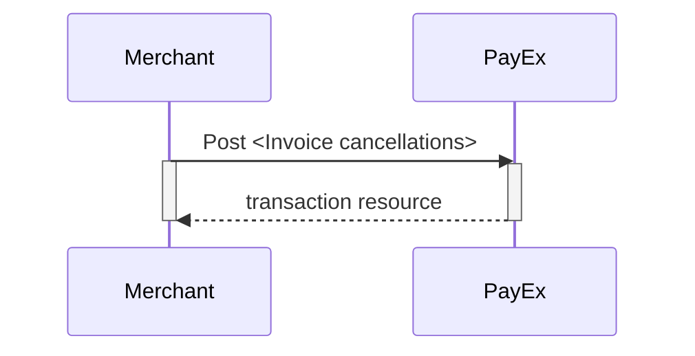
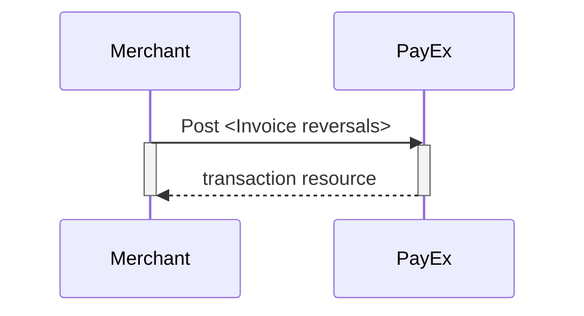

## Options after posting a payment

When you detect that the payer has reached your `completeUrl`, you need to do a
GET request on the payment resource, which contains the paymentID generated in
the first step, to receive the state of the transaction. You will also be able
to see the available operations after posting a payment.



* **Abort:** It is possible to abort the process if the payment has no
  successful transactions. [See the `abort`
  description][abort-description].
* An invoice authorization must be followed by a `capture` or
  `cancel` request.
* For reversals, you will need to implement the `reversal` request.
* **If CallbackURL is set:** Whenever changes to the payment occur a [Callback
  request][callback-request] will be posted to the callbackUrl, which was
  generated when the payment was created.



### Cancellations

#### Create cancel transaction

Perform the `create-cancellation` operation to cancel a previously authorized
or partially captured invoice payment.

{:.code-header}
***Request***

```http
POST /psp/invoice/payments/{{ page.payment_id }}/cancellations HTTP/1.1
Host: {{ page.api_host }}
Authorization: Bearer <AccessToken>
Content-Type: application/json

{
    "transaction": {
        "activity": "FinancingConsumer",
        "payeeReference": "customer order reference-unique",
        "description": "description for transaction"
    }
}
```

{:.table .table-striped}
| Required | Parameter name               | Datatype     | Value (with description)                                                                                                                                                                                                              |
| :------: | :--------------------------- | :----------- | :------------------------------------------------------------------------------------------------------------------------------------------------------------------------------------------------------------------------------------ |
|    ✔︎    | `transaction.activity`       | `string`     | `FinancingConsumer`.                                                                                                                                                                                                                  |
|    ✔︎    | `transaction.payeeReference` | `string`     | The `payeeReference` is the receipt/invoice number, which is a **unique** reference with max 50 characters set by the merchant system. This must be unique for each operation and must follow the regex pattern `[\w]* (a-zA-Z0-9_)`. |
|    ✔︎    | `transaction.description`    | `string(50)` | A textual description for the cancellation.                                                                                                                                                                                           |

The `cancel` resource will be returned, containing information about the
newly created `cancel` transaction.



### Inspecting the Cancellation

The `cancellations` resource lists the cancellation transaction made on a
specific payment.

{:.code-header}
**Request**

```http
Request
GET /psp/invoice/payments/{{ page.payment_id }}/cancellations HTTP/1.1
Host: {{ page.api_host }}
Authorization: Bearer <AccessToken>
Content-Type: application/json
```



#### Cancel Sequence

A `cancel` can only be performed on a successfully authorized transaction which
has not been captured yet. If you perform a cancellation after doing a partial
capture, you will only cancel the remaining authorized amount.



### Reversals

#### Create reversal transaction

The `create-reversal` operation will reverse a previously captured payment and
refund the amount to the consumer. To reverse a payment, perform the
`create-reversal` operation. The HTTP body of the request should look as
follows:

{:.code-header}
**Request**

```http
POST /psp/invoice/payments/{{ page.payment_id }}/reversals HTTP/1.1
Host: {{ page.api_host }}
Authorization: Bearer <AccessToken>
Content-Type: application/json

{
    "transaction": {
        "activity": "FinancingConsumer",
        "amount": 1500,
        "vatAmount": 0,
        "payeeReference": "customer reference-unique",
        "receiptReference": "3245766",
        "description": "description for transaction"
    }
}
```

{:.code-header}
**Properties**

{:.table .table-striped}
| Required | Field                      | Type         | Description                                                                                                                                                                                                                                                                |
| :------: | :------------------------- | :----------- | :------------------------------------------------------------------------------------------------------------------------------------------------------------------------------------------------------------------------------------------------------------------------- |
|    ✔︎    | `transaction`              | `object`     | The transaction object containing details about the reversal transaction.                                                                                                                                                                                                  |
|    ✔︎    | └➔&nbsp;`activity`         | `string`     | `FinancingConsumer`.                                                                                                                                                                                                                                                       |
|    ✔︎    | └➔&nbsp;`amount`           | `integer`    |                                                                                                                                                                                                                                   |
|    ✔︎    | └➔&nbsp;`vatAmount`        | `integer`    |                                                                                                                                                                                                                                |
|    ✔︎    | └➔&nbsp;`payeeReference`   | `string(50)` | The `payeeReference` is the receipt/invoice number if `receiptReference` is not defined, which is a **unique** reference with max 50 characters set by the merchant system. This must be unique for each operation and must follow the regex pattern `[\w]* (a-zA-Z0-9_)`. |
|          | └➔&nbsp;`receiptReference` | `string(50)` | The `receiptReference` is a reference from the merchant system. If sent in, this reference is used as an invoice/receipt number.                                                                                                                                           |
|    ✔︎    | └➔&nbsp;`description`      | `string`     | A textual description of the reversal.                                                                                                                                                                                                                                     |

The `reversal` resource will be returned, containing information about the newly created reversal transaction.



### Inspecting the Reversal

The `reversals` resource will list the reversal transactions
(one or more) on a specific payment.

{:.code-header}
***Request***

```http
GET /psp/invoice/payments/{{ page.payment_id }}/reversals HTTP/1.1
Host: {{ page.api_host }}
Authorization: Bearer <AccessToken>
Content-Type: application/json
```



#### Reversal Sequence

`Reversal` can only be done on an captured transaction where there are
some captured amount not yet reversed.





----------------------------------------------------------
[abort-description]: #abort
[callback-request]: /payments/invoice/other-features#callback
[invoice-captures]: #captures
[invoice-cancellations]: #cancellations
[invoice-reversals]: #reversals
[other-features-transaction]: /payments/invoice/other-features#transactions
