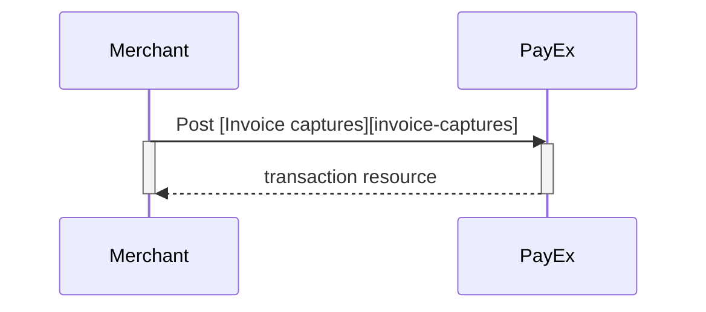
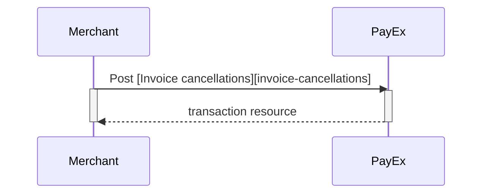
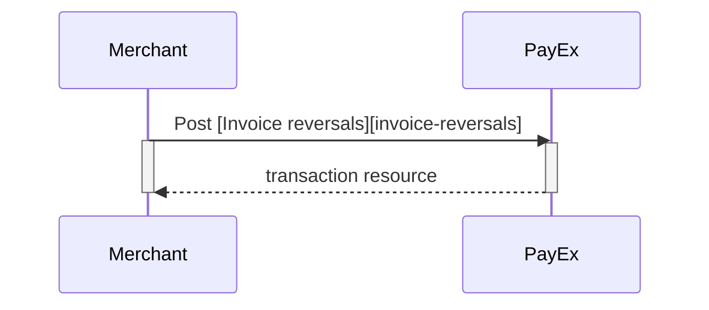




## Options after posting a payment

*   **Abort:** It is possible to abort the process, if the payment has no successful transactions. [See the PATCH payment description][see-the-PATCH-payment-description].
*   You must always follow up an Invoice Authorization with a Capture or Cancel request.
*   For reversals, you will need to implement the Reversal request.
*   **If CallbackURL is set:** Whenever changes to the payment occur a [Callback request][callback-request] will be posted to the callbackUrl, which was generated when the payment was created.

### Captures

The `captures` resource list the capture transactions performed on a specific invoice payment.

{:.code-header}
***Request***

```HTTP
GET /psp/invoice/payments/5adc265f-f87f-4313-577e-08d3dca1a26c/captures HTTP/1.1
Host: api.payex.com
Authorization: Bearer <MerchantToken>
Content-Type: application/json
```

{:.code-header}
***Response***

```HTTP
HTTP/1.1 200 OK
Content-Type: application/json

{
    "payment": "/psp/invoice/payments/5adc265f-f87f-4313-577e-08d3dca1a26c",
    "captures": [{
        "itemDescriptions": {
            "id": "/psp/invoice/payments/5adc265f-f87f-4313-577e-08d3dca1a26c/transactions/5adc265f-f87f-4313-577e-08d3dca1a26c/itemdescriptions"
        },
        "invoiceCopy": "/psp/invoice/payments/5adc265f-f87f-4313-577e-08d3dca1a26c/captures/5adc265f-f87f-4313-577e-08d3dca1a26c/invoicecopy",
        "transaction": {
            "id": "/psp/invoice/payments/5adc265f-f87f-4313-577e-08d3dca1a26c/transactions/5adc265f-f87f-4313-577e-08d3dca1a26c",
            "created": "2016-09-14T01:01:01.01Z",
            "updated": "2016-09-14T01:01:01.03Z",
            "type": "Capture",
            "state": "Initialized|Completed|Failed",
            "number": 1234567890,
            "amount": 1000,
            "vatAmount": 250,
            "description": "Test transaction",
            "payeeReference": "AH123456",
            "failedReason": "",
            "isOperational": "TRUE|FALSE",
            "operations": []
        }
    }]
}
```

#### Create `FinancingConsumer` capture

To capture a `FinancingConsumer` invoice payment, perform the create-capture operation with the following request  body:

```HTTP
POST /psp/invoice/payments/<paymentId>/captures HTTP/1.1
Host: api.payex.com
Authorization: Bearer <MerchantToken>
Content-Type: application/json

{
    "transaction": {
        "activity": "FinancingConsumer",
        "amount": 13500,
        "vatAmount": 2500,
        "payeeReference": "customer reference-unique",
        "description": "description for transaction",
        "itemDescriptions": [
          {
            "amount": 12500,
            "description": "item description 1"
          },
          {
            "amount": 1000,
            "description": "item description 2"
          }
        ],
        "vatSummary": [
          {
            "amount": 12500,
            "vatPercent": 2500,
            "vatAmount": 2500
          },
          {
            "amount": 1000,
            "vatPercent": 0,
            "vatAmount": 0
          }
        ]
  }
}
```

{:.table .table-striped}
| Parameter name | Datatype | Required | Value (with description)
| transaction.activity | string | ✔︎ | FinancingConsumer.
| transaction.Amount | integer | ✔︎ | Amount entered in the lowest momentary units of the selected currency. E.g. 10000 = 100.00 NOK, 5000 = 50.00 SEK.
| transaction.vatAmount | integer | ✔︎ | Amount entered in the lowest momentary units of the selected currency. E.g. 10000 = 100.00 NOK, 5000 = 50.00 SEK.
| transaction.payeeReference | string(50) | ✔︎ | A **unique **reference max 50 characters set by the merchant system) - this must be unique for each operation! The `payeeReference` must follow the regex pattern `[\w]* (a-zA-Z0-9_)`.
| transaction.description | string | ✔︎ | A textual description of the capture
| itemDescriptions.amount | integer | ✔︎ | Total price for this order line - entered in the lowest momentary units of the selected currency. E.g. 10000 = 100.00 NOK, 5000 = 50.00 SEK.
| itemDescriptions.description | string | ✔︎ | A textual description of this product
| vatSummary.amount | integer | ✔︎ | Total price for this order line - entered in the lowest momentary units of the selected currency. E.g. 10000 = 100.00 NOK, 5000 = 50.00 SEK.
| vatSummary.vatAmount | integer | ✔︎ | VAT Amount entered in the lowest momentary units of the selected currency. E.g. 10000 = 100.00 NOK, 5000 = 50.00 SEK.
| vatSummary.vatPercent | string | ✔︎ | The VAT in percent. Supported values : "0.00", "6.00", "8.00", "10.00", "12.00", "14.00", "15.00", "22.00", "24.00", "25.00"

Notes on `FinancingConsumer` captures:

* Due date is set by PayEx based on the agreement with merchant. Standard due date is 14 days.
* Invoice number is set by PayEx.

```HTTP
HTTP/1.1 200 OK
Content-Type: application/json

{
    "payment": "/psp/invoice/payments/5adc265f-f87f-4313-577e-08d3dca1a26c",
    "capture": {
        "itemDescriptions": {
            "id": "/psp/invoice/payments/<captureId>/transactions/12345678-1234-1234-1234-123456789012/itemDescriptions"
        },
        "invoiceCopy": "/psp/invoice/payments/5adc265f-f87f-4313-577e-08d3dca1a26c/captures/12345678-1234-1234-1234-123456789012/invoicecopy",
        "transaction": {
            "id": "/psp/invoice/payments/5adc265f-f87f-4313-577e-08d3dca1a26c/transactions/12345678-1234-1234-1234-123456789012",
            "created": "2016-09-14T01:01:01.01Z",
            "updated": "2016-09-14T01:01:01.03Z",
            "type": "Capture",
            "state": "Completed",
            "number": 1234567890,
            "amount": 1000,
            "vatAmount": 250,
            "description": "Test transaction",
            "payeeReference": "AH123456",
            "failedReason": "",
            "isOperational": "TRUE|FALSE",
            "operations": []
        }
    }
}
```

{:.table .table-striped}
| Property | Data type | Description
| payment | string | The relative URI of the payment this capture transaction resource belongs to.
| capture.itemDescriptions.id | string | The relative URI of the item descriptions resource associated with this capture transaction resource.
| capture.invoiceCopy | string | The relative URI of the downloadable invoice copy in PDF format.
| capture.transaction | object | The object representation of the [transaction][technical-reference-transaction].

#### Capture Sequence

`Capture` can only be done on a successfully authorized transaction. It is possible to do a part-capture where you only capture a part of the authorization amount. You can later do more captures on the same payment up to the total authorization amount.




### Cancellations

The `cancellations` resource lists the cancellation transactions made on a specific payment.

{:.code-header}
***Request***

```HTTP
Request
GET /psp/invoice/payments/5adc265f-f87f-4313-577e-08d3dca1a26c/cancellations HTTP/1.1
Host: api.payex.com
Authorization: Bearer <MerchantToken>
Content-Type: application/json
```

{:.code-header}
***Response***
```HTTP
HTTP/1.1 200 OK
Content-Type: application/json

{
    "payment": "/psp/invoice/payments/5adc265f-f87f-4313-577e-08d3dca1a26c",
    "cancellations": [{
        "transaction": {
            "id": "/psp/invoice/payments/5adc265f-f87f-4313-577e-08d3dca1a26c/transactions/5adc265f-f87f-4313-577e-08d3dca1a26c",
            "created": "2016-09-14T01:01:01.01Z",
            "updated": "2016-09-14T01:01:01.03Z",
            "type": "Cancellation",
            "state": "Failed",
            "number": 1234567890,
            "amount": 1000,
            "vatAmount": 250,
            "description": "Test transaction",
            "payeeReference": "AH123456",
            "failedReason": "",
            "isOperational": false,
            "operations": []
        }
    }]
}
```

{:.table .table-striped}
| Property | Data type | Description
| payment | string | The relative URI of the payment this list of cancellation transactions belong to.
| cancellations.id | string | The relative URI of the current `cancellations` resource.
| cancellations.cancellationList | array | The array of the cancellation transaction objects.
| cancellations.cancellationList[] | object | The object representation of the cancellation transaction resource described below.

#### Create cancellation transaction

Perform the `create-cancellation` operation to cancel a previously created - and not yet captured - invoice payment.

{:.code-header}
***Request***

```HTTP
POST /psp/invoice/payments/5adc265f-f87f-4313-577e-08d3dca1a26c/cancellations HTTP/1.1
Host: api.payex.com
Authorization: Bearer <MerchantToken>
Content-Type: application/json

{
    "transaction": {
        "activity": "FinancingConsumer",
        "payeeReference": "customer order reference-unique",
        "description": "description for transaction"
    }
}
```

{:.table .table-striped}
| Parameter name | Datatype | Required | Value (with description)
| transaction.activity | string | ✔︎ | `FinancingConsumer`.
| transaction.payeeReference | string | ✔︎ | A **unique **reference max 50 characters set by the merchant system) - this must be unique for each operation! The [payeeReference][technical-reference-payeeReference] must follow the regex pattern `[\w]* (a-zA-Z0-9_)`. 
| transaction.description | string(50) | ✔︎ | A textual description for the cancellation.

The `cancel` resource will be returned, containing information about the newly created cancellation transaction.

{:.code-header}
***Response***

```HTTP
{
    "payment": "/psp/invoice/payments/5adc265f-f87f-4313-577e-08d3dca1a26c",
    "cancellation": {
        "transaction": {
            "id": "/psp/invoice/payments/5adc265f-f87f-4313-577e-08d3dca1a26c/transactions/12345678-1234-1234-1234-123456789012",
            "created": "2016-09-14T01:01:01.01Z",
            "updated": "2016-09-14T01:01:01.03Z",
            "type": "Cancellation",
            "state": "Completed",
            "number": 1234567890,
            "amount": 1000,
            "vatAmount": 250,
            "description": "Test transaction",
            "payeeReference": "AH123456",
            "failedReason": "",
            "isOperational": false,
            "operations": []
        }
    }
}
```

{:.table .table-striped}
| Property | Data type | Description
| payment | string | The relative URI of the payment this capture transaction belongs to.
| reversal.id | string | The relative URI of the created capture transaction.
| reversal.transaction | object | The object representation of the generic [transaction][technical-reference-transaction].

#### Cancel Sequence

`Cancel` can only be done on a successfully authorized transaction, not yet captured. If you do cancel after doing a part-capture you will cancel the not yet captured amount only.




### Reversals  

The `reversals` resource will list the reversal transactions (one or more) on a specific payment.

{:.code-header}
***Request***

```HTTP
GET /psp/invoice/payments/5adc265f-f87f-4313-577e-08d3dca1a26c/reversals HTTP/1.1
Host: api.payex.com
Authorization: Bearer <MerchantToken>
Content-Type: application/json
```

{:.code-header}
***Response***

```HTTP
HTTP/1.1 200 OK
Content-Type: application/json

{
    "payment": "/psp/invoice/payments/5adc265f-f87f-4313-577e-08d3dca1a26c",
    "reversal": [{
        "transaction": {
            "id": "/psp/invoice/payments/5adc265f-f87f-4313-577e-08d3dca1a26c/transactions/12345678-1234-1234-1234-123456789012",
            "created": "2016-09-14T01:01:01.01Z",
            "updated": "2016-09-14T01:01:01.03Z",
            "type": "Reversal",
            "state": "Completed",
            "number": 1234567890,
            "amount": 1000,
            "vatAmount": 250,
            "description": "Test transaction",
            "payeeReference": "AH123456",
            "failedReason": "",
            "isOperational": false,
            "operations": []
        }
    }]
}
```

{:.table .table-striped}
| Property | Type | Description
| payment | string | The relative URI of the payment that the reversal transactions belong to.
| reversalList | array | The array of reversal transaction objects.
| reversalList[] | object | The reversal transaction object representation of the reversal transaction resource described below.

#### Create reversal transaction

The `create-reversal` operation will reverse a previously captured payment. To reverse a payment, perform the `create-reversal` operation. The HTTP body of the request should look like the following.

{:.code-header}
**Request**

```HTTP
POST /psp/invoice/payments/5adc265f-f87f-4313-577e-08d3dca1a26c/reversals HTTP/1.1
Host: api.payex.com
Authorization: Bearer <MerchantToken>
Content-Type: application/json

{
    "transaction": {
        "activity": "FinancingConsumer",
        "amount": 1500,
        "vatAmount": 0,
        "payeeReference": "customer reference-unique",
        "description": "description for transaction"
    }
}
```

{:.code-header}
**Properties**

{:.table .table-striped}
| Property | Data type | Required | Description
| transaction.activity | string | Y| `FinancingConsumer`.
| transaction.amount | integer | ✔︎ | Amount Entered in the lowest momentary units of the selected currency. E.g. *10000* = 100.00 NOK, *5000* = 50.00 SEK.
| transaction.vatAmount | integer | ✔︎ | Amount Entered in the lowest momentary units of the selected currency. E.g. *10000* = 100.00 NOK, *5000* = 50.00 SEK.
| transaction.payeeReference | string(50 | ✔︎ | A **unique **reference max 50 characters set by the merchant system) - this must be unique for each operation! The `payeeReference` must follow the regex pattern `[\w]* (a-zA-Z0-9_)`.
| transaction.description | string | ✔︎ | A textual description of the reversal.

The `reversal` resource will be returned, containing information about the newly created reversal transaction.

{:.code-header}
**Response**

```HTTP
HTTP/1.1 200 OK
Content-Type: application/json

{
    "payment": "/psp/invoice/payments/5adc265f-f87f-4313-577e-08d3dca1a26c",
    "reversal": {
        "transaction": {
            "id": "/psp/invoice/payments/5adc265f-f87f-4313-577e-08d3dca1a26c/transactions/12345678-1234-1234-1234-123456789012",
            "created": "2016-09-14T01:01:01.01Z",
            "updated": "2016-09-14T01:01:01.03Z",
            "type": "Reversal",
            "state": "Completed",
            "number": 1234567890,
            "amount": 1000,
            "vatAmount": 250,
            "description": "Test transaction",
            "payeeReference": "AH123456",
            "failedReason": "",
            "isOperational": false,
            "operations": []
        }
    }
}
```

{:.code-header}
**Properties**

{:.table .table-striped}
| Property | Data type | Description
| payment | string | The relative URI of the payment this capture transaction belongs to.
| reversal.id | string | The relative URI of the created capture transaction.
| reversal.transaction | object | The object representation of the generic [transaction][technical-reference-transaction].

#### Reversal Sequence

`Reversal` can only be done on an captured transaction where there are some captured amount not yet reversed.







----------------------------------------------------------
[see-the-PATCH-payment-description]: /payments/credit-card/after-payment
[callback-request]: #
[invoice-captures]: #
[invoice-cancellations]: #
[invoice-reversals]: #
[technical-reference-transaction]: #
[technical-reference-payeeReference]: #
