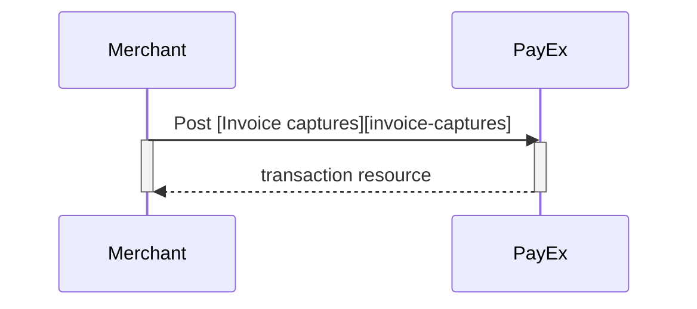
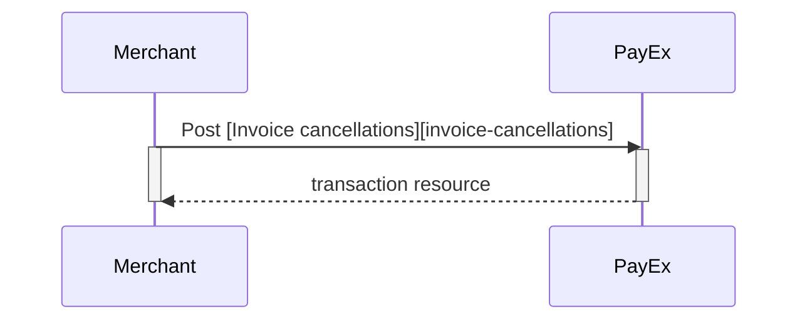
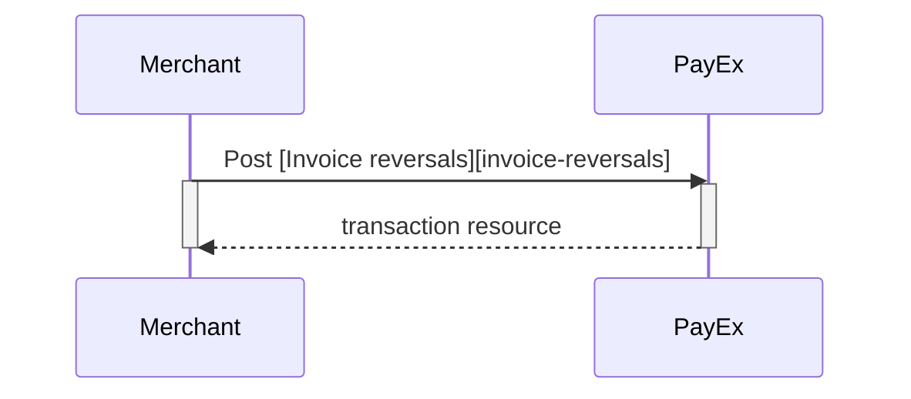



## Options after posting a payment

*   **Abort:** It is possible to abort the process, if the payment has no successful transactions. [See the PATCH payment description][see-the-PATCH-payment-description].
*   You must always follow up an Invoice Authorization with a Capture or Cancel request.
*   For reversals, you will need to implement the Reversal request.
*   **If CallbackURL is set:** Whenever changes to the payment occur a [Callback request][callback-request] will be posted to the callbackUrl, which was generated when the payment was created.

### Capture Sequence

[Capture] can only be done on a successfully authorized transaction. It is possible to do a part-capture where you only capture a part of the authorization amount. You can later do more captures on the same payment up to the total authorization amount.

### Cancel Sequence

[Cancel] can only be done on a successfully authorized transaction, not yet captured. If you do cancel after doing a part-capture you will cancel the not yet captured amount only.

### Reversal Sequence

[Reversal] can only be done on an captured transaction where there are some captured amount not yet reversed.

----------------------------------------------------------
[see-the-PATCH-payment-description]: /payments/credit-card/after-payment
[callback-url]: #
[callback-api]: #
[callback-request]: #
[invoice-captures]: #
[invoice-cancellations]: #
[invoice-reversals]: #