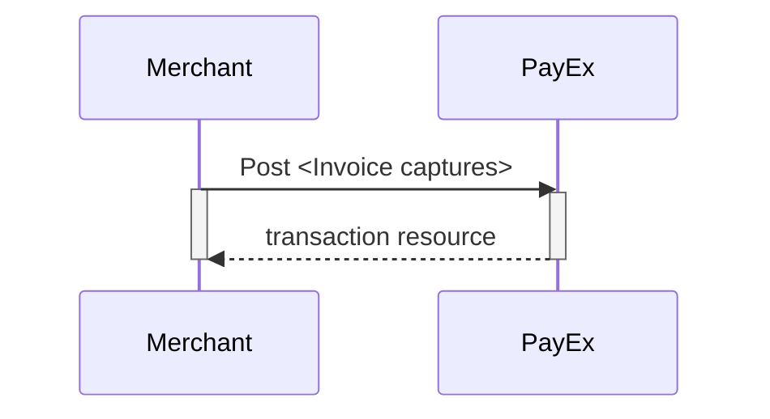
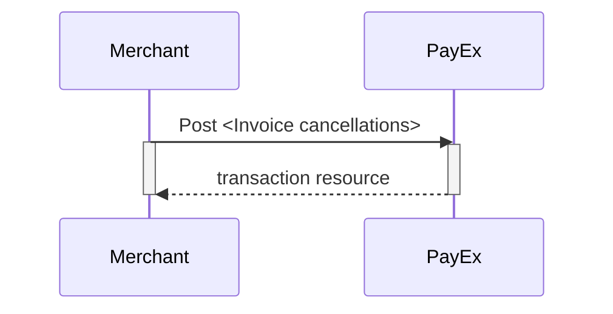
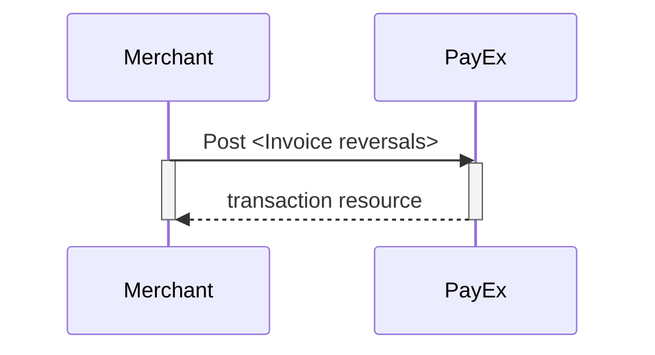

## Options after posting a payment

When you detect that the payer has reached your `completeUrl`, you need to do a
GET request on the payment resource, which contains the paymentID generated in
the first step, to receive the state of the transaction. You will also be able
to see the available operations after posting a payment.



* **Abort:** It is possible to abort the process if the payment has no
  successful transactions. [See the `abort`
  description][abort-description].
* An invoice authorization must be followed by a `capture` or
  `cancel` request.
* For reversals, you will need to implement the `reversal` request.
* **If CallbackURL is set:** Whenever changes to the payment occur a [Callback
  request][callback-request] will be posted to the callbackUrl, which was
  generated when the payment was created.



### Captures

An invoice capture will generate the invoice and distribute it to the consumer.
This differs from i.e. card payments, where a capture operation will fully or
partially charge the consumer's authorized amount.

#### Create `FinancingConsumer` capture

To capture a `FinancingConsumer` invoice payment, perform the `create-capture`
operation with the following request body:

```http
POST /psp/invoice/payments/{{ page.paymentId }}/captures HTTP/1.1
Host: {{ page.apiHost }}
Authorization: Bearer <AccessToken>
Content-Type: application/json

{
    "transaction": {
        "activity": "FinancingConsumer",
        "amount": 13500,
        "vatAmount": 2500,
        "payeeReference": "customer reference-unique",
        "description": "description for transaction",
        "itemDescriptions": [
          {
            "amount": 12500,
            "description": "item description 1"
          },
          {
            "amount": 1000,
            "description": "item description 2"
          }
        ],
        "vatSummary": [
          {
            "amount": 12500,
            "vatPercent": 2500,
            "vatAmount": 2500
          },
          {
            "amount": 1000,
            "vatPercent": 0,
            "vatAmount": 0
          }
        ]
  }
}
```

{:.table .table-striped}
| Required | Parameter name               | Datatype     | Value (with description)                                                                                                                                                                |
| :------: | :--------------------------- | :----------- | :-------------------------------------------------------------------------------------------------------------------------------------------------------------------------------------- |
|    ✔︎     | `transaction.activity`       | `string`     | FinancingConsumer.                                                                                                                                                                      |
|    ✔︎     | `transaction.Amount`         | `integer`    | Amount entered in the lowest momentary units of the selected currency. E.g. `10000` = `100.00 SEK`, `5000` = `50.00 SEK`.                                                               |
|    ✔︎     | `transaction.vatAmount`      | `integer`    | Amount entered in the lowest momentary units of the selected currency. E.g. `10000` = `100.00 SEK`, `5000` = `50.00 SEK`.                                                               |
|    ✔︎     | `transaction.payeeReference` | `string(50)` | A **unique** reference max 50 characters set by the merchant system) - this must be unique for each operation! The `payeeReference` must follow the regex pattern `[\w]* (a-zA-Z0-9_)`. |
|    ✔︎     | `transaction.description`    | `string`     | A textual description of the capture                                                                                                                                                    |
|    ✔︎     | `itemDescriptions.amount`      | `integer`    | Total price for this order line - entered in the lowest momentary units of the selected currency. E.g. `10000` = `100.00 SEK`, `5000` = `50.00 SEK`.                                    |
|    ✔︎     | `itemDescriptions.description` | `string`     | A textual description of this product                                                                                                                                                   |
|    ✔︎     | `vatSummary.amount`            | `integer`    | Total price for this order line - entered in the lowest momentary units of the selected currency. E.g. `10000` = `100.00 SEK`, `5000` = `50.00 SEK`.                                    |
|    ✔︎     | `vatSummary.vatAmount`         | `integer`    | VAT Amount entered in the lowest momentary units of the selected currency. E.g. `10000` = `100.00 SEK`, `5000` =`50.00 SEK`.                                                            |
|    ✔︎     | `vatSummary.vatPercent`        | `string`     | The VAT in percent. Supported values : "0.00", "6.00", "8.00", "10.00", "12.00", "14.00", "15.00", "22.00", "24.00", "25.00"                                                            |

Notes on `FinancingConsumer` captures:

* The due date is set by PayEx based on the agreement with merchant. Standard
  due date is 14 days.
* The invoice number is set by PayEx.

```http
HTTP/1.1 200 OK
Content-Type: application/json

{
    "payment": "/psp/invoice/payments/{{ page.paymentId }}",
    "capture": {
        "itemDescriptions": {
            "id": "/psp/invoice/payments/<captureId>/transactions/{{ page.transactionId }}/itemDescriptions"
        },
        "invoiceCopy": "/psp/invoice/payments/{{ page.paymentId }}/captures/{{ page.transactionId }}/invoicecopy",
        "transaction": {
            "id": "/psp/invoice/payments/{{ page.paymentId }}/transactions/{{ page.transactionId }}",
            "created": "2016-09-14T01:01:01.01Z",
            "updated": "2016-09-14T01:01:01.03Z",
            "type": "Capture",
            "state": "Completed",
            "number": 1234567890,
            "amount": 1000,
            "vatAmount": 250,
            "description": "Test transaction",
            "payeeReference": "AH123456",
            "failedReason": "",
            "isOperational": false,
            "operations": []
        }
    }
}
```

{:.table .table-striped}
| Property                    | Type | Description                                                                                           |
| :-------------------------- | :-------- | :---------------------------------------------------------------------------------------------------- |
| `payment`                     | `string`  | The relative URI of the payment this capture transaction resource belongs to.                         |
| `capture.itemDescriptions.id` | `string`  | The relative URI of the item descriptions resource associated with this capture transaction resource. |
| `capture.invoiceCopy`         | `string`  | The relative URI of the downloadable invoice copy in PDF format.                                      |
| `capture.transaction`         | `object`  | The object representation of the [transaction][other-features-transaction].                      |

#### Inspecting the Captures

The `captures` resource lists the capture transactions performed on a
specific invoice payment.

{:.code-header}
**Request**

```http
GET /psp/invoice/payments/{{ page.paymentId }}/captures HTTP/1.1
Host: {{ page.apiHost }}
Authorization: Bearer <AccessToken>
Content-Type: application/json
```

{:.code-header}
**Response**

```http
HTTP/1.1 200 OK
Content-Type: application/json

{
    "payment": "/psp/invoice/payments/{{ page.paymentId }}",
    "captures": [{
        "itemDescriptions": {
            "id": "/psp/invoice/payments/{{ page.paymentId }}/transactions/{{ page.paymentId }}/itemdescriptions"
        },
        "invoiceCopy": "/psp/invoice/payments/{{ page.paymentId }}/captures/{{ page.paymentId }}/invoicecopy",
        "transaction": {
            "id": "/psp/invoice/payments/{{ page.paymentId }}/transactions/{{ page.paymentId }}",
            "created": "2016-09-14T01:01:01.01Z",
            "updated": "2016-09-14T01:01:01.03Z",
            "type": "Capture",
            "state": "Failed",
            "number": 1234567890,
            "amount": 1000,
            "vatAmount": 250,
            "description": "Test transaction",
            "payeeReference": "AH123456",
            "failedReason": "",
            "isOperational": false,
            "operations": []
        }
    }]
}
```

#### Capture Sequence

A `capture` can only be performed on a successfully authorized transaction. It is
possible to do a partial `capture` where you only capture a part of the
authorized amount. You can do other captures on the same payment later, up to
the total authorized amount.



### Cancellations

#### Create cancel transaction

Perform the `create-cancellation` operation to cancel a previously authorized
or partially captured invoice payment.

{:.code-header}
***Request***

```http
POST /psp/invoice/payments/{{ page.paymentId }}/cancellations HTTP/1.1
Host: {{ page.apiHost }}
Authorization: Bearer <AccessToken>
Content-Type: application/json

{
    "transaction": {
        "activity": "FinancingConsumer",
        "payeeReference": "customer order reference-unique",
        "description": "description for transaction"
    }
}
```

{:.table .table-striped}
| Required | Parameter name               | Datatype     | Value (with description)                                                                                                                                                                                                    |
| :------: | :--------------------------- | :----------- | :-------------------------------------------------------------------------------------------------------------------------------------------------------------------------------------------------------------------------- |
|    ✔︎     | `transaction.activity`       | `string`     | `FinancingConsumer`.                                                                                                                                                                                                        |
|    ✔︎     | `transaction.payeeReference` | `string`     | A **unique **reference max 50 characters set by the merchant system) - this must be unique for each operation! The `payeeReference` must follow the regex pattern `[\w]* (a-zA-Z0-9_)`. |
|    ✔︎     | `transaction.description`    | `string(50)` | A textual description for the cancellation.                                                                                                                                                                                 |

The `cancel` resource will be returned, containing information about the
newly created `cancel` transaction.

{:.code-header}
**Response**

```http
{
    "payment": "/psp/invoice/payments/{{ page.paymentId }}",
    "cancellation": {
        "transaction": {
            "id": "/psp/invoice/payments/{{ page.paymentId }}/transactions/{{ page.transactionId }}",
            "created": "2016-09-14T01:01:01.01Z",
            "updated": "2016-09-14T01:01:01.03Z",
            "type": "Cancellation",
            "state": "Completed",
            "number": 1234567890,
            "amount": 1000,
            "vatAmount": 250,
            "description": "Test transaction",
            "payeeReference": "AH123456",
            "failedReason": "",
            "isOperational": false,
            "operations": []
        }
    }
}
```

{:.table .table-striped}
| Property               | Type | Description                                                                              |
| :--------------------- | :-------- | :--------------------------------------------------------------------------------------- |
| `payment`              | `string`  | The relative URI of the payment this capture transaction belongs to.                     |
| `reversal.id`          | `string`  | The relative URI of the created capture transaction.                                     |
| `reversal.transaction` | `object`  | The object representation of the generic [transaction][other-features-transaction]. |

### Inspecting the Cancellation

The `cancellations` resource lists the cancellation transaction made on a
specific payment.

{:.code-header}
**Request**

```http
Request
GET /psp/invoice/payments/{{ page.paymentId }}/cancellations HTTP/1.1
Host: {{ page.apiHost }}
Authorization: Bearer <AccessToken>
Content-Type: application/json
```

{:.code-header}
**Response**

```http
HTTP/1.1 200 OK
Content-Type: application/json

{
    "payment": "/psp/invoice/payments/{{ page.paymentId }}",
    "cancellations": [{
        "transaction": {
            "id": "/psp/invoice/payments/{{ page.paymentId }}/transactions/{{ page.paymentId }}",
            "created": "2016-09-14T01:01:01.01Z",
            "updated": "2016-09-14T01:01:01.03Z",
            "type": "Cancellation",
            "state": "Failed",
            "number": 1234567890,
            "amount": 1000,
            "vatAmount": 250,
            "description": "Test transaction",
            "payeeReference": "AH123456",
            "failedReason": "",
            "isOperational": false,
            "operations": []
        }
    }]
}
```

{:.table .table-striped}
| Property                           | Type | Description                                                                         |
| :--------------------------------- | :-------- | :---------------------------------------------------------------------------------- |
| `payment`                          | `string`  | The relative URI of the payment this list of cancellation transactions belong to.   |
| `cancellations.id`                 | `string`  | The relative URI of the current `cancellations` resource.                           |
| `cancellations.cancellationList`   | `array`   | The array of the cancellation transaction objects.                                  |
| `cancellations.cancellationList[]` | `object`  | The object representation of the cancellation transaction resource described below. |

#### Cancel Sequence

A `cancel` can only be performed on a successfully authorized transaction which
has not been captured yet. If you perform a cancellation after doing a partial
capture, you will only cancel the remaining authorized amount.



### Reversals

#### Create reversal transaction

The `create-reversal` operation will reverse a previously captured payment and
refund the amount to the consumer. To reverse a payment, perform the
`create-reversal` operation. The HTTP body of the request should look as
follows:

{:.code-header}
**Request**

```http
POST /psp/invoice/payments/{{ page.paymentId }}/reversals HTTP/1.1
Host: {{ page.apiHost }}
Authorization: Bearer <AccessToken>
Content-Type: application/json

{
    "transaction": {
        "activity": "FinancingConsumer",
        "amount": 1500,
        "vatAmount": 0,
        "payeeReference": "customer reference-unique",
        "description": "description for transaction"
    }
}
```

{:.code-header}
**Properties**

{:.table .table-striped}
| Required | Property                     | Type    | Description                                                                                                                                                                             |
| :------: | :--------------------------- | :----------- | :-------------------------------------------------------------------------------------------------------------------------------------------------------------------------------------- |
|    ✔︎     | `transaction.activity`       | `string`     | `FinancingConsumer`.                                                                                                                                                                    |
|    ✔︎     | `transaction.amount`         | `integer`    | Amount Entered in the lowest momentary units of the selected currency. E.g. *`10000`* = `100.00 SEK`, *`5000`* = `50.00 SEK`.                                                           |
|    ✔︎     | `transaction.vatAmount`      | `integer`    | Amount Entered in the lowest momentary units of the selected currency. E.g. *`10000`* = `100.00 SEK`, *`5000`* =`50.00 SEK`.                                                            |
|    ✔︎     | `transaction.payeeReference` | `string(50)` | A **unique **reference max 50 characters set by the merchant system) - this must be unique for each operation! The `payeeReference` must follow the regex pattern `[\w]* (a-zA-Z0-9_)`. |
|    ✔︎     | `transaction.description`    | `string`     | A textual description of the reversal.                                                                                                                                                  |

The `reversal` resource will be returned, containing information about the newly created reversal transaction.

{:.code-header}
**Response**

```http
HTTP/1.1 200 OK
Content-Type: application/json

{
    "payment": "/psp/invoice/payments/{{ page.paymentId }}",
    "reversal": {
        "transaction": {
            "id": "/psp/invoice/payments/{{ page.paymentId }}/transactions/{{ page.transactionId }}",
            "created": "2016-09-14T01:01:01.01Z",
            "updated": "2016-09-14T01:01:01.03Z",
            "type": "Reversal",
            "state": "Completed",
            "number": 1234567890,
            "amount": 1000,
            "vatAmount": 250,
            "description": "Test transaction",
            "payeeReference": "AH123456",
            "failedReason": "",
            "isOperational": false,
            "operations": []
        }
    }
}
```

{:.table .table-striped}
| Property               | Type | Description                                                                              |
| :--------------------- | :-------- | :--------------------------------------------------------------------------------------- |
| `payment`              | `string`  | The relative URI of the payment this capture transaction belongs to.                     |
| `reversal.id`          | `string`  | The relative URI of the created capture transaction.                                     |
| `reversal.transaction` | `object`  | The object representation of the generic [transaction][other-features-transaction]. |

### Inspecting the Reversal

The `reversals` resource will list the reversal transactions
(one or more) on a specific payment.

{:.code-header}
***Request***

```http
GET /psp/invoice/payments/{{ page.paymentId }}/reversals HTTP/1.1
Host: {{ page.apiHost }}
Authorization: Bearer <AccessToken>
Content-Type: application/json
```

{:.code-header}
**Response**

```http
HTTP/1.1 200 OK
Content-Type: application/json

{
    "payment": "/psp/invoice/payments/{{ page.paymentId }}",
    "reversal": [{
        "transaction": {
            "id": "/psp/invoice/payments/{{ page.paymentId }}/transactions/{{ page.transactionId }}",
            "created": "2016-09-14T01:01:01.01Z",
            "updated": "2016-09-14T01:01:01.03Z",
            "type": "Reversal",
            "state": "Completed",
            "number": 1234567890,
            "amount": 1000,
            "vatAmount": 250,
            "description": "Test transaction",
            "payeeReference": "AH123456",
            "failedReason": "",
            "isOperational": false,
            "operations": []
        }
    }]
}
```

{:.table .table-striped}
| Property         | Type     | Description                                                                                          |
| :--------------- | :------- | :--------------------------------------------------------------------------------------------------- |
| `payment`        | `string` | The relative URI of the payment that the reversal transactions belong to.                            |
| `reversalList`   | `array`  | The array of reversal transaction objects.                                                           |
| `reversalList[]` | `object` | The reversal transaction object representation of the reversal transaction resource described below. |

#### Reversal Sequence

`Reversal` can only be done on an captured transaction where there are
some captured amount not yet reversed.





----------------------------------------------------------
[abort-description]: #abort
[callback-request]: /payments/invoice/other-features#callback
[invoice-captures]: #captures
[invoice-cancellations]: #cancellations
[invoice-reversals]: #reversals
[other-features-transaction]: /payments/invoice/other-features#transactions
