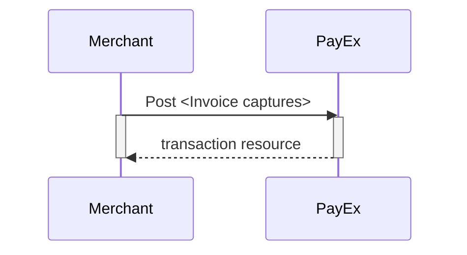

## Capture

The final step in the integration process for Invoice [Redirect][redirect],
[Seamless View][seamless-view] and [Direct][direct] is to complete a Capture.

An invoice capture will generate the invoice and distribute it to the consumer.
This differs from i.e. Card Payments, where a capture operation will fully or
partially charge the consumer's authorized amount.

## Step 1: Create `FinancingConsumer` Capture

To capture a `FinancingConsumer` invoice payment, perform the `create-capture`
operation with the following request body:

```http
POST /psp/invoice/payments/{{ page.payment_id }}/captures HTTP/1.1
Host: {{ page.api_host }}
Authorization: Bearer <AccessToken>
Content-Type: application/json

{
    "transaction": {
        "activity": "FinancingConsumer",
        "amount": 13500,
        "vatAmount": 2500,
        "payeeReference": "customer reference-unique",
        "receiptReference": "3245766",
        "description": "description for transaction",
        "itemDescriptions": [
          {
            "amount": 12500,
            "description": "item description 1"
          },
          {
            "amount": 1000,
            "description": "item description 2"
          }
        ],
        "vatSummary": [
          {
            "amount": 12500,
            "vatPercent": 2500,
            "vatAmount": 2500
          },
          {
            "amount": 1000,
            "vatPercent": 0,
            "vatAmount": 0
          }
        ]
  }
}
```

{:.table .table-striped}
| Required | Parameter name                 | Datatype     | Value (with description)                                                                                                                                                                                                                                                   |
| :------: | :----------------------------- | :----------- | :------------------------------------------------------------------------------------------------------------------------------------------------------------------------------------------------------------------------------------------------------------------------- |
|    ✔︎    | `transaction.activity`         | `string`     | FinancingConsumer.                                                                                                                                                                                                                                                         |
|    ✔︎    | `transaction.Amount`           | `integer`    | Amount entered in the lowest momentary units of the selected currency. E.g. `10000` = `100.00 SEK`, `5000` = `50.00 SEK`.                                                                                                                                                  |
|    ✔︎    | `transaction.vatAmount`        | `integer`    | Amount entered in the lowest momentary units of the selected currency. E.g. `10000` = `100.00 SEK`, `5000` = `50.00 SEK`.                                                                                                                                                  |
|    ✔︎    | `transaction.payeeReference`   | `string(50)` | The `payeeReference` is the receipt/invoice number if `receiptReference` is not defined, which is a **unique** reference with max 50 characters set by the merchant system. This must be unique for each operation and must follow the regex pattern `[\w]* (a-zA-Z0-9_)`. |
|          | `transaction.receiptReference` | `string(50)` | The `receiptReference` is a reference from the merchant system. If sent in, this reference is used as an invoice/receipt number.                                                                                                                                           |
|    ✔︎    | `transaction.description`      | `string`     | A textual description of the capture                                                                                                                                                                                                                                       |
|    ✔︎    | `itemDescriptions.amount`      | `integer`    | Total price for this order line - entered in the lowest momentary units of the selected currency. E.g. `10000` = `100.00 SEK`, `5000` = `50.00 SEK`.                                                                                                                       |
|    ✔︎    | `itemDescriptions.description` | `string`     | A textual description of this product                                                                                                                                                                                                                                      |
|    ✔︎    | `vatSummary.amount`            | `integer`    | Total price for this order line - entered in the lowest momentary units of the selected currency. E.g. `10000` = `100.00 SEK`, `5000` = `50.00 SEK`.                                                                                                                       |
|    ✔︎    | `vatSummary.vatAmount`         | `integer`    | VAT Amount entered in the lowest momentary units of the selected currency. E.g. `10000` = `100.00 SEK`, `5000` =`50.00 SEK`.                                                                                                                                               |
|    ✔︎    | `vatSummary.vatPercent`        | `string`     | The VAT in percent. Supported values : "0.00", "6.00", "8.00", "10.00", "12.00", "14.00", "15.00", "22.00", "24.00", "25.00"                                                                                                                                               |

Notes on `FinancingConsumer` captures:

* The due date is set by PayEx based on the agreement with merchant. Standard
  due date is 14 days.
* The invoice number is set by PayEx.



## Step 2: Inspecting the Captures

The `captures` resource lists the capture transactions performed on a
specific invoice payment.

{:.code-header}
**Request**

```http
GET /psp/invoice/payments/{{ page.payment_id }}/captures HTTP/1.1
Host: {{ page.api_host }}
Authorization: Bearer <AccessToken>
Content-Type: application/json
```

{:.code-header}
**Response**

```http
HTTP/1.1 200 OK
Content-Type: application/json

{
    "payment": "/psp/invoice/payments/{{ page.payment_id }}",
    "captures": [{
        "itemDescriptions": {
            "id": "/psp/invoice/payments/{{ page.payment_id }}/transactions/{{ page.payment_id }}/itemdescriptions"
        },
        "invoiceCopy": "/psp/invoice/payments/{{ page.payment_id }}/captures/{{ page.payment_id }}/invoicecopy",
        "transaction": {
            "id": "/psp/invoice/payments/{{ page.payment_id }}/transactions/{{ page.payment_id }}",
            "created": "2016-09-14T01:01:01.01Z",
            "updated": "2016-09-14T01:01:01.03Z",
            "type": "Capture",
            "state": "Failed",
            "number": 1234567890,
            "amount": 1000,
            "vatAmount": 250,
            "description": "Test transaction",
            "payeeReference": "AH123456",
            "failedReason": "",
            "isOperational": false,
            "operations": []
        }
    }]
}
```

## Capture Flow

A `capture` can only be performed on a successfully authorized transaction.
It is possible to do a partial `capture` where you only capture a part of the
authorized amount. You can do other captures on the same payment later, up to
the total authorized amount.



[direct]: /payments/invoice/direct
[card-payments-capture]: /payments/card-payments/capture
[redirect]: /payments/invoice/redirect
[seamless-view]: /payments/invoice/seamless-view


