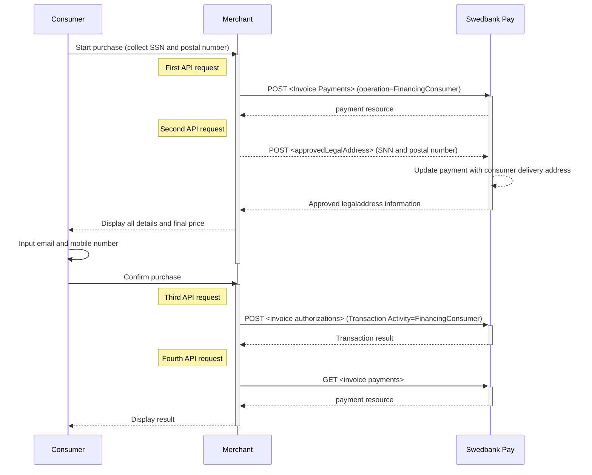
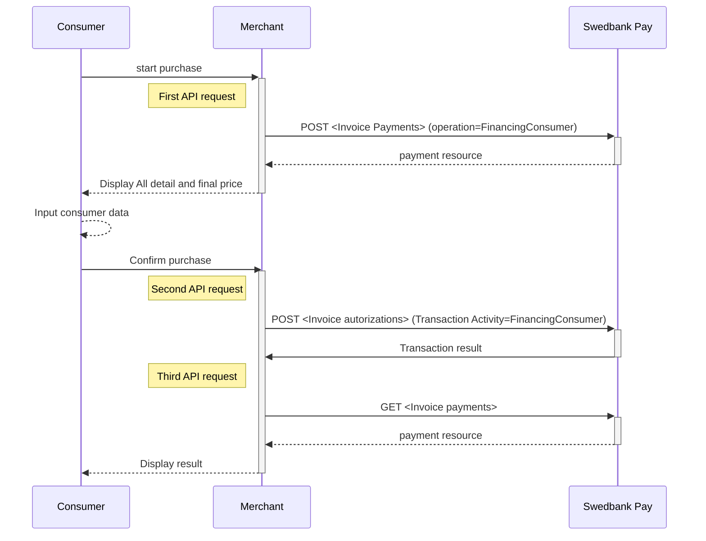



## Introduction

* To create an invoice payment, you need to collect all purchase information
  and make a `POST` request towards Swedbank Pay.
* You also need to collect social security number (SSN) / person number and
  postal number from the consumer, and make another `POST` request towards
  PayEx in order to retrieve the name and address from the consumer.
* To create the authorization transaction, you need to calculate the final
  price / amount, and make a third `POST` request where you send in
  the consumer data.
* To get the authorization result, you need  to follow up with a `GET`
  request using the `paymentID` received in the first step.
* Finally, when you are ready to ship your order, you will have to make
  a `POST` request to make a Capture. **At this point Swedbank Pay will generate
  the invoice to the consumer.**

## Options before posting a payment

All valid options when posting a payment with operation equal to
`FinancingConsumer`, are described in
[other features][other-features-financing-consumer].

{:.table .table-striped}
| | **Sweden** ![Swedish flag][se-png]| **Norway** ![Norwegian flag][no-png] | **Finland** ![Finish flag][fi-png] |
| `operation` | `FinancingConsumer` | `FinancingConsumer` | `FinancingConsumer` |
| `intent` | `Authorization` | `Authorization` | `Authorization` |
| `currency` | SEK | NOK | EUR |
|`invoiceType` | `PayExFinancingSE` | `PayExFinancingNO` | `PayExFinancingFI` |

* An invoice payment is always two-phased based - you create an Authorize
  transaction, that is followed by a `Capture` or `Cancel` request.
* **Defining CallbackURL**: When implementing a scenario, it is optional to
  set a [CallbackURL][callback-api] in the `POST` request. If `callbackURL`
  is set Swedbank Pay will send a postback request to this URL when the consumer
  has fulfilled the payment.

.

The `Capture` , `Cancel`, `Reversal` opions are
described in [optional features][optional-features].
The links will take you directly to the API description for the specific request.

The sequence diagram below shows a high level description of the invoice
process, including the four requests you have to send to Swedbank Pay to create
an authorize transaction for Sweden (SE) and Norway (NO). Note that for Finland
(FI) the process is different as the Merchant needs to send a `POST` request
with the `approvedLegalAddress` (SNN and postal number).

## Invoice flow (SE and NO)

## Invoice Flow (FI)

[capture]: /payments/credit-card/after-payment#Capture
[fi-png]: /assets/img/fi.png
[financing-invoice-1-png]: /assets/img/checkout/test-purchase.png
[financing-invoice-2-png]: /assets/screenshots/invoice/redirect-view/iframe-verify-data.png
[no-png]: /assets/img/no.png
[se-png]: /assets/img/se.png
[callback-api]: /payments/invoice/other-features#callback
[hosted-view]: /payments/#hosted-view-implementation
[optional-features]: /payments/invoice/optional-features
[redirect]: /payments/invoice/redirect
[setup-mail]: mailto:setup.ecom@PayEx.com
