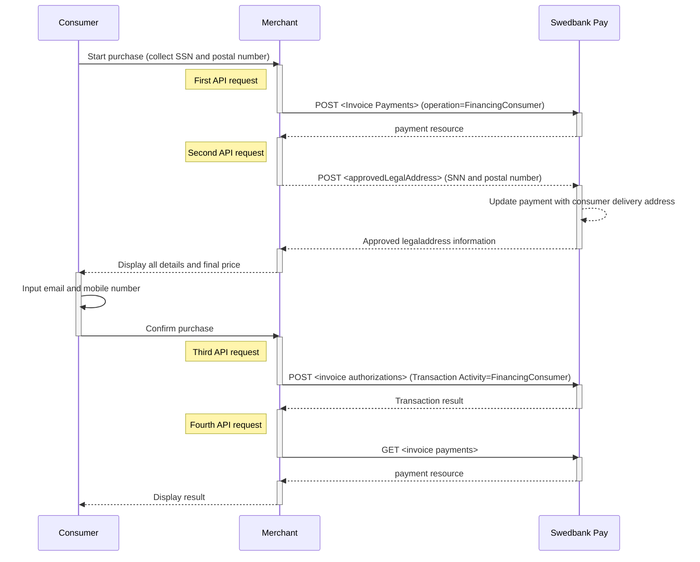





## Introduction

1. Collect all purchase information and send it in a `POST` request to Swedbank
   Pay.
1. Include personal information (SSN and postal code) and send it to Swedbank
   Pay.
1. Make a new `POST` request towards Swedbank Pay to retrieve the name and
   address of the customer.
1. Create an authorization transaction by calculating the final price / amount.
1. Make a third `POST` request with consumer data as input.
1. Send a  `GET` request with the `paymentID` to get the authorization result
1. Make a Capture by creating a `POST` request

  **By making a Capture, Swedbank Pay will generate
  the invoice to the consumer and the order is ready for shipping.**

## Options before posting a payment

All valid options when posting a payment with operation equal to
`FinancingConsumer`, are described in
[other features][financing-consumer].

{:.table .table-striped}
|               | Norway ![Norwegian flag][no-png] | Finland ![Finish flag][fi-png] | Sweden ![Swedish flag][se-png] |
| :------------ | :------------------------------- | :----------------------------- | :----------------------------- |
| `operation`   | `FinancingConsumer`              | `FinancingConsumer`            | `FinancingConsumer`            |
| `currency`    | `NOK`                            | `EUR`                          | `SEK`                          |
| `invoiceType` | `PayExFinancingNO`               | `PayExFinancingFI`             | `PayExFinancingSE`             |

* An invoice payment is always two-phased based - you create an Authorize
  transaction, that is followed by a `Capture` or `Cancel` request.
* **Defining CallbackURL**: When implementing a scenario, it is optional to
  set a [CallbackURL][callback] in the `POST` request. If `callbackURL`
  is set Swedbank Pay will send a postback request to this URL when the consumer
  has fulfilled the payment.

.

The `Capture` , `Cancel`, `Reversal` opions are
described in [other features][other-features].
The links will take you directly to the API description for the specific request.

The sequence diagram below shows a high level description of the invoice
process, including the four requests you have to send to Swedbank Pay to create
an authorize transaction for Sweden (SE) and Norway (NO). Note that for Finland
(FI) the process is different as the Merchant needs to send a `POST` request
with the `approvedLegalAddress` (SNN and postal number).

## Invoice flow (SE and NO)



## Invoice Flow (FI)


## API Requests

The API requests are displayed in the [purchase flow](#purchase-flow).
You can complete the invoice payment with following `operation`
options:

* [Financing Consumer][financing-consumer]
* [Recur][recur]
* [Verify][verify]

Our `payment` example below uses the [`FinancingConsumer`][financing-consumer] value.

### Financing Consumer

{:.code-header}
**Request**

```http
HTTP/1.1 200 OK
Content-Type: application/json

{
    "payment": {
        "operation": "FinancingConsumer",
        "intent": "Authorization",
        "currency": "SEK",
        "prices": [
            {
                "type": "Invoice",
                "amount": 1500,
                "vatAmount": 0
            }
        ],
        "description": "Test Purchase",
        "payerReference": "SomeReference",
        "userAgent": "Mozilla/5.0...",
        "language": "sv-SE",
        "urls": {
            "completeUrl": "http://example.com/payment-completed",
            "cancelUrl": "http://example.com/payment-canceled",
            "callbackUrl": "http://example.com/payment-callback",
            "logoUrl": "http://example.com/logo.png",
            "termsOfServiceUrl": "http://example.com/terms.pdf"
        },
        "payeeInfo": {
            "payeeId": "{{ page.merchantId }}",
            "payeeReference": "PR123",
            "payeeName": "Merchant1",
            "productCategory": "PC1234",
            "subsite": "MySubsite"
        },
        "billingAddress": {
            "firstName": "Leia",
            "lastName": "Ahlstrom",
            "email": "leia.ahlstrom@swedbankpay.com",
            "msisdn": "+46739000001",
            "streetAddress": "Helgestavägen 9",
            "city": "Bro",
            "zipCode": "19792",
            "countryCode": "SE"
        }
    },
    "invoice": {
        "invoiceType": "PayExFinancingSe"
    }
}
```

{:.table .table-striped}
| Required | Property                              | Type          | Description                                                                                                                                                                                                                                                                                                                                                                                                                                                                                                                                    |
| :------: | :------------------------------------ | :------------ | :--------------------------------------------------------------------------------------------------------------------------------------------------------------------------------------------------------------------------------------------------------------------------------------------------------------------------------------------------------------------------------------------------------------------------------------------------------------------------------------------------------------------------------------------- |
|  ✔︎︎︎︎︎  | `payment`                             | `object`      | The `payment` object contains information about the specific payment.                                                                                                                                                                                                                                                                                                                                                                                                                                                                          |
|  ✔︎︎︎︎︎  | └➔&nbsp;`operation`                   | `string`      | The operation that the `payment` is supposed to perform. The [`FinancingConsumer`][financing-consumer] operation is used in our example. Take a look at the Other Features section for a full examples of the following `operation` options: [FinancingConsumer][financing-consumer], [Recur][recur], [Verify][verify]                                                                                                                                                                                                                         |
|  ✔︎︎︎︎︎  | └➔&nbsp;`intent`                      | `string`      | `Authorization` is the only intent option for invoice. Reserves the amount, and is followed by a [cancellation][cancel] or [capture][capture] of funds.                                                                                                                                                                                                                                                                                                                                                                                        |
|  ✔︎︎︎︎︎  | └➔&nbsp;`currency`                    | `string`      | NOK, SEK, DKK, USD or EUR.                                                                                                                                                                                                                                                                                                                                                                                                                                                                                                                     |
|  ✔︎︎︎︎︎  | └➔&nbsp;`prices`                      | `object`      | The `prices` resource lists the prices related to a specific payment.                                                                                                                                                                                                                                                                                                                                                                                                                                                                          |
|  ✔︎︎︎︎︎  | └─➔&nbsp;`type`                       | `string`      | Use the `Invoice` type here                                                                                                                                                                                                                                                                                                                                                                                                                                                                                                                    |
|  ✔︎︎︎︎︎  | └─➔&nbsp;`amount`                     | `integer`     | Amount is entered in the lowest momentary units of the selected currency. E.g. 10000 = 100.00 SEK 5000 = 50.00 SEK.                                                                                                                                                                                                                                                                                                                                                                                                                            |
|  ✔︎︎︎︎︎  | └─➔&nbsp;`vatAmount`                  | `integer`     | If the amount given includes VAT, this may be displayed for the user in the payment page (redirect only). Set to 0 (zero) if this is not relevant.                                                                                                                                                                                                                                                                                                                                                                                             |
|  ✔︎︎︎︎︎  | └➔&nbsp;`description`                 | `string(40)`  | A textual description max 40 characters of the purchase.                                                                                                                                                                                                                                                                                                                                                                                                                                                                                       |
|          | └➔&nbsp;`payerReference`              | `string`      | The reference to the payer (consumer/end user) from the merchant system. E.g mobile number, customer number etc.                                                                                                                                                                                                                                                                                                                                                                                                                               |
|          | └➔&nbsp;`generatePaymentToken`        | `boolean`     | `true` or `false`. Set this to `true` if you want to create a paymentToken for future use as One Click.                                                                                                                                                                                                                                                                                                                                                                                                                                        |
|          | └➔&nbsp;`generateRecurrenceToken`     | `boolean`     | `true` or `false`. Set this to `true` if you want to create a recurrenceToken for future use Recurring purchases (subscription payments).                                                                                                                                                                                                                                                                                                                                                                                                      |
|  ✔︎︎︎︎︎  | └➔&nbsp;`userAgent`                   | `string`      | The user agent reference of the consumer's browser - [see user agent definition][user-agent-definition]                                                                                                                                                                                                                                                                                                                                                                                                                                        |
|  ✔︎︎︎︎︎  | └➔&nbsp;`language`                    | `string`      | nb-NO, sv-SE or en-US.                                                                                                                                                                                                                                                                                                                                                                                                                                                                                                                         |
|  ✔︎︎︎︎︎  | └➔&nbsp;`urls`                        | `object`      | The `urls` resource lists urls that redirects users to relevant sites.                                                                                                                                                                                                                                                                                                                                                                                                                                                                         |
|          | └─➔&nbsp;`hostUrl`                    | `array`       | The array of URLs valid for embedding of Swedbank Pay Hosted Views. If not supplied, view-operation will not be available.                                                                                                                                                                                                                                                                                                                                                                                                                     |
|  ✔︎︎︎︎︎  | └─➔&nbsp;`completeUrl`                | `string`      | The URL that Swedbank Pay will redirect back to when the payer has completed his or her interactions with the payment. This does not indicate a successful payment, only that it has reached a final (complete) state. A `GET` request needs to be performed on the payment to inspect it further.                                                                                                                                                                                                                                             |
|          | └─➔&nbsp;`cancelUrl`                  | `string`      | The URI to redirect the payer to if the payment is canceled. Only used in redirect scenarios. Can not be used simultaneously with `paymentUrl`; only `cancelUrl` or `paymentUrl` can be used, not both.                                                                                                                                                                                                                                                                                                                                        |
|          | └─➔&nbsp;`paymentUrl`                 | `string`      | The URI that Swedbank Pay will redirect back to when the view-operation needs to be loaded, to inspect and act on the current status of the payment. Only used in Seamless Views. If both `cancelUrl` and `paymentUrl` is sent, the `paymentUrl` will used.                                                                                                                                                                                                                                                                                    |
|          | └─➔&nbsp;`callbackUrl`                | `string`      | The URL that Swedbank Pay will perform an HTTP `POST` against every time a transaction is created on the payment. See [callback][callback] for details.                                                                                                                                                                                                                                                                                                                                                                                        |
|          | └─➔&nbsp;`logoUrl`                    | `string`      | The URL that will be used for showing the customer logo. Must be a picture with maximum 50px height and 400px width. Require https.                                                                                                                                                                                                                                                                                                                                                                                                            |
|          | └─➔&nbsp;`termsOfServiceUrl`          | `string`      | A URL that contains your terms and conditions for the payment, to be linked on the payment page. Require https.                                                                                                                                                                                                                                                                                                                                                                                                                                |
|  ✔︎︎︎︎︎  | └➔&nbsp;`payeenfo`                    | `object`      | The `payeeInfo` contains information about the payee.                                                                                                                                                                                                                                                                                                                                                                                                                                                                                          |
|  ✔︎︎︎︎︎  | └─➔&nbsp;`payeeId`                    | `string`      | This is the unique id that identifies this payee (like merchant) set by Swedbank Pay.                                                                                                                                                                                                                                                                                                                                                                                                                                                          |
|  ✔︎︎︎︎︎  | └─➔&nbsp;`payeeReference`             | `string(30*)` | A unique reference from the merchant system. It is set per operation to ensure an exactly-once delivery of a transactional operation. See [payeeReference][payee-reference] for details.                                                                                                                                                                                                                                                                                                                                                       |
|          | └─➔&nbsp;`payeeName`                  | `string`      | The payee name (like merchant name) that will be displayed to consumer when redirected to Swedbank Pay.                                                                                                                                                                                                                                                                                                                                                                                                                                        |
|          | └─➔&nbsp;`productCategory`            | `string`      | A product category or number sent in from the payee/merchant. This is not validated by Swedbank Pay, but will be passed through the payment process and may be used in the settlement process.                                                                                                                                                                                                                                                                                                                                                 |
|          | └─➔&nbsp;`orderReference`             | `String(50)`  | The order reference should reflect the order reference found in the merchant's systems.                                                                                                                                                                                                                                                                                                                                                                                                                                                        |
|          | └─➔&nbsp;`subsite`                    | `String(40)`  | The subsite field can be used to perform split settlement on the payment. The subsites must be resolved with Swedbank Pay reconciliation before being used.                                                                                                                                                                                                                                                                                                                                                                                    |
|          | └─➔&nbsp;`deliveryTimeFrameIndicator` | `string`      | Indicates the merchandise delivery timeframe. <br>`01` (Electronic Delivery) <br>`02` (Same day shipping) <br>`03` (Overnight shipping) <br>`04` (Two-day or more shipping)                                                                                                                                                                                                                                                                                                                                                                    |
|          | └─➔&nbsp;`preOrderDate`               | `string`      | For a pre-ordered purchase. The expected date that the merchandise will be available. Format: `YYYYMMDD`                                                                                                                                                                                                                                                                                                                                                                                                                                       |
|          | └─➔&nbsp;`preOrderPurchaseIndicator`  | `string`      | Indicates whether the payer is placing an order for merchandise with a future availability or release date. <br>`01` (Merchandise available) <br>`02` (Future availability)                                                                                                                                                                                                                                                                                                                                                                    |
|          | └─➔&nbsp;`shipIndicator`              | `string`      | Indicates shipping method chosen for the transaction. <br>`01` (Ship to the billing address) <br>`02` (Ship to another verified address on file with merchant)<br>`03` (Ship to address that is different than the billing address)<br>`04` (Ship to Store / Pick-up at local store. Store address shall be populated in shipping address fields)<br>`05` (Digital goods, includes online services, electronic giftcards and redemption codes) <br>`06` (Travel and Event tickets, not shipped) <br>`07` (Other, e.g. gaming, digital service) |
|          | └─➔&nbsp;`giftCardPurchase`           | `bool`        | `true` if this is a purchase of a gift card.                                                                                                                                                                                                                                                                                                                                                                                                                                                                                                   |
|          | └─➔&nbsp;`reOrderPurchaseIndicator`   | `string`      | Indicates whether the payer is placing an order for merchandise with a future availability or release date. <br>`01` (Merchandise available) <br>`02` (Future availability)                                                                                                                                                                                                                                                                                                                                                                    |
|          | └➔&nbsp;`pickUpAddress`               | `object`      | If `shipIndicator` set to `04`, then prefill this with the payers `pickUpAddress` of the purchase to decrease the risk factor of the purchase.                                                                                                                                                                                                                                                                                                                                                                                                 |
|          | └─➔&nbsp;`name`                       | `string`      | If `shipIndicator` set to `04`, then prefill this with the payers `name` of the purchase to decrease the risk factor of the purchase.                                                                                                                                                                                                                                                                                                                                                                                                          |
|          | └─➔&nbsp;`streetAddress`              | `string`      | If `shipIndicator` set to `04`, then prefill this with the payers `streetAddress` of the purchase to decrease the risk factor of the purchase.                                                                                                                                                                                                                                                                                                                                                                                                 |
|          | └─➔&nbsp;`coAddress`                  | `string`      | If `shipIndicator` set to `04`, then prefill this with the payers `coAddress` of the purchase to decrease the risk factor of the purchase.                                                                                                                                                                                                                                                                                                                                                                                                     |
|          | └─➔&nbsp;`city`                       | `string`      | If `shipIndicator` set to `04`, then prefill this with the payers `city` of the purchase to decrease the risk factor of the purchase.                                                                                                                                                                                                                                                                                                                                                                                                          |
|          | └─➔&nbsp;`zipCode`                    | `string`      | If `shipIndicator` set to `04`, then prefill this with the payers `zipCode` of the purchase to decrease the risk factor of the purchase.                                                                                                                                                                                                                                                                                                                                                                                                       |
|          | └─➔&nbsp;`countryCode`                | `string`      | If `shipIndicator` set to `04`, then prefill this with the payers `countryCode` of the purchase to decrease the risk factor of the purchase.                                                                                                                                                                                                                                                                                                                                                                                                   |

{:.code-header}
**Response**

```http
HTTP/1.1 200 OK
Content-Type: application/json

{
    "payment": {
        "id": "/psp/invoice/payments/{{ page.paymentId }}",
        "number": 1234567890,
        "instrument": "Invoice",
        "created": "YYYY-MM-DDThh:mm:ssZ",
        "updated": "YYYY-MM-DDThh:mm:ssZ",
        "state": "Ready",
        "operation": "FinancingConsumer",
        "intent": "Authorization",
        "currency": "SEK",
        "amount": 1500,
        "remainingCaptureAmount": 1000,
        "remainingCancellationAmount": 1000,
        "remainingReversalAmount": 500,
        "description": "Test Purchase",
        "userAgent": "Mozilla/5.0...",
        "language": "sv-SE",
        "prices": {
            "id": "/psp/invoice/payments/{{ page.paymentId }}/prices"
        },
        "transactions": {
            "id": "/psp/invoice/payments/{{ page.paymentId }}/transactions"
        },
        "authorizations": {
            "id": "/psp/invoice/payments/{{ page.paymentId }}/authorizations"
        },
        "captures": {
            "id": "/psp/invoice/payments/{{ page.paymentId }}/captures"
        },
        "reversals": {
            "id": "/psp/invoice/payments/{{ page.paymentId }}/reversals"
        },
        "cancellations": {
            "id": "/psp/invoice/payments/{{ page.paymentId }}/cancellations"
        },
        "payeeInfo": {
            "id": "/psp/invoice/payments/{{ page.paymentId }}/payeeInfo"
        },
        "urls": {
            "id": "/psp/invoice/payments/{{ page.paymentId }}/urls"
        },
        "settings": {
            "id": "/psp/invoice/payments/{{ page.paymentId }}/settings"
        },
        "approvedLegalAddress": {
            "id": "/psp/invoice/payments/{{ page.paymentId }}/approvedlegaladdress"
        },
        "maskedApprovedLegalAddress": {
            "id": "/psp/invoice/payments/{{ page.paymentId }}/maskedapprovedlegaladdress"
        }
    },
    "operations": [
        {
            "href": "{{ page.apiUrl }}/psp/invoice/payments/{{ page.paymentId }}",
            "rel": "update-payment-abort",
            "method": "PATCH"
        },
        {
            "href": "{{ page.apiUrl }}/psp/invoice/payments/{{ page.paymentId }}/authorizations",
            "rel": "create-authorize",
            "method": "POST"
        },
        {
            "href": "{{ page.apiUrl }}/psp/invoice/payments/{{ page.paymentId }}/approvedlegaladdress",
            "rel": "create-approved-legal-address",
            "method": "POST"
        }
    ]
}
```

## Payment Resource

The `payment` resource is central to all payment instruments. All operations
that target the payment resource directly produce a response similar to the
example seen below. The response given contains all operations that are
possible to perform in the current state of the payment.

{:.code-header}
**Request**

```http
GET /psp/invoice/payments/{{ page.paymentId }}/ HTTP/1.1
Host: {{ page.apiHost }}
Authorization: Bearer <AccessToken>
Content-Type: application/json
```

{:.code-header}
**Response**

```http
HTTP/1.1 200 OK
Content-Type: application/json

{
    "payment": {
        "id": "/psp/invoice/payments/{{ page.paymentId }}",
        "number": 1234567890,
        "created": "2016-09-14T13:21:29.3182115Z",
        "updated": "2016-09-14T13:21:57.6627579Z",
        "state": "Ready",
        "operation": "Purchase",
        "intent": "Authorization",
        "currency": "SE",
        "amount": 1500,
        "remainingCaptureAmount": 1500,
        "remainingCancellationAmount": 1500,
        "remainingReversalAmount": 0,
        "description": "Test Purchase",
        "payerReference": "AB1234",
        "initiatingSystemUserAgent": "PostmanRuntime/3.0.1",
        "userAgent": "Mozilla/5.0...",
        "language": "sv-SE",
        "prices": {
            "id": "/psp/invoice/payments/{{ page.paymentId }}/prices"
        },
        "transactions": {
            "id": "/psp/invoice/payments/{{ page.paymentId }}/transactions"
        },
        "authorizations": {
            "id": "/psp/invoice/payments/{{ page.paymentId }}/authorizations"
        },
        "captures": {
            "id": "/psp/invoice/payments/{{ page.paymentId }}/captures"
        },
        "reversals": {
            "id": "/psp/invoice/payments/{{ page.paymentId }}/reversals"
        },
        "cancellations": {
            "id": "/psp/invoice/payments/{{ page.paymentId }}/cancellations"
        },
        "payeeInfo": {
            "id": "/psp/invoice/payments/{{ page.paymentId }}/payeeInfo"
        },
        "urls": {
            "id": "/psp/invoice/payments/{{ page.paymentId }}/urls"
        },
        "settings": {
            "id": "/psp/invoice/payments/{{ page.paymentId }}/settings"
        },
        "approvedLegalAddress": {
            "id": "/psp/invoice/payments/{{ page.paymentId }}/approvedlegaladdress"
        },
        "maskedApprovedLegalAddress": {
            "id": "/psp/invoice/payments/{{ page.paymentId }}/maskedapprovedlegaladdress"
        }
    },
    "approvedLegalAddress": {
        "id": "/psp/invoice/payments/{{ page.paymentId }}/approvedlegaladdress"
    },
    "operations": [
        {
            "href": "{{ page.apiUrl }}/psp/invoice/payments/{{ page.paymentId }}/captures",
            "rel": "create-capture",
            "method": "POST"
        },
        {
            "href": "{{ page.apiUrl }}/psp/invoice/payments/{{ page.paymentId }}/cancellations",
            "rel": "create-cancel",
            "method": "POST"
        },
        {
            "href": "{{ page.apiUrl }}/psp/invoice/payments/{{ page.paymentId }}/approvedlegaladdress",
            "rel": "create-approved-legal-address",
            "method": "POST"
        }
    ]
}
```

If a `GET` method is used from `paymentUI` with a `paymentToken`, the following
operations can be returned, depending on state of the payment and the last
transaction.

```http
HTTP/1.1 200 OK
Content-Type: application/json

{
    "href": "https://example.com/cancelUrl",
    "rel": "redirect-merchant-cancel",
    "method": "GET"
}
{
    "href": "https://example.com/completeUrl",
    "rel": "redirect-merchant-complete",
    "method": "GET"
}
{
    "href": "https://example.com/cancelUrl",
    "rel": "redirect-merchant-cancel",
    "method": "GET"
}
{
    "href": "https://example.com/completeUrl",
    "rel": "redirect-merchant-complete",
    "method": "GET"
}


```

{:.table .table-striped}
| Property                 | Type         | Description                                                                                                                                                                                      |
| :----------------------- | :----------- | :----------------------------------------------------------------------------------------------------------------------------------------------------------------------------------------------- |
| `payment`                | `object`     | The `payment` object contains information about the specific payment.                                                                                                                            |
| └➔&nbsp;`id`             | `string`     | The relative URI of the payment.                                                                                                                                                                 |
| └➔&nbsp;`number`         | `integer`    | The payment  number , useful when there's need to reference the payment in human communication. Not usable for programmatic identification of the payment, for that  id  should be used instead. |
| └➔&nbsp;`created`        | `string`     | The ISO-8601 date of when the payment was created.                                                                                                                                               |
| └➔&nbsp;`updated`        | `string`     | The ISO-8601 date of when the payment was updated.                                                                                                                                               |
| └➔&nbsp;`state`          | `string`     | Ready ,  Pending ,  Failed  or  Aborted . Indicates the state of the payment. This field is only for status display purposes. To                                                                 |
| └➔&nbsp;`prices`         | `object`     | The `prices` resource lists the prices related to a specific payment.                                                                                                                            |
| └➔&nbsp;`prices.id`      | `string`     | The relative URI of the current prices resource.                                                                                                                                                 |
| └➔&nbsp;`description`    | `string(40)` | A textual description of maximum 40 characters of the purchase.                                                                                                                                  |
| └➔&nbsp;`payerReference` | `string`     | The reference to the payer (consumer/end-user) from the merchant system, like e-mail address, mobile number, customer number etc.                                                                |
| └➔&nbsp;`userAgent`      | `string`     | The [user agent][user-agent-definition] string of the consumer's browser.                                                                                                                        |
| └➔&nbsp;`language`       | `string`     | `nb-NO` , `sv-SE`  or  `en-US`                                                                                                                                                                   |
| └➔&nbsp;`urls`           | `string`     | The URI to the  urls  resource where all URIs related to the payment can be retrieved.                                                                                                           |
| └➔&nbsp;`payeeInfo`      | `string`     | The URI to the  payeeinfo  resource where the information about the payee of the payment can be retrieved.                                                                                       |
| `operations`             | `array`      | The array of possible operations to perform                                                                                                                                                      |
| └─➔&nbsp;`method`        | `string`     | The HTTP method to use when performing the operation.                                                                                                                                            |
| └─➔&nbsp;`href`          | `string`     | The target URI to perform the operation against.                                                                                                                                                 |
| └─➔&nbsp;`rel`           | `string`     | The name of the relation the operation has to the current resource.                                                                                                                              |

### Operations

The operations should be performed as described in each response and not as
described here in the documentation.
Always use the `href` and `method` as specified in the response by finding
the appropriate operation based on its `rel` value.
The only thing that should be hard coded in the client is the value of
the `rel` and the request that will be sent in the HTTP body of the request
for the given operation.

{:.table .table-striped}
| Operation                | Description                                                                                                               |
| :----------------------- | :------------------------------------------------------------------------------------------------------------------------ |
| `update-payment-abort`   | [Aborts][abort] the payment order before any financial transactions are performed.                                        |
| `redirect-authorization` | Contains the URI that is used to redirect the consumer to the Swedbank Pay Payments containing the card authorization UI. |
| `view-authorization`     | Contains the JavaScript `href` that is used to embed  the card authorization UI directly on the webshop/merchant site     |
| `create-capture`         | Creates a `capture` transaction in order to charge the reserved funds from the consumer.                                  |
| `create-cancellation`    | Creates a `cancellation` transaction that cancels a created, but not yet captured payment.                                |



[abort]: /payments/invoice/other-features#abort
[callback]: /payments/invoice/other-features#callback
[cancel]: /payments/invoice/after-payment#cancellations
[capture]: /payments/invoice/after-payment#capture
[fi-png]: /assets/img/fi.png
[financing-consumer]: /payments/invoice/other-features#financing-consumer
[financing-invoice-1-png]: /assets/img/checkout/test-purchase.png
[financing-invoice-2-png]: /assets/screenshots/invoice/redirect-view/iframe-verify-data.png
[no-png]: /assets/img/no.png
[other-features]: /payments/invoice/other-features
[payee-reference]: /payments/invoice/other-features#payee-info
[recur]: /payments/invoice/other-features#recur
[redirect]: /payments/invoice/redirect
[se-png]: /assets/img/se.png
[setup-mail]: mailto:setup.ecom@PayEx.com
[user-agent-definition]: https://en.wikipedia.org/wiki/User_agent
[verify]: /payments/invoice/other-features#verify
