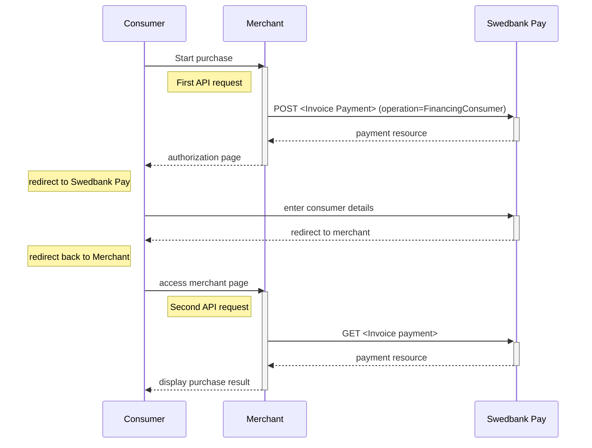











### Important steps before you launch Swedbank Pay Faktura at your website

Prior to launching Swedbank Pay Faktura at your site, make sure that you
have done the following:  

1. Sent a merchant logo in .JPG format to [setup.ecom@payex.com][setup-mail].
    The logo will be displayed on all your invoices. Minimum accepted size is
    600x200 pixels, and at least 300 DPI.
2. Included a link to "Terms and Conditions" for Swedbank Pay Faktura.

## API Requests

The API requests are displayed in the [purchase flow](#purchase-flow).
You can create an invoice payment with the following `operation`
options:

* [Financing Consumer][other-features-financing-consumer]
* [Recur][recur]
* [Verify][verify]

Our `payment` example uses the [`FinancingConsumer`]
[other-features-financing-consumer] value.

## Invoice flow

The sequence diagram below shows the two requests you have to send to Swedbank
Pay to make a purchase.
The diagram also shows in high level,
the sequence of the process of a complete purchase.

[after-payment]: /payments/invoice/after-payment
[no-png]: /assets/img/no.png
[se-png]: /assets/img/se.png
[fi-png]: /assets/img/fi.png
[callback]: /payments/invoice/other-features#callback
[cancel]: /payments/invoice/after-payment#cancellations
[capture]: /payments/invoice/after-payment#captures
[other-features-financing-consumer]:/payments/invoice/other-features#create-authorization-transaction
[payout]: /payments/card/other-features/#payout
[purchase]: /payments/card/other-features/#purchase
[verify]: /payments/card/other-features/#verify
[recur]: /payments/card/other-features/#recur
[user-agent-def]: https://en.wikipedia.org/wiki/User_agent
[payee-reference]: /payments/invoice/other-features#payee-info
