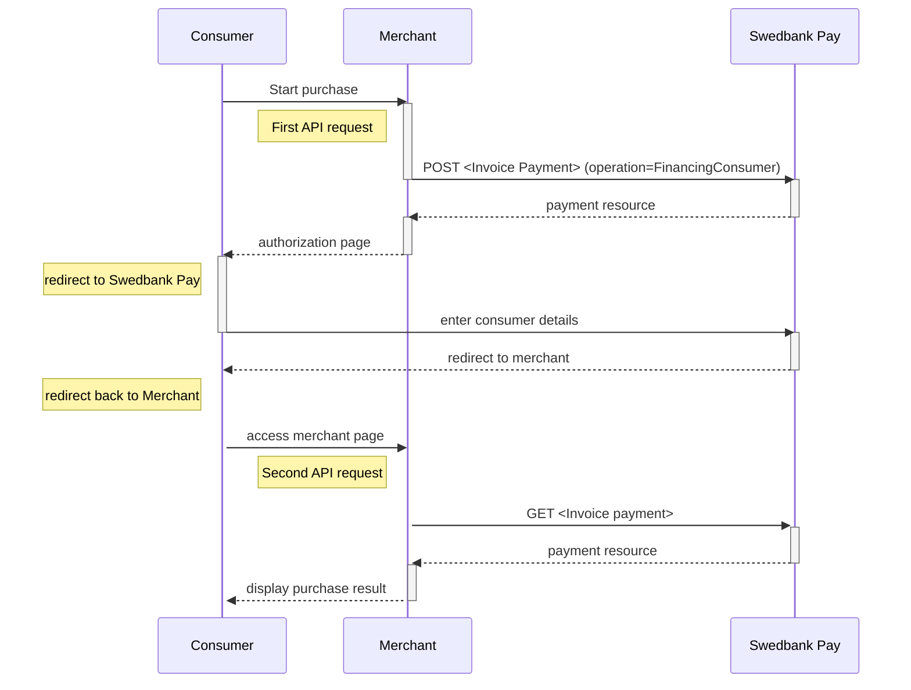









### Important steps before you launch Swedbank Pay Invoice Payments at your website

Prior to launching Swedbank Pay Invoice Payments at your site, make sure that
you have done the following:  

1. Sent a merchant logo in .JPG format to the [Swedish
   setup][setup-mail-sweden], [Norwegian setup][setup-mail-norway] or [Finnish
   setup][setup-mail-finland], depending on your country. The logo will be
   displayed on all your invoices. Minimum accepted size is 600x200 pixels, and
   at least 300 DPI.
2. Included a link to "Terms and Conditions" for Invoice.

## API Requests

The API requests are displayed in the purchase flow below.
You can create an invoice payment with the following `operation`
options:

* [Financing Consumer][financing-consumer]
* [Recur][recur]
* [Verify][verify]

Our `payment` example uses the [`FinancingConsumer`][financing-consumer]
operation.

## Invoice flow

This is an example of the Redirect scenario. For other integrations, take a
look at the respective sections. The sequence diagram below shows the two
requests you have to send to Swedbank Pay to make a purchase. The diagram also
shows the steps in a [purchase][purchase] process.



[after-payment]: /payments/invoice/after-payment
[callback-api]: /payments/invoice/other-features#callback
[financing-consumer]: /payments/invoice/other-features#financing-consumer
[no-png]: /assets/img/no.png
[optional-features]: /payments/invoice/optional-features
[recur]: /payments/invoice/other-features#recur
[redirect]: /payments/invoice/redirect
[purchase]: /payments/invoice/other-features#purchase
[se-png]: /assets/img/se.png
[setup-mail-finland]: verkkokauppa.setup@swedbankpay.fi
[setup-mail-norway]: mailto:ehandelsetup@swedbankpay.no
[setup-mail-sweden]: mailto:ehandelsetup@swedbankpay.se
[verify]: /payments/invoice/other-features#verify
