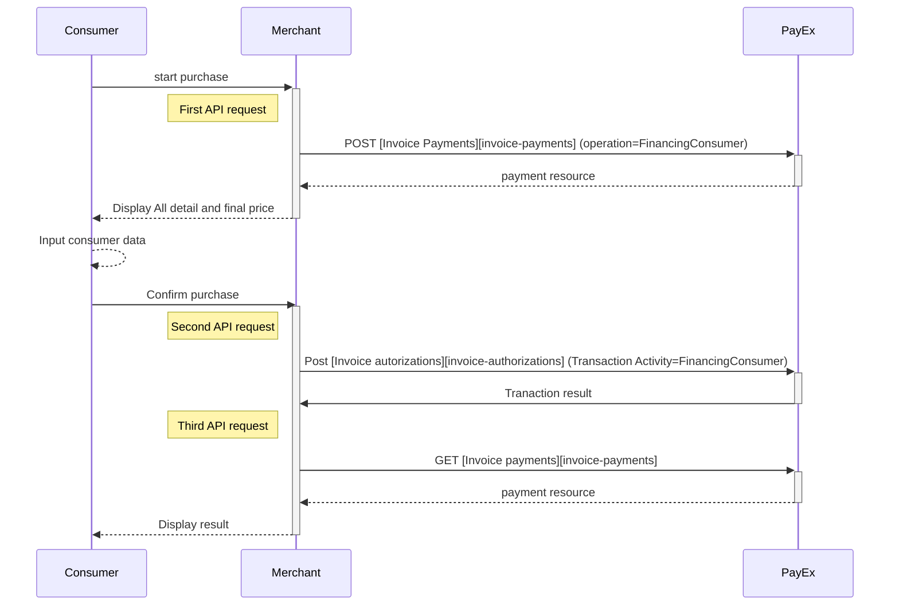
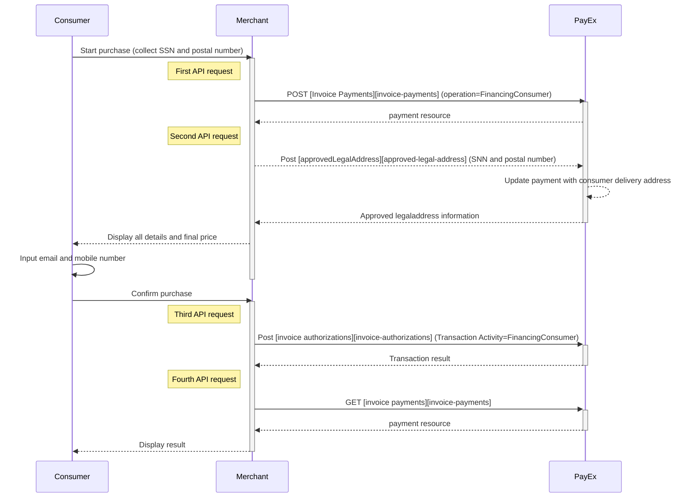
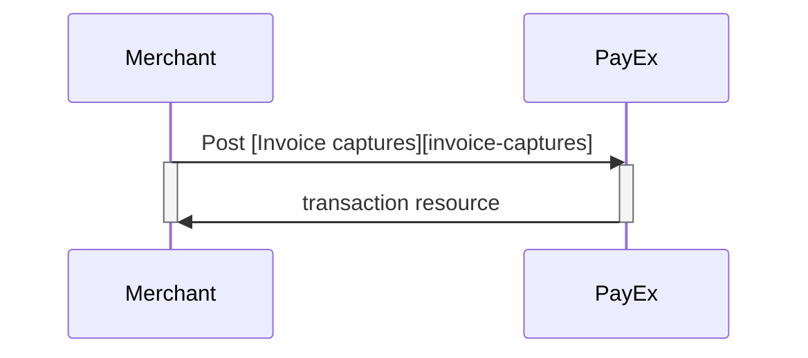
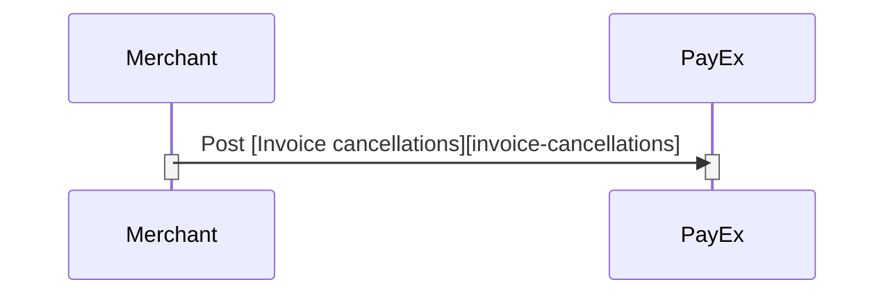
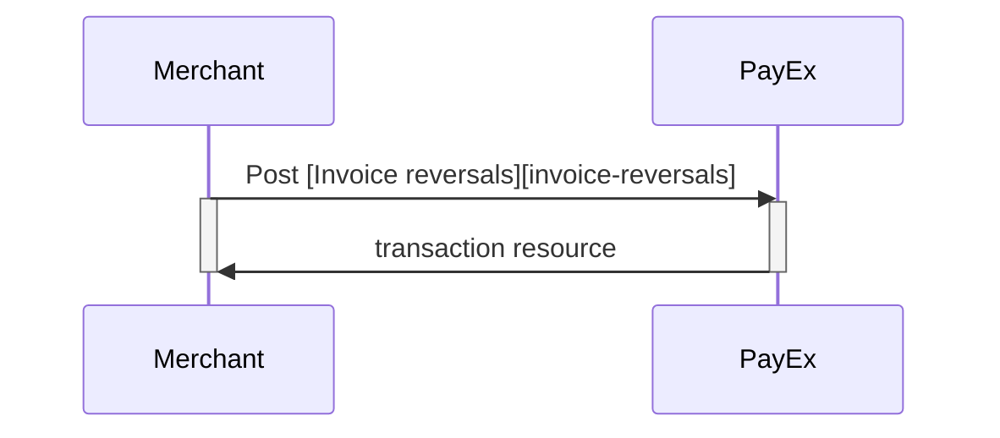
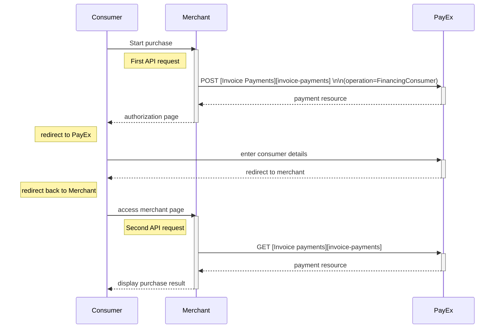



# Invoice Payments

>PayEx Invoice implements the *Financing Invoice API* and is a service where PayEx helps improve cashflow by purchasing merchant invoices.

# Financing Invoice Direct API (FI)

>PayEx Invoice (PayEx Faktura) is a payment service where PayEx helps improve cashflow by purchasing merchant invoices. PayEx receives invoice data, which is used to produce and distribute invoices to the consumer/end-user.  

## Introduction

*   To create an invoice payment, you need to collect all purchase information and make a `POST` request towards PayEx.
*   You also need to collect name, address, post number, social security number (SSN) / person number, e-mail and mobile number, and make another `POST` request towards PayEx in order to create an authorization transaction.
*   To get the authorization result, you need  to follow up with a `GET` request using the paymentID received in the first step.
*   Finally, when you are ready to ship your order, you will have to make a `POST` request to make a Capture. **At this point PayEx will generate the invoice to the consumer.**

## Important steps before you launch PayEx Faktura at your website

Prior to launching PayEx Faktura at your site, make sure that you have done the following:  

1.  Sent a merchant logo in .JPG format to [setup.ecom@payex.com][setup-mail]. The logo will be displayed on all your invoices. Minimum accepted size is 600x200 pixels, and at least 300 DPI.
2.  Included a link to "Terms and Conditions" for PayEx Faktura.

## API requests

The API requests are displayed in the [invoice flow](#invoice-flow). The options you can choose from when creating a payment with key operation set to Value FinancingConsumer are listed [here][optional-features]. The general REST based API model is described in the [technical reference].

# Invoice flow

The sequence diagram below shows the high level description of the invoice process, including the three requests you have to send to PayEx to create an authorize transaction. **Note that the invoice will not be created/distributed before you have made a Capture request.** The Capture/Cancel/Reversal opions are described below under "Options after posting a payment". The links will take you directly to the API description for the specific request. 

# Financing Invoice Direct API (SE and NO)

>PayEx Invoice (PayEx Faktura) is a payment service where PayEx helps improve cashflow by purchasing merchant invoices. PayEx receives invoice data, which is used to produce and distribute invoices to the consumer/end-user.  

## Introduction

*   To create an invoice payment, you need to collect all purchase information and make a `POST` request towards PayEx.
*   You also need to collect social security number (SSN) / person number and postal number from the consumer, and make another `POST` request towards PayEx in order to retrieve the name and address from the consumer.
*   To create the authorization transaction, you need to calculate the final price / amount, and make a third `POST` request where you send in the consumer data.
*   To get the authorization result, you need  to follow up with a `GET` request using the paymentID received in the first step.
*   Finally, when you are ready to ship your order, you will have to make a `POST` request to make a Capture. **At this point PayEx will generate the invoice to the consumer.**

## Important steps before you launch PayEx Faktura at your website

Prior to launching PayEx Faktura at your site, make sure that you have done the following:  

1.  Send a merchant logo in .JPG format to [setup.ecom@PayEx.com][setup-mail]. The logo will be displayed on all your invoices. Minimum accepted size is 600x200 pixels, and at least 300 DPI.
2.  Included a link to "Terms and Conditions" for PayEx Faktura.

## API requests

The API requests are displayed in the [invoice flow](#invoice-flow). The options you can choose from when creating a payment with key operation set to Value FinancingConsumer are listed below. The general REST based API model is described in the [technical reference][technical-reference].

### Options before posting a payment

**POST Request**

{:.table .table-striped}
| **POST Request** |	Sweden ![Sweedish flag][se-png]|	Norway ![Norwegian flag][no-png]
| **Operation** |	FinancingConsumer |	FinancingConsumer |
| **Intent** | Authorization | Authorization |
| **Currency** | SEK | NOK |
| **InvoiceType** |	PayExFinancingSE |	PayExFinancingNO |

*   An invoice payment is always two-phased based - you create an Authorize transaction, that is followed by a Capture or Cancel request.
*   **Defining CallbackURL**: When implementing a scenario, it is optional to set a [CallbackURL][callback-url]in the `POST` request. If callbackURL is set PayEx will send a postback request to this URL when the consumer has fulfilled the payment. [See the Callback API description here.][callback-api]

# Invoice flow

The sequence diagram below shows a high level description of the invoice process, including the four requests you have to send to PayEx to create an authorize transaction. **Note that the invoice will not be created/distributed before you have made a Capture request.** The Capture/Cancel/Reversal opions are described below under "Options after posting a payment". The links will take you directly to the API description for the specific request. 

## Options after posting a payment

*   **Abort:** It is possible to abort the process, if the payment has no successful transactions. [See the PATCH payment description][see-the-PATCH-payment-description].
*   You must always follow up an Invoice Authorization with a Capture or Cancel request.
*   For reversals, you will need to implement the Reversal request.
*   **If CallbackURL is set:** Whenever changes to the payment occur a [Callback request][callback-request] will be posted to the [CallbackURL][callback-url], which was generated when the payment was created.

### Capture Sequence

[Capture][capture] can only be done on a successfully authorized transaction. It is possible to do a part-capture where you only capture a part of the authorization amount. You can later do more captures on the same payment up to the total authorization amount.

### Cancel Sequence

[Cancel][cancel] can only be done on a successfully authorized transaction, not yet captured. If you do cancel after doing a part-capture you will cancel the not yet captured amount only.

### Reversal Sequence

[Reversal][reversals] can only be done on an captured transaction where there are some captured amount not yet reversed.

# Financing Invoice Payment Pages

>PayEx Invoice (PayEx Faktura) is a payment service where PayEx helps improve cashflow by purchasing merchant invoices. The Redirect purchase scenario is the easiest way to implement PayEx Invoice.  

## Introduction

*   When the consumer begins the purchase process in your merchant/webshop site, you need to make a `POST` request towards PayEx with your Purchase information. This will generate a payment object with a unique paymentID. You either receive a Redirect URL to a hosted page or a JavaScript source in response.
*   You need to [redirect][redirect] the payer to the Redirect payment page or embed the script source on you site to create a [Hosted View][hosted-view] in an iFrame; so that she may enter her details (social security number, email address, etc.) in a secure PayEx hosted environment.
*   PayEx will redirect the payer's browser to - or display directly in  the iFrame - one of two specified URLs, depending on whether the payment session is followed through completely or cancelled beforehand. Please note that both a successful and rejected payment reach completion, in contrast to a cancelled payment.
*   When you detect that the payer reach your completeUrl , you need to do a `GET` request, containing the paymentID generated in the first step, to receive the state of the transaction.

## API requests

The API requests are displayed in the [invoice flow](#invoice-flow). The options you can choose from when creating a payment with key operation set to Value FinancingConsumer are listed below. The general REST based API model is described in the [technical reference][technical-reference].

## Screenshots

![financing-invoice-1][financing-invoice-1-png]

![financing-invoice-2][financing-invoice-2-png]

### Options before posting a payment

All valid options when posting a payment with operation equal to FinancingConsumer, are described in [the technical reference][technical-reference].

{:.table .table-striped}
| **POST Request** |	**Sweden** ![Swedish flag][se-png] |	**Norway** ![Norwegian flag][no-png] |	**FInland** ![Finish flag][fi-png] |
| **Operation** |	FinancingConsumer	| FinancingConsumer |	FinancingConsumer |
| **Intent** |	Authorization |	Authorization |	Authorization |
| **Currency** |	SEK |	NOK |	EUR |
| **InvoiceType** |	PayExFinancingSE |	PayExFinancingNO |	PayExFinancingFI |

*   An invoice payment is always two-phased based - you create an Authorize transaction, that is followed by a Capture or Cancel request.
*   **Defining CallbackURL**: When implementing a scenario, it is optional to set a [CallbackURL ][callback-url]in the `POST` request. If callbackURL is set PayEx will send a postback request to this URL when the consumer has fulfilled the payment. [See the Callback API description here.][callback-api]

## Invoice flow

The sequence diagram below shows the two requests you have to send to PayEx to make a purchase. The diagram also shows in high level, the sequence of the process of a complete purchase.

---------------------------------------------------------------

[financing-invoice-1-png]: \assets\img\financing-invoice-1.png
[financing-invoice-2-png]: \assets\img\financing-invoice-2.png
[approved-legal-address]: #
[callback-api]: #
[callback-request]: #
[callback-url]: #
[cancel]:#
[capture]: #
[fi-png]: /assets/img/fi.png
[hosted-view]: /payments/#hosted-view-implementation
[invoice-cancellations]: #
[invoice-captures]: #
[invoice-payments]: #
[invoice-reversals]: #
[no-png]: \assets\img\no.png
[optional-features]: /payments/invoice/optional-features
[redirect]: #
[reversals]: #
[se-png]: \assets\img\se.png
[see-the-PATCH-payment-description]: /payments/credit-card/after-payment
[setup-mail]: mailto:setup.ecom@PayEx.com
[technical-reference]: #
