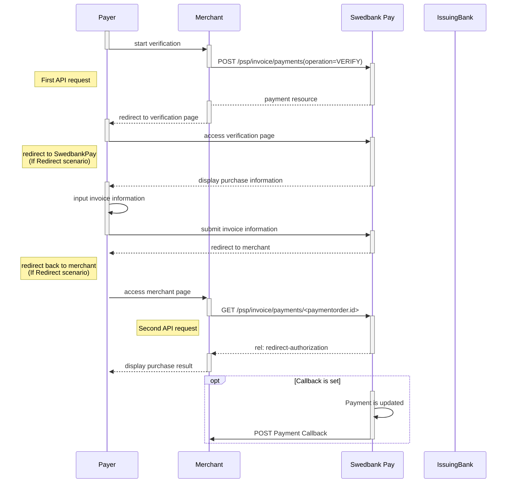



## API requests

The API requests are displayed in the [invoice flow][invoice-flow].
The options you can choose from when creating a payment with key operation
set to value `FinancingConsumer` are listed below.

### Options before posting a payment

{:.table .table-striped}
|                 | Sweden ![Swedish flag][se-png] | Norway ![Norwegian flag][no-png] | FInland ![Finish flag][fi-png] |
| :-------------- | :----------------------------- | :------------------------------- | :----------------------------- |
| **Operation**   | `FinancingConsumer`            | `FinancingConsumer`              | `FinancingConsumer`            |
| **Intent**      | `Authorization`                | `Authorization`                  | `Authorization`                |
| **Currency**    | SEK                            | NOK                              | EUR                            |
| **InvoiceType** | `PayExFinancingSE`             | `PayExFinancingNO`               | `PayExFinancingFI`             |

* An invoice payment is always two-phased based -  you create an Authorize
  transaction, that is followed by a Capture or Cancel request.
* **Defining CallbackURL**: When implementing a scenario, it is optional
  to set a [CallbackURL][callback-api] in the request.
  If callbackURL is set PayEx will send a postback request to this URL when
  the consumer has fulfilled the payment.
  [See the Callback API description here.][callback-api]



## Payment Resource



## Create Payment

Within the invoice payments part of the eCommerce API, you can create four kinds
of payments ([FinancingConsumer][FinancingConsumer], [Verify][Verify], and
[Recur][recurrence]), and you can inspect and alter the details of the
individual transactions within the payment.

To create a invoice payment, you perform an HTTP `POST` against the `payments`
resource.

There are four different kinds of payment that can be created. These are
identified with the value of the `operation` property. Each kind are documented
in their own section below.

{:.code-header}
**Request**"

```http
POST /psp/invoice/payments HTTP/1.1
Host: api.externalintegration.payex.com
Authorization: Bearer <AccessToken>
Content-Type: application/json

{
  "payment": {
    "operation": "<operation>",
    "intent": "<intent>",
  }
}
```

{:.table .table-striped}
| Required | Property            | Type     | Description                                                                                                                                                                                                                                                                                                                                                                                                                                               |
| :------: | ------------------- | -------- | --------------------------------------------------------------------------------------------------------------------------------------------------------------------------------------------------------------------------------------------------------------------------------------------------------------------------------------------------------------------------------------------------------------------------------------------------------- |
|  ✔︎︎︎︎︎  | `payment`           | `object` | The `payment` object.                                                                                                                                                                                                                                                                                                                                                                                                                                     |
|  ✔︎︎︎︎︎  | └➔&nbsp;`operation` | `string` | Determines the initial operation, that defines the type invoice payment created.<br> <br> `FinancingConsumer`. Used to create a new invoice to be sent to the payer.<br> <br> `Recur`. Used to charge a card on a recurring basis. Is followed up by a capture or cancel operation (if not Autocapture is used, that is).<br> <br>`Verify`. Used when authorizing a card withouth reserveing any funds.  It is followed up by a verification transaction. |
|  ✔︎︎︎︎︎  | └➔&nbsp;`intent`    | `string` | The intent of the payment identifies how and when the charge will be effectuated. This determine the type transactions used during the payment process.<br> <br>`Authorization`. Reserves the amount, and is followed by a [cancellation][cancel] or [capture][capture] of funds.                                                                                                                                                                         |

## Financing Consumer

A `FinancingConsumer` payment is a invoice.

{:.code-header}
**Request**

```http
POST /psp/invoice/payments HTTP/1.1
Host: api.externalintegration.payex.com
Authorization: Bearer <AccessToken>
Content-Type: application/json

{
  "payment": {
    "operation": "FinancingConsumer",
    "intent": "<intent>",
    "currency": "NOK|SEK|...",
    "prices": [
      {
        "type": "Invoice",
        "amount": 1500,
        "vatAmount": 0
      }
    ],
    "description": "Test Purchase",
    "payerReference": "SomeReference",
    "generateRecurrenceToken": "true|false",
    "userAgent": "Mozilla/5.0...",
    "language": "nb-NO|sv-SE|...",
    "urls": {
      "completeUrl": "http://test-dummy.net/payment-completed",
      "cancelUrl": "http://test-dummy.net/payment-canceled",
      "callbackUrl": "http://test-dummy.net/payment-callback",
      "logoUrl": "http://fakeservices.psp.dev.utvnet.net/logo.png",
      "termsOfServiceUrl": "http://fakeservices.psp.dev.utvnet.net/terms.pdf"
    },
    "payeeInfo": {
      "payeeId": "12345678-1234-1234-1234-123456789012",
      "payeeReference": "PR123",
      "payeeName": "Merchant1",
      "productCategory": "PC1234",
      "subsite": "MySubsite"
    }
  },
  "invoice": {
    "invoiceType": "PayExFinancingSe|PayExFinancingNo|PayExFinancingFi|CampaignInvoiceSe|PayMonthlyInvoiceSe|ScbFinancingSe",
    "campaignCode": "Campaign1|Campaign2|Campaign3|Campaign4"
  }
}
```

## Recur

A `recur` payment is a payment that references a `recurrenceToken` created
through a previous payment in order to charge the same card.

{:.code-header}
**Request**

```http
POST /psp/invoice/payments HTTP/1.1
Host: api.externalintegration.payex.com
Authorization: Bearer <AccessToken>
Content-Type: application/json

{
  "payment": {
    "operation": "Recur",
    "intent": "Authorization|AutoCapture",
    "recurrenceToken": "5adc265f-f87f-4313-577e-08d3dca1a26c",
    "currency": "NOK",
    "amount": 1500,
    "vatAmount": 0,
    "description": "Test Recurrence",
    "userAgent": "Mozilla/5.0...",
    "language": "nb-NO",
    "urls": {
      "callbackUrl": "https://example.com/payment-callback"
    },
    "payeeInfo": {
      "payeeId": "12345678-1234-1234-1234-123456789012",
      "payeeReference": "CD1234",
      "payeeName": "Merchant1",
      "productCategory": "A123",
      "orderReference": "or-12456",
      "subsite": "MySubsite"
    }
  }
}
```

## Verify



### Introduction to Verify

This option is commonly used when initiating a subsequent
[One-click invoice payment][one-click-payments] or a
[recurring invoice payment][recurrence] flow - where you do not want
to charge the consumer right away.



### Verification through Swedbank Pay Payments

* When properly set up in your merchant/webshop site and the payer initiates a
  verification operation, you make a `POST` request towards Swedbank Pay with
  your Verify information. This will generate a payment object with a unique
  `paymentID`. You either receive a Redirect URL to a hosted page or a
  JavaScript source in response.
* You need to [redirect][redirect] the payer's browser to that specified URL, or
  embed the script source on your site to create a [Hosted View][hosted-view] in
  an `iframe`; so that she can enter the credit card details in a secure
  Swedbank Pay hosted environment.
* Swedbank Pay will handle 3-D Secure authentication when this is required.
* Swedbank Pay will redirect the payer's browser to - or display directly in the
  `iframe` - one of two specified URLs, depending on whether the payment session
  is followed through completely or cancelled beforehand. Please note that both
  a successful and rejected payment reach completion, in contrast to a cancelled
  payment.
* When you detect that the payer reach your completeUrl , you need to do a `GET`
  request to receive the state of the transaction.
* Finally you will make a `GET` request towards Swedbank Pay with the
  `paymentID` received in the first step, which will return the payment result
  and a `paymentToken` that can be used for subsequent [One-Click
  Payments][one-click-payments] and [recurring server-to-server based
  payments][recurrence].

### Screenshots

You will redirect the consumer/end-user to Swedbank Pay hosted pages to collect
the credit card information.

![screenshot of the redirect invoice payment page][card-payment]{:height="500px" width="425px"}

### API Requests

The API requests are displayed in the [Verification flow]. The options you can
choose from when creating a payment with key operation set to Value Verify are
listed below.

{:.code-header}
**Request**

```http
POST /psp/invoice/payments HTTP/1.1
Host: api.externalintegration.payex.com
Authorization: Bearer <AccessToken>
Content-Type: application/json

{
  "payment": {
    "operation": "Verify",
    "currency": "NOK",
    "description": "Test Verification",
    "payerReference": "AB1234",
    "userAgent": "Mozilla/5.0...",
    "language": "nb-NO",
    "generatePaymentToken": true,
    "generateRecurrenceToken": false,
    "urls": {
      "hostUrls": ["https://example.com"],
      "completeUrl": "https://example.com/payment-completed",
      "cancelUrl": "https://example.com/payment-canceled",
      "paymentUrl": "http://example.com/perform-payment",
      "logoUrl": "https://example.com/payment-logo.png",
      "termsOfServiceUrl": "https://example.com/payment-terms.html"
    },
    "payeeInfo": {
      "payeeId": "12345678-1234-1234-1234-123456789012",
      "payeeReference": "CD1234",
      "payeeName": "Merchant1",
      "productCategory": "A123",
      "orderReference": "or-12456",
      "subsite": "MySubsite"
    }
  },
  "invoice": {
    "invoiceType": "PayExFinancingNo"
  }
}
```

{:.code-header}
**Response**

```http
HTTP/1.1 200 OK
Content-Type: application/json

{
  "payment": {
    "id": "/psp/invoice/payments/5adc265f-f87f-4313-577e-08d3dca1a26c",
    "number": 1234567890,
    "created": "2016-09-14T13:21:29.3182115Z",
    "updated": "2016-09-14T13:21:57.6627579Z",
    "operation": "Verify",
    "state": "Ready",
    "currency": "NOK",
    "amount": 0,
    "description": "Test Verification",
    "payerReference": "AB1234",
    "initiatingSystemUserAgent": "PostmanRuntime/3.0.1",
    "userAgent": "Mozilla/5.0",
    "language": "nb-NO",
    "transactions": {
      "id": "/psp/invoice/payments/5adc265f-f87f-4313-577e-08d3dca1a26c/transactions"
    },
    "verifications": {
      "id": "/psp/invoice/payments/5adc265f-f87f-4313-577e-08d3dca1a26c/verifications"
    },
    "urls": {
      "id": "/psp/invoice/payments/5adc265f-f87f-4313-577e-08d3dca1a26c/urls"
    },
    "payeeInfo": {
      "id": "/psp/invoice/payments/5adc265f-f87f-4313-577e-08d3dca1a26c/payeeInfo"
    },
    "settings": {
      "id": "/psp/invoice/payments/5adc265f-f87f-4313-577e-08d3dca1a26c/settings"
    }
  },
  "operations": [
    {
      "method": "POST",
      "href": "https://api.externalintegration.payex.com/psp/invoice/payments/5adc265f-f87f-4313-577e-08d3dca1a26c/approvedlegaladdress",
      "rel": "create-approved-legal-address",
      "contentType": "application/json"
    },
    {
      "method": "POST",
      "href": "https://api.externalintegration.payex.com/psp/invoice/payments/5adc265f-f87f-4313-577e-08d3dca1a26c/authorizations",
      "rel": "create-authorization",
      "contentType": "application/json"
    },
    {
      "method": "PATCH",
      "href": "https://api.externalintegration.payex.com/psp/invoice/payments/5adc265f-f87f-4313-577e-08d3dca1a26c",
      "rel": "update-payment-abort",
      "contentType": "application/json"
    },
    {
      "method": "GET",
      "href": "https://ecom.externalintegration.payex.com/invoice/payments/authorize/2f9b51a821d40dd015332f14460f91393856725a19e9fb5a834d460af91c9ce2",
      "rel": "redirect-authorization",
      "contentType": "text/html"
    }
]
}
```

### Verification flow

The sequence diagram below shows the two requests you have to send to Swedbank
Pay to make a purchase. The links will take you directly to the API description
for the specific request. The diagram also shows in high level, the sequence of
the process of a complete purchase.
When dealing with credit invoice payments, 3-D Secure authentication of the
cardholder is an essential topic. There are three alternative outcome of a
credit invoice payment:

* 3-D Secure enabled - by default, 3-D Secure should be enabled, and Swedbank
  Pay will check if the card is enrolled with 3-D Secure. This depends on the
  issuer of the card. If the card is not enrolled with 3-D Secure, no
  authentication of the cardholder is done.
* Card supports 3-D Secure - if the card is enrolled with 3-D Secure, Swedbank
  Pay will redirect the cardholder to the autentication mechanism that is
  decided by the issuing bank. Normally this will be done using BankID or Mobile
  BankID.



### Create authorization transaction

The `redirect-authorization` operation redirects the consumer to
Swedbank Pay Payments where the payment is authorized.

{code-header}
**Request**

```http
POST /psp/invoice/payments/5adc265f-f87f-4313-577e-08d3dca1a26c/authorizations HTTP/1.1
Host: api.externalintegration.payex.com
Authorization: Bearer <AccessToken>
Content-Type: application/json

{
  "transaction": {
    "activity": "FinancingConsumer"
  },
  "consumer": {
    "socialSecurityNumber": "socialSecurityNumber",
    "customerNumber": "customerNumber",
    "email": "email",
    "msisdn": "msisdn",
    "ip": "consumer ip address"
  },
  "legalAddress": {
    "addressee": "firstName + lastName",
    "coAddress": "coAddress",
    "streetAddress": "streetAddress",
    "zipCode": "zipCode",
    "city": "city",
    "countryCode": "countryCode"
  },
  "billingAddress": {
    "addressee": "firstName + lastName",
    "coAddress": "coAddress",
    "streetAddress": "streetAddress",
    "zipCode": "zipCode",
    "city": "city",
    "countryCode": "countryCode"
  }
}
```

{:.table .table-striped}
| Required | Property                       | Type     | Description                                                            |
| :------: | :----------------------------- | :------- | :--------------------------------------------------------------------- |
|  ✔︎︎︎︎︎  | `transaction`                  | `object` | The transaction object.                                                |
|          | └➔&nbsp;`activity`             | `string` | Only the value `"FinancingConsumer"` or `"AccountsReceivableConsumer"` |
|          | `consumer`                     | `object` | The consumer object.                                                   |
|          | └➔&nbsp;`socialSecurityNumber` | `string` | The social security number of the consumer.                            |
|          | └➔&nbsp;`customerNumber`       | `string` | Customer number of the consumer.                                       |
|          | └➔&nbsp;`email`                | `string` | The customer email address.                                            |
|          | └➔&nbsp;`msisdn`               | `string` | The MSISDN of the consumer.                                            |
|          | └➔&nbsp;`ip`                   | `string` | The IP address of the consumer.                                        |
|          | `legalAddress`                 | `object` | The Address object.                                                    |
|          | └➔&nbsp;`addressee`            | `string` | The full name of the addressee of this invoice                         |
|          | └➔&nbsp;`coAddress`            | `string` | The co Address of the addressee.                                       |
|          | └➔&nbsp;`streetAddress`        | `string` | The street address of the addresse.                                    |
|          | └➔&nbsp;`zipCode`              | `string` | The zip code of the addresse.                                          |
|          | └➔&nbsp;`city`                 | `string` | The city name  of the addresse.                                        |
|          | └➔&nbsp;`countryCode`          | `string` | The country code of the addresse.                                      |
|          | `billingAddress`               | `object` | The BillingAddress object for the billing address of the addresse.     |
|          | └➔&nbsp;`addressee`            | `string` | The full name of the billing address adressee.                         |
|          | └➔&nbsp;`coAddress`            | `string` | The co address of the billing address adressee.                        |
|          | └➔&nbsp;`streetAddress`        | `string` | The street address of the billing address adressee.                    |
|          | └➔&nbsp;`zipCode`              | `string` | The zip code of the billing address adressee.                          |
|          | └➔&nbsp;`city`                 | `string` | The city name of the billing address adressee.                         |
|          | └➔&nbsp;`countryCode`          | `string` | The country code of the billing address adressee.                      |

{code-header}
**Response**

```json
{
  "payment": "/psp/invoice/payments/5adc265f-f87f-4313-577e-08d3dca1a26c",
  "authorization": {
    "id": "/psp/invoice/payments/5adc265f-f87f-4313-577e-08d3dca1a26c/authorizations/12345678-1234-1234-1234-123456789012",
    "consumer": {
      "id": "/psp/invoice/payments/5adc265f-f87f-4313-577e-08d3dca1a26c/consumer"
    },
    "legalAddress": {
      "id": "/psp/invoice/payments/5adc265f-f87f-4313-577e-08d3dca1a26c/legaladdress"
    },
    "billingAddress": {
      "id": "/psp/invoice/payments/5adc265f-f87f-4313-577e-08d3dca1a26c/billingaddress"
    },
    "transaction": {
      "id": "/psp/invoice/payments/5adc265f-f87f-4313-577e-08d3dca1a26c/transactions/12345678-1234-1234-1234-123456789012",
      "created": "2016-09-14T01:01:01.01Z",
      "updated": "2016-09-14T01:01:01.03Z",
      "type": "Authorization",
      "state": "Initialized|Completed|Failed",
      "number": 1234567890,
      "amount": 1000,
      "vatAmount": 250,
      "description": "Test transaction",
      "payeeReference": "AH123456",
      "failedReason": "ExternalResponseError",
      "failedActivityName": "Authorize",
      "failedErrorCode": "ThirdPartyErrorCode",
      "failedErrorDescription": "ThirdPartyErrorMessage",
      "isOperational": "TRUE|FALSE",
      "activities": {
        "id": "/psp/invoice/payments/5adc265f-f87f-4313-577e-08d3dca1a26c/transactions/12345678-1234-1234-1234-123456789012/activities"
      },
      "operations": [
        {
          "href": "https://api.payex.com/psp/invoice/payments/5adc265f-f87f-4313-577e-08d3dca1a26c",
          "rel": "edit-authorization",
          "method": "PATCH"
        }
      ]
    }
  }
}
```

{:.table .table-striped}
| Property                 | Type      | Description                                                                                                                                                                                                  |
| :----------------------- | :-------- | :----------------------------------------------------------------------------------------------------------------------------------------------------------------------------------------------------------- |
| `payment`                | `string`  | The relative URI of the payment this transaction belongs to.                                                                                                                                                 |
| `authorization`          | `object`  | The transaction object.                                                                                                                                                                                      |
| └➔&nbsp;`id`             | `string`  | The relative URI of the current `transaction` resource.                                                                                                                                                      |
| └➔&nbsp;`created`        | `string`  | The ISO-8601 date and time of when the transaction was created.                                                                                                                                              |
| └➔&nbsp;`updated`        | `string`  | The ISO-8601 date and time of when the transaction was created.                                                                                                                                              |
| └➔&nbsp;`type`           | `string`  | Indicates the transaction type.                                                                                                                                                                              |
| └➔&nbsp;`state`          | `string`  | `Initialized`, `Completed` or `Failed`. Indicates the state of the transaction.                                                                                                                              |
| └➔&nbsp;`number`         | `string`  | The transaction `number`, useful when there's need to reference the transaction in human communication. Not usable for programmatic identification of the transaction, for that `id` should be used instead. |
| └➔&nbsp;`amount`         | `integer` | Amount is entered in the lowest momentary units of the selected currency. E.g. `10000` = 100.00 NOK, `5000` = 50.00 SEK.                                                                                     |
| └➔&nbsp;`vatAmount`      | `integer` | If the amount given includes VAT, this may be displayed for the user in the payment page (redirect only). Set to 0 (zero) if this is not relevant.                                                           |
| └➔&nbsp;`description`    | `string`  | A human readable description of maximum 40 characters of the transaction.                                                                                                                                    |
| └➔&nbsp;`payeeReference` | `string`  | A unique reference for the transaction.                                                                                                                                                                      |
| └➔&nbsp;`failedReason`   | `string`  | The human readable explanation of why the payment failed.                                                                                                                                                    |
| └➔&nbsp;`isOperational`  | `bool`    | `true` if the transaction is operational; otherwise `false`.                                                                                                                                                 |
| └➔&nbsp;`operations`     | `array`   | The array of operations that are possible to perform on the transaction in its current state.                                                                                                                |

The `authorization` resource contains information about an authorization
transaction made towards a payment, as previously described.











## PayeeReference



## Prices





## Problems

When performing unsuccessful operations, the eCommerce API will respond with a
problem message. We generally use the problem message `type` and `status` code
to identify the nature of the problem. The problem `name` and `description` will
often help narrow down the specifics of the problem.

### Error types from Swedbank Pay Invoice and third parties

All invoice error types will have the following URI in front of type:
`https://api.payex.com/psp/errordetail/invoice/<errorType>`

{:.table .table-striped}
| Type            | Status |                               |
| :-------------- | :----- | :---------------------------- |
| *externalerror* | 500    | No error code                 |
| *inputerror*    | 400    | 10 - ValidationWarning        |
| *inputerror*    | 400    | 30 - ValidationError          |
| *inputerror*    | 400    | 3010 - ClientRequestInvalid   |
| *externalerror* | 502    | 40 - Error                    |
| *externalerror* | 502    | 60 - SystemError              |
| *externalerror* | 502    | 50 - SystemConfigurationError |
| *externalerror* | 502    | 9999 - ServerOtherServer      |
| *forbidden*     | 403    | Any other error code          |



[fi-png]: /assets/img/fi.png
[no-png]: /assets/img/no.png
[se-png]: /assets/img/se.png
[callback-api]: #callback
[cancel]: /payments/invoice/after-payment/#cancellations
[capture]: /payments/invoice/after-payment/#Capture
[card-payment]: /assets/img/payments/card-payment.png
[FinancingConsumer]: #financing-consumer
[hosted-view]: /payments/invoice/seamless-view
[invoice-flow]: /payments/invoice/index/#invoice-flow
[one-click-payments]: #one-click-payments
[recurrence]: #recur
[redirect]: /payments/invoice/redirect
[transaction-resource]: #transactions
[verify]: #verify
