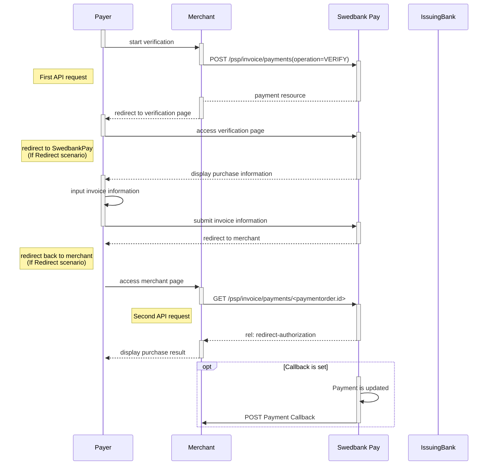

## API requests

The API requests are displayed in the [invoice flow][invoice-flow].
The options you can choose from when creating a payment with key operation
set to value `FinancingConsumer` are listed below.

### Options before posting a payment

{:.table .table-striped}
|               | Norway  | Finland  | Sweden  |
| :------------ | :------------------- | :-------------------- | :------------------- |
| `operation`   | `FinancingConsumer`  | `FinancingConsumer`   | `FinancingConsumer`  |
| `currency`    | `NOK`                | `EUR`                 | `SEK`                |
| `invoiceType` | `PayExFinancingNO`   | `PayExFinancingFI`    | `PayExFinancingSE`   |

*   An invoice payment is always two-phased based -  you create an Authorize
  transaction, that is followed by a Capture or Cancel request.









## Create Payment

Within the invoice payments part of the eCommerce API, you can create four kinds
of payments ([FinancingConsumer][financing-consumer], [Verify][verify], and
[Recur][recur]), and you can inspect and alter the details of the
individual transactions within the payment.

To create a invoice payment, you perform an HTTP `POST` against the `payments`
resource.

There are four different kinds of payment that can be created. These are
identified with the value of the `operation` field. Each kind are documented
in their own section below.

{:.code-header}
**Request**

```http
POST /psp/invoice/payments HTTP/1.1
Host: {{ page.api_host }}
Authorization: Bearer <AccessToken>
Content-Type: application/json

{
    "payment": {
        "operation": "<operation>",
        "intent": "<intent>"
    }
}
```

{:.table .table-striped}
|     Required     | Field               | Type     | Description                                                                                                                                                                                                                                                                                                                                                                                                                                               |
| :--------------: | ------------------- | -------- | --------------------------------------------------------------------------------------------------------------------------------------------------------------------------------------------------------------------------------------------------------------------------------------------------------------------------------------------------------------------------------------------------------------------------------------------------------- |
|  | `payment`           | `object` | The `payment` object.                                                                                                                                                                                                                                                                                                                                                                                                                                     |
|  | └➔&nbsp;`operation` | `string` | Determines the initial operation, that defines the type invoice payment created.<br> <br> `FinancingConsumer`. Used to create a new invoice to be sent to the payer.<br> <br> `Recur`. Used to charge a card on a recurring basis. Is followed up by a capture or cancel operation (if not Autocapture is used, that is).<br> <br>`Verify`. Used when authorizing a card withouth reserveing any funds.  It is followed up by a verification transaction. |
|  | └➔&nbsp;`intent`    | `string` | The intent of the payment identifies how and when the charge will be effectuated. This determine the type transactions used during the payment process.<br> <br>`Authorization`. Reserves the amount, and is followed by a [cancellation][cancel] or [capture][capture] of funds.                                                                                                                                                                         |

## Financing Consumer

A `FinancingConsumer` payment is an invoice.

{:.code-header}
**Request**

```http
POST /psp/invoice/payments HTTP/1.1
Host: {{ page.api_host }}
Authorization: Bearer <AccessToken>
Content-Type: application/json
{
    "payment": {
        "operation": "FinancingConsumer",
        "intent": "<intent>",
        "currency": "NOK",
        "prices": [
            {
                "type": "Invoice",
                "amount": 1500,
                "vatAmount": 0
            }
        ],
        "description": "Test Purchase",
        "payerReference": "SomeReference",
        "generateRecurrenceToken": "false",
        "userAgent": "Mozilla/5.0...",
        "language": "nb-NO",
        "urls": {
            "completeUrl": "https://example.com/payment-completed",
            "cancelUrl": "https://example.com/payment-canceled",
            "callbackUrl": "https://example.com/payment-callback",
            "logoUrl": "https://example.com/logo.png",
            "termsOfServiceUrl": "http://fexample.com/terms.pdf"
        },
        "payeeInfo": {
            "payeeId": "{{ page.merchant_id }}",
            "payeeReference": "PR123",
            "payeeName": "Merchant1",
            "productCategory": "PC1234",
            "subsite": "MySubsite"
        }
    },
    "invoice": {
        "invoiceType": "PayExFinancingNo"
    }
}
```

## Recur

A `recur` payment is a payment that references a `recurrenceToken` created
through a previous payment in order to charge the same card.

{:.code-header}
**Request**

```http
POST /psp/invoice/payments HTTP/1.1
Host: {{ page.api_host }}
Authorization: Bearer <AccessToken>
Content-Type: application/json

{
    "payment": {
        "operation": "Recur",
        "intent": "Authorization",
        "recurrenceToken": "{{ page.payment_id }}",
        "currency": "NOK",
        "amount": 1500,
        "vatAmount": 0,
        "description": "Test Recurrence",
        "userAgent": "Mozilla/5.0...",
        "language": "nb-NO",
        "urls": {
            "callbackUrl": "https://example.com/payment-callback"
        },
        "payeeInfo": {
            "payeeId": "{{ page.merchant_id }}",
            "payeeReference": "CD1234",
            "payeeName": "Merchant1",
            "productCategory": "A123",
            "orderReference": "or-12456",
            "subsite": "MySubsite"
        }
    }
}
```

## Verify



### Introduction to Verify

This option is commonly used when initiating a subsequent
[recurring invoice payment][recur] flow - where you do not want
to charge the consumer right away.

### Verification through Swedbank Pay Payments

*   When properly set up in your merchant/webshop site and the payer initiates a
  verification operation, you make a `POST` request towards Swedbank Pay with
  your Verify information. This will generate a payment object with a unique
  `paymentID`. You either receive a Redirect URL to a hosted page or a
  JavaScript source in response.
*   You need to [redirect][redirect] the payer's browser to that specified URL,
    or embed the script source on your site to create a
    [Seamless View][seamless-view] in an `iframe`; so that the payer can enter
    the payment details in a secure Swedbank Pay hosted environment.
*   Swedbank Pay will redirect the payer's browser to - or display directly in
    the `iframe` - one of two specified URLs, depending on whether the payment
    session is followed through completely or cancelled beforehand.
    Please note that both a successful and rejected payment reach completion,
    in contrast to a cancelled payment.
*   When you detect that the payer reach your completeUrl , you need to do a
    `GET`  request to receive the state of the transaction.
*   Finally you will make a `GET` request towards Swedbank Pay with the
    `paymentID` received in the first step, which will return the payment result
    and a `paymentToken` that can be used for subsequent [recurring
    server-to-server based payments][recur].

### Screenshots

You will redirect the consumer/end-user to Swedbank Pay hosted pages to collect
the payment information.

![screenshot of the redirect invoice payment page][invoice-payment]{:height="500px" width="425px"}

### API Requests verification flow

The API requests are displayed in the [Verification flow][verification-flow]. The options you can
choose from when creating a payment with key operation set to Value Verify are
listed below.

{:.code-header}
**Request**

```http
POST /psp/invoice/payments HTTP/1.1
Host: {{ page.api_host }}
Authorization: Bearer <AccessToken>
Content-Type: application/json

{
    "payment": {
        "operation": "Verify",
        "currency": "NOK",
        "description": "Test Verification",
        "payerReference": "AB1234",
        "userAgent": "Mozilla/5.0...",
        "language": "nb-NO",
        "generatePaymentToken": true,
        "generateRecurrenceToken": false,
        "urls": {
            "hostUrls": [
                "https://example.com"
            ],
            "completeUrl": "https://example.com/payment-completed",
            "cancelUrl": "https://example.com/payment-canceled",
            "paymentUrl": "https://example.com/perform-payment",
            "logoUrl": "https://example.com/payment-logo.png",
            "termsOfServiceUrl": "https://example.com/payment-terms.html"
        },
        "payeeInfo": {
            "payeeId": "{{ page.merchant_id }}",
            "payeeReference": "CD1234",
            "payeeName": "Merchant1",
            "productCategory": "A123",
            "orderReference": "or-12456",
            "subsite": "MySubsite"
        }
    },
    "invoice": {
        "invoiceType": "PayExFinancingNo"
    }
}
```

{:.code-header}
**Response**

```http
HTTP/1.1 200 OK
Content-Type: application/json
{
    "payment": {
        "id": "/psp/invoice/payments/{{ page.payment_id }}",
        "number": 1234567890,
        "created": "2016-09-14T13:21:29.3182115Z",
        "updated": "2016-09-14T13:21:57.6627579Z",
        "operation": "Verify",
        "state": "Ready",
        "currency": "NOK",
        "amount": 0,
        "description": "Test Verification",
        "payerReference": "AB1234",
        "initiatingSystemUserAgent": "PostmanRuntime/3.0.1",
        "userAgent": "Mozilla/5.0",
        "language": "nb-NO",
        "transactions": {
            "id": "/psp/invoice/payments/{{ page.payment_id }}/transactions"
        },
        "verifications": {
            "id": "/psp/invoice/payments/{{ page.payment_id }}/verifications"
        },
        "urls": {
            "id": "/psp/invoice/payments/{{ page.payment_id }}/urls"
        },
        "payeeInfo": {
            "id": "/psp/invoice/payments/{{ page.payment_id }}/payeeInfo"
        },
        "settings": {
            "id": "/psp/invoice/payments/{{ page.payment_id }}/settings"
        }
    },
    "operations": [
        {
            "method": "POST",
            "href": "{{ page.api_url }}/psp/invoice/payments/{{ page.payment_id }}/approvedlegaladdress",
            "rel": "create-approved-legal-address",
            "contentType": "application/json"
        },
        {
            "method": "POST",
            "href": "{{ page.api_url }}/psp/invoice/payments/{{ page.payment_id }}/authorizations",
            "rel": "create-authorization",
            "contentType": "application/json"
        },
        {
            "method": "PATCH",
            "href": "{{ page.api_url }}/psp/invoice/payments/{{ page.payment_id }}",
            "rel": "update-payment-abort",
            "contentType": "application/json"
        },
        {
            "method": "GET",
            "href": "{{ page.front_end_url }}/invoice/payments/authorize/{{ page.payment_token }}",
            "rel": "redirect-authorization",
            "contentType": "text/html"
        }
    ]
}
```

### Verification flow

The sequence diagram below shows the two requests you have to send to Swedbank
Pay to make a purchase. The links will take you directly to the API description
for the specific request. The diagram also shows in high level, the sequence of
the process of a complete purchase.



### Create authorization transaction

The `redirect-authorization` operation redirects the consumer to
Swedbank Pay Payments where the payment is authorized.

{:.code-header}
**Request**

```http
POST /psp/invoice/payments/{{ page.payment_id }}/authorizations HTTP/1.1
Host: {{ page.api_host }}
Authorization: Bearer <AccessToken>
Content-Type: application/json
{
    "transaction": {
        "activity": "FinancingConsumer"
    },
    "consumer": {
        "socialSecurityNumber": "{{ page.consumer_ssn_no }}",
        "customerNumber": "123456",
        "email": "olivia.nyhuus@payex.com",
        "msisdn": "+4798765432",
        "ip": "127.0.0.1"
    },
    "legalAddress": {
        "addressee": "Olivia Nyhuus",
        "streetAddress": "SaltnesToppen 43",
        "zipCode": "1642",
        "city": "Saltnes",
        "countryCode": "no"
    },
    "billingAddress": {
        "addressee": "Olivia Nyhuus",
        "streetAddress": "SaltnesToppen 43",
        "zipCode": "1642",
        "city": "Saltnes",
        "countryCode": "no"
    }
}
```

{:.table .table-striped}
|     Required     | Field                          | Type     | Description                                                            |
| :--------------: | :----------------------------- | :------- | :--------------------------------------------------------------------- |
|  | `transaction`                  | `object` | The transaction object.                                                |
|                  | └➔&nbsp;`activity`             | `string` | Only the value `"FinancingConsumer"` or `"AccountsReceivableConsumer"` |
|                  | `consumer`                     | `object` | The consumer object.                                                   |
|                  | └➔&nbsp;`socialSecurityNumber` | `string` | The social security number of the consumer.                            |
|                  | └➔&nbsp;`customerNumber`       | `string` | Customer number of the consumer.                                       |
|                  | └➔&nbsp;`email`                | `string` | The customer email address.                                            |
|                  | └➔&nbsp;`msisdn`               | `string` | The MSISDN of the consumer.                                            |
|                  | └➔&nbsp;`ip`                   | `string` | The IP address of the consumer.                                        |
|                  | `legalAddress`                 | `object` | The Address object.                                                    |
|                  | └➔&nbsp;`addressee`            | `string` | The full name of the addressee of this invoice                         |
|                  | └➔&nbsp;`coAddress`            | `string` | The co Address of the addressee.                                       |
|                  | └➔&nbsp;`streetAddress`        | `string` | The street address of the addresse.                                    |
|                  | └➔&nbsp;`zipCode`              | `string` | The zip code of the addresse.                                          |
|                  | └➔&nbsp;`city`                 | `string` | The city name  of the addresse.                                        |
|                  | └➔&nbsp;`countryCode`          | `string` | The country code of the addresse.                                      |
|                  | `billingAddress`               | `object` | The BillingAddress object for the billing address of the addresse.     |
|                  | └➔&nbsp;`addressee`            | `string` | The full name of the billing address adressee.                         |
|                  | └➔&nbsp;`coAddress`            | `string` | The co address of the billing address adressee.                        |
|                  | └➔&nbsp;`streetAddress`        | `string` | The street address of the billing address adressee.                    |
|                  | └➔&nbsp;`zipCode`              | `string` | The zip code of the billing address adressee.                          |
|                  | └➔&nbsp;`city`                 | `string` | The city name of the billing address adressee.                         |
|                  | └➔&nbsp;`countryCode`          | `string` | The country code of the billing address adressee.                      |

{:.code-header}
**Response**

```json
{
    "payment": "/psp/invoice/payments/{{ page.payment_id }}",
    "authorization": {
        "id": "/psp/invoice/payments/{{ page.payment_id }}/authorizations/{{ page.transaction_id }}",
        "consumer": {
            "id": "/psp/invoice/payments/{{ page.payment_id }}/consumer"
        },
        "legalAddress": {
            "id": "/psp/invoice/payments/{{ page.payment_id }}/legaladdress"
        },
        "billingAddress": {
            "id": "/psp/invoice/payments/{{ page.payment_id }}/billingaddress"
        },
        "transaction": {
            "id": "/psp/invoice/payments/{{ page.payment_id }}/transactions/{{ page.transaction_id }}",
            "created": "2016-09-14T01:01:01.01Z",
            "updated": "2016-09-14T01:01:01.03Z",
            "type": "Authorization",
            "state": "Failed",
            "number": 1234567890,
            "amount": 1000,
            "vatAmount": 250,
            "description": "Test transaction",
            "payeeReference": "AH123456",
            "failedReason": "ExternalResponseError",
            "failedActivityName": "Authorize",
            "failedErrorCode": "ThirdPartyErrorCode",
            "failedErrorDescription": "ThirdPartyErrorMessage",
            "isOperational": "TRUE",
            "activities": {
                "id": "/psp/invoice/payments/{{ page.payment_id }}/transactions/{{ page.transaction_id }}/activities"
            },
            "operations": [
                {
                    "href": "{{ page.api_url }}/psp/invoice/payments/{{ page.payment_id }}",
                    "rel": "edit-authorization",
                    "method": "PATCH"
                }
            ]
        }
    }
}
```

{:.table .table-striped}
| Field                    | Type      | Description                                                                                                                                                                                                  |
| :----------------------- | :-------- | :----------------------------------------------------------------------------------------------------------------------------------------------------------------------------------------------------------- |
| `payment`                | `string`  |                                                                                                                                            |
| `authorization`          | `object`  | The transaction object.                                                                                                                                                                                      |
| └➔&nbsp;`id`             | `string`  |                                                                                                                                                |
| └➔&nbsp;`created`        | `string`  | The ISO-8601 date and time of when the transaction was created.                                                                                                                                              |
| └➔&nbsp;`updated`        | `string`  | The ISO-8601 date and time of when the transaction was updated.                                                                                                                                              |
| └➔&nbsp;`type`           | `string`  | Indicates the transaction type.                                                                                                                                                                              |
| └➔&nbsp;`state`          | `string`  | `Initialized`, `Completed` or `Failed`. Indicates the state of the transaction.                                                                                                                              |
| └➔&nbsp;`number`         | `string`  | The transaction `number`, useful when there's need to reference the transaction in human communication. Not usable for programmatic identification of the transaction, for that `id` should be used instead. |
| └➔&nbsp;`amount`         | `integer` |                                                                                                                                                                     |
| └➔&nbsp;`vatAmount`      | `integer` |                                                                                                                                                                  |
| └➔&nbsp;`description`    | `string`  |                                                                                                                                |
| └➔&nbsp;`payeeReference` | `string`  | The `payeeReference` is the receipt/invoice number and is a unique reference for each transaction.                                                                                                           |
| └➔&nbsp;`failedReason`   | `string`  | The human readable explanation of why the payment failed.                                                                                                                                                    |
| └➔&nbsp;`isOperational`  | `bool`    | `true` if the transaction is operational; otherwise `false`.                                                                                                                                                 |
| └➔&nbsp;`operations`     | `array`   | The array of operations that are possible to perform on the transaction in its current state.                                                                                                                |

The `authorization` resource contains information about an authorization
transaction made towards a payment, as previously described.

















## Problems

When performing unsuccessful operations, the eCommerce API will respond with a
problem message. We generally use the problem message `type` and `status` code
to identify the nature of the problem. The problem `name` and `description` will
often help narrow down the specifics of the problem.

### Error types from Swedbank Pay Invoice and third parties

All invoice error types will have the following URI in front of type:
`https://api.payex.com/psp/errordetail/invoice/<error-type>`

{:.table .table-striped}
| Type            | Status | Description                   |
| :-------------- | :----: | :---------------------------- |
| `externalerror` |  500   | No error code                 |
| `inputerror`    |  400   | 10 - ValidationWarning        |
| `inputerror`    |  400   | 30 - ValidationError          |
| `inputerror`    |  400   | 3010 - ClientRequestInvalid   |
| `externalerror` |  502   | 40 - Error                    |
| `externalerror` |  502   | 60 - SystemError              |
| `externalerror` |  502   | 50 - SystemConfigurationError |
| `externalerror` |  502   | 9999 - ServerOtherServer      |
| `forbidden`     |  403   | Any other error code          |







[callback]: #callback
[cancel]: /payments/invoice/after-payment#cancellations
[capture]: /payments/invoice/capture
[financing-consumer]: #financing-consumer
[invoice-flow]: /payments/invoice#invoice-flow
[invoice-payment]: /assets/img/checkout/invoice-seamless-view.png
[recur]: #recur
[redirect]: /payments/invoice/redirect
[seamless-view]: /payments/invoice/seamless-view
[verification-flow]: #verification-flow
[verify]: #verify
