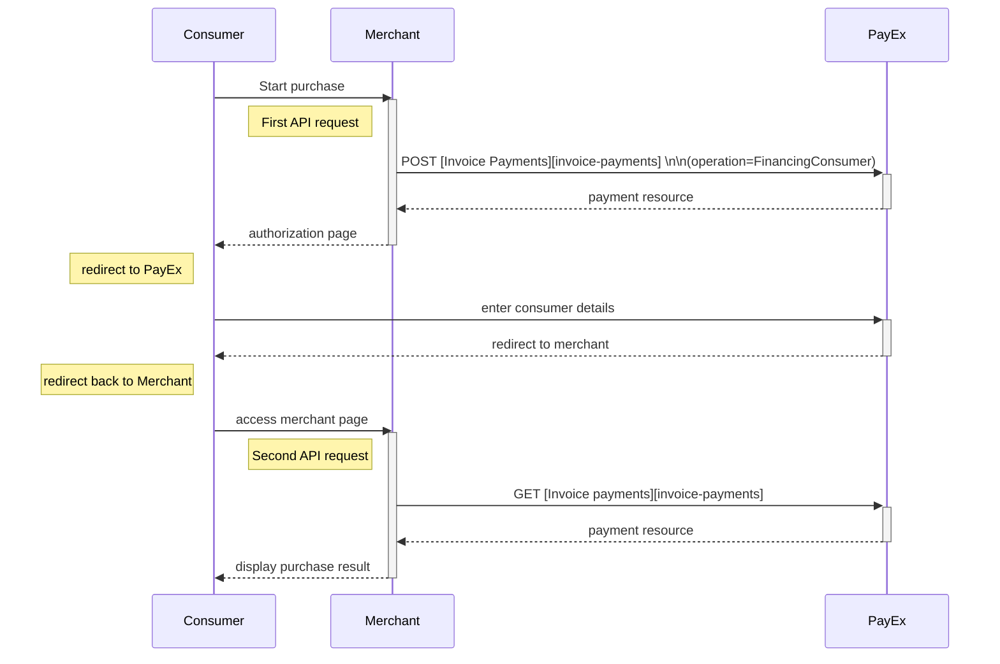



### Options before posting a payment

All valid options when posting a payment with operation equal to FinancingConsumer, are described in [the technical reference][technical-reference].

{:.table .table-striped}
| *POST Request* |	**Sweden** ![Swedish flag][se-png] |	**Norway** ![Norwegian flag][no-png] |	**FInland** ![Finish flag][fi-png] |
| *Operation* |	FinancingConsumer	| FinancingConsumer |	FinancingConsumer |
| *Intent* |	Authorization |	Authorization |	Authorization |
| *Currency* |	SEK |	NOK |	EUR |
| *InvoiceType* |	PayExFinancingSE |	PayExFinancingNO |	PayExFinancingFI |

*   An invoice payment is always two-phased based - you create an Authorize transaction, that is followed by a Capture or Cancel request.
*   **Defining CallbackURL**: When implementing a scenario, it is optional to set a [CallbackURL ][callback-url]in the `POST` request. If callbackURL is set PayEx will send a postback request to this URL when the consumer has fulfilled the payment. [See the Callback API description here.][callback-api]

## Invoice flow

The sequence diagram below shows the two requests you have to send to PayEx to make a purchase. The diagram also shows in high level, the sequence of the process of a complete purchase.

### Options after posting a payment

Head over to [after payment][after-payment] to see what you can do when a payment is completed.  
Here you will also find info on `Capture`, `Cancel`, and `Reversal`.

[after-payment]: /payments/invoice/after-payment
[no-png]: /assets/img/no.png
[se-png]: /assets/img/se.png