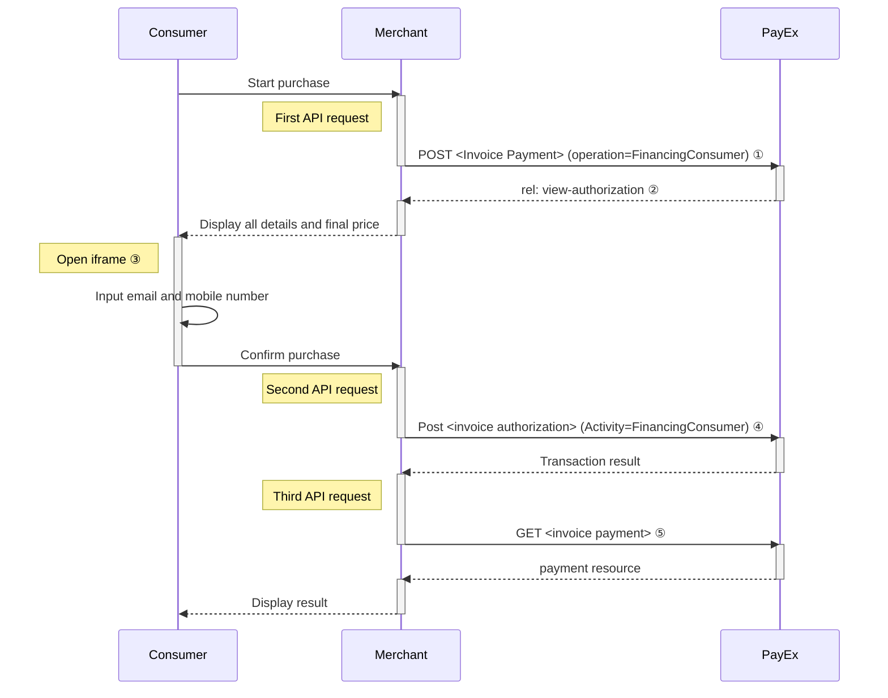





## Introduction

Seamless View provides an integration of the payment process directly on your
website. This solution offers a smooth shopping experience with Swedbank Pay
payment pages seamlessly integrated in an `iframe` on your website. The costumer
does not need to leave your webpage, since we are handling the payment in the
`iframe` on your page.

**TODO**
Insert screenshot of an iframe with the invoice option.

## Purchase Flow

The sequence diagram below shows a high level description of the
invoice process.



The Capture/Cancel/Reversal options are described in the [after payment section][after-payment]. The link will take you directly to the API descriptions for
the requests.

### Explainations

* ① Start with collecting all purchase information and make a `POST` request towards    PayEx to create an invoice payment.
* ② The response from the payment resource contains operations that can be
  performed on the resource. The relevant operation in our example is
  `rel: view-authorization`.
* ③ `Open iframe` creates the Swedbank Pay hosted iframe.
* ④ To create the authorization transaction, you need to make a second `POST`
  request where you send in the consumer data.
* ⑤ To get the authorization result, you need to follow up with a `GET` request
  using the paymentID received in the first step.

* Finally, when you are ready to ship your order, you will have to make a `POST`
  request to make a Capture. **At this point PayEx will generate the invoice to
  the consumer.**

## API requests

The API requests are displayed in the [invoice flow](#invoice-flow).
The options you can choose from when creating a payment with key operation set
to Value FinancingConsumer are listed below.

* An invoice payment is always two-phased based - you create an
  [`Authorize`][authorize] transaction, that is followed by a
  [`Capture`][capture] or [`Cancel`][cancel] request.
* **Defining CallbackURL**: When implementing a scenario, it is optional to set
  a [CallbackURL][callback-api]in the `POST` request. If callbackURL is set
  PayEx will send a postback request to this URL when the consumer has fulfilled
  the payment. [See the Callback API description here.][callback-api]

## Seamless View Back End

When properly set up in your merchant/webshop site and the payer starts the
invoice process, you need to make a POST request towards PayEx with your
invoice information. This will generate a payment object with a unique
`paymentID`. You will receive a **JavaScript source** in response.

### Options before posting a payment

Different countries have different values for the properties. The table below showcase the values for the respective countries:

**POST Request**

{:.table .table-striped}
| *Country* | **Sweden** ![Swedish flag][se-png] | **Norway** ![Norwegian flag][no-png] | **FInland** ![Finish flag][fi-png] |
| *Operation* | FinancingConsumer | FinancingConsumer | FinancingConsumer |
| *Intent* | Authorization | Authorization | Authorization |
| *Currency* | SEK | NOK | EUR |
| *InvoiceType* | PayExFinancingSE | PayExFinancingNO | PayExFinancingFI |

### Intent



### Operations

The API requests are displayed in the purchase flow above.
You can [create an invoice `payment`][create-payment] with following `operation`
options:

* [FinancingConsumer][financing-consumer] (We use this value in our examples)
* [Recur][recur]
* [Verify][verify]

### FinancingConsumer

A `FinancingConsumer` payment is a straightforward way to charge the card of the
payer. It is followed up by posting a capture, cancellation or reversal
transaction.

An example of an abbreviated `POST` request is provided below. Each individual
Property of the JSON document is described in the following section.
An example of an expanded `POST` request is available in the
[other features section][purchase].



[after-payment]: /payments/invoice/after-payment
[callback-api]: /payments/invoice/other-features#callback
[fi-png]: /assets/img/fi.png
[no-png]: /assets/img/no.png
[se-png]: /assets/img/se.png
[setup-mail]: mailto:setup.ecom@PayEx.com
[authorize]: /payments/invoice/other-features#authorizations
[capture]: /payments/invoice/after-payment#captures
[cancel]: /payments/invoice/after-payment#cancellations
[financing-consumer]: /payments/invoice/other-features
[recur]: /payments/invoice/other-features
[verify]: /payments/invoice/other-features
