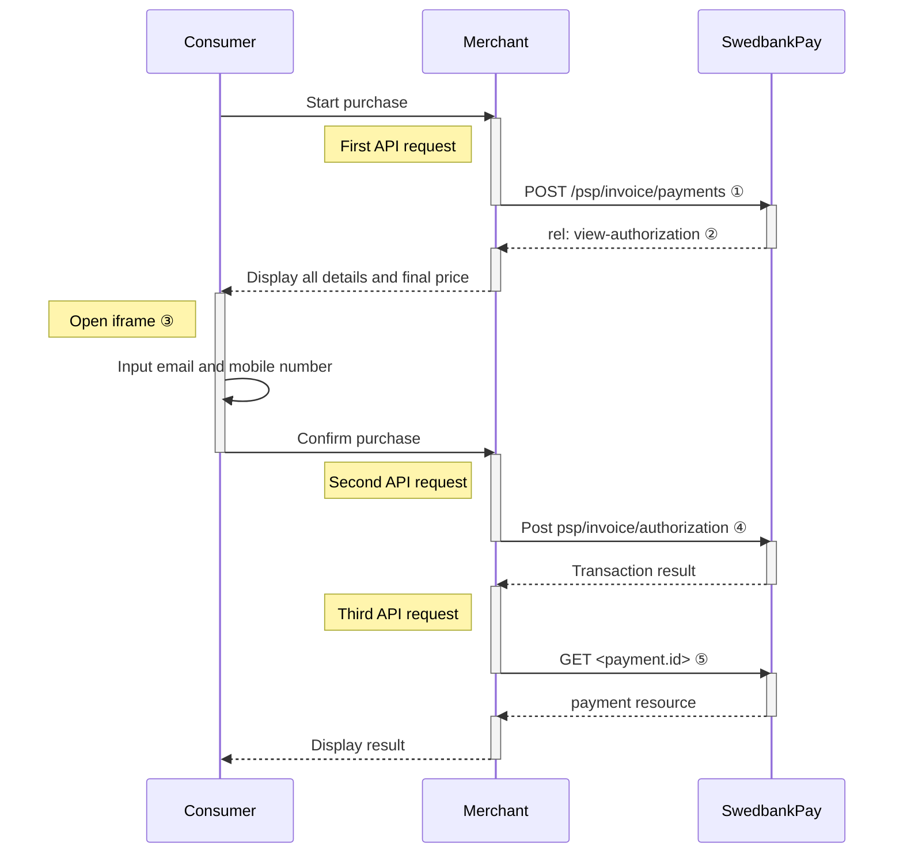



## Introduction

Seamless View provides an integration of the payment process directly on your
website. This solution offers a smooth shopping experience with Swedbank Pay
payment pages seamlessly integrated in an `iframe` on your website. The costumer
does not need to leave your webpage, since we are handling the payment in the
`iframe` on your page.

![screenshot of the invoice payment window][invoice-payment]{:height="425px" width="700px"}

## Purchase Flow

The sequence diagram below shows a high level description of the
invoice process.





The Capture/Cancel/Reversal options are described in the [after payment
section][after-payment]. The link will take you directly to the API descriptions
for the requests.

### Explainations

* ① Start with collecting all purchase information and make a `POST` request
  towards Swedbank Pay to create an invoice payment. Use the `FinancingConsumer`
  operation.
* ② The response from the payment resource contains operations that can be
  performed on the resource. The relevant operation in our example is `rel:
  view-authorization`.
* ③ `Open iframe` creates the Swedbank Pay hosted iframe.
* ④ To create the authorization transaction, you need to make a second `POST`
  request where you send in the consumer data. Use the `FinancingConsumer`
  activity
* ⑤ To get the authorization result, you need to follow up with a `GET` request
  using the paymentID received in the first step.

* Finally, when you are ready to ship your order, you will have to make a `POST`
  request to make a [Capture][capture]. **At this point Swedbank Pay will
  generate the invoice to the consumer.**

## API requests

The API requests are displayed in the [invoice flow](#invoice-flow). The options
you can choose from when creating a payment with key operation set to Value
`FinancingConsumer` are listed below.

* An invoice payment is always two-phased based - you create an
  [`Authorize`][authorize] transaction, that is followed by a
  [`Capture`][capture] or [`Cancel`][cancel] request.
* **Defining CallbackURL**: When implementing a scenario, it is optional to set
  a [CallbackURL][callback] in the `POST` request. If callbackURL is set
  Swedbank Pay will send a postback request to this URL when the consumer has
  fulfilled the payment. [See the Callback API description here.][callback]

## Seamless View Back End

When properly set up in your merchant/webshop site and the payer starts the
invoice process, you need to make a POST request towards Swedbank Pay with your
invoice information. This will generate a payment object with a unique
`paymentID`. You will receive a **JavaScript source** in response.

### Options before posting a payment

Different countries have different values for the properties. The table below
showcase the values for the respective countries:

#### POST Request Options

{:.table .table-striped}
|               | Norway ![Norwegian flag][no-png] | FInland ![Finish flag][fi-png] | Sweden ![Swedish flag][se-png] |
| :------------ | :------------------------------- | :----------------------------- | :----------------------------- |
| `operation`   | `FinancingConsumer`              | `FinancingConsumer`            | `FinancingConsumer`            |
| `currency`    | `NOK`                            | `EUR`                          | `SEK`                          |
| `invoiceType` | `PayExFinancingNO`               | `PayExFinancingFI`             | `PayExFinancingSE`             |

### Intent



### Operations

The API requests are displayed in the purchase flow above.
You can [create an invoice `payment`][create-payment] with following `operation`
options:

* [FinancingConsumer][financing-consumer] (We use this value in our examples)
* [Recur][recur]
* [Verify][verify]

### FinancingConsumer

A `FinancingConsumer` payment is a straightforward way to invoice a
payer. It is followed up by posting a capture, cancellation or reversal
transaction.

An example of an abbreviated `POST` request is provided below. Each individual
Property of the JSON document is described in the following section.
An example of an expanded `POST` request is available in the
[other features section][financing-consumer].

{:.code-header}
**Request**

```http
POST /psp/invoice/payments HTTP/1.1
Authorization: Bearer <AccessToken>
Content-Type: application/json

{
    "payment": {
        "operation": "FinancingConsumer",
        "intent": "Authorization",
        "currency": "SEK",
        "prices": [
            {
                "type": "Invoice",
                "amount": 4201,
                "vatAmount": 0
            }
        ],
        "description": "Test Invoice",
        "userAgent": "Mozilla/5.0...",
        "generatePaymentToken": false,
        "generateRecurrenceToken": false,
        "paymentToken": ""
        "language": "sv-SE",
        "urls": {
            "hosturls": [
                "http://example.com"
            ],
            "completeUrl": "http://example.com/payment-completed",
            "cancelUrl": "http://example.com/payment-canceled",
            "callbackUrl": "http://example.com/payment-callback",
            "termsOfServiceUrl": "http://example.com/payment-terms.pdf"
        },
        "payeeInfo": {
            "payeeId": "{{ page.merchantId }}",
            "payeeReference": "CD1234",
            "payeeName": "Merchant1",
            "productCategory": "A123"
        }
    },
    "invoice": {
        "invoiceType": "PayExFinancingSE"
    }
}
```

{:.table .table-striped}
| Required | Property                          | Type          | Description                                                                                                                                                                                                                                                                                                                                    |
| :------: | :-------------------------------- | :------------ | :--------------------------------------------------------------------------------------------------------------------------------------------------------------------------------------------------------------------------------------------------------------------------------------------------------------------------------------------- |
|  ✔︎︎︎︎︎  | `payment`                         | `object`      | The `payment` object contains information about the specific payment.                                                                                                                                                                                                                                                                          |
|  ✔︎︎︎︎︎  | └➔&nbsp;`operation`               | `string`      | The operation that the `payment` is supposed to perform. The [`FinancingConsumer`][financing-consumer] operation is used in our example. Take a look at the [create `payment` section][create-payment] for a full examples of the following `operation` options: [FinancingConsumer][financing-consumer], [Recur][recur], and [Verify][verify] |
|  ✔︎︎︎︎︎  | └➔&nbsp;`intent`                  | `string`      | `Authorization`. Reserves the amount, and is followed by a [cancellation][cancel] or [capture][capture] of funds.                                                                                                                                                                                                                              |
|  ✔︎︎︎︎︎  | └➔&nbsp;`currency`                | `string`      | NOK or SEK.                                                                                                                                                                                                                                                                                                                                    |
|  ✔︎︎︎︎︎  | └➔&nbsp;`prices`                  | `object`      | The `prices` resource lists the prices related to a specific payment.                                                                                                                                                                                                                                                                          |
|  ✔︎︎︎︎︎  | └─➔&nbsp;`type`                   | `string`      | Use the invoice value [See the Prices resource and prices object types for more information][price-resource].                                                                                                                                                                                                                                  |
|  ✔︎︎︎︎︎  | └─➔&nbsp;`amount`                 | `integer`     | Amount is entered in the lowest momentary units of the selected currency. E.g. 10000 = 100.00 SEK 5000 = 50.00 SEK.                                                                                                                                                                                                                            |
|  ✔︎︎︎︎︎  | └─➔&nbsp;`vatAmount`              | `integer`     | If the amount given includes VAT, this may be displayed for the user in the payment page (redirect only). Set to 0 (zero) if this is not relevant.                                                                                                                                                                                             |
|  ✔︎︎︎︎︎  | └➔&nbsp;`description`             | `string(40)`  | A textual description max 40 characters of the purchase.                                                                                                                                                                                                                                                                                       |
|          | └➔&nbsp;`payerReference`          | `string`      | The reference to the payer (consumer/end user) from the merchant system. E.g mobile number, customer number etc.                                                                                                                                                                                                                               |
|          | └➔&nbsp;`generatePaymentToken`    | `boolean`     | `true` or `false`. Set this to `true` if you want to create a paymentToken for future use as One Click.                                                                                                                                                                                                                                        |
|          | └➔&nbsp;`generateRecurrenceToken` | `boolean`     | `true` or `false`. Set this to `true` if you want to create a recurrenceToken for future use Recurring purchases (subscription payments).                                                                                                                                                                                                      |
|  ✔︎︎︎︎︎  | └➔&nbsp;`userAgent`               | `string`      | The user agent reference of the consumer's browser - [see user agent definition][user-agent-definition]                                                                                                                                                                                                                                        |
|  ✔︎︎︎︎︎  | └➔&nbsp;`language`                | `string`      | `nb-NO`, `sv-SE` or `en-US`.                                                                                                                                                                                                                                                                                                                   |
|  ✔︎︎︎︎︎  | └➔&nbsp;`urls`                    | `object`      | The `urls` resource lists urls that redirects users to relevant sites.                                                                                                                                                                                                                                                                         |
|          | └─➔&nbsp;`hostUrls`               | `array`       | The array of URLs valid for embedding of Swedbank Pay Hosted Views. If not supplied, view-operation will not be available.                                                                                                                                                                                                                     |
|  ✔︎︎︎︎︎  | └─➔&nbsp;`completeUrl`            | `string`      | The URL that Swedbank Pay will redirect back to when the payer has completed his or her interactions with the payment. This does not indicate a successful payment, only that it has reached a final (complete) state. A `GET` request needs to be performed on the payment to inspect it further.                                             |
|          | └─➔&nbsp;`cancelUrl`              | `string`      | The URI to redirect the payer to if the payment is canceled. Only used in redirect scenarios. Can not be used simultaneously with `paymentUrl`; only cancelUrl or `paymentUrl` can be used, not both.                                                                                                                                          |
|          | └─➔&nbsp;`callbackUrl`            | `string`      | The URL that Swedbank Pay will perform an HTTP POST against every time a transaction is created on the payment. See [callback][callback] for details.                                                                                                                                                                                          |
|          | └─➔&nbsp;`termsOfServiceUrl`      | `string`      | A URL that contains your terms and conditions for the payment, to be linked on the payment page. Require https.                                                                                                                                                                                                                                |
|  ✔︎︎︎︎︎  | └➔&nbsp;`payeeInfo`               | `object`      | The `payeeInfo` contains information about the payee.                                                                                                                                                                                                                                                                                          |
|  ✔︎︎︎︎︎  | └─➔&nbsp;`payeeId`                | `string`      | This is the unique id that identifies this payee (like merchant) set by Swedbank Pay.                                                                                                                                                                                                                                                          |
|  ✔︎︎︎︎︎  | └─➔&nbsp;`payeeReference`         | `string(30*)` | A unique reference from the merchant system. It is set per operation to ensure an exactly-once delivery of a transactional operation. See [payeeReference][payee-reference] for details.                                                                                                                                                       |
|          | └─➔&nbsp;`payeeName`              | `string`      | The payee name (like merchant name) that will be displayed to consumer when redirected to Swedbank Pay.                                                                                                                                                                                                                                        |
|          | └─➔&nbsp;`productCategory`        | `string`      | A product category or number sent in from the payee/merchant. This is not validated by Swedbank Pay, but will be passed through the payment process and may be used in the settlement process.                                                                                                                                                 |
|          | └─➔&nbsp;`orderReference`         | `String(50)`  | The order reference should reflect the order reference found in the merchant's systems.                                                                                                                                                                                                                                                        |
|  ✔︎︎︎︎︎  | └─➔&nbsp;`invoiceType`            | `String`      | PayExFinancingSe, PayExFinancingNo or PayExFinancingFi depending on which country you're doing business with PayEx in. (Other external financing partner names must be agreed upon with Swedbank Pay.)                                                                                                                                         |

{:.code-header}
**Response**

```http
HTTP/1.1 200 OK
Content-Type: application/json

{
    "payment": {
        "id": "/psp/invoice/payments/{{ page.paymentId }}",
        "number": 1234567890,
        "instrument": "Invoice",
        "created": "YYYY-MM-DDThh:mm:ssZ",
        "updated": "YYYY-MM-DDThh:mm:ssZ",
        "operation": "FinancingConsumer",
        "intent": "Authorization",
        "state": "Ready",
        "currency": "SEK",
        "prices": {
            "id": "/psp/invoice/payments/{{ page.paymentId }}/prices"
        },
        "amount": 0,
        "description": "Test Purchase",
        "initiatingSystemUserAgent": "PostmanRuntime/3.0.1",
        "userAgent": "Mozilla/5.0...",
        "language": "sv-SE",
        "urls": {
            "id": "/psp/invoice/payments/{{ page.paymentId }}/urls"
        },
        "payeeInfo": {
            "id": "/psp/invoice/payments/{{ page.paymentId }}/payeeinfo"
        },
        "metadata": {
            "id": "/psp/invoice/payments/{{ page.paymentId }}/metadata"
        }
    },
    "operations": [
        {
            "method": "POST",
            "href": "{{ page.apiUrl }}/psp/invoice/payments/{{ page.paymentId }}/approvedlegaladdress",
            "rel": "create-approved-legal-address",
            "contentType": "application/json"
        },
        {
            "method": "POST",
            "href": "{{ page.apiUrl }}/psp/invoice/payments/{{ page.paymentId }}/authorizations",
            "rel": "create-authorization",
            "contentType": "application/json"
        },
        {
            "method": "PATCH",
            "href": "{{ page.apiUrl }}/psp/invoice/payments/{{ page.paymentId }}",
            "rel": "update-payment-abort",
            "contentType": "application/json"
        },
        {
            "method": "GET",
            "href": "{{ page.frontEndUrl }}/invoice/payments/authorize/{{ page.paymentToken }}",
            "rel": "redirect-authorization",
            "contentType": "text/html"
        },
        {
            "method": "GET",
            "href": "{{ page.frontEndUrl }}/invoice/core/scripts/client/px.invoice.client.js?{{ page.paymentToken }}&operation=authorize",
            "rel": "view-authorization",
            "contentType": "application/javascript"
        }
    ]
}
```

The key information in the response is the `view-authorization` operation. You
will need to embed its `href` in a `<script>` element. The script will enable
loading the payment page in an `iframe` in our next step.

## Seamless View Front End

You need to embed the script source on your site to create a hosted-view in an
`iframe`; so that she can enter the payment details in a secure Swedbank Pay
hosted environment. A simplified integration has these following steps:

1. Create a container that will contain the Seamless View iframe: `<div
   id="swedbank-pay-seamless-view-page">`.
2. Create a `<script>` source within the container. Embed the `href` value
   obtained in the `POST` request in the `<script>` element. Example:

```html
    <script id="payment-page-script" src="https://ecom.dev.payex.com/invoice/core/ scripts/client/px.invoice.client.js"></script>
```

The previous two steps gives this HTML:

{:.code-header}
**HTML**

```html
<!DOCTYPE html>
<html>
    <head>
        <title>Swedbank Pay Seamless View is Awesome!</title>
        <!-- Here you can specify your own javascript file -->
        <script src=<YourJavaScriptFileHere>></script>
    </head>
    <body>
        <div id="swedbank-pay-seamless-view-page">
          <script id="payment-page-script" src="https://ecom.dev.payex.com/invoice/core/scripts/client/px.invoice.client.js"></script>
        </div>
    </body>
</html>
```

Lastly, initiate the Seamless View with a JavaScript call to open the `iframe`
embedded on your website.

{:.code-header}
**JavaScript**

```js
<script language="javascript">
    payex.hostedView.invoice({
        // The container specifies which id the script will look for to host the
        // iframe component.
        container: "swedbank-pay-seamless-view-page"
    }).open();
</script>
```



[after-payment]: /payments/invoice/after-payment
[authorize]: /payments/invoice/other-features#authorizations
[callback]: /payments/invoice/other-features#callback
[cancel]: /payments/invoice/after-payment#cancellations
[capture]: /payments/invoice/after-payment#captures
[create-payment]: /payments/invoice/other-features#create-payment
[fi-png]: /assets/img/fi.png
[financing-consumer]: /payments/invoice/other-features#financing-consumer
[invoice-payment]: /assets/img/checkout/invoice-seamless-view.png
[no-png]: /assets/img/no.png
[payee-reference]: /payments/invoice/other-features#payeereference
[price-resource]: /payments/invoice/other-features#prices
[recur]: /payments/invoice/other-features#recur
[se-png]: /assets/img/se.png
[setup-mail]: mailto:setup.ecom@PayEx.com
[user-agent-definition]: https://en.wikipedia.org/wiki/User_agent
[verify]: /payments/invoice/other-features#verify
