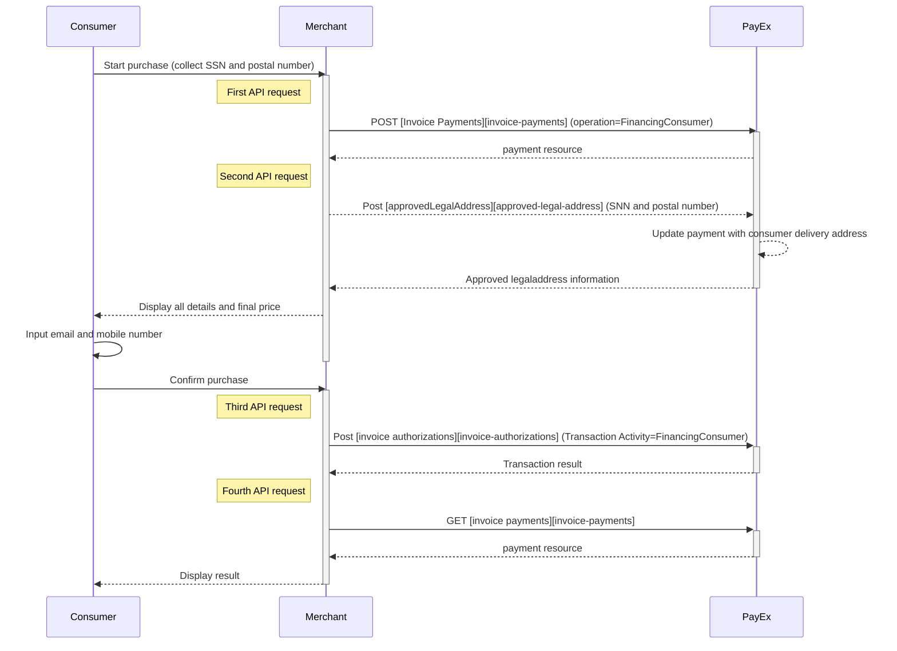



## Introduction

*   To create an invoice payment, you need to collect all purchase information and make a `POST` request towards PayEx.
*   You also need to collect social security number (SSN) / person number and postal number from the consumer, and make another `POST` request towards PayEx in order to retrieve the name and address from the consumer.
*   To create the authorization transaction, you need to calculate the final price / amount, and make a third `POST` request where you send in the consumer data.
*   To get the authorization result, you need  to follow up with a `GET` request using the paymentID received in the first step.
*   Finally, when you are ready to ship your order, you will have to make a `POST` request to make a Capture. **At this point PayEx will generate the invoice to the consumer.**

## Important steps before you launch PayEx Faktura at your website

Prior to launching PayEx Faktura at your site, make sure that you have done the following:  

1.  Send a merchant logo in .JPG format to [setup.ecom@PayEx.com][setup-mail]. The logo will be displayed on all your invoices. Minimum accepted size is 600x200 pixels, and at least 300 DPI.
2.  Included a link to "Terms and Conditions" for PayEx Faktura.

## API requests

The API requests are displayed in the [invoice flow](#invoice-flow). The options you can choose from when creating a payment with key operation set to Value FinancingConsumer are listed below. The general REST based API model is described in the [technical reference][technical-reference].

### Options before posting a payment

**POST Request**

{:.table .table-striped}
| *POST Request* |	**Sweden** ![Swedish flag][se-png] |	**Norway** ![Norwegian flag][no-png] |	**FInland** ![Finish flag][fi-png] |
| *Operation* |	FinancingConsumer	| FinancingConsumer |	FinancingConsumer |
| *Intent* |	Authorization |	Authorization |	Authorization |
| *Currency* |	SEK |	NOK |	EUR |
| *InvoiceType* |	PayExFinancingSE |	PayExFinancingNO |	PayExFinancingFI |

*   An invoice payment is always two-phased based - you create an Authorize transaction, that is followed by a Capture or Cancel request.
*   **Defining CallbackURL**: When implementing a scenario, it is optional to set a [CallbackURL][callback-url]in the `POST` request. If callbackURL is set PayEx will send a postback request to this URL when the consumer has fulfilled the payment. [See the Callback API description here.][callback-api]

# Invoice flow

The sequence diagram below shows a high level description of the invoice process, including the four requests you have to send to PayEx to create an authorize transaction. **Note that the invoice will not be created/distributed before you have made a Capture request.** The Capture/Cancel/Reversal opions are described below under "Options after posting a payment". The links will take you directly to the API description for the specific request. 

[approved-legal-address]: #
[callback-api]: #
[callback-url]: #
[fi-png]: /assets/img/fi.png
[invoice-payments]: #
[no-png]: /assets/img/no.png
[se-png]: /assets/img/se.png
[setup-mail]: mailto:setup.ecom@PayEx.com
[technical-reference]: #
