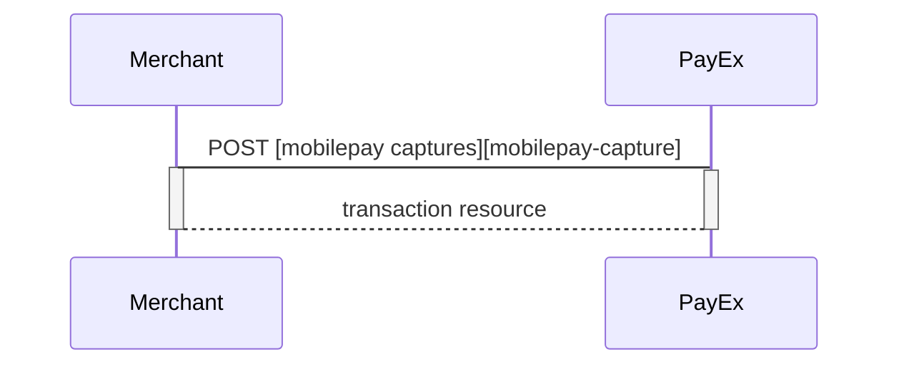
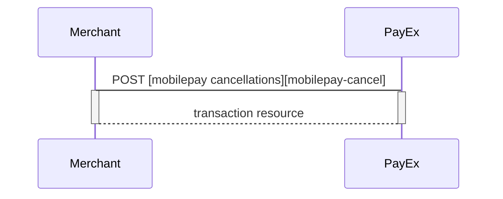
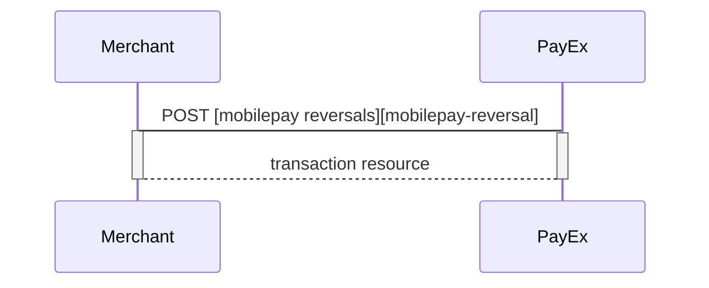
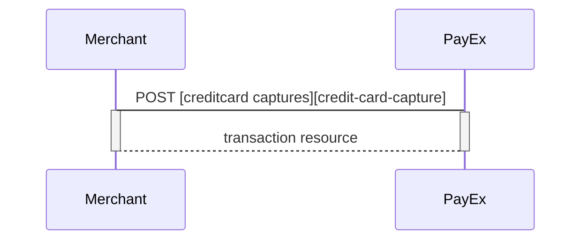
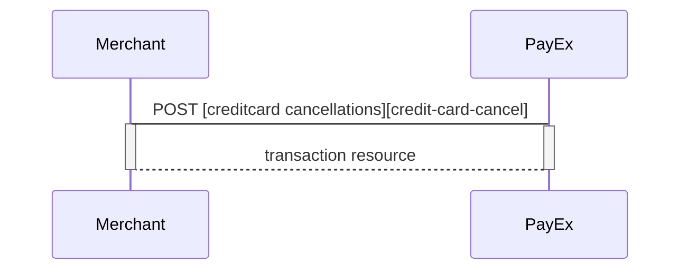

## After payment options for Mobile Pay

### Options after posting a payment

* **Abort:** It is possible to [abort a payment][technical-reference-abort] if the payment has no successful transactions.
* If the payment shown above is done as a twophase (`authorization`), you will need to implement the Capture and Cancel requests.
* For reversals, you will need to implement the Reversal request.
* **If CallbackURL is set:** Whenever changes to the payment occur  a [Callback request][technical-reference-callback] will be posted to the callbackUrl, generated when the payment was created.

### Capture Sequence

Capture can only be done on a authorized transaction. It is possible to do a part-capture where you only capture a smaller amount than the authorization amount. You can later do more captures on the sam payment upto the total authorization amount.

### Cancel Sequence

Cancel can only be done on a authorized transaction. If you do cancel after doing a part-capture you will cancel the different between the capture amount and the authorization amount.

### Reversal Sequence

Reversal can only be done on a payment where there are some captured amount not yet reversed.

## Payment Link

### Options after posting a payment with Payment Link

*  If the payment enable a two-phase flow (Authorize), you will need to implement the Capture and Cancel requests.
*  It is possible to "abort" the validity of the Payment Link by making a PATCH on the payment. [See the PATCH payment description][technical-reference-abort].
*  For reversals, you will need to implement the Reversal request.
*  If you did a PreAuthorization, you will have to send a Finalize to the transaction using [PATCH on the Authorization][technical-reference-card-payments].
*  When implementing the Payment Link scenario, it is optional to set a CallbackURL in the POST request. If CallbackURL is set PayEx will send a postback request to this URL when the consumer as fulfilled the payment. [See the Callback API description here.][technical-reference-callback]

### Capture Sequence

Capture can only be perfomed on a payment with a successfully authorized transaction. It is possible to do a part-capture where you only capture a smaller amount than the authorized amount. You can later do more captures on the same payment up to the total authorization amount.

### Cancel Sequence

Cancel can only be done on a authorized transaction. If you do cancel after doing a part-capture you will cancel the difference between the captured amount and the authorized amount.

### Reversal Sequence

Reversal can only be done on a payment where there are some captured amount not yet reversed.

[credit-card-capture]: #
[credit-card-cancel]: #
[credit-card-reversal]: #
[mobilepay-capture]: #
[mobilepay-cancel]: #
[mobilepay-reversal]: #
[technical-reference-abort]: #
[technical-reference-callback]: #
[technical-reference-card-payments]: #
