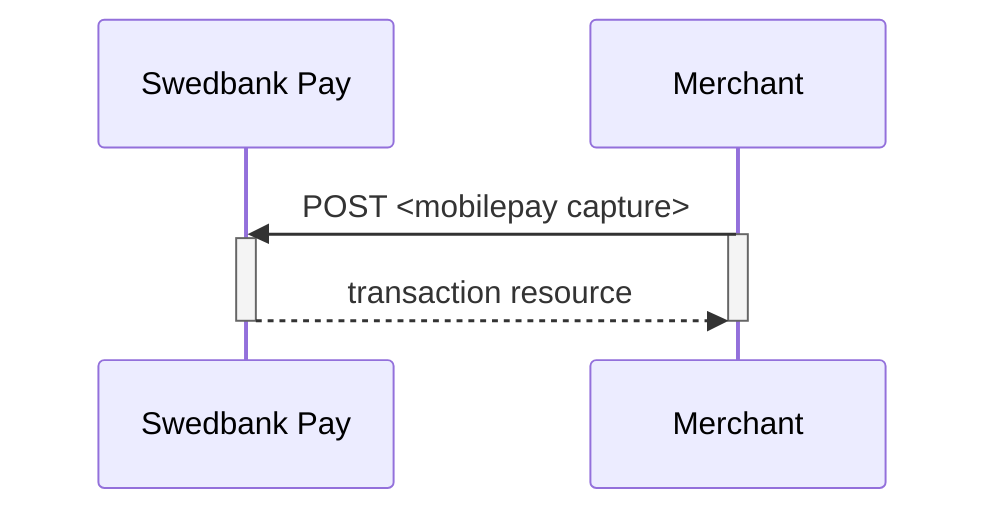
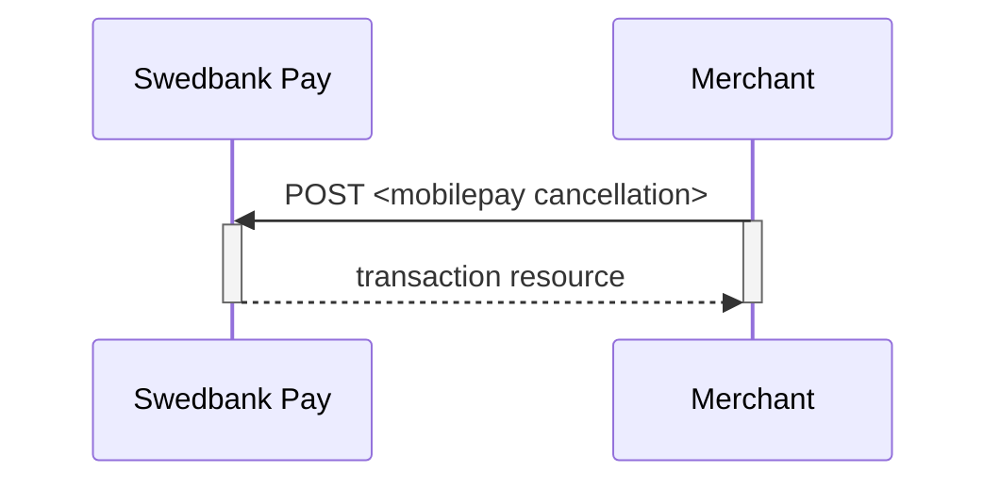
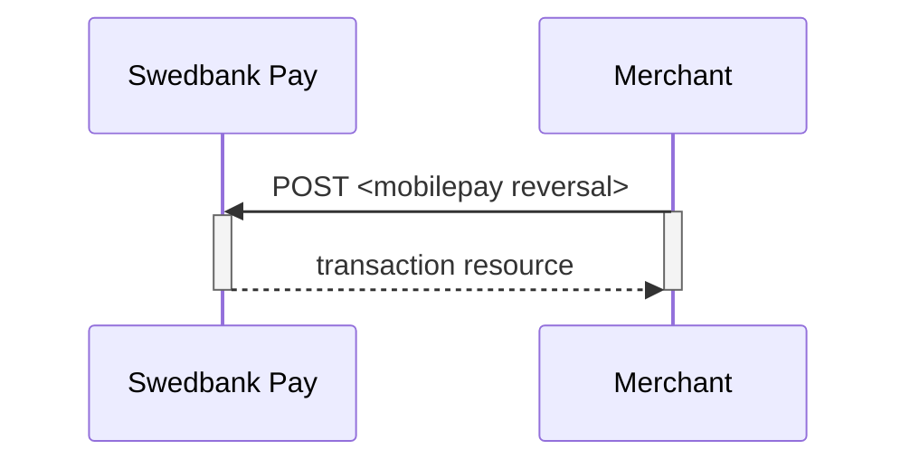



## Payment Resource

### Create Payment

To create a Mobile Pay payment, you perform an HTTP `POST` against the
`/psp/mobilepay/payments` resource. Please read the [general
information][general-http-info] on how to compose a valid HTTP request before
proceeding.

An example of a payment creation request is provided below. Each individual
Property of the JSON document is described in the following section. Use the
[expand][technical-reference-expand] request parameter to get a response that
includes one or more expanded sub-resources inlined.

{:.code-header}
**Request**

```http
POST /psp/mobilepay/payments HTTP/1.1
Host: api.externalintegration.payex.com
Authorization: Bearer <AccessToken>
Content-Type: application/json

{
    "payment": {
        "operation": "Purchase",
        "intent": "Authorization",
        "currency": "DKK",
        "prices": [{
            "type": "MobilePay",
            "amount": 1500,
            "vatAmount": 0
        }],
        "description": "Test Purchase",
        "payerReference": "AB1234",
        "userAgent": "Mozilla/5.0...",
        "language": "da-DK",
        "urls": {
            "hostUrls": ["https://example.com", "https://example2.com"],
            "completeUrl": "https://example.com/payment-completed",
            "cancelUrl": "https://example.com/payment-canceled",
            "callbackUrl": "https://example.com/payment-callback",
            "logoUrl": "https://example.com/logo.png",
            "termsOfServiceUrl": "https://example.com/terms.pdf"
        },
        "payeeInfo": {
            "payeeId": "bbb33dc5-f44e-4af6-afc0-27fb5fa2f63a",
            "payeeReference": "ref-123456",
            "payeeName": "Merchant1",
            "productCategory": "A123",
            "orderReference": "or-123456",
            "subsite": "MySubsite"
        },
        "prefillInfo": {
            "msisdn": "+4792345678"
        },
        "mobilepay": {
            "shoplogoUrl": "https://example.com/shop-logo.png"
        }
    }
}
```

{:.table .table-striped}
| Required | Property                        | Type         | Description                                                                                                                                                                                                 |
| :------: | :------------------------------ | :----------- | :---------------------------------------------------------------------------------------------------------------------------------------------------------------------------------------------------------- |
|    ✔︎    | `payment`                       | `object`     | The `payment`object.                                                                                                                                                                                        |
|    ✔︎    | └➔&nbsp;`operation`             | `string`     | `Purchase`                                                                                                                                                                                                  |
|    ✔︎    | └➔&nbsp;`intent`                | `string`     | `Authorization`                                                                                                                                                                                             |
|    ✔︎    | └➔&nbsp;`currency`              | `string`     | `DKK`                                                                                                                                                                                                       |
|    ✔︎    | └➔&nbsp;`prices.type`           | `string`     | `MobilePay`                                                                                                                                                                                                 |
|    ✔︎    | └➔&nbsp;`prices.amount`         | `integer`    | Amount is entered in the lowest momentary units of the selected currency. E.g.`10000`=`100.00 DKK`, `5000`=`50.00 DKK`                                                                                      |
|    ✔︎    | └➔&nbsp;`prices.vatAmount`      | `integer`    | If the amount given includes VAT, this may be displayed for the user in the payment page (redirect only). Set to 0 (zero) if this is not relevant.                                                          |
|    ✔︎    | └➔&nbsp;`description`           | `string(40)` | A textual description max 40 characters of the purchase.                                                                                                                                                    |
|          | └➔&nbsp;`payerReference`        | `string`     | The reference to the payer (consumer/end-user) from the merchant system, like mobile number, customer number etc.                                                                                           |
|    ✔︎    | └➔&nbsp;`userAgent`             | `string`     | The user agent reference of the consumer's browser - [see user agent definition][user-agent]                                                                                                                |
|    ✔︎    | └➔&nbsp;`language`              | `string`     | `da-DK`, `nb-NO`, `sv-SE`.                                                                                                                                                                                  |
|    ✔︎    | └➔&nbsp;`urls`                  | `object`     | This object hold information about various URIs you can send in.                                                                                                                                            |
|    ✔︎    | └─➔&nbsp;`hostUrls`             | `array`      | The array of URIs valid for embedding of Swedbank Pay Hosted Views.                                                                                                                                         |
|    ✔︎    | └─➔&nbsp;`completeUrl`          | `string`     | The URI that Swedbank Pay will redirect back to when the payment page is completed.                                                                                                                         |
|    ✔︎    | └─➔&nbsp;`cancelUrl`            | `string`     | The URI that Swedbank Pay will redirect back to when the user presses the cancel button in the payment page.                                                                                                |
|          | └─➔&nbsp;`callbackUrl`          | `string`     | The URI that Swedbank Pay will perform an HTTP POST against every time a transaction is created on the payment. See [callback][technical-reference-callback] for details.                                   |
|          | └─➔&nbsp;`logoUrl`              | `string`     | The URI that will be used for showing the customer logo. Must be a picture with at most 50px height and 400px width. Require https.                                                                         |
|          | └─➔&nbsp;`termsOfServiceUrl`    | `string`     | A URI that contains your terms and conditions for the payment, to be linked on the payment page. Require https.                                                                                             |
|    ✔︎    | └➔&nbsp;`payeeInfo`             | `object`     | This object holds information about the payee of the payment.                                                                                                                                               |
|    ✔︎    | └─➔&nbsp;`payeeId`              | `string`     | This is the unique id that identifies this payee (like merchant) set by Swedbank Pay.                                                                                                                       |
|    ✔︎    | └─➔&nbsp;`payeeReference`       | `string(35)` | A unique reference from the merchant system. It is set per operation to ensure an exactly-once delivery of a transactional operation. See [payeeReference][technical-reference-payeeReference] for details. |
|          | └─➔&nbsp;`payeeName`            | `string`     | The payee name (like merchant name) that will be displayed to consumer when redirected to Swedbank Pay.                                                                                                     |
|          | └─➔&nbsp;`productCategory`      | `string`     | A product category or number sent in from the payee/merchant. This is not validated by Swedbank Pay, but will be passed through the payment process and may be used in the settlement process.              |
|          | └─➔&nbsp;`orderReference`       | `string(50)` | The order reference should reflect the order reference found in your systems to easily keep track of orders.                                                                                                |
|          | └─➔&nbsp;`subsite`              | `string(40)` | The subsite field can be used to perform split settlement on the payment. The subsites must be resolved with Swedbank Pay reconciliation before being used.                                                 |
|          | └➔&nbsp;`prefillInfo.msisdn`    | `string`     | Number will be prefilled on payment page, if valid.                                                                                                                                                         |
|          | └➔&nbsp;`mobilepay.shoplogoUrl` | `boolean`    | The URI that will be used for showing the customer logo. Must be a picture with at most 50px height and 400px width. Requires https.                                                                        |

{:.code-header}
**Response**

```http
HTTP/1.1 200 OK
Content-Type: application/json

{
  "payment": {
    "id": "/psp/mobilepay/payments/{{ page.paymentId }}",
    "number": 1234567890,
    "created": "2016-09-14T13:21:29.3182115Z",
    "updated": "2016-09-14T13:21:57.6627579Z",
    "instrument": "MobilePay",
    "operation": "Purchase",
    "intent": "Authorization",
    "state": "Ready",
    "currency": "DKK",
    "amount": 1500,
    "remainingCaptureAmount": 1500,
    "remainingCancellationAmount": 1500,
    "remainingReversalAmount": 0,
    "description": "Test Purchase",
    "payerReference": "AB1234",
    "initiatingSystemUserAgent": "PostmanRuntime/3.0.1",
    "userAgent": "Mozilla/5.0...",
    "language": "da-DK",
    "prices": { "id": "/psp/mobilepay/payments/{{ page.paymentId }}/prices" },
    "transactions": { "id": "/psp/mobilepay/payments/{{ page.paymentId }}/transactions" },
    "authorizations": { "id": "/psp/mobilepay/payments/{{ page.paymentId }}/authorizations" },
    "reversals": { "id": "/psp/mobilepay/payments/{{ page.paymentId }}/reversals" },
    "cancellations": { "id": "/psp/mobilepay/payments/{{ page.paymentId }}/cancellations" },
    "urls" : { "id": "/psp/mobilepay/payments/{{ page.paymentId }}/urls" },
    "payeeInfo" : { "id": "/psp/mobilepay/payments/{{ page.paymentId }}/payeeInfo" },
    "settings": { "id": "/psp/mobilepay/payments/{{ page.paymentId }}/settings" }
  },
  "operations": [
    {
      "method": "POST",
      "href": "https://ecom.externalintegration.payex.com/psp/mobilepay/payments/{{ page.paymentId }}/authorizations",
      "rel": "create-authorization"
    },
    {
      "method": "PATCH",
      "href": "https://ecom.externalintegration.payex.com/psp/mobilepay/payments/{{ page.paymentId }}",
      "rel": "update-payment-abort"
    },
    {
      "method": "GET",
      "href": "https://ecom.externalintegration.payex.com/mobilepay/payments/authorize/9fb05a835f2fc227dc7bca9abaf649b918ba8a572deb448bff543dd5806dacb7",
      "rel": "redirect-authorization"
    }
  ]
}
```

### Operations

A payment resource has a set of operations that can be performed on it,
from its creation to its completion.
The operations available at any given time vary between payment instruments and
depends on the current state of the payment resource.
A list of possible operations for Swish Payments and their explanation
is given below.

{:.code-header}
**Operations**

```js
{
    "operations": [
    {
      "method": "POST",
      "href": "https://ecom.externalintegration.payex.com/psp/mobilepay/payments/{{ page.paymentId }}/authorizations",
      "rel": "create-authorization"
    },
    {
      "method": "PATCH",
      "href": "https://ecom.externalintegration.payex.com/psp/mobilepay/payments/{{ page.paymentId }}",
      "rel": "update-payment-abort"
    },
    {
      "method": "GET",
      "href": "https://ecom.externalintegration.payex.com/mobilepay/payments/authorize/9fb05a835f2fc227dc7bca9abaf649b918ba8a572deb448bff543dd5806dacb7",
      "rel": "redirect-authorization"
    }
  ]
}
```

{:.table .table-striped}
| Property | Description                                                         |
| :------- | :------------------------------------------------------------------ |
| `href`   | The target URI to perform the operation against.                    |
| `rel`    | The name of the relation the operation has to the current resource. |
| `method` | The HTTP method to use when performing the operation.               |

The operations should be performed as described in each response and not as
described here in the documentation.
Always use the `href` and `method` as specified in the response by finding the
appropriate operation based on its `rel` value.
The only thing that should be hard coded in the client is the value of
the `rel` and the request that will be sent in the HTTP body of the
request for the given operation.

{:.table .table-striped}
| Operation                | Description                                                                                      |
| :----------------------- | :----------------------------------------------------------------------------------------------- |
| `update-payment-abort`   | [Aborts][technical-reference-abort] the payment before any financial transactions are performed. |
| `redirect-authorization` | Used to redirect the consumer to Swedbank Pay Payments and the authorization UI.                 |

## Options after posting a payment

* **Abort**: It is possible to [abort a payment][technical-reference-abort]
  if the payment has no successful transactions.
* If the payment shown above has a completed `authorization`,
  you will need to implement the `Capture` and `Cancel` requests.
* For reversals, you will need to implement the `Reversal` request.
* **If CallbackURL is set**: Whenever changes to the payment occur
  a [Callback request][technical-reference-callback] will be posted to
  the `callbackUrl`, generated when the payment was created.

## Capture

The `captures` resource lists the capture transactions performed on a
specific payment.

{:.code-header}
**Request**

```http
GET /psp/mobilepay/payments/e7919b4f-81a2-4ffb-ec40-08d617d580a2/captures HTTP/1.1
Host: {{ page.apiUrl }}
Authorization: Bearer <AccessToken>
Content-Type: application/json
```

{:.code-header}
**Response**

```http
HTTP/1.1 200 OK
Content-Type: application/json

{
    "payment": "/psp/mobilepay/payments/{{ page.paymentId }}",
    "captures": {
        "id": "/psp/mobilepay/payments/{{ page.paymentId }}/captures",
        "captureList": [{
            "id": "/psp/mobilepay/payments/{{ page.paymentId }}/captures/{{ page.transactionId }}",
            "transaction": {
                "id": "/psp/mobilepay/payments/{{ page.paymentId }}/transactions/{{ page.transactionId }}",
                "created": "2016-09-14T01:01:01.01Z",
                "updated": "2016-09-14T01:01:01.03Z",
                "type": "Capture",
                "state": "Completed",
                "number": 1234567890,
                "amount": 1000,
                "vatAmount": 250,
                "description": "14L of Milk",
                "payeeReference": "AH123456",
                "failedReason": "",
                "isOperational": false,
                "operations": []
            }
        }]
    }
}
```

{:.table .table-striped}
| Property              | Type     | Description                                                                            |
| :-------------------- | :------- | :------------------------------------------------------------------------------------- |
| `payment`             | `string` | The relative URI of the payment this capture transaction belongs to.                   |
| `capture`             | `string` | The capture object.                                                                    |
| └➔&nbsp;`id`          | `string` | The relative URI of the created capture transaction.                                   |
| └➔&nbsp;`transaction` | `object` | The object representation of the generic [transaction resource][transaction-resource]. |

## Create capture transaction

A `capture` transaction - to withdraw money from the payer's Mobile Pay - can be
created after a completed authorization by performing the `create-capture`
operation.

{:.code-header}
**Request**

```http
POST /psp/mobilepay/payments/e7919b4f-81a2-4ffb-ec40-08d617d580a2/captures HTTP/1.1
Host: {{ page.apiUrl }}
Authorization: Bearer <AccessToken>
Content-Type: application/json

{
    "transaction": {
        "amount": 1000,
        "vatAmount": 250,
        "payeeReference": 1234,
        "description" : "description for transaction"
    }
}
```

{:.table .table-striped}
| Required | Property                 | Type         | Description                                                                                                               |
| :------: | :----------------------- | :----------- | :------------------------------------------------------------------------------------------------------------------------ |
|    ✔︎    | `transaction`            | `object`     | Object representing the capture transaction.                                                                              |
|    ✔︎    | └➔&nbsp;`amount`         | `integer`    | Amount entered in the lowest momentary units of the selected currency. E.g. `10000` = `100.00 DKK`, `5000` = `50.00 DKK`. |
|    ✔︎    | └➔&nbsp;`vatAmount`      | `integer`    | Amount entered in the lowest momentary units of the selected currency. E.g. `10000` = `100.00 DKK`, `5000` = `50.00 DKK`. |
|    ✔︎    | └➔&nbsp;`description`    | `string`     | A textual description of the capture transaction.                                                                         |
|    ✔︎    | └➔&nbsp;`payeeReference` | `string(50)` | A unique reference for the capture transaction. See [payeeReference][payee-reference] for details.                        |

The `capture` resource contains information about the capture transaction made
against a MobilePay payment.
You can return a specific capture transaction by adding the transaction id to
 the `GET` request.

{:.code-header}
**Response**

```http
HTTP/1.1 200 OK
Content-Type: application/json

{
    "payment": "/psp/mobilepay/payments/{{ page.paymentId }}",
    "captures": {
        "id": "/psp/mobilepay/payments/{{ page.paymentId }}/captures",
        "captureList": [
            {
                "id": "/psp/mobilepay/payments/{{ page.paymentId }}/captures/{{ page.transactionId }}",
                "transaction": {
                    "id": "/psp/mobilepay/payments/{{ page.paymentId }}/transactions/{{ page.transactionId }}",
                    "created": "2018-09-11T12:14:20.3155727Z",
                    "updated": "2018-09-11T12:14:21.3834204Z",
                    "type": "Capture",
                    "state": "Completed",
                    "number": 75100000126,
                    "amount": 1000,
                    "vatAmount": 250,
                    "description": "description for transaction",
                    "payeeReference": "1234",
                    "isOperational": false,
                    "operations": []
                }
            }
        ]
    }
}
```

{:.table .table-striped}
| Property              | Type     | Description                                                                            |
| :-------------------- | :------- | :------------------------------------------------------------------------------------- |
| `payment`             | `string` | The relative URI of the payment this capture transaction belongs to.                   |
| `capture`             | `string` | The capture transaction object.                                                        |
| └➔&nbsp;`id`          | `string` | The relative URI of the created capture transaction.                                   |
| └➔&nbsp;`transaction` | `object` | The object representation of the generic [transaction resource][transaction-resource]. |

## Capture Sequence

`Capture` can only be done on a authorized transaction.
It is possible to do a part-capture where you only capture a smaller amount
than the authorization amount.
You can later do more captures on the sam payment upto the total
authorization amount.



## Cancellations

The `cancellations` resource lists the cancellation transactions on a
specific payment.

{:.code-header}
**Request**

```http
GET /psp/mobilepay/payments/e7919b4f-81a2-4ffb-ec40-08d617d580a2/cancellations HTTP/1.1
Host: {{ page.apiUrl }}
Authorization: Bearer <AccessToken>
Content-Type: application/json
```

{:.code-header}
**Response**

```http
HTTP/1.1 200 OK
Content-Type: application/json

{
    "payment": "/psp/mobilepay/payments/{{ page.paymentId }}",
    "cancellations": {
        "id": "/psp/mobilepay/payments/{{ page.paymentId }}/cancellations",
        "cancellationList": [
            {
                "id": "/psp/mobilepay/payments/{{ page.paymentId }}/cancellations/{{ page.transactionId }}",
                "transaction": {
                    "id": "/psp/mobilepay/payments/{{ page.paymentId }}/transactions/{{ page.transactionId }}",
                    "created": "2018-09-11T12:19:38.1247314Z",
                    "updated": "2018-09-11T12:19:38.3059149Z",
                    "type": "Cancellation",
                    "state": "Completed",
                    "number": 75100000127,
                    "amount": 500,
                    "vatAmount": 0,
                    "description": "Test Cancellation",
                    "payeeReference": "ABC123",
                    "isOperational": false,
                    "operations": []
                }
            }
        ]
    }
}
```

{:.table .table-striped}
| Property                     | Type     | Description                                                                         |
| :--------------------------- | :------- | :---------------------------------------------------------------------------------- |
| `payment`                    | `string` | The relative URI of the payment this list of cancellation transactions belong to.   |
| `cancellations`              | `string` | The cancellations object.                                                           |
| └➔&nbsp;`id`                 | `string` | The relative URI of the current cancellations resource.                             |
| └➔&nbsp;`cancellationList`   | `array`  | The array of the cancellation transaction objects.                                  |
| └➔&nbsp;`cancellationList[]` | `object` | The object representation of the cancellation transaction resource described below. |

<<<<<<< HEAD

### Finalize

Finalizing a preauthorized payment is done as a `PATCH`  after a successful
`Authorization` transaction has been created.
The common use-case for the finalize operation is to authorize the payment
(that has the preauthorization intent) and complete all payment related
activities as soon as possible - in order to complete (finalize) everything
server-to-server afterwards.
The only allowed activity is `Finalize`. To use the operation, you should
perform a `GET` on the payment after the user returns from the
`redirect-authorization` operation and find the operation
`update-authorization-finalize`.

{:.code-header}
**Request**

```http
<<<<<<< HEAD
PATCH /psp/creditcard/payments/5adc265f-f87f-4313-577e-08d3dca1a26c/authorizations/<transactionId> HTTP/1.1
Host: {{ page.apiUrl }}
=======
PATCH /psp/creditcard/payments/{{ page.paymentId }}/authorizations/<transactionId> HTTP/1.1
Host: api.externalintegration.payex.com
>>>>>>> DX-502 Update mobile pay after payment GUIDs
Authorization: Bearer <AccessToken>
Content-Type: application/json

{
    "transaction": {
        "activity": "Finalize"
    }
}
```

{:.table .table-striped}
| ✔︎   | Property               | Type     | Description |
| :--- | :--------------------- | :------- | :---------- |
| ✔︎   | `transaction.activity` | `string` | `Finalize`  |

{:.code-header}
**Response**

```http
HTTP/1.1 200 OK
Content-Type: application/json

{
    "payment": "/psp/creditcard/payments/{{ page.paymentId }}",
    "authorization": {
        "id": "/psp/creditcard/payments/{{ page.paymentId }}/authorizations/{{ page.transactionId }}",
        "paymentToken": "{{ page.transactionId }}",
        "maskedPan": "123456xxxxxx1234",
        "expireDate": "mm/yyyy",
        "panToken": "{{ page.transactionId }}",
        "cardBrand": "Visa|MC",
        "cardType": "Credit Card|Debit Card",
        "issuingBank": "UTL MAESTRO",
        "countryCode": "999",
        "acquirerTransactionType": "3DSECURE|SSL",
        "acquirerStan": "39736",
        "acquirerTerminalId": "39",
        "acquirerTransactionTime": "2017-08-29T13:42:18Z",
        "authenticationStatus": "Y|A|U|N",
        "transaction": {
            "id": "/psp/creditcard/payments/{{ page.paymentId }}/transactions/{{ page.transactionId }}",
            "created": "2016-09-14T01:01:01.01Z",
            "updated": "2016-09-14T01:01:01.03Z",
            "type": "Authorization",
            "state": "Initialized",
            "number": 1234567890,
            "amount": 1000,
            "vatAmount": 250,
            "description": "Test transaction",
            "payeeReference": "AH123456",
            "failedReason": "",
            "isOperational": true,
            "operations": [
                {
<<<<<<< HEAD
                    "href": "https://{{ page.apiUrl }}/psp/creditcard/payments/5adc265f-f87f-4313-577e-08d3dca1a26c",
=======
                    "href": "https://api.externalintegration.payex.com/psp/creditcard/payments/{{ page.paymentId }}",
>>>>>>> DX-502 Update mobile pay after payment GUIDs
                    "rel": "edit-authorization",
                    "method": "PATCH"
                }
            ]
        }
    }
}
```

{:.table .table-striped}
| Property        | Type     | Description                                                                             |
| :-------------- | :------- | :-------------------------------------------------------------------------------------- |
| `payment`       | `string` | The relative URI of the payment this finalize transaction resource belongs to.          |
| `authorization` | `object` | The object representation of the [`authorization` transaction resource][authorization]. |

### Create cancellation transaction

=======

## Create cancellation transaction

>>>>>>> DX-502 Mobile pay after payment more fixes to tables and examples

Perform the `create-cancel` operation to cancel a previously created payment.
You can only cancel a payment - or part of payment - not yet captured.

{:.code-header}
**Request**

```http
<<<<<<< HEAD
POST /psp/mobilepay/payments/e7919b4f-81a2-4ffb-ec40-08d617d580a2/cancellations HTTP/1.1
Host: {{ page.apiUrl }}
=======
POST /psp/mobilepay/payments/{{ page.paymentId }}/cancellations HTTP/1.1
Host: api.externalintegration.payex.com
>>>>>>> DX-502 Update mobile pay after payment GUIDs
Authorization: Bearer <AccessToken>
Content-Type: application/json

{
    "transaction": {
        "description": "Test Cancellation",
        "payeeReference": "ABC123"
    }
}
```

{:.table .table-striped}
| ✔︎   | Property                 | Type         | Description                                                                                             |
| :--- | :----------------------- | :----------- | :------------------------------------------------------------------------------------------------------ |
| ✔︎   | `transaction`            | `string`     | The transaction object contains information about this cancellation.                                    |
| ✔︎   | └➔&nbsp;`description`    | `string`     | A textual description of the reason for the cancellation.                                               |
| ✔︎   | └➔&nbsp;`payeeReference` | `string(50)` | A unique reference for the cancellation transaction. See [payeeReference][payee-reference] for details. |

The `cancel` resource contains information about a cancellation transaction
made against a payment.
You can return a specific cancellation transaction by adding the transaction
id to the `GET` request.

{:.code-header}
**Response**

```http
HTTP/1.1 200 OK
Content-Type: application/json

{
    "payment": "/psp/mobilepay/payments/{{ page.paymentId }}",
    "cancellation": {
        "id": "/psp/mobilepay/payments/{{ page.paymentId }}/cancellations/{{ page.transactionId }}",
        "transaction": {
            "id": "/psp/mobilepay/payments/{{ page.paymentId }}/transactions/{{ page.transactionId }}",
            "created": "2018-09-11T12:19:38.1247314Z",
            "updated": "2018-09-11T12:19:38.3059149Z",
            "type": "Cancellation",
            "state": "Completed",
            "number": 75100000127,
            "amount": 500,
            "vatAmount": 0,
            "description": "Test Cancellation",
            "payeeReference": "ABC123",
            "isOperational": false,
            "operations": []
        }
    }
}
```

{:.table .table-striped}
| Property              | Type     | Description                                                                            |
| :-------------------- | :------- | :------------------------------------------------------------------------------------- |
| `payment`             | `string` | The relative URI of the payment this cancellation transaction belongs to.              |
| `cancellation`        | `string` | The current cancellation transaction object.                                           |
| └➔&nbsp;`id`          | `string` | The relative URI of the current cancellation transaction resource.                     |
| └➔&nbsp;`transaction` | `object` | The object representation of the generic [transaction resource][transaction-resource]. |

## Cancel Sequence

Cancel can only be done on a authorized transaction.
If you do cancel after doing a part-capture you will cancel the different
between the capture amount and the authorization amount.



## Reversals

The `reversals` resource lists the reversal transactions performed on a
specific payment.

{:.code-header}
**Request**

```http
<<<<<<< HEAD
GET /psp/mobilepay/payments/e7919b4f-81a2-4ffb-ec40-08d617d580a2/reversals HTTP/1.1
Host: {{ page.apiUrl }}
=======
GET /psp/mobilepay/payments/{{ page.paymentId }}/reversals HTTP/1.1
Host: api.externalintegration.payex.com
>>>>>>> DX-502 Update mobile pay after payment GUIDs
Authorization: Bearer <AccessToken>
Content-Type: application/json
```

{:.code-header}
**Response**

```http
HTTP/1.1 200 OK
Content-Type: application/json

{
    "payment": "/psp/mobilepay/payments/{{ page.paymentId }}",
    "reversals": {
        "id": "/psp/mobilepay/payments/{{ page.paymentId }}/reversal",
        "reversalList": [{
            "id": "/psp/mobilepay/payments/{{ page.paymentId }}/reversal/{{ page.transactionId }}",
            "transaction": {
                "id": "/psp/mobilepay/payments/{{ page.paymentId }}/transactions/{{ page.transactionId }}",
                "created": "2016-09-14T01:01:01.01Z",
                "updated": "2016-09-14T01:01:01.03Z",
                "type": "Reversal",
                "state": "Completed",
                "number": 1234567890,
                "amount": 1000,
                "vatAmount": 250,
                "description": "Test transaction",
                "payeeReference": "AH123456",
                "failedReason": "",
                "isOperational": false,
                "operations": []
            }
        }]
    }
}
```

{:.table .table-striped}
| Property                 | Type     | Description                                                                                          |
| :----------------------- | :------- | :--------------------------------------------------------------------------------------------------- |
| `payment`                | `string` | The relative URI of the payment that the reversal transactions belong to.                            |
| `reversals`              | `string` | The created reversal transaction object.                                                             |
| └➔&nbsp;`id`             | `string` | The relative URI of the created reversal transaction.                                                |
| └➔&nbsp;`reversalList`   | `array`  | The array of reversal transaction objects.                                                           |
| └➔&nbsp;`reversalList[]` | `object` | The reversal transaction object representation of the reversal transaction resource described below. |

## Create reversal transaction

The `create-reversal` operation reverses a previously created and
captured payment.

{:.code-header}
**Request**

```http
<<<<<<< HEAD
POST /psp/mobilepay/payments/e7919b4f-81a2-4ffb-ec40-08d617d580a2/reversals HTTP/1.1
Host: {{ page.apiUrl }}
=======
POST /psp/mobilepay/payments/{{ page.paymentId }}/reversals HTTP/1.1
Host: api.externalintegration.payex.com
>>>>>>> DX-502 Update mobile pay after payment GUIDs
Authorization: Bearer <AccessToken>
Content-Type: application/json

{
    "transaction": {
        "amount": 1000,
        "vatAmount": 0,
        "description" : "Test Reversal",
        "payeeReference": "DEF456"
    }
}
```

{:.table .table-striped}
| ✔︎   | Property                 | Type         | Description                                                                                                               |
| :--- | :----------------------- | :----------- | :------------------------------------------------------------------------------------------------------------------------ |
| ✔︎   | `transaction`            | `integer`    | The reversal `transaction`.                                                                                               |
| ✔︎   | └➔&nbsp;`amount`         | `integer`    | Amount entered in the lowest momentary units of the selected currency. E.g. `10000` = `100.00 DKK`, `5000` = `50.00 DKK`. |
| ✔︎   | └➔&nbsp;`vatAmount`      | `integer`    | Amount entered in the lowest momentary units of the selected currency. E.g. `10000` = `100.00 DKK`, `5000` = `50.00 DKK`. |
| ✔︎   | └➔&nbsp;`description`    | `string`     | A textual description of the capture                                                                                      |
| ✔︎   | └➔&nbsp;`payeeReference` | `string(50)` | A unique reference for the reversal transaction. See [payeeReference][payee-reference] for details.                       |

The `reversal` resource contains information about a reversal transaction made
against a payment.
You can return a specific reversal transaction by adding the transaction id to
the `GET` request.

{:.code-header}
**Response**

```http
HTTP/1.1 200 OK
Content-Type: application/json

{
    "payment": "/psp/mobilepay/payments/{{ page.paymentId }}",
    "reversal": {
        "id": "/psp/mobilepay/payments/{{ page.paymentId }}/reversals/{{ page.transactionId }}",
        "transaction": {
            "id": "/psp/mobilepay/payments/{{ page.paymentId }}/transactions/{{ page.transactionId }}",
            "created": "2018-09-11T12:25:54.339611Z",
            "updated": "2018-09-11T12:25:54.5738079Z",
            "type": "Reversal",
            "state": "Completed",
            "number": 75100000128,
            "amount": 1000,
            "vatAmount": 0,
            "description": "Reversal reason",
            "payeeReference": "DEF456",
            "isOperational": false,
            "operations": []
        }
    }
}
```

{:.table .table-striped}
| Property              | Type     | Description                                                                            |
| :-------------------- | :------- | :------------------------------------------------------------------------------------- |
| `payment`             | `string` | The relative URI of the payment this capture transaction belongs to.                   |
| `reversal`            | `string` | The reversal transaction.                                                              |
| └➔&nbsp;`id`          | `string` | The relative URI of the created capture transaction.                                   |
| └➔&nbsp;`transaction` | `object` | The object representation of the generic [transaction resource][transaction-resource]. |

## Reversal Sequence

Reversal can only be done on a payment where there are some
captured amount not yet reversed.





[authorization]: /payments/mobile-pay/redirect#type-of-authorization-intent
[mobilepay-cancel]: /payments/mobile-pay/other-features#cancel-sequence
[mobilepay-capture]: /payments/mobile-pay/other-features#capture-sequence
[mobilepay-reversal]: /payments/mobile-pay/other-features#reversal-sequence
[payee-reference]: /payments/mobile-pay/other-features#payee-reference
[technical-reference-abort]: /payments/mobile-pay/other-features#abort-a-payment
[technical-reference-callback]: /payments/mobile-pay/other-features#callback
[technical-reference-payeeReference]: /payments/mobile-pay/other-features#payee-reference
[transaction-resource]: /payments/mobile-pay/other-features#transactions
