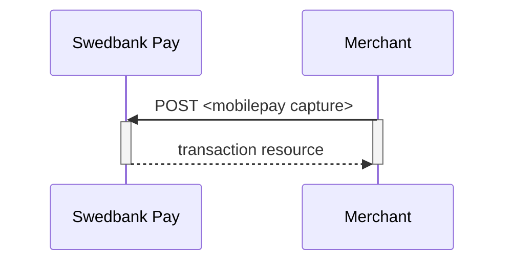
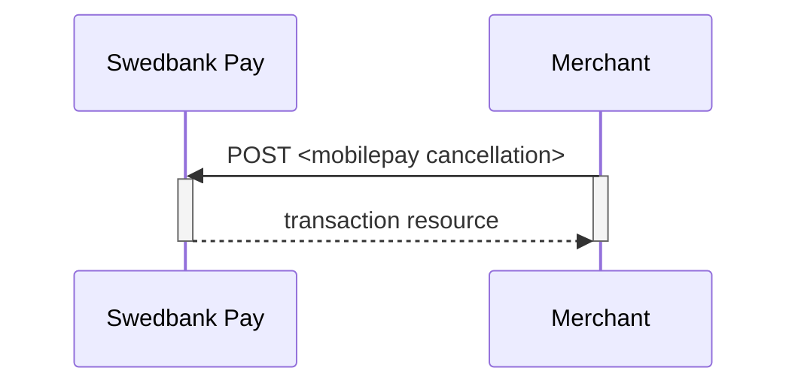
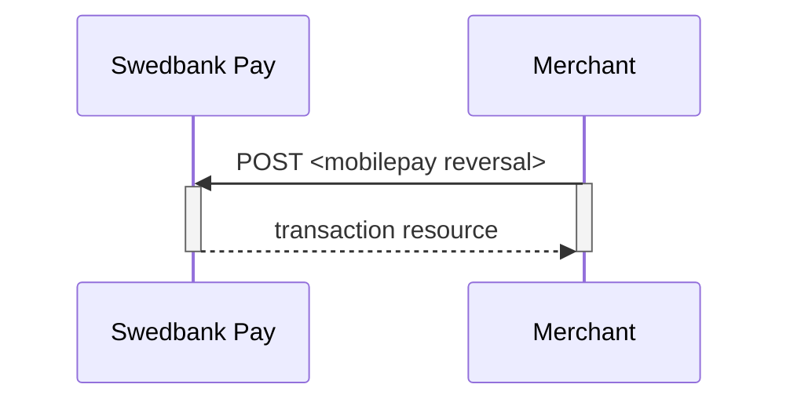

## Options after posting a payment

* **Abort**: It is possible to [abort a payment][technical-reference-abort]
  if the payment has no successful transactions.
* If the payment shown above has a completed `authorization`,
  you will need to implement the `Capture` and `Cancel` requests.
* For reversals, you will need to implement the `Reversal` request.
* **If CallbackURL is set**: Whenever changes to the payment occur
  a [Callback request][technical-reference-callback] will be posted to
  the `callbackUrl`, generated when the payment was created.

## Capture



## Create capture transaction

A `capture` transaction - to withdraw money from the payer's MobilePay - can be
created after a completed authorization by performing the `create-capture`
operation.

{:.code-header}
**Request**

```http
POST /psp/mobilepay/payments/{{ page.payment_id }}/captures HTTP/1.1
Host: {{ page.api_host }}
Authorization: Bearer <AccessToken>
Content-Type: application/json

{
    "transaction": {
        "amount": 1000,
        "vatAmount": 250,
        "payeeReference": 1234,
        "description" : "description for transaction"
    }
}
```

{:.table .table-striped}
| Required | Field                    | Type         | Description                                                                                          |
| :------: | :----------------------- | :----------- | :--------------------------------------------------------------------------------------------------- |
|    ✔︎    | `transaction`            | `object`     | Object representing the capture transaction.                                                         |
|    ✔︎    | └➔&nbsp;`amount`         | `integer`    |                                                             |
|    ✔︎    | └➔&nbsp;`vatAmount`      | `integer`    |                                                          |
|    ✔︎    | └➔&nbsp;`description`    | `string`     | A textual description of the capture transaction.                                                    |
|    ✔︎    | └➔&nbsp;`payeeReference` | `string(50)` | A unique reference for the capture transaction. See [`payeeReference`][payee-reference] for details. |



## Capture Sequence

`Capture` can only be done on a authorized transaction.
It is possible to do a part-capture where you only capture a smaller amount
than the authorization amount.
You can later do more captures on the same payment up to the total
authorization amount.



## Cancellations

The `cancellations` resource lists the cancellation transactions on a
specific payment.

### Create cancellation transaction

Perform the `create-cancel` operation to cancel a previously created payment.
You can only cancel a payment - or part of payment - not yet captured.

{:.code-header}
**Request**

```http
POST /psp/mobilepay/payments/{{ page.payment_id }}/cancellations HTTP/1.1
Host: {{ page.api_host }}
Authorization: Bearer <AccessToken>
Content-Type: application/json

{
    "transaction": {
        "description": "Test Cancellation",
        "payeeReference": "ABC123"
    }
}
```

{:.table .table-striped}
| ✔︎   | Field                    | Type         | Description                                                                                               |
| :--- | :----------------------- | :----------- | :-------------------------------------------------------------------------------------------------------- |
| ✔︎   | `transaction`            | `string`     | The transaction object contains information about this cancellation.                                      |
| ✔︎   | └➔&nbsp;`description`    | `string`     | A textual description of the reason for the cancellation.                                                 |
| ✔︎   | └➔&nbsp;`payeeReference` | `string(50)` | A unique reference for the cancellation transaction. See [`payeeReference`][payee-reference] for details. |



### Finalize

Finalizing a preauthorized payment is done as a `PATCH`  after a successful
`Authorization` transaction has been created.
The common use-case for the finalize operation is to authorize the payment
(that has the preauthorization intent) and complete all payment related
activities as soon as possible - in order to complete (finalize) everything
server-to-server afterwards.
The only allowed activity is `Finalize`. To use the operation, you should
perform a `GET` on the payment after the user returns from the
`redirect-authorization` operation and find the operation
`update-authorization-finalize`.

{:.code-header}
**Request**

```http
PATCH /psp/creditcard/payments/{{ page.payment_id }}/authorizations/{{ page.transaction_id }} HTTP/1.1
Host: {{ page.api_host }}
Authorization: Bearer <AccessToken>
Content-Type: application/json

{
    "transaction": {
        "activity": "Finalize"
    }
}
```

{:.table .table-striped}
| ✔︎   | Field                  | Type     | Description |
| :--- | :--------------------- | :------- | :---------- |
| ✔︎   | `transaction.activity` | `string` | `Finalize`  |



## Cancel Sequence

Cancel can only be done on a authorized transaction.
If you do cancel after doing a part-capture you will cancel the different
between the capture amount and the authorization amount.



## Reversals



## Create reversal transaction

The `create-reversal` operation reverses a previously created and
captured payment.

{:.code-header}
**Request**

```http
POST /psp/mobilepay/payments/{{ page.payment_id }}/reversals HTTP/1.1
Host: {{ page.api_host }}
Authorization: Bearer <AccessToken>
Content-Type: application/json

{
    "transaction": {
        "amount": 1000,
        "vatAmount": 0,
        "description" : "Test Reversal",
        "payeeReference": "DEF456"
    }
}
```

{:.table .table-striped}
| ✔︎   | Field                    | Type         | Description                                                                                           |
| :--- | :----------------------- | :----------- | :---------------------------------------------------------------------------------------------------- |
| ✔︎   | `transaction`            | `integer`    | The reversal `transaction`.                                                                           |
| ✔︎   | └➔&nbsp;`amount`         | `integer`    |                                                              |
| ✔︎   | └➔&nbsp;`vatAmount`      | `integer`    |                                                           |
| ✔︎   | └➔&nbsp;`description`    | `string`     | A textual description of the capture                                                                  |
| ✔︎   | └➔&nbsp;`payeeReference` | `string(50)` | A unique reference for the reversal transaction. See [`payeeReference`][payee-reference] for details. |



## Reversal Sequence

Reversal can only be done on a payment where there are some
captured amount not yet reversed.





[authorization]: /payments/mobile-pay/redirect#type-of-authorization-intent
[mobilepay-cancel]: /payments/mobile-pay/other-features#cancel-sequence
[mobilepay-capture]: /payments/mobile-pay/other-features#capture-sequence
[mobilepay-reversal]: /payments/mobile-pay/other-features#reversal-sequence
[payee-reference]: /payments/mobile-pay/other-features#payee-reference
[technical-reference-abort]: /payments/mobile-pay/other-features#abort-a-payment
[technical-reference-callback]: /payments/mobile-pay/other-features#callback
[technical-reference-payeeReference]: /payments/mobile-pay/other-features#payee-reference
[transaction-resource]: /payments/mobile-pay/other-features#transactions
