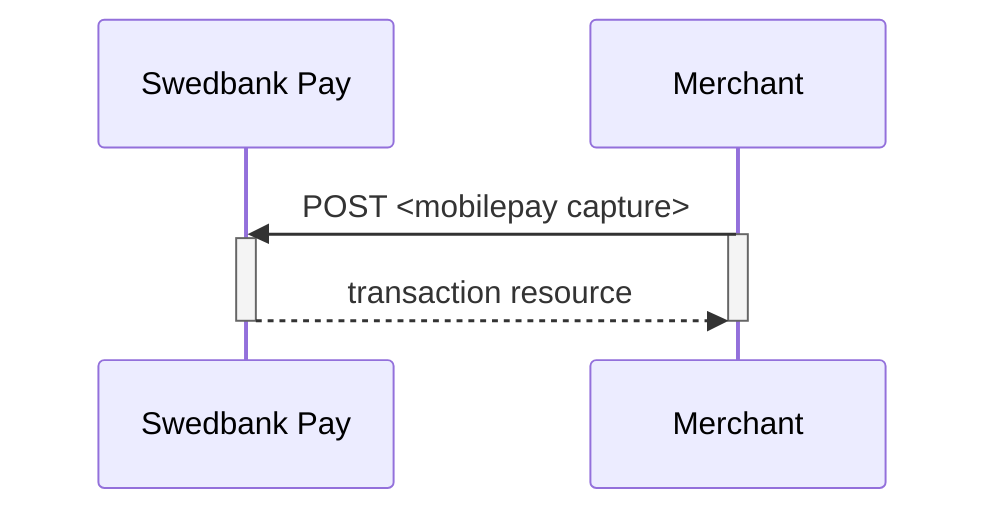
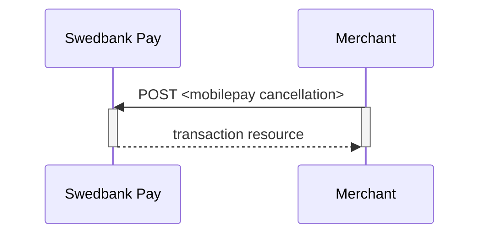
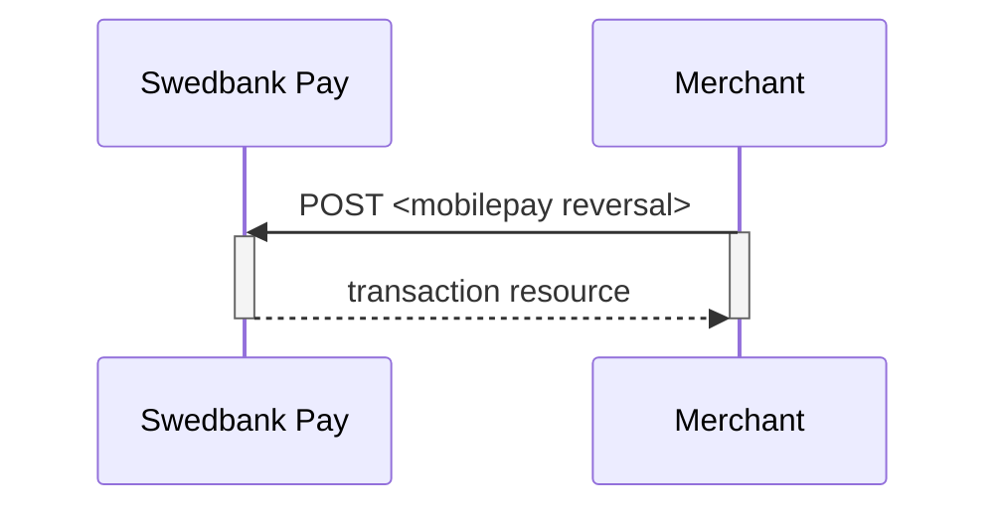



## Options after posting a payment

* **Abort**: It is possible to [abort a payment][technical-reference-abort]
  if the payment has no successful transactions.
* If the payment shown above has a completed `authorization`,
  you will need to implement the `Capture` and `Cancel` requests.
* For reversals, you will need to implement the `Reversal` request.
* **If CallbackURL is set**: Whenever changes to the payment occur
  a [Callback request][technical-reference-callback] will be posted to
  the `callbackUrl`, generated when the payment was created.

## Capture

The `captures` resource lists the capture transactions performed on a
specific payment.



## Create capture transaction

A `capture` transaction - to withdraw money from the payer's Mobile Pay - can be
created after a completed authorization by performing the `create-capture`
operation.

{:.code-header}
**Request**

```http
POST /psp/mobilepay/payments/{{ page.paymentId }}/captures HTTP/1.1
Host: {{ page.apiHost }}
Authorization: Bearer <AccessToken>
Content-Type: application/json

{
    "transaction": {
        "amount": 1000,
        "vatAmount": 250,
        "payeeReference": 1234,
        "description" : "description for transaction"
    }
}
```

{:.table .table-striped}
| Required | Property                 | Type         | Description                                                                                                               |
| :------: | :----------------------- | :----------- | :------------------------------------------------------------------------------------------------------------------------ |
|    ✔︎    | `transaction`            | `object`     | Object representing the capture transaction.                                                                              |
|    ✔︎    | └➔&nbsp;`amount`         | `integer`    | Amount entered in the lowest momentary units of the selected currency. E.g. `10000` = `100.00 DKK`, `5000` = `50.00 DKK`. |
|    ✔︎    | └➔&nbsp;`vatAmount`      | `integer`    | Amount entered in the lowest momentary units of the selected currency. E.g. `10000` = `100.00 DKK`, `5000` = `50.00 DKK`. |
|    ✔︎    | └➔&nbsp;`description`    | `string`     | A textual description of the capture transaction.                                                                         |
|    ✔︎    | └➔&nbsp;`payeeReference` | `string(50)` | A unique reference for the capture transaction. See [payeeReference][payee-reference] for details.                        |

The `capture` resource contains information about the capture transaction made
against a MobilePay payment.
You can return a specific capture transaction by adding the transaction id to
the `GET` request.



## Capture Sequence

`Capture` can only be done on a authorized transaction.
It is possible to do a part-capture where you only capture a smaller amount
than the authorization amount.
You can later do more captures on the sam payment upto the total
authorization amount.



## Cancellations

The `cancellations` resource lists the cancellation transactions on a
specific payment.

### Create cancellation transaction

Perform the `create-cancel` operation to cancel a previously created payment.
You can only cancel a payment - or part of payment - not yet captured.

{:.code-header}
**Request**

```http
POST /psp/mobilepay/payments/{{ page.paymentId }}/cancellations HTTP/1.1
Host: {{ page.apiHost }}
Authorization: Bearer <AccessToken>
Content-Type: application/json

{
    "transaction": {
        "description": "Test Cancellation",
        "payeeReference": "ABC123"
    }
}
```

{:.table .table-striped}
| ✔︎   | Property                 | Type         | Description                                                                                             |
| :--- | :----------------------- | :----------- | :------------------------------------------------------------------------------------------------------ |
| ✔︎   | `transaction`            | `string`     | The transaction object contains information about this cancellation.                                    |
| ✔︎   | └➔&nbsp;`description`    | `string`     | A textual description of the reason for the cancellation.                                               |
| ✔︎   | └➔&nbsp;`payeeReference` | `string(50)` | A unique reference for the cancellation transaction. See [payeeReference][payee-reference] for details. |

The `cancel` resource contains information about a cancellation transaction
made against a payment.
You can return a specific cancellation transaction by adding the transaction
id to the `GET` request.



### Finalize

Finalizing a preauthorized payment is done as a `PATCH`  after a successful
`Authorization` transaction has been created.
The common use-case for the finalize operation is to authorize the payment
(that has the preauthorization intent) and complete all payment related
activities as soon as possible - in order to complete (finalize) everything
server-to-server afterwards.
The only allowed activity is `Finalize`. To use the operation, you should
perform a `GET` on the payment after the user returns from the
`redirect-authorization` operation and find the operation
`update-authorization-finalize`.

{:.code-header}
**Request**

```http
PATCH /psp/creditcard/payments/{{ page.paymentId }}/authorizations/{{ page.transactionId }} HTTP/1.1
Host: {{ page.apiHost }}
Authorization: Bearer <AccessToken>
Content-Type: application/json

{
    "transaction": {
        "activity": "Finalize"
    }
}
```

{:.table .table-striped}
| ✔︎   | Property               | Type     | Description |
| :--- | :--------------------- | :------- | :---------- |
| ✔︎   | `transaction.activity` | `string` | `Finalize`  |

{:.code-header}
**Response**

```http
HTTP/1.1 200 OK
Content-Type: application/json

{
    "payment": "/psp/creditcard/payments/{{ page.paymentId }}",
    "authorization": {
        "id": "/psp/creditcard/payments/{{ page.paymentId }}/authorizations/{{ page.transactionId }}",
        "paymentToken": "{{ page.transactionId }}",
        "maskedPan": "123456xxxxxx1234",
        "expireDate": "mm/yyyy",
        "panToken": "{{ page.transactionId }}",
        "cardBrand": "Visa|MC",
        "cardType": "Credit Card|Debit Card",
        "issuingBank": "UTL MAESTRO",
        "countryCode": "999",
        "acquirerTransactionType": "3DSECURE|SSL",
        "acquirerStan": "39736",
        "acquirerTerminalId": "39",
        "acquirerTransactionTime": "2017-08-29T13:42:18Z",
        "authenticationStatus": "Y|A|U|N",
        "transaction": {
            "id": "/psp/creditcard/payments/{{ page.paymentId }}/transactions/{{ page.transactionId }}",
            "created": "2016-09-14T01:01:01.01Z",
            "updated": "2016-09-14T01:01:01.03Z",
            "type": "Authorization",
            "state": "Initialized",
            "number": 1234567890,
            "amount": 1000,
            "vatAmount": 250,
            "description": "Test transaction",
            "payeeReference": "AH123456",
            "failedReason": "",
            "isOperational": true,
            "operations": [
                {
                    "href": "{{ page.apiUrl }}/psp/creditcard/payments/{{ page.paymentId }}",
                    "rel": "edit-authorization",
                    "method": "PATCH"
                }
            ]
        }
    }
}
```

{:.table .table-striped}
| Property        | Type     | Description                                                                             |
| :-------------- | :------- | :-------------------------------------------------------------------------------------- |
| `payment`       | `string` | The relative URI of the payment this finalize transaction resource belongs to.          |
| `authorization` | `object` | The object representation of the [`authorization` transaction resource][authorization]. |

## Cancel Sequence

Cancel can only be done on a authorized transaction.
If you do cancel after doing a part-capture you will cancel the different
between the capture amount and the authorization amount.



## Reversals

The `reversals` resource lists the reversal transactions performed on a
specific payment.



## Create reversal transaction

The `create-reversal` operation reverses a previously created and
captured payment.

{:.code-header}
**Request**

```http
POST /psp/mobilepay/payments/{{ page.paymentId }}/reversals HTTP/1.1
Host: {{ page.apiHost }}
Authorization: Bearer <AccessToken>
Content-Type: application/json

{
    "transaction": {
        "amount": 1000,
        "vatAmount": 0,
        "description" : "Test Reversal",
        "payeeReference": "DEF456"
    }
}
```

{:.table .table-striped}
| ✔︎   | Property                 | Type         | Description                                                                                                               |
| :--- | :----------------------- | :----------- | :------------------------------------------------------------------------------------------------------------------------ |
| ✔︎   | `transaction`            | `integer`    | The reversal `transaction`.                                                                                               |
| ✔︎   | └➔&nbsp;`amount`         | `integer`    | Amount entered in the lowest momentary units of the selected currency. E.g. `10000` = `100.00 DKK`, `5000` = `50.00 DKK`. |
| ✔︎   | └➔&nbsp;`vatAmount`      | `integer`    | Amount entered in the lowest momentary units of the selected currency. E.g. `10000` = `100.00 DKK`, `5000` = `50.00 DKK`. |
| ✔︎   | └➔&nbsp;`description`    | `string`     | A textual description of the capture                                                                                      |
| ✔︎   | └➔&nbsp;`payeeReference` | `string(50)` | A unique reference for the reversal transaction. See [payeeReference][payee-reference] for details.                       |

The `reversal` resource contains information about a reversal transaction made
against a payment.
You can return a specific reversal transaction by adding the transaction id to
the `GET` request.



## Reversal Sequence

Reversal can only be done on a payment where there are some
captured amount not yet reversed.





[authorization]: /payments/mobile-pay/redirect#type-of-authorization-intent
[mobilepay-cancel]: /payments/mobile-pay/other-features#cancel-sequence
[mobilepay-capture]: /payments/mobile-pay/other-features#capture-sequence
[mobilepay-reversal]: /payments/mobile-pay/other-features#reversal-sequence
[payee-reference]: /payments/mobile-pay/other-features#payee-reference
[technical-reference-abort]: /payments/mobile-pay/other-features#abort-a-payment
[technical-reference-callback]: /payments/mobile-pay/other-features#callback
[technical-reference-payeeReference]: /payments/mobile-pay/other-features#payee-reference
[transaction-resource]: /payments/mobile-pay/other-features#transactions
