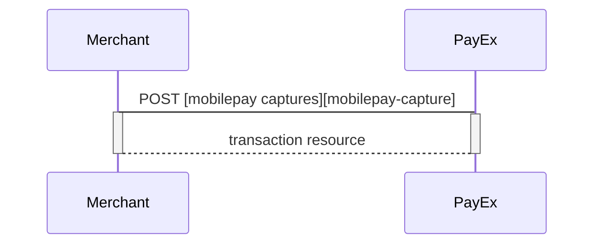
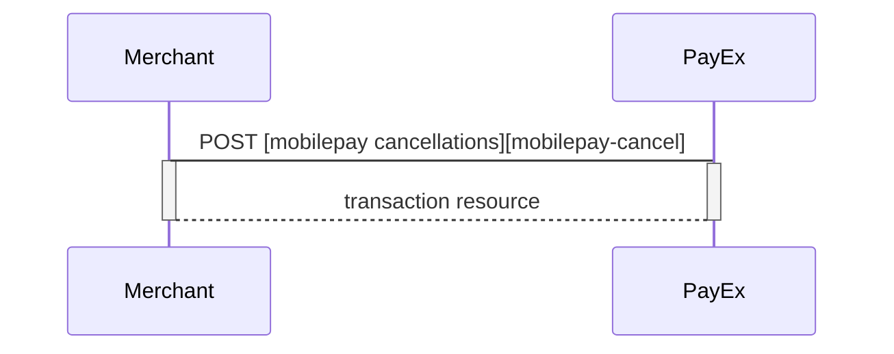
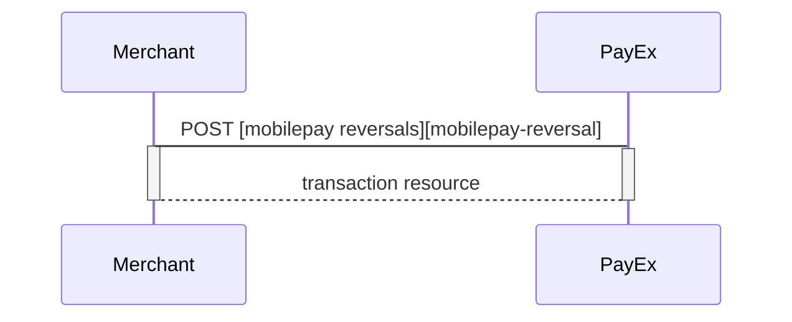


## After payment options for Mobile Pay

### Options after posting a payment

* **Abort:** It is possible to [abort a payment][technical-reference-abort] if the payment has no successful transactions.
* If the payment shown above is done as a two-phase (`authorization`), you will need to implement the `Capture` and `Cancel` requests.
* For reversals, you will need to implement the `Reversal` request.
* **If CallbackURL is set:** Whenever changes to the payment occur  a [Callback request][technical-reference-callback] will be posted to the `callbackUrl`, generated when the payment was created.


## Capture

The `captures` resource lists the capture transactions performed on a specific payment.

{:.code-header}
**Request**

```HTTP
GET /psp/mobilepay/payments/e7919b4f-81a2-4ffb-ec40-08d617d580a2/captures HTTP/1.1
Host: api.payex.com
Authorization: Bearer <MerchantToken>
Content-Type: application/json
```

{:.code-header}
**Response**

```HTTP
HTTP/1.1 200 OK
Content-Type: application/json

{
    "payment": "/psp/mobilepay/payments/5adc265f-f87f-4313-577e-08d3dca1a26c",
    "captures": {
        "id": "/psp/mobilepay/payments/5adc265f-f87f-4313-577e-08d3dca1a26c/captures",
        "captureList": [{
            "id": "/psp/mobilepay/payments/5adc265f-f87f-4313-577e-08d3dca1a26c/captures/12345678-1234-1234-1234-123456789012",
            "transaction": {
                "id": "/psp/mobilepay/payments/5adc265f-f87f-4313-577e-08d3dca1a26c/transactions/12345678-1234-1234-1234-123456789012",
                "created": "2016-09-14T01:01:01.01Z",
                "updated": "2016-09-14T01:01:01.03Z",
                "type": "Capture",
                "state": "Completed",
                "number": 1234567890,
                "amount": 1000,
                "vatAmount": 250,
                "description": "Test transaction",
                "payeeReference": "AH123456",
                "failedReason": "",
                "isOperational": false,
                "operations": []
            }
        }]
    }
}
```

{:.table .table-striped}
| **Property**            | **Data type** | **Description**                                                          |
| payment             | string    | The relative URI of the payment this capture transaction belongs to. |
| capture.id          | string    | The relative URI of the created capture transaction.                 |
| capture.transaction | object    | The object representation of the generic transaction resource.       |

### Create capture transaction
A `capture` transaction - to withdraw money from the payer's mobilepay - can be created after a completed authorization by performing the `create-capture` operation.

{:.code-header}
**Request**

```HTTP
POST /psp/mobilepay/payments/e7919b4f-81a2-4ffb-ec40-08d617d580a2/captures HTTP/1.1
Host: api.payex.com
Authorization: Bearer <MerchantToken>
Content-Type: application/json

{
    "transaction": {
        "amount": 1000,
        "vatAmount": 250,
        "payeeReference": 1234,
        "description" : "description for transaction"
    }
}
```

{:.table .table-striped}
| **Property**               | **Data type**  | **Required** | **Description**                                                                                                       |
| capture.amount         | integer    | Y        | Amount Entered in the lowest momentary units of the selected currency. E.g. 10000 = 100.00 DKK, 5000 = 50.00 DKK. |
| capture.vatAmount      | integer    | Y        | Amount Entered in the lowest momentary units of the selected currency. E.g. 10000 = 100.00 DKK, 5000 = 50.00 DKK. |
| capture.description    | string     | Y        | A textual description of the capture transaction.                                                                 |
| capture.payeeReference | string(50) | Y        | A unique reference for the capture transaction. See [payeeReference][payee-reference] for details.                                   |

The `capture` resource contains information about the capture transaction made against a MobilePay payment. You can return a specific capture transaction by adding the transaction id to the `GET` request.

{:.code-header}
**Response**

```HTTP
HTTP/1.1 200 OK
Content-Type: application/json

{
    "payment": "/psp/mobilepay/payments/6c742993-0aaa-478e-ec41-08d617d580a2",
    "captures": {
        "id": "/psp/mobilepay/payments/6c742993-0aaa-478e-ec41-08d617d580a2/captures",
        "captureList": [
            {
                "id": "/psp/mobilepay/payments/6c742993-0aaa-478e-ec41-08d617d580a2/captures/6f978046-ad7d-4a7e-8ac9-08d617e01a6f",
                "transaction": {
                    "id": "/psp/mobilepay/payments/6c742993-0aaa-478e-ec41-08d617d580a2/transactions/6f978046-ad7d-4a7e-8ac9-08d617e01a6f",
                    "created": "2018-09-11T12:14:20.3155727Z",
                    "updated": "2018-09-11T12:14:21.3834204Z",
                    "type": "Capture",
                    "state": "Completed",
                    "number": 75100000126,
                    "amount": 1000,
                    "vatAmount": 250,
                    "description": "description for transaction",
                    "payeeReference": "1234",
                    "isOperational": false,
                    "operations": []
                }
            }
        ]
    }
}
```

{:.table .table-striped}
| **Property**            | **Data type** | **Description**                                                          |
| payment             | string    | The relative URI of the payment this capture transaction belongs to. |
| capture.id          | string    | The relative URI of the created capture transaction.                 |
| capture.transaction | object    | The object representation of the generic [transaction resource][transaction-resource].       |


### Capture Sequence

`Capture` can only be done on a authorized transaction. It is possible to do a part-capture where you only capture a smaller amount than the authorization amount. You can later do more captures on the sam payment upto the total authorization amount.



## Cancellations
The `cancellations` resource lists the cancellation transactions on a specific payment.

{:.code-header}
**Request**

```HTTP
GET /psp/mobilepay/payments/e7919b4f-81a2-4ffb-ec40-08d617d580a2/cancellations HTTP/1.1
Host: api.payex.com
Authorization: Bearer <MerchantToken>
Content-Type: application/json
```

{:.code-header}
**Response**

```HTTP
HTTP/1.1 200 OK
Content-Type: application/json

{
    "payment": "/psp/mobilepay/payments/6c742993-0aaa-478e-ec41-08d617d580a2",
    "cancellations": {
        "id": "/psp/mobilepay/payments/6c742993-0aaa-478e-ec41-08d617d580a2/cancellations",
        "cancellationList": [
            {
                "id": "/psp/mobilepay/payments/6c742993-0aaa-478e-ec41-08d617d580a2/cancellations/c72f2a42-2222-4f91-ed4a-08d617e0d7e9",
                "transaction": {
                    "id": "/psp/mobilepay/payments/6c742993-0aaa-478e-ec41-08d617d580a2/transactions/c72f2a42-2222-4f91-ed4a-08d617e0d7e9",
                    "created": "2018-09-11T12:19:38.1247314Z",
                    "updated": "2018-09-11T12:19:38.3059149Z",
                    "type": "Cancellation",
                    "state": "Completed",
                    "number": 75100000127,
                    "amount": 500,
                    "vatAmount": 0,
                    "description": "Test Cancellation",
                    "payeeReference": "ABC123",
                    "isOperational": false,
                    "operations": []
                }
            }
        ]
    }
}
```

{:.table .table-striped}
| **Property**                         | **Data type** | **Description**                                                                         |
| payment                          | string    | The relative URI of the payment this list of cancellation transactions belong to.   |
| cancellations.id                 | string    | The relative URI of the current cancellations resource.                             |
| cancellations.cancellationList   | array     | The array of the cancellation transaction objects.                                  |
| cancellations.cancellationList[] | object    | The object representation of the cancellation transaction resource described below. |


### Create cancellation transaction
Perform the `create-cancel` operation to cancel a previously created payment. You can only cancel a payment - or part of payment - not yet captured.

{:.code-header}
**Request**

```HTTP
POST /psp/mobilepay/payments/e7919b4f-81a2-4ffb-ec40-08d617d580a2/cancellations HTTP/1.1
Host: api.payex.com
Authorization: Bearer <MerchantToken>
Content-Type: application/json

{
    "transaction": {
        "description": "Test Cancellation",
        "payeeReference": "ABC123"
    }
}
```

{:.table .table-striped}
| **Property**                    | **Data type**  | **Required** | **Description**          
| cancellation.description    | string     | Y        | A textual description of the reason for the cancellation.                            |
| cancellation.payeeReference | string(50) | Y        | A unique reference for the cancellation transaction. See [payeeReference][payee-reference] for details. |


The `cancel` resource contains information about a cancellation transaction made against a payment. You can return a specific cancellation transaction by adding the transaction id to the `GET` request.

{:.code-header}
**Response**

```HTTP
HTTP/1.1 200 OK
Content-Type: application/json

{
    "payment": "/psp/mobilepay/payments/6c742993-0aaa-478e-ec41-08d617d580a2",
    "cancellation": {
        "id": "/psp/mobilepay/payments/6c742993-0aaa-478e-ec41-08d617d580a2/cancellations/c72f2a42-2222-4f91-ed4a-08d617e0d7e9",
        "transaction": {
            "id": "/psp/mobilepay/payments/6c742993-0aaa-478e-ec41-08d617d580a2/transactions/c72f2a42-2222-4f91-ed4a-08d617e0d7e9",
            "created": "2018-09-11T12:19:38.1247314Z",
            "updated": "2018-09-11T12:19:38.3059149Z",
            "type": "Cancellation",
            "state": "Completed",
            "number": 75100000127,
            "amount": 500,
            "vatAmount": 0,
            "description": "Test Cancellation",
            "payeeReference": "ABC123",
            "isOperational": false,
            "operations": []
        }
    }
}
```

{:.table .table-striped}
| **Property**                 | **Data type** | **Description**
| payment                  | string    | The relative URI of the payment this cancellation transaction belongs to. |
| cancellation.id          | string    | The relative URI of the current cancellation transaction resource.        |
| cancellation.transaction | object    | The object representation of the generic [transaction resource][transaction-resource].            |

### Cancel Sequence

Cancel can only be done on a authorized transaction. If you do cancel after doing a part-capture you will cancel the different between the capture amount and the authorization amount.


## Reversals
The `reversals` resource lists the reversal transactions performed on a specific payment.

{:.code-header}
**Request**

```HTTP
GET /psp/mobilepay/payments/e7919b4f-81a2-4ffb-ec40-08d617d580a2/reversals HTTP/1.1
Host: api.payex.com
Authorization: Bearer <MerchantToken>
Content-Type: application/json
```

{:.code-header}
**Response**

```HTTP
HTTP/1.1 200 OK
Content-Type: application/json

{
    "payment": "/psp/mobilepay/payments/5adc265f-f87f-4313-577e-08d3dca1a26c",
    "reversals": {
        "id": "/psp/mobilepay/payments/5adc265f-f87f-4313-577e-08d3dca1a26c/reversal",
        "reversalList": [{
            "id": "/psp/mobilepay/payments/5adc265f-f87f-4313-577e-08d3dca1a26c/reversal/12345678-1234-1234-1234-123456789012",
            "transaction": {
                "id": "/psp/mobilepay/payments/5adc265f-f87f-4313-577e-08d3dca1a26c/transactions/12345678-1234-1234-1234-123456789012",
                "created": "2016-09-14T01:01:01.01Z",
                "updated": "2016-09-14T01:01:01.03Z",
                "type": "Reversal",
                "state": "Completed",
                "number": 1234567890,
                "amount": 1000,
                "vatAmount": 250,
                "description": "Test transaction",
                "payeeReference": "AH123456",
                "failedReason": "",
                "isOperational": false,
                "operations": []
            }
        }]
    }
}
```

{:.table .table-striped}
| **Property**       | **Type**   | **Description**    
| payment        | string | The relative URI of the payment that the reversal transactions belong to.                            |
| id             | string | The relative URI of the created reversal transaction.                                                |
| reversalList   | array  | The array of reversal transaction objects.                                                           |
| reversalList[] | object | The reversal transaction object representation of the reversal transaction resource described below. |


### Create reversal transaction
The `create-reversal` operation reverses a previously created and captured payment.

{:.code-header}
**Request**

```HTTP
POST /psp/mobilepay/payments/e7919b4f-81a2-4ffb-ec40-08d617d580a2/reversals HTTP/1.1
Host: api.payex.com
Authorization: Bearer <MerchantToken>
Content-Type: application/json

{
    "transaction": {
        "amount": 1000,
        "vatAmount": 0,
        "description" : "Test Reversal",
        "payeeReference": "DEF456"
    }
}
```

{:.table .table-striped}
| **Property**                   | **Data type**  | **Required** | **Description** 
| transaction.amount         | integer    | Y        | Amount Entered in the lowest momentary units of the selected currency. E.g. 10000 = 100.00 DKK, 5000 = 50.00 DKK. |
| transaction.vatAmount      | integer    | Y        | Amount Entered in the lowest momentary units of the selected currency. E.g. 10000 = 100.00 DKK, 5000 = 50.00 DKK. |
| transaction.description    | string     | Y        | A textual description of the capture                                                                              |
| transaction.payeeReference | string(50) | Y        | A unique reference for the reversal transaction. See [payeeReference][payee-reference] for details.                                  |


The `reversal` resource contains information about a reversal transaction made against a payment. You can return a specific reversal transaction by adding the transaction id to the `GET` request.

{:.code-header}
**Response**

```HTTP
HTTP/1.1 200 OK
Content-Type: application/json

{
    "payment": "/psp/mobilepay/payments/6c742993-0aaa-478e-ec41-08d617d580a2",
    "reversal": {
        "id": "/psp/mobilepay/payments/6c742993-0aaa-478e-ec41-08d617d580a2/reversals/55c52694-fdb0-4134-ed4b-08d617e0d7e9",
        "transaction": {
            "id": "/psp/mobilepay/payments/6c742993-0aaa-478e-ec41-08d617d580a2/transactions/55c52694-fdb0-4134-ed4b-08d617e0d7e9",
            "created": "2018-09-11T12:25:54.339611Z",
            "updated": "2018-09-11T12:25:54.5738079Z",
            "type": "Reversal",
            "state": "Completed",
            "number": 75100000128,
            "amount": 1000,
            "vatAmount": 0,
            "description": "Test Reversal",
            "payeeReference": "DEF456",
            "isOperational": false,
            "operations": []
        }
    }
}
```

{:.table .table-striped}
| Property             | Data type | Description                            
| payment              | string    | The relative URI of the payment this capture transaction belongs to. |
| reversal.id          | string    | The relative URI of the created capture transaction.                 |
| reversal.transaction | object    | The object representation of the generic transaction resource.       |

### Reversal Sequence

Reversal can only be done on a payment where there are some captured amount not yet reversed.




[mobilepay-cancel]: #
[mobilepay-capture]: #
[mobilepay-reversal]: #
[payee-reference]: #
[technical-reference-abort]: #
[technical-reference-callback]: #
[transaction-resource]: #
