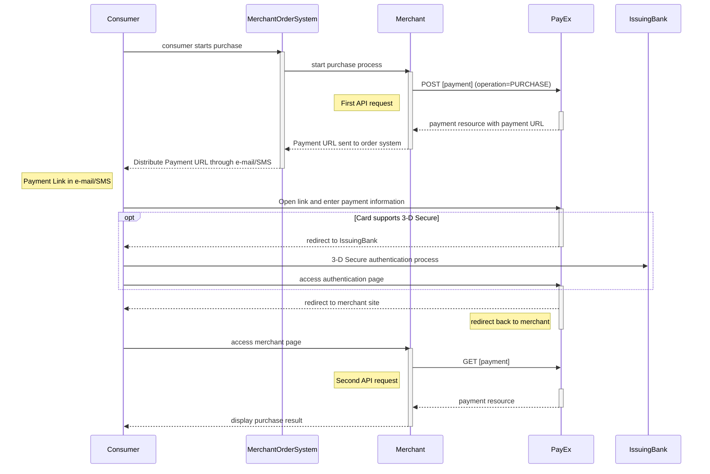



>Add MobilePay Online to your Swedbank Pay payment instruments and take advantage
of [Swedbank Pay Settlement Service][payex-reconciliation-and-settlement] to
get consolidated payments and reporting, for all your payment instruments.

## MobilePay Online Payments

Read our documentation on [MobilePay Redirect](/payments/mobile-pay/redirect)
to learn how to implement MobilePay in the redirect scenario.

## Payment Link

>The implementation sequence for this scenario is a variant of the purchase
 sequence in a
 [hosted payment page redirect scenario][redirect-implementation].
 The consumer is not redirected to the Payments directly but will
 instead receive a payment link via mail/SMS.
 When the consumer clicks on the link a payment window opens.

## Introduction

* The Payment Link can be implemented for payment instruments listed below,
  using the Redirect platform and hosted payment page.
  * [Credit card][credit-card]
  * [MobilePay][mobile-pay]
  * [Swish m-commerce][swish-m-commerce] and [Swish e-commerce][swish-e-commerce]
  * [Vipps][vipps]
* When the consumer/end-user starts the purchase process in your
  merchant/wehshop site, you need to make a `POST` request towards Swedbank Pay
  with your Purchase information.
  You receive a Payment Link (same as redirect URL) in response.
* You have to distribute the Payment Link to the customer through your order
  system, using channels like e-mail or SMS.
  * NOTE: When sending information in e-mail/SMS, it is strongly recommended
   that you add information about your terms and conditions, including
   purchase information and price.
    **See recommendations in the next paragraph.**
* When the consumer clicks on the Payment Link, the Swedbank Pay payment page
  will open, letting the consumer enter the payment details (varying depending
  on payment instrument) in a secure Swedbank Pay hosted environment.
  When paying with credit card and if required, Swedbank Pay will handle
  3-D Secure authentication
* After completion, Swedbank Pay will redirect the browser back to your
  merchant/webshop site.
* If [CallbackURL][technical-reference-callback] is set the merchant system
  will receive a callback from PayEx, enabling you to make a `GET` request
  towards Swedbank Pay with the paymentID received in the first step,
  which will return the purchase result.

## Recommendations regarding Payment Link in E-mail/SMS

When you as a merchant sends an e-mail or SMS to the consumer about the
Payment Link, it is recommended to include contextual information that help
the consumer understand what will happen when clicking on the Payment Link.
We recommend that you include following information:

* The name of the merchant/shop that initiates the payment
* An understandable product description, describing what kind of service the
  consumer will pay for.
* Some order-id (or similar) that exists in the merchant order system.
* The price and currency.
* Details about shipping method and expected delivery
  (if physical goods will be sent  to the consumer).
* Directions to (a link to a page) the merchant's terms and conditions
  (such as return policy) and information of how the consumer can contact the
  merchant.
* Details informing the consumer that he or she accepts the Terms & Conditions
  when clicking on the Payment Link.

## Recommendations about receipt

We recommend that you send an e-mail or SMS confirmation with a receipt to
the consumer when the payment has been fulfilled.

## API requests

The API requests depend on the payment instrument you are using when implementing
the Payment Link scenario, see [purchase flow](#purchase-flow).
One-phase payment metods will not implement capture, cancellation or reversal.
The options you can choose from when creating a payment with key operation set
to Value Purchase are listed below.

## Screenshots

When clicking the payment link, the consumer will be directed to a payment
page, similar to the examples below, where payment information can be entered.

![Payex payment menu][paymentMethodsScreenshot]

### Options

All valid options when posting in a payment with operation Purchase,
are described in each payment instrument's respective API reference.
Please see the general sequence diagrams for more information about payments
in one-phase (e.g. [Swish][swish-m-commerce] and credit card with autocapture)
and two-phase (e.g. [Credit card][credit-card],
[MobilePay][mobile-pay], [Vipps][vipps]).

#### Authorization

* PreAuthorization (Credit card):
  * If you specify that the _intent_ of the _purchase_ is PreAuthorize,
   it's almost the same as an authorization,
    **except that no money will be reserved** from the consumers credit card,
   [before you make a finalize on this transaction (using the PATCH on
   the Autorization)][tecnical-reference-finalize].

* Authorize (two-phase):
  * When using two-phase flows you reserve the amount with an authorization,
   you will have to specify that the intent of the purchaseis Authorize.
   The amount will be reserved but not charged.
   You will later (i.e. when you are ready to ship the purchased products)
   have to make a `Capture` or `Cancel` request.

#### Capture

*Autocapture (one-phase credit card)*:
If you want the credit card to be charged right away, you will have to specify
that the intent of the purchaseis Autocapture.
The credit card will be charged and you don't need to do any more financial
operations to this purchase.

#### General

When implementing the Payment Link scenario, it is optional to set a
[CallbackURL][technical-reference-callback] in the `POST` request.
If callbackURL is set Swedbank Pay will send a postback request to this URL
when the consumer as fulfilled the payment.

## Purchase flow

The sequence diagrams display the high level process of the purchase,
from generating a Payment Link to receving a Callback.
This in a generalized flow as well as a specific 3-D Secure enabled credit
card scenario.



When dealing with credit card payments, 3-D Secure authentication of the
cardholder is an essential topic.
There are two alternative outcome of a credit card payment:

* 3-D Secure enabled - by default, 3-D Secure should be enabled, and Swedbank
  Pay will check if the card is enrolled with 3-D Secure.
  This depends on the issuer of the card.
  If the card is not enrolled with 3-D Secure, no authentication
  of the cardholder is done.
* Card supports 3-D Secure - if the card is enrolled with 3-D Secure,
  Swedbank Pay will redirect the cardholder to the autentication mechanism
  that is decided by the issuing bank.
  Normally this will be done using BankID or Mobile BankID.



[paymentMethodsScreenshot]: /assets/img/checkout/payment_methods.PNG
[credit-card]: /payments/card/
[mobile-pay]: /payments/mobile-pay/
[payex-reconciliation-and-settlement]: /payments/mobile-pay/other-features#settlement-and-reconcilliation
[redirect-implementation]: /payments/mobile-pay/redirect
[swish-e-commerce]: /payments/swish#swish-e-commerce-redirect-to-payment-pages
[swish-m-commerce]: /payments/swish#swish-m-commerce-redirect-to-payment-pages
[technical-reference-callback]: /payments/mobile-pay/other-features#callback
[tecnical-reference-finalize]: /payments/mobile-pay/after-payment#finalize
[vipps]: /payments/vipps/
