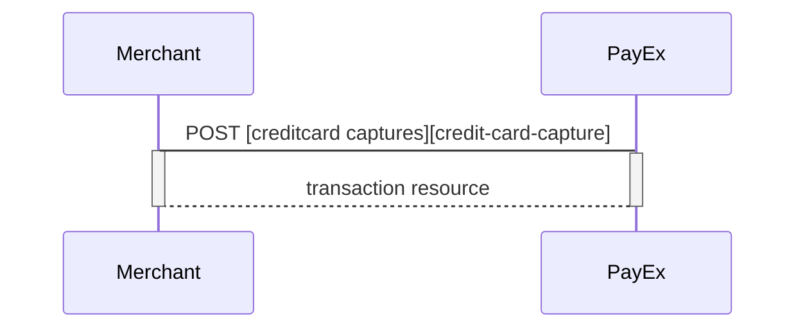
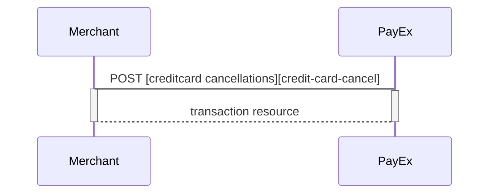
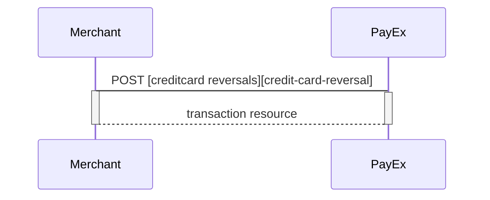



### Capture Sequence

Capture can only be perfomed on a payment with a successfully authorized transaction. It is possible to do a part-capture where you only capture a smaller amount than the authorized amount. You can later do more captures on the same payment up to the total authorization amount.

### Cancel Sequence

Cancel can only be done on a authorized transaction. If you do cancel after doing a part-capture you will cancel the difference between the captured amount and the authorized amount.

### Reversal Sequence

Reversal can only be done on a payment where there are some captured amount not yet reversed.









