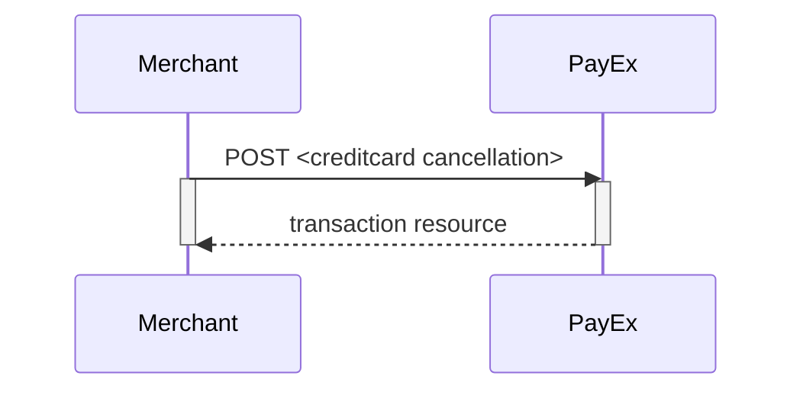
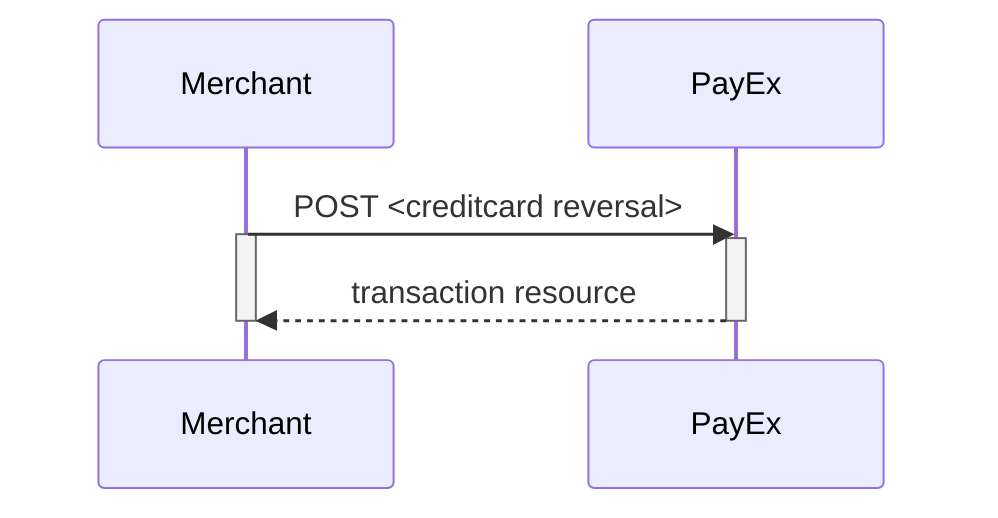



### Capture Sequence

Capture can only be perfomed on a payment with a successfully authorized
transaction.
It is possible to do a part-capture where you only capture a smaller amount
than the authorized amount.
You can later do more captures on the same payment up to the total
authorization amount.


### Cancel Sequence

Cancel can only be done on a authorized transaction.
If you do cancel after doing a part-capture you will cancel the difference
between the captured amount and the authorized amount.



### Reversal Sequence

Reversal can only be done on a payment where there are some captured amount
not yet reversed.



### Abort a payment

To abort a payment, perform the `update-payment-abort` operation that is
returned in the payment request. You need to include the following HTTP body:

{:.code-header}
**Request**

```http
PATCH /psp/creditcard/payments/5adc265f-f87f-4313-577e-08d3dca1a26c HTTP/1.1
Host: api.externalintegration.payex.com
Authorization: Bearer <MerchantToken>
Content-Type: application/json

{
  "payment": {
    "operation": "Abort",
    "abortReason": "CancelledByConsumer"
  }
}
```

{:.code-header}
**Response**

```http
HTTP/1.1 200 OK
Content-Type: application/json

{
    "payment": {
        "id": "/psp/creditcard/payments/e73da1da-1148-476c-b6bb-08d67623d21b",
        "number": 70100130293,
        "created": "2019-01-09T13:11:28.371179Z",
        "updated": "2019-01-09T13:11:46.5949967Z",
        "instrument": "CreditCard",
        "operation": "Purchase",
        "intent": "AutoCapture",
        "state": "Aborted",
        "currency": "DKK",
        "prices": {
            "id": "/psp/creditcard/payments/e73da1da-1148-476c-b6bb-08d67623d21b/prices"
        },
        "amount": 0,
        "description": "creditcard Test",
        "payerReference": "100500",
        "initiatingSystemUserAgent": "PostmanRuntime/7.1.1",
        "userAgent": "Mozilla/5.0",
        "language": "nb-NO",
        "urls": {
            "id": "/psp/creditcard/payments/e73da1da-1148-476c-b6bb-08d67623d21b/urls"
        },
        "payeeInfo": {
            "id": "/psp/creditcard/payments/e73da1da-1148-476c-b6bb-08d67623d21b/payeeinfo"
        },
        "metadata": {
            "id": "/psp/creditcard/payments/e73da1da-1148-476c-b6bb-08d67623d21b/metadata"
        }
    },
    "operations": []
}
```

The response will be the `payment` resource with its `state` set to `Aborted`.















### Prices



### Payee reference




