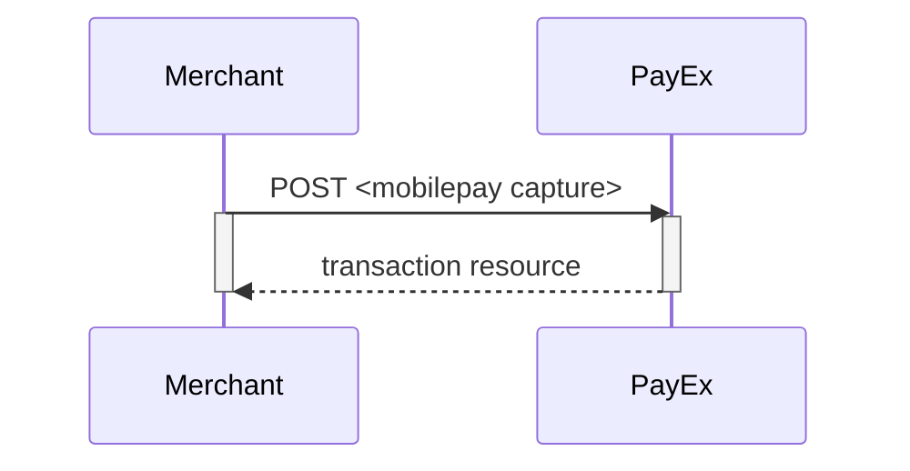
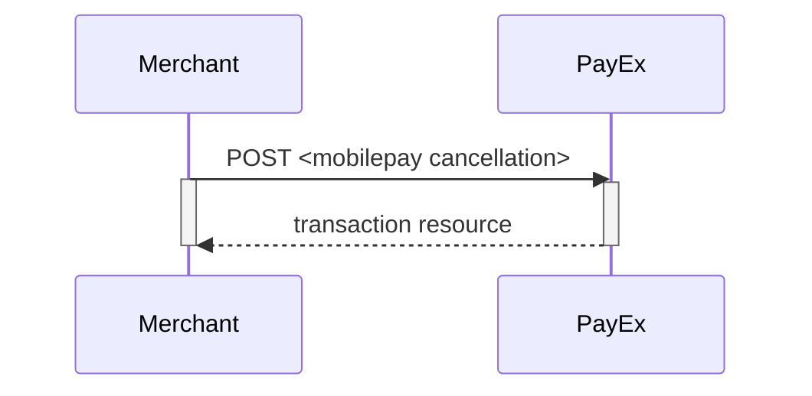
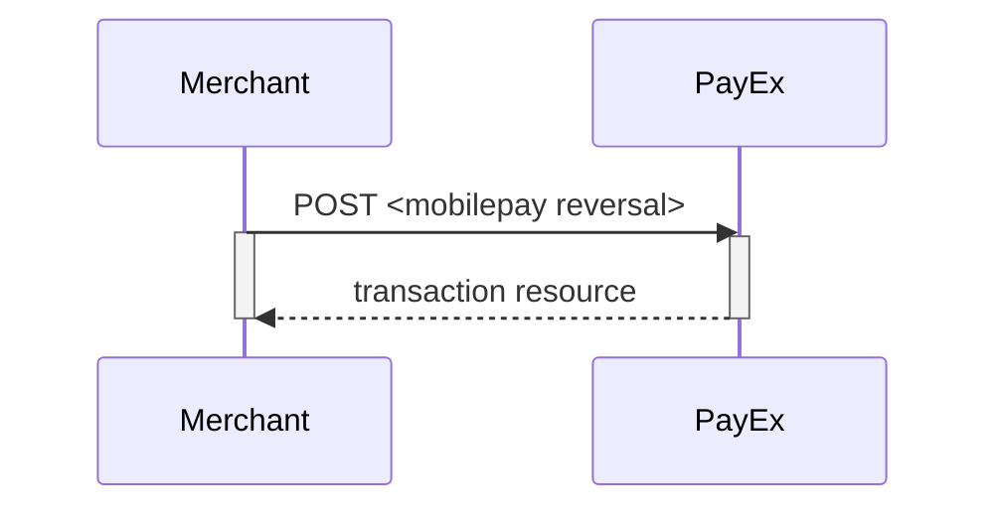



### Create Payment

To create a MobilePay Online payment, you perform an HTTP `POST` against the
`/psp/mobilepay/payments` resource. Please read the [general
information][general-http-info] on how to compose a valid HTTP request before
proceeding.

An example of a payment creation request is provided below. Each individual field of the JSON document is described in the following section. Use the
[expand][technical-reference-expand] request parameter to get a response that
includes one or more expanded sub-resources inlined.

{:.code-header}
**Request**

```http
POST /psp/mobilepay/payments HTTP/1.1
Authorization: Bearer <AccessToken>
Content-Type: application/json

{
    "payment": {
        "operation": "Purchase",
        "intent": "Authorization",
        "currency": "DKK",
        "prices": [
            {
                "type": "Visa",
                "amount": 1500,
                "vatAmount": 0,
                "FeeAmount": 5
            },
            {
                "type": "MasterCard",
                "amount": 1500,
                "vatAmount": 0,
                "FeeAmount": 10
            }
        ],
        "description": "Test Purchase",
        "payerReference": "AB1234",
        "userAgent": "Mozilla/5.0...",
        "language": "da-DK",
        "urls": {
            "hostUrls": ["https://example.com", "https://example.net"],
            "completeUrl": "https://example.com/payment-completed",
            "cancelUrl": "https://example.com/payment-canceled",
            "callbackUrl": "https://example.com/payment-callback"
        },
        "payeeInfo": {
            "payeeId": "12345678-1234-1234-1234-123456789012",
            "payeeReference": "CD1234",
            "payeeName": "Merchant1",
            "productCategory": "A123",
            "orderReference": "or-12456",
            "subsite": "MySubsite"
        },
        "prefillInfo": {
            "msisdn": "+4522222222"
        }
    },
    "mobilepay": {
        "shoplogoUrl": "https://example.com/shop-logo.png"
    }
}
```

{:.table .table-striped}
| Required         | Field                           | Data type    | Description                                                                                                                                                                                                                                               |
| :--------------- | :------------------------------ | :----------- | :-------------------------------------------------------------------------------------------------------------------------------------------------------------------------------------------------------------------------------------------------------- |
|  | `payment`                       | `object`     | The payment object.                                                                                                                                                                                                                                       |
|  | └➔&nbsp;`operation`             | `string`     | `Purchase`                                                                                                                                                                                                                                                |
|  | └➔&nbsp;`intent`                | `string`     | `Authorization`                                                                                                                                                                                                                                           |
|  | └➔&nbsp;`currency`              | `string`     | `NOK`, `SEK`, `DKK`, `USD` or `EUR`.                                                                                                                                                                                                                      |
|  | └➔&nbsp;`prices`                | `object`     | The prices object.                                                                                                                                                                                                                                        |
|  | └─➔&nbsp;`type`                 | `string`     | `Visa` (for card type Visa), `MC` (for card type Mastercard)                                                                                                                                                                                              |
|  | └─➔&nbsp;`amount`               | `integer`    |                                                                                                                                                                                                   |
|  | └─➔&nbsp;`vatAmount`            | `integer`    |                                                                                                                                                                                                |
|                  | └─➔&nbsp;`feeAmount`            | `integer`    | If the amount given includes Fee, this may be displayed for the user in the payment page (redirect only).                                                                                                                                                 |
|  | └➔&nbsp;`description`           | `string(40)` |                                                                                                                                                                                                   |
|                  | └➔&nbsp;`payerReference`        | `string`     | The reference to the payer (consumer/end-user) from the merchant system, like mobile number, customer number etc.                                                                                                                                         |
|  | └➔&nbsp;`userAgent`             | `string`     | The user agent reference of the consumer's browser - [see user agent definition][user-agent]                                                                                                                                                              |
|  | └➔&nbsp;`language`              | `string`     |                                                                                                                                                                                                                               |
|  | └➔&nbsp;`urls`                  | `object`     | The URLs object containing the urls used for this payment.                                                                                                                                                                                                |
|  | └─➔&nbsp;`completeUrl`          | `string`     | The URI that Swedbank Pay will redirect back to when the payment page is completed. This does not indicate a successful payment, only that it has reached a completion state. A `GET` request needs to be performed on the payment to inspect it further. |
|  | └─➔&nbsp;`cancelUrl`            | `string`     | The URI that Swedbank Pay will redirect back to when the user presses the cancel button in the payment page.                                                                                                                                              |
|                  | └─➔&nbsp;`callbackUrl`          | `string`     | The URI that Swedbank Pay will perform an HTTP `POST` against every time a transaction is created on the payment. See [callback][callback-reference] for details.                                                                                         |
|  | └➔&nbsp;`payeeInfo`             | `object`     | This object contains the identificators of the payee of this payment.                                                                                                                                                                                     |
|  | └─➔&nbsp;`payeeId`              | `string`     | This is the unique id that identifies this payee (like merchant) set by Swedbank Pay.                                                                                                                                                                     |
|  | └─➔&nbsp;`payeeReference`       | `string(50)` | A unique reference from the merchant system. It is set per operation to ensure an exactly-once delivery of a transactional operation. See [`payeeReference`][payee-reference] for details.                                                                |
|                  | └─➔&nbsp;`payeeName`            | `string`     | The payee name (like merchant name) that will be displayed to consumer when redirected to Swedbank Pay.                                                                                                                                                   |
|                  | └─➔&nbsp;`productCategory`      | `string`     | A product category or number sent in from the payee/merchant. This is not validated by Swedbank Pay, but will be passed through the payment process and may be used in the settlement process.                                                            |
|                  | └─➔&nbsp;`orderReference`       | `String(50)` | The order reference should reflect the order reference found in the merchant's systems.                                                                                                                                                                   |
|                  | └─➔&nbsp;`subsite`              | `String(40)` | The subsite field can be used to perform split settlement on the payment. The subsites must be resolved with Swedbank Pay reconciliation before being used.                                                                                               |
|                  | └➔&nbsp;`prefillInfo.msisdn`    | `string`     | Number will be prefilled on payment page, if valid.                                                                                                                                                                                                        |
|                  | └➔&nbsp;`mobilepay.shoplogoUrl` | `string`     | URI to logo that will be visible at MobilePay                                                                                                                                                                                                             |

{:.code-header}
**Response**

```http
HTTP/1.1 200 OK
Content-Type: application/json

{
    "payment": {
        "prices": {
            "id": "/psp/mobilepay/payments/{{ page.payment_id }}/prices"
        },
        "id": "/psp/mobilepay/payments/{{ page.payment_id }}",
        "number": 75100000121,
        "created": "2018-09-11T10:58:27.4236127Z",
        "updated": "2018-09-11T10:58:30.8254419Z",
        "instrument": "MobilePay",
        "operation": "Purchase",
        "intent": "Authorization",
        "state": "Ready",
        "currency": "DKK",
        "amount": 3000,
        "description": "Test Purchase",
        "payerReference": "AB1234",
        "initiatingSystemUserAgent": "PostmanRuntime/7.2.0",
        "userAgent": "Mozilla/5.0",
        "language": "da-DK",
        "transactions": {
            "id": "/psp/mobilepay/payments/{{ page.payment_id }}/transactions"
        },
        "urls": {
            "id": "/psp/mobilepay/payments/{{ page.payment_id }}/urls"
        },
        "payeeInfo": {
            "id": "/psp/mobilepay/payments/{{ page.payment_id }}/payeeinfo"
        }
    },
    "operations": [
        {
            "method": "PATCH",
            "href": "https://{{ page.api_url }}/psp/mobilepay/payments/{{ page.payment_id }}",
            "rel": "update-payment-abort"
        },
        {
            "method": "GET",
            "href": "https://{{ page.front_end_url }}/mobilepay/payments/authorize/{{ page.transaction_id }}",
            "rel": "redirect-authorization"
        }
    ]
}
```

{:.table .table-striped}
| Field                               | Data type    | Description                                                                                                                                                                                      |
| :---------------------------------- | :----------- | :----------------------------------------------------------------------------------------------------------------------------------------------------------------------------------------------- |
| `payment`                           | `object`     | The payment object contains information about the retrieved payment.                                                                                                                             |
| └➔&nbsp;`id`                        | `string`     |                                                                                                                                                             |
| └➔&nbsp;`number`                    | `integer`    | The payment `number`, useful when there's need to reference the payment in human communication. Not usable for programmatic identification of the payment, for that `id` should be used instead. |
| └➔&nbsp;`created`                   | `string`     | The ISO-8601 date of when the payment was created.                                                                                                                                               |
| └➔&nbsp;`updated`                   | `string`     | The ISO-8601 date of when the payment was updated.                                                                                                                                               |
| └➔&nbsp;`instrument`                | `string`     | The instrument used                                                                                                                                                                              |
| └➔&nbsp;`operation`                 | `string`     | Purchase                                                                                                                                                                                         |
| └➔&nbsp;`intent`                    | `string`     | The intent sent in on request                                                                                                                                                                    |
| └➔&nbsp;`state`                     | `string`     | `Ready`, `Pending`, `Failed` or `Aborted`. Indicates the state of the payment. This field is only for status display purposes.                                                                   |
| └➔&nbsp;`currency`                  | `string`     | The currency used                                                                                                                                                                                |
| └➔&nbsp;`description`               | `string(40)` |                                                                                                                    |
| └➔&nbsp;`payerReference`            | `string`     | The reference to the payer (consumer/end-user) from the merchant system, like mobile number, customer number etc.                                                                                |
| └➔&nbsp;`initiatingSystemUserAgent` | `string`     | The system user agent used                                                                                                                                                                       |
| └➔&nbsp;`userAgent`                 | `string`     | The [user agent][user-agent] string of the consumer's browser.                                                                                                                                   |
| └➔&nbsp;`language`                  | `string`     |                                                                                                                                                                       |
| └➔&nbsp;`urls`                      | `string`     | The URI to the `urls` resource where all URIs related to the payment can be retrieved.                                                                                                           |
| └➔&nbsp;`payeeInfo`                 | `string`     | The URI to the `payeeinfo` resource where the information about the payee of the payment can be retrieved.                                                                                       |

## Purchase

Posting a payment (operation `Purchase`) returns the options of aborting the
payment altogether or creating an authorization transaction through the
`redirect-authorization` hyperlink.
Use the expand request parameter to get a response that includes one or more
expanded sub-resources inlined.

```json
{
    "payment": {
        "operation": "Purchase"
    }
}
```

## Operations

When a payment resource is created and during its lifetime, it will have a set
of operations that can be performed on it.
Which operations are available will vary depending on the state of the payment
resource, what the access token is authorized to do, etc.
A list of possible operations and their explanation is given below.

```json
{
    "payment": {},
    "operations": [
        {
            "href": "http://{{ page.api_url }}/psp/mobilepay/payments/{{ page.payment_id }}",
            "rel": "update-payment-abort",
            "method": "PATCH"
        },
        {
            "href": "https://{{ page.front_end_url }}/mobilepay/payments/authorize/{{ page.payment_id }}",
            "rel": "redirect-authorization",
            "method": "GET"
        },
        {
            "href": "https://{{ page.api_url }}/psp/mobilepay/payments/{{ page.payment_id }}/captures",
            "rel": "create-capture",
            "method": "POST"
        },
        {
            "href": "https://{{ page.api_url }}/psp/mobilepay/payments/{{ page.payment_id }}/cancellations",
            "rel": "create-cancellation",
            "method": "POST"
        },
        {
            "href": "https://{{ page.api_url }}/psp/mobilepay/payments/{{ page.payment_id }}/reversals",
            "rel": "create-reversal",
            "method": "POST"
        },
    ]
}
```

{:.table .table-striped}
| Field    | Description                                                         |
| :------- | :------------------------------------------------------------------ |
| `href`   | The target URI to perform the operation against.                    |
| `rel`    | The name of the relation the operation has to the current resource. |
| `method` | The HTTP method to use when performing the operation.               |

The operations should be performed as described in each response and not as
described here in the documentation.
Always use the `href` and `method` as specified in the response by finding the
appropriate operation based on its `rel` value.
The only thing that should be hard coded in the client is the value of
the `rel` and the request that will be sent in the HTTP body of the
request for the given operation.

{:.table .table-striped}
| Operation                | Description                                                                  |
| :----------------------- | :--------------------------------------------------------------------------- |
| `update-payment-abort`   | [Aborts][abort] the payment before any financial transactions are performed. |
| `create-authorization`   | Create an [authorization][authorization-transaction] transaction.            |
| `redirect-authorization` | Used to redirect the consumer to the MobilePay Online authorization UI.      |
| `create-capture`         | Creates a [capture][capture-transaction] transaction.                        |
| `create-cancellation`    | Creates a [cancellation][cancellation-transaction] transaction.              |
| `create-reversal`        | Creates a [reversal][reversal-transaction] transaction.                      |



## MobilePay Online transactions

All MobilePay Online specific transactions are described below.

## Authorizations

{:.code-header}
**Request**

```http
GET /psp/mobilepay/payments/{{ page.payment_id }}/authorizations/ HTTP/1.1
Host: {{ page.api_url }}
Authorization: Bearer <AccessToken>
Content-Type: application/json
```



### Create authorization transaction

The authorization transaction is initiated by redirecting the end-user/consumer
to the hyperlink returned in the `redirect-authorization` request.

## Captures



### Create capture transaction

A `capture` transaction - to withdraw money from the payer's MobilePay - can be
created after a completed authorization by performing the `create-capture`
operation.

{:.code-header}
**Request**

```http
POST /psp/mobilepay/payments/{{ page.payment_id }}/captures HTTP/1.1
Host: {{ page.api_host }}
Authorization: Bearer <AccessToken>
Content-Type: application/json

{
    "transaction": {
        "amount": 1000,
        "vatAmount": 250,
        "payeeReference": 1234,
        "description" : "description for transaction"
    }
}
```

{:.table .table-striped}
| Required         | Field                    | Type         | Description                                                                                          |
| :--------------- | :----------------------- | :----------- | :--------------------------------------------------------------------------------------------------- |
|  | `transaction`            | `object`     | The currenct capture object.                                                                         |
|  | └➔&nbsp;`amount`         | `integer`    |                                                             |
|  | └➔&nbsp;`vatAmount`      | `integer`    |                                                          |
|  | └➔&nbsp;`description`    | `string`     | A textual description of the capture transaction.                                                    |
|  | └➔&nbsp;`payeeReference` | `string(50)` | A unique reference for the capture transaction. See [`payeeReference`][payee-reference] for details. |



## Cancellations



### Create cancellation transaction

Perform the `create-cancel` operation to cancel a previously created payment.
You can only cancel a payment - or part of payment - not yet captured.

{:.code-header}
**Request**

```http
POST /psp/mobilepay/payments/{{ page.payment_id }}/cancellations HTTP/1.1
Host: {{ page.api_host }}
Authorization: Bearer <AccessToken>
Content-Type: application/json

{
    "transaction": {
        "description": "Test Cancellation",
        "payeeReference": "ABC123"
    }
}
```

{:.table .table-striped}
|     Required     | Field                    | Type         | Description                                                                                               |
| :--------------: | :----------------------- | :----------- | :-------------------------------------------------------------------------------------------------------- |
|  | `transaction`            | `object`     | The current cancellation.                                                                                 |
|  | └➔&nbsp;`description`    | `string`     | A textual description of the reason for the cancellation.                                                 |
|  | └➔&nbsp;`payeeReference` | `string(50)` | A unique reference for the cancellation transaction. See [`payeeReference`][payee-reference] for details. |



## Reversals



### Create reversal transaction

The `create-reversal` operation reverses a previously created and captured
payment.

{:.code-header}
**Request**

```http
POST /psp/mobilepay/payments/{{ page.payment_id }}/reversals HTTP/1.1
Host: {{ page.api_host }}
Authorization: Bearer <AccessToken>
Content-Type: application/json

{
    "transaction": {
        "amount": 1000,
        "vatAmount": 0,
        "description" : "Test Reversal",
        "payeeReference": "DEF456"
    }
}
```

{:.table .table-striped}
|     Required     | Field                    | Type         | Description                                                                                           |
| :--------------: | :----------------------- | :----------- |
| ︎ | `transaction`            | `object`     | The current reversal transaction object                                                               |
| ︎ | └➔&nbsp;`amount`         | `integer`    |                                                              |
| ︎ | └➔&nbsp;`vatAmount`      | `integer`    |                                                           |
| ︎ | └➔&nbsp;`description`    | `string`     | A textual description of the capture                                                                  |
| ︎ | └➔&nbsp;`payeeReference` | `string(50)` | A unique reference for the reversal transaction. See [`payeeReference`][payee-reference] for details. |



## Capture Sequence

Capture can only be perfomed on a payment with a successfully authorized
transaction.
It is possible to do a part-capture where you only capture a smaller amount
than the authorized amount.
You can later do more captures on the same payment up to the total
authorization amount.



## Cancel Sequence

Cancel can only be done on a authorized transaction.
If you do cancel after doing a part-capture you will cancel the difference
between the captured amount and the authorized amount.



## Reversal Sequence

Reversal can only be done on a payment where there are some captured amount
not yet reversed.



The response will be the `payment` resource with its `state` set to `Aborted`.

















[abort]: /payments/mobile-pay/after-payment#abort
[authorization-transaction]: /payments/mobile-pay/other-features#authorizations
[callback-reference]: #callback
[cancellation-transaction]: #cancellations
[capture-transaction]: #captures
[capture]: #captures
[payee-reference]: #payee-reference
[reversal-transaction]: #reversals
[user-agent]: https://en.wikipedia.org/wiki/User_agent
