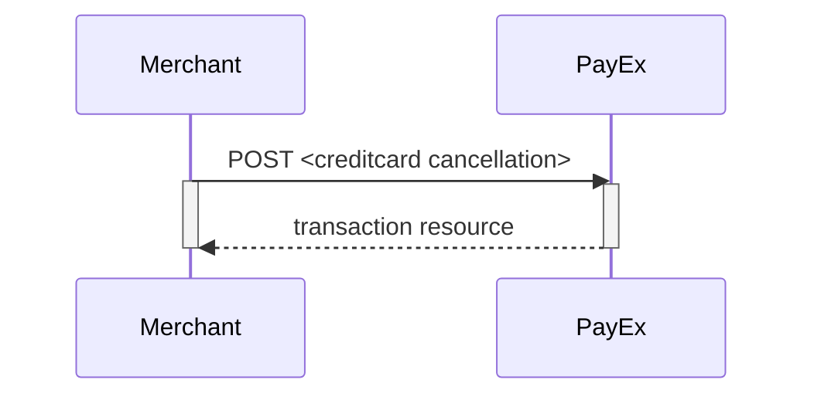
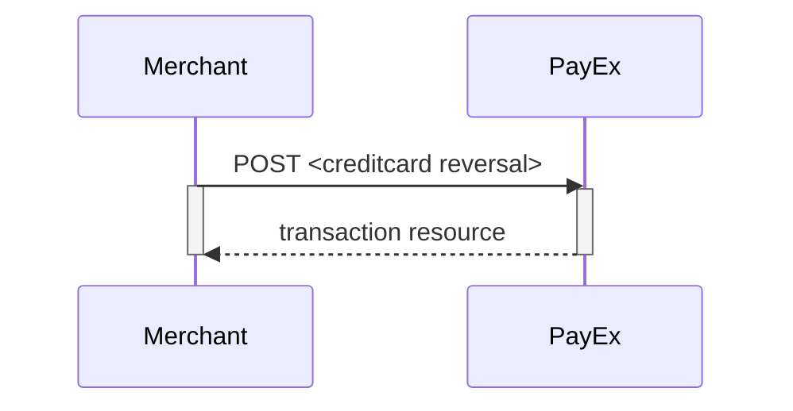



## Create Payment

To create a MobilePay payment, you perform an HTTP `POST` against the
`/psp/mobilepay/payments` resource. Please read the general information on how
to compose a valid HTTP request before proceeding.

MobilePay is a two-phase payment that always use purchase as operation to
initialize the authorization.

An example of a payment creation request is provided below.

{:.code-header}
**Request**

```http
POST /psp/mobilepay/payments HTTP/1.1
Authorization: Bearer <MerchantToken>
Content-Type: application/json

{
    "payment": {
        "operation": "Purchase",
        "intent": "Authorization",
        "currency": "DKK",
        "prices": [
            {
                "type": "Visa",
                "amount": 1500,
                "vatAmount": 0,
                "FeeAmount": 5
            },
            {
                "type": "MasterCard",
                "amount": 1500,
                "vatAmount": 0,
                "FeeAmount": 10
            }
        ],
        "description": "Test Purchase",
        "payerReference": "AB1234",
        "userAgent": "Mozilla/5.0...",
        "language": "da-DK",
        "urls": {
            "hostUrls": ["https://example.com", "https://example.net"],
            "completeUrl": "http://example.com/payment-completed",
            "cancelUrl": "http://example.com/payment-canceled",
            "callbackUrl": "http://example.com/payment-callback"
        },
        "payeeInfo": {
            "payeeId": "12345678-1234-1234-1234-123456789012",
            "payeeReference": "CD1234",
            "payeeName": "Merchant1",
            "productCategory": "A123",
            "orderReference": "or-12456",
            "subsite": "MySubsite"
        },
        "prefillInfo": {
            "msisdn": "+4792345678"
        }
    },
    "mobilepay": {
        "shoplogoUrl": "Url for shop logo url"
    }
}
```

{:.table .table-striped}
| Required | Property                        | Data type    | Description                                                                                                                                                                                                   |
| :------- | :------------------------------ | :----------- | :------------------------------------------------------------------------------------------------------------------------------------------------------------------------------------------------------------ |
| ✔︎︎︎︎︎   | `payment`                       | `object`     | The payment object.                                                                                                                                                                                           |
| ✔︎︎︎︎︎   | └➔&nbsp;`operation`             | `string`     | `Purchase`                                                                                                                                                                                                    |
| ✔︎︎︎︎︎   | └➔&nbsp;`intent`                | `string`     | `Authorization`                                                                                                                                                                                               |
| ✔︎︎︎︎︎   | └➔&nbsp;`currency`              | `string`     | `NOK`, `SEK`, `DKK`, `USD` or `EUR`.                                                                                                                                                                          |
| ✔︎︎︎︎︎   | └➔&nbsp;`prices`                | `object`     | The prices object.                                                                                                                                                                                            |
| ✔︎︎︎︎︎   | └─➔&nbsp;`type`                 | `string`     | `Visa` (for card type Visa), `MC` (for card type Mastercard)                                                                                                                                                  |
| ✔︎︎︎︎︎   | └─➔&nbsp;`amount`               | `integer`    | Amount is entered in the lowest momentary units of the selected currency. E.g. 10000 = 100.00 DKK, 5000 = 50.00 DKK.                                                                                          |
| ✔︎︎︎︎︎   | └─➔&nbsp;`vatAmount`            | `integer`    | If the amount given includes VAT, this may be displayed for the user in the payment page (redirect only). Set to 0 (zero) if this is not relevant.                                                            |
|          | └─➔&nbsp;`feeAmount`            | `integer`    | If the amount given includes Fee, this may be displayed for the user in the payment page (redirect only).                                                                                                     |
| ✔︎︎︎︎︎   | └➔&nbsp;`description`           | `string(40)` | A textual description max 40 characters of the purchase.                                                                                                                                                      |
|          | └➔&nbsp;`payerReference`        | `string`     | The reference to the payer (consumer/end-user) from the merchant system, like mobile number, customer number etc.                                                                                             |
| ✔︎︎︎︎︎   | └➔&nbsp;`userAgent`             | `string`     | The user agent reference of the consumer's browser - [see user agent definition][user-agent]                                                                                                                  |
| ✔︎︎︎︎︎   | └➔&nbsp;`language`              | `string`     | `nb-NO`, `sv-SE` or `en-US`.                                                                                                                                                                                  |
| ✔︎︎︎︎︎   | └➔&nbsp;`urls`                  | `object`     | The URLs object containing the urls used for this payment.                                                                                                                                                    |
| ✔︎︎︎︎︎   | └─➔&nbsp;`completeUrl`          | `string`     | The URI that Swedbank Pay will redirect back to when the payment page is completed.                                                                                                                           |
| ✔︎︎︎︎︎   | └─➔&nbsp;`cancelUrl`            | `string`     | The URI that Swedbank Pay will redirect back to when the user presses the cancel button in the payment page.                                                                                                  |
|          | └─➔&nbsp;`callbackUrl`          | `string`     | The URI that Swedbank Pay will perform an HTTP `POST` against every time a transaction is created on the payment. See [callback][callback-reference] for details.                                             |
| ✔︎︎︎︎︎   | └➔&nbsp;`payeeInfo`             | `object`     | This object contains the identificators of the payee of this payment.                                                                                                                                         |
| ✔︎︎︎︎︎   | └─➔&nbsp;`payeeId`              | `string`     | This is the unique id that identifies this payee (like merchant) set by Swedbank Pay.                                                                                                                         |
| ✔︎︎︎︎︎   | └─➔&nbsp;`payeeReference`       | `string(50)` | A unique reference from the merchant system. It is set per operation to ensure an exactly-once delivery of a transactional operation.. See [[`payeeReference`>>doc:Main.ecommerce.technical-reference.WebHome |  | anchor="HPayeeReference"]] for details. |
|          | └─➔&nbsp;`payeeName`            | `string`     | The payee name (like merchant name) that will be displayed to consumer when redirected to Swedbank Pay.                                                                                                       |
|          | └─➔&nbsp;`productCategory`      | `string`     | A product category or number sent in from the payee/merchant. This is not validated by Swedbank Pay, but will be passed through the payment process and may be used in the settlement process.                |
|          | └─➔&nbsp;`orderReference`       | `String(50)` | The order reference should reflect the order reference found in the merchant's systems.                                                                                                                       |
|          | └─➔&nbsp;`subsite`              | `String(40)` | The subsite field can be used to perform split settlement on the payment. The subsites must be resolved with Swedbank Pay reconciliation before being used.                                                   |
|          | └➔&nbsp;`prefillInfo.msisdn`    | `string`     | umber will be prefilled on payment page, if valid.                                                                                                                                                            |
|          | └➔&nbsp;`mobilepay.shoplogoUrl` | `string`     | URI to logo that will be visible at MobilePay                                                                                                                                                                 |

{:.code-header}
**Request**

```json
{
    "payment": {
        "prices": {
            "id": "/psp/mobilepay/payments/{{ page.paymentId }}/prices"
        },
        "id": "/psp/mobilepay/payments/{{ page.paymentId }}",
        "number": 75100000121,
        "created": "2018-09-11T10:58:27.4236127Z",
        "updated": "2018-09-11T10:58:30.8254419Z",
        "instrument": "MobilePay",
        "operation": "Purchase",
        "intent": "Authorization",
        "state": "Ready",
        "currency": "DKK",
        "amount": 3000,
        "description": "Test Purchase",
        "payerReference": "AB1234",
        "initiatingSystemUserAgent": "PostmanRuntime/7.2.0",
        "userAgent": "Mozilla/5.0",
        "language": "da-DK",
        "transactions": {
            "id": "/psp/mobilepay/payments/{{ page.paymentId }}/transactions"
        },
        "urls": {
            "id": "/psp/mobilepay/payments/{{ page.paymentId }}/urls"
        },
        "payeeInfo": {
            "id": "/psp/mobilepay/payments/{{ page.paymentId }}/payeeinfo"
        }
    },
    "operations": [
        {
            "method": "PATCH",
            "href": "https://api.payex.com/psp/mobilepay/payments/{{ page.paymentId }}",
            "rel": "update-payment-abort"
        },
        {
            "method": "GET",
            "href": "https://ecom.payex.com/mobilepay/payments/authorize/0018f0afb9b6dd73fb39087893362d0099c6e54166c82274b776219cf113ebfc",
            "rel": "redirect-authorization"
        }
    ]
}
```

| Property                                     | Data type    | Description                                                                                                                                                                                      |
| :------------------------------------------- | :----------- | :----------------------------------------------------------------------------------------------------------------------------------------------------------------------------------------------- |
| `payment`                                    | `object`     | The payment object contains information about the retrieved payment.                                                                                                                             |
| └➔&nbsp;`id`                                 | `string`     | The relative URI to the payment.                                                                                                                                                                 |
| └➔&nbsp;`number`                             | `integer`    | The payment `number`, useful when there's need to reference the payment in human communication. Not usable for programmatic identification of the payment, for that `id` should be used instead. |
| └➔&nbsp;`created`                            | `string`     | The ISO-8601 date of when the payment was created.                                                                                                                                               |
| └➔&nbsp;`updated`                            | `string`     | The ISO-8601 date of when the payment was updated.                                                                                                                                               |
| └➔&nbsp;`instrument`                         | `string`     | The instrument used                                                                                                                                                                              |
| └➔&nbsp;`operation`                          | `string`     | Purchase                                                                                                                                                                                         |
| └➔&nbsp;`intent`                             | `string`     | The intent sent in on request                                                                                                                                                                    |
| └➔&nbsp;`state`                              | `string`     | `Ready`, `Pending`, `Failed` or `Aborted`. Indicates the state of the payment. This field is only for status display purposes.                                                                   |
| └➔&nbsp;`currency`                           | `string`     | The currency used                                                                                                                                                                                |
| └➔&nbsp;`prices.amount`                      | `integer`    | Amount is entered in the lowest momentary units of the selected currency. E.g. `10000` = `100.00 DKK`, `5000` = `50.00 DKK`.                                                                     |
| └➔&nbsp;`prices.remainingCaptureAmount`      | `integer`    | The amount available for capture. Amount is entered in the lowest momentary units of the selected currency. E.g. `10000` = `100.00 DKK`, `5000` = `50.00 DKK`.                                   |
| └➔&nbsp;`prices.remainingCancellationAmount` | `integer`    | The amount available for cancellation. Amount is entered in the lowest momentary units of the selected currency. E.g. `10000` = `100.00 DKK`, `5000` = `50.00 DKK`.                              |
| └➔&nbsp;`prices.remainingReversalAmount`     | `integer`    | The amount available for reversal. Amount is entered in the lowest momentary units of the selected currency. E.g. `10000` = `100.00 DKK`, `5000` = `50.00 DKK`.                                  |
| └➔&nbsp;`description`                        | `string(40)` | A textual description of maximum 40 characters of the purchase.                                                                                                                                  |
| └➔&nbsp;`payerReference`                     | `string`     | The reference to the payer (consumer/end-user) from the merchant system, like mobile number, customer number etc.                                                                                |
| └➔&nbsp;`initiatingSystemUserAgent`          | `string`     | The system user agent used                                                                                                                                                                       |
| └➔&nbsp;`userAgent`                          | `string`     | The [user agent][user-agent] string of the consumer's browser.                                                                                                                                   |
| └➔&nbsp;`language`                           | `string`     | `nb-NO`, `sv-SE` or `en-US`                                                                                                                                                                      |
| └➔&nbsp;`urls`                               | `string`     | The URI to the `urls` resource where all URIs related to the payment can be retrieved.                                                                                                           |
| └➔&nbsp;`payeeInfo`                          | `string`     | The URI to the `payeeinfo` resource where the information about the payee of the payment can be retrieved.                                                                                       |

## Capture Sequence

Capture can only be perfomed on a payment with a successfully authorized
transaction.
It is possible to do a part-capture where you only capture a smaller amount
than the authorized amount.
You can later do more captures on the same payment up to the total
authorization amount.


## Cancel Sequence

Cancel can only be done on a authorized transaction.
If you do cancel after doing a part-capture you will cancel the difference
between the captured amount and the authorized amount.



## Reversal Sequence

Reversal can only be done on a payment where there are some captured amount
not yet reversed.



## Abort a payment

To abort a payment, perform the `update-payment-abort` operation that is
returned in the payment request. You need to include the following HTTP body:

{:.code-header}
**Request**

```http
PATCH /psp/creditcard/payments/5adc265f-f87f-4313-577e-08d3dca1a26c HTTP/1.1
Host: {{ page.apiUrl }}
Authorization: Bearer <AccessToken>
Content-Type: application/json

{
  "payment": {
    "operation": "Abort",
    "abortReason": "CancelledByConsumer"
  }
}
```

{:.code-header}
**Response**

```http
HTTP/1.1 200 OK
Content-Type: application/json

{
    "payment": {
        "id": "/psp/creditcard/payments/e73da1da-1148-476c-b6bb-08d67623d21b",
        "number": 70100130293,
        "created": "2019-01-09T13:11:28.371179Z",
        "updated": "2019-01-09T13:11:46.5949967Z",
        "instrument": "CreditCard",
        "operation": "Purchase",
        "intent": "AutoCapture",
        "state": "Aborted",
        "currency": "DKK",
        "prices": {
            "id": "/psp/creditcard/payments/e73da1da-1148-476c-b6bb-08d67623d21b/prices"
        },
        "amount": 0,
        "description": "creditcard Test",
        "payerReference": "100500",
        "initiatingSystemUserAgent": "PostmanRuntime/7.1.1",
        "userAgent": "Mozilla/5.0",
        "language": "nb-NO",
        "urls": {
            "id": "/psp/creditcard/payments/e73da1da-1148-476c-b6bb-08d67623d21b/urls"
        },
        "payeeInfo": {
            "id": "/psp/creditcard/payments/e73da1da-1148-476c-b6bb-08d67623d21b/payeeinfo"
        },
        "metadata": {
            "id": "/psp/creditcard/payments/e73da1da-1148-476c-b6bb-08d67623d21b/metadata"
        }
    },
    "operations": []
}
```

The response will be the `payment` resource with its `state` set to `Aborted`.













## Prices



## Payee reference





[user-agent]: https://en.wikipedia.org/wiki/User_agent
