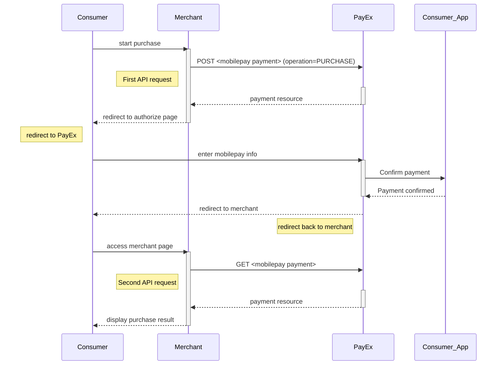



>The basic redirect **purchase** scenario is the supported way to implement
 MobilePay payments.

## Introduction

* When you have prepared your merchant/webshop site, you make a `POST` request
  towards Swedbank Pay with your Purchase information.
  You will receive a Redirect URL, leading to a secure Swedbank Pay hosted
  environment, in response.
* You need to redirect the browser of the end-user/consumer to that URL so
  that she may enter her MobilePay details .
* When the payment is completed, Swedbank Pay will redirect the browser back
  to your merchant/webshop site.
* Finally you need to make a `GET` request towards Swedbank Pay with the
  `paymentID` received in the first step, which will return the purchase result.

## Screenshots

![mobilepay enter number][mobilepay-screenshot-1]

![mobilepay approve payment][mobilepay-screenshot-2]

## API Requests

The API requests are displayed in the [purchase flow](#purchase-flow).
The options you can choose from when creating a payment with key operation set
to Value `Purchase` are listed below.

### Type of authorization (Intent)

**Authorization (two-phase)**: The intent of a MobilePay purchase is always
`Authorization`. The amount will be reserved but not charged.
You will later (i.e. if a physical product, when you are ready to ship the
purchased products) have to make a [Capture][mobilepay-capture] or
[Cancel][mobilepay-cancel] request.

#### General

**Defining CallbackURL**: When implementing a scenario, it is optional to set
a [CallbackURL][technical-reference-callback] in the POST request.
If callbackURL is set Swedbank Pay will send a postback request to this URL
when the consumer has fulfilled the payment.

## Purchase flow

The sequence diagram below shows the two requests you have to send to
Swedbank Pay to make a purchase.
The links will take you directly to the API description for the specific
request.
The diagram also shows in high level, the sequence of the process of a
complete purchase.



[mobilepay-screenshot-1]: /assets/img/mobilepay-screenshot-1.png
[mobilepay-screenshot-2]: /assets/img/mobilepay-screenshot-2.png
[mobilepay-cancel]: /payments/mobile-pay/after-payment#cancellations
[mobilepay-capture]: /payments/mobile-pay/after-payment#capture
[technical-reference-callback]: /payments/mobile-pay/other-features#callback
