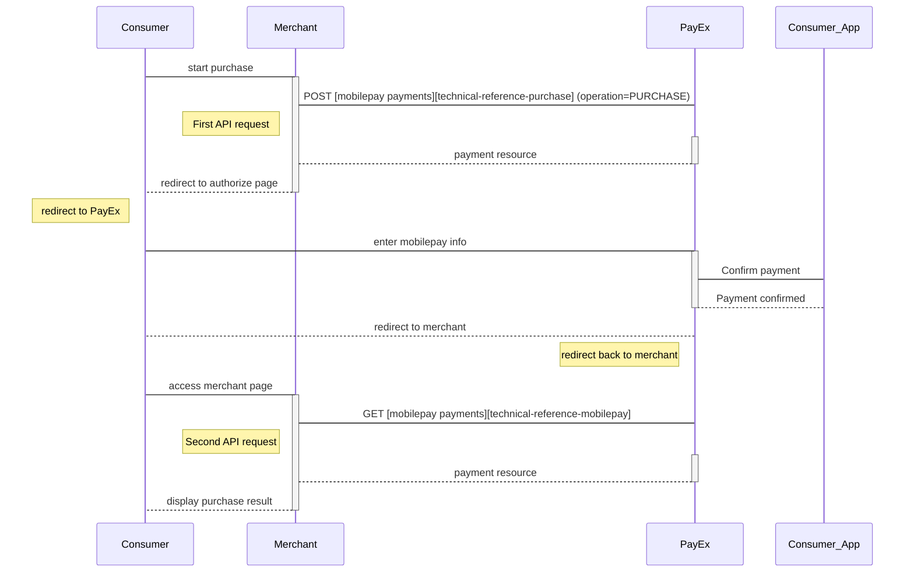



>The basic redirect **purchase** scenario is the supported way to implement MobilePay payments.

## Introduction

* When you have prepared your merchant/webshop site, you make a `POST` request towards PayEx with your  Purchase information. You will receive a Redirect URL, leading to a secure PayEx hosted environment, in response, .
* You need to redirect the browser of the end-user/consumer to that URL so that she may enter her MobilePay details .
* When the payment is completed, PayEx will redirect the browser back to your merchant/webshop site.
* Finally you need to make a `GET` request towards PayEx with the paymentID received in the first step, which will return the purchase result.

## Screenshots

![mobilepay enter number][mobilepay-screenshot-1]

![mobilepay approve payment][mobilepay-screenshot-2]

## API Requests

The API requests are displayed in the [purchase flow](#purchase-flow). The options you can choose from when creating a payment with key operation set to Value Purchase are listed below. The general REST based API model is described in the [technical reference][technical-reference].

### Options before posting a payment

All valid options when posting in a payment with operation equal to Purchase, are described in [the technical reference][technical-reference-mobilepay].

#### Type of authorization (Intent).

* **Authorization (two-phase)**: The intent of a MobilePay purchase is always Authorization. The amount will be reserved but not charged. You will later (i.e. if a physical product, when you are ready to ship the purchased products) have to make a [Capture][mobilepay-capture] or [Cancel][mobilepay-cancel] request.

#### General

* **Defining CallbackURL**: When implementing a scenario, it is optional to set a [CallbackURL][technical-reference-callbackurl] in the POST request. If callbackURL is set PayEx will send a postback request to this URL when the consumer has fulfilled the payment. [See the Callback API description here.][technical-reference-callback]

## Purchase flow

The sequence diagram below shows the two requests you have to send to PayEx to make a purchase. The links will take you directly to the API description for the specific request. The diagram also shows in high level, the sequence of the process of a complete purchase.

[mobilepay-screenshot-1]: /assets/img/mobilepay-screenshot-1.png
[mobilepay-screenshot-2]: /assets/img/mobilepay-screenshot-2.png
[mobilepay-cancel]: #
[mobilepay-capture]: #
[technical-reference-callback]: #
[technical-reference-callbackurl]: #
[technical-reference-mobilepay]: #
[technical-reference]: #
